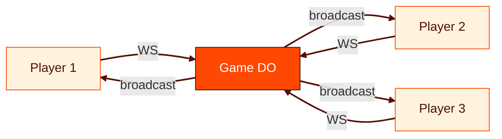

# What Are Durable Objects For?

What happens when you give a function a name, a memory, and a mailbox?

<!-- The central question isn't technical — it's philosophical. Serverless promised to abstract away servers. It succeeded. But it also abstracted away state, coordination, and identity. Durable Objects give those back — not by reverting to servers, but by making functions into entities.

Sources:
- https://developers.cloudflare.com/durable-objects/ — official documentation
- https://developers.cloudflare.com/agents/ — Agents SDK built on DOs -->

---
layout: statement
transition: fade
---

# A Worker is stateless. A database is shared. What lives in between?

<!-- This is the coordination gap. Workers handle requests but forget everything between them. Databases remember but can't coordinate in real-time. The gap between "fast and forgetful" and "slow and shared" is where most real-time applications break down.

Sources:
- https://developers.cloudflare.com/durable-objects/ — "Durable Objects provide low-latency coordination and consistent storage" -->

---
transition: slide-left
---

# Workers are fast and forgetful

Cloudflare Workers run your code at the edge — auto-scaling, sub-millisecond cold starts.

But a Worker forgets you the moment it responds.

<v-clicks>

- Need real-time sync? Workers can't hold WebSocket state.
- Need per-entity memory? Workers share nothing between requests.
- Need coordination? Workers race against each other.

</v-clicks>

The platform gives you speed and scale. It doesn't give you identity.

<!-- Workers are extraordinary for stateless compute. The gap becomes visible only when you try to build something that needs to remember.

[click] Need real-time sync? Workers can't hold WebSocket state — each request is isolated. You can't broadcast to other connections because you can't see them.

[click] Need per-entity memory? Workers share nothing between requests — there's no "this user's session" or "this game's state." Every invocation starts from zero.

[click] Need coordination? Workers race against each other — two concurrent requests to the same resource can read stale state and overwrite each other.

Sources:
- https://developers.cloudflare.com/workers/ — Workers platform overview
- https://developers.cloudflare.com/durable-objects/ — coordination and state management -->

---
transition: slide-left
---

# Neither Workers nor D1 solve coordination

Problems that fall between stateless compute and shared storage:

<v-clicks>

- **Real-time sync** — 4 players need the same game state within 33ms (one 30Hz frame)
- **Per-entity state** — each music session holds its own tracks, patterns, and tempo
- **Long-lived connections** — a WebSocket that outlives a single request
- **Coordination without contention** — no row locks, no race conditions

</v-clicks>

Durable Objects fill this gap. One per entity. Single-threaded. Named.

<!-- Each bullet is a real product requirement from the case studies later in this deck.

[click] Real-time sync — the 33ms game sync requirement comes from Vaders. 4 players need the same game state within one 30Hz frame.

[click] Per-entity state — each Keyboardia music session holds its own tracks (up to 16), patterns, tempo, swing, and per-step parameter locks. The state belongs to the session, not to a shared database row.

[click] Long-lived connections — a WebSocket that outlives a single request. Workers can't hold a connection open; DOs can.

[click] Coordination without contention — no row locks, no race conditions. Single-threaded execution means coordination is free. This is the killer feature.

Sources:
- https://github.com/adewale/vaders/blob/main/docs/server-architecture.md — 30Hz game loop with full state broadcast
- https://developers.cloudflare.com/durable-objects/ — single-threaded execution guarantee -->

---
transition: slide-left
---

# The race condition that changed everything

A collaborative document editor built on Workers + D1. Two users edit the same paragraph simultaneously.

Worker A reads the paragraph, applies edit, writes to D1.
Worker B reads the paragraph, applies edit, writes to D1.
Worker B's write lands second. Worker A's edit vanishes.

<v-clicks>

- Optimistic locking? Adds retries, complexity, and user-visible conflicts.
- Row-level locks? D1 is SQLite — no concurrent writers.
- CRDTs? Now you're building a distributed systems library.

</v-clicks>

One Durable Object per document. Single-threaded. Problem gone.

<!-- The race condition illustrates the fundamental problem that Workers + D1 cannot solve.

[click] Optimistic locking? Adds retries, complexity, and user-visible conflicts — you're solving the problem by making the user deal with it.

[click] Row-level locks? D1 is SQLite — there's a single-writer constraint. You can't have concurrent writers by design.

[click] CRDTs? Now you're building a distributed systems library — massive complexity for what should be a simple editing operation.

One DO per document eliminates the entire category of bug — not by solving concurrency, but by removing it. Single-threaded execution means coordination is free.

Sources:
- https://developers.cloudflare.com/durable-objects/best-practices/ — single-threaded execution prevents data races
- https://developers.cloudflare.com/d1/ — D1 uses SQLite, which has a single-writer constraint -->

---
layout: section
transition: iris
---

# Three primitives

A name, a memory, and a mailbox.

<!-- The section header is the thesis in compressed form. Everything Durable Objects do reduces to three capabilities. The rest of the deck shows these three primitives solving three completely different problems. -->

---
transition: slide-left
---

# A name — globally unique identity

Every Durable Object is a singleton, accessed by a stable name.

```ts
// Get a stub by name — globally unique, always the same instance
const id = env.GAME_SERVER.idFromName("room-42");
const stub = env.GAME_SERVER.get(id);
```

- `idFromName()` is deterministic — same name, same instance
- No load balancers, no service discovery, no routing tables
- The name **is** the address

<!-- In traditional architectures, routing a request to the right instance requires service discovery, load balancers, sticky sessions, or consistent hashing. With DOs, the name IS the routing. "room-42" always means the same instance, globally.

Sources:
- https://developers.cloudflare.com/durable-objects/api/namespace/ — idFromName() API
- https://github.com/adewale/vaders/blob/main/docs/server-architecture.md — room-based naming for game sessions -->

---
transition: glide
---

# A memory — state that survives

In-memory JavaScript state + SQLite persistence. Single-threaded guarantee means no race conditions.

```ts
export class GameServer extends DurableObject {
  players = new Map<string, Player>();
  frame = 0;
  async onStart() {
    const saved = await this.ctx.storage.get("state");
    if (saved) this.players = new Map(saved.players);
  }
}
```

- In-memory state is fast — no database round-trips during gameplay
- SQLite persists across restarts — state survives eviction
- **Single-threaded** — one request at a time, zero data races

<!-- The memory primitive has two layers: fast in-memory state for hot paths (game frames, pattern updates) and durable SQLite for cold persistence (reconnection, crash recovery). The single-threaded guarantee means no locks, mutexes, or CAS operations.

Sources:
- https://developers.cloudflare.com/durable-objects/api/storage-api/ — SQLite-backed persistent storage
- https://github.com/adewale/vaders/blob/main/docs/server-architecture.md — in-memory game state with SQLite backup -->

---
transition: glide
---

# A mailbox — real-time connections

WebSocket connections that the DO owns, broadcasts to, and can hibernate.

```ts
async webSocketMessage(ws: WebSocket, msg: string) {
  this.handleInput(ws, JSON.parse(msg));
}
broadcast(data: string) {
  for (const ws of this.ctx.getWebSockets()) {
    ws.send(data);
  }
}
```

- `acceptWebSocket()` promotes an HTTP request to a persistent connection
- `getWebSockets()` returns all live connections to this instance
- **Hibernation** — idle connections sleep at zero cost, wake on message

<!-- The mailbox primitive turns a function into a real-time server. The DO owns its WebSocket connections — it can enumerate them, broadcast to them, and hibernate them. This is fundamentally different from a stateless WebSocket relay.

Sources:
- https://developers.cloudflare.com/durable-objects/api/websockets/ — WebSocket Hibernation API
- https://github.com/adewale/vaders/blob/main/docs/server-architecture.md — WebSocket broadcast pattern for game state -->

---
layout: fact
transition: fade
---

# 0ms

cold starts

Each instance is a named, stateful, connected entity.

<!-- Zero millisecond cold starts because DOs run on the same V8 isolate infrastructure as Workers. But unlike Workers, they persist state between requests.

Sources:
- https://developers.cloudflare.com/durable-objects/ — "Durable Objects have zero cold starts" -->

---
layout: section
transition: iris
---

# A function with a name becomes a game server

Vaders — multiplayer TUI Space Invaders on Durable Objects.

---
transition: slide-left
---

# The problem

4-player real-time multiplayer in a 120x36 terminal.

- State must sync at **30Hz** with zero desync
- Players connect from different edges worldwide
- Terminal rendering is character-by-character — every frame is a full snapshot
- One source of truth, or the game breaks

<!-- The terminal constraint makes this harder than a browser game. There's no partial DOM update — every frame is a complete character grid sent as a single string. The DO must compute, serialize, and broadcast a full frame at each tick. The Vaders server architecture uses a pure reducer pattern: inputs go in, deterministic state comes out.

Sources:
- https://github.com/adewale/vaders/blob/main/docs/server-architecture.md — 30Hz game loop, full state broadcast, pure reducer pattern
- https://github.com/adewale/vaders/blob/main/Lessons_learned.md — TUI rendering constraints and frame synchronization -->

---
transition: slide-up
---

# The DO pattern — alarm-driven broadcast

The alarm fires 30 times per second. Each tick: advance state, serialize, broadcast.

```ts
async alarm() {
  this.frame++;
  this.updatePositions();
  this.checkCollisions();
  this.broadcast(this.serialize());
  this.ctx.storage.setAlarm(Date.now() + 33); // ~30Hz
}
```

- **Server-authoritative** — clients send inputs, DO computes state
- **Alarm loop** — `setAlarm()` is the game clock, not `setInterval`
- **No desync** — one thread, one state, one broadcast per frame

<!-- Alarms instead of setInterval because alarms are durable — they survive hibernation and process restarts. setInterval dies when the isolate evicts. The alarm fires, the frame advances, the state broadcasts. The Vaders architecture documents this as the "alarm-driven broadcast" pattern.

Sources:
- https://github.com/adewale/vaders/blob/main/docs/server-architecture.md — alarm-driven broadcast loop at 30Hz
- https://github.com/adewale/vaders/blob/main/Lessons_learned.md — why alarms over setInterval for game timing -->

---
transition: slide-left
---

# Server-authoritative architecture



Notice: all arrows from players carry only inputs (keystrokes). All arrows from the DO carry full state. Players never compute game logic — they render what the DO tells them. This prevents cheat clients.

<!-- The asymmetry is the insight. Input messages are tiny (~20 bytes for a keystroke). Broadcast messages are large (full frame buffer). The DO is the only source of truth — a modified client can't inject false game state because the DO ignores anything that isn't a raw input event. The Vaders server architecture enforces this as a "pure reducer" — game state is computed entirely server-side.

Sources:
- https://github.com/adewale/vaders/blob/main/docs/server-architecture.md — server-authoritative architecture with input/state asymmetry
- https://github.com/adewale/vaders/blob/main/Lessons_learned.md — pure reducer pattern preventing cheat clients -->

---
layout: section
transition: iris
---

# A function with a mailbox becomes a jam session

Keyboardia — collaborative polyrhythmic step sequencer.

---
transition: slide-left
---

# The problem

Up to 10 musicians collaborating in real-time. Each track has its own loop length.

- **Polyrhythm** — Track A loops at 16 steps, Track B at 7, Track C at 5 — independent cycles over a shared clock
- Audio is latency-sensitive — it **cannot** round-trip through a server
- Pattern sync must be fast enough that edits feel instant across all clients
- Session state must survive disconnects and hibernation

<!-- The polyrhythm model uses per-track step counts (4, 8, 16, 32, or 64 steps) rather than time signatures. At 120 BPM a sixteenth note is 125ms. Audio synthesis happens locally via Web Audio API with a 25ms scheduler tick and 100ms lookahead — the server never touches audio. The DO only coordinates pattern state: which steps are active, tempo, swing, and track parameters.

Sources:
- https://github.com/nicholasgasior/keyboardia — Keyboardia step sequencer
- https://developers.cloudflare.com/durable-objects/api/websockets/ — WebSocket Hibernation enabling persistent musician connections -->

---
transition: slide-up
---

# The DO pattern — event-driven relay with debounced KV backup

The DO relays pattern state on every edit. Audio never touches the server.

- **Session hub** — one DO per session, holds tracks, tempo, swing, and player map
- **Event-driven broadcast** — each toggle/edit broadcasts immediately to all clients
- **Debounced KV persistence** — alarm fires every 5s to save state to KV; also saves when last player leaves
- **R2 sample storage** — user-recorded samples upload to R2, URL broadcast to all players
- **State hash verification** — clients periodically send state hashes; mismatches trigger a full snapshot resync

<!-- The key architectural decision is what the DO does NOT do: it doesn't touch audio. The insight is that you only need to sync the pattern — which notes are active at which steps. Audio synthesis happens locally via Web Audio API with a 25ms lookahead scheduler. Unlike Vaders' alarm-driven game loop, Keyboardia's DO is event-driven: edits arrive via WebSocket, the DO mutates state and broadcasts the delta immediately. Alarms are only used for debounced KV persistence (5s delay), not for a tick loop.

Sources:
- https://github.com/nicholasgasior/keyboardia — Keyboardia architecture
- https://developers.cloudflare.com/durable-objects/ — coordination primitive for session management
- https://developers.cloudflare.com/kv/ — KV for persistent session state
- https://developers.cloudflare.com/r2/ — R2 for sample storage -->

---
layout: two-cols
transition: wipe-right
---

# What the DO handles

- Session membership (join/leave/identity)
- Pattern state (steps, parameter locks, mute/solo)
- Tempo, swing, and per-track step count sync
- Broadcast deltas on every edit
- Debounced KV persistence via alarms
- State hash verification and snapshot resync
- Cursor/presence sharing between players
- R2 sample upload coordination

::right::

# What the client handles

- Audio synthesis (Web Audio API + 19 synth presets)
- Lookahead scheduling (25ms tick, 100ms lookahead)
- Sample playback with pitch shifting
- Clock sync (server offset calculation)
- Step sequencer UI and parameter lock editing
- Mic recording via MediaRecorder
- Offline queue for edits during disconnect

<!-- This split is the entire architecture. The line between server and client is drawn at the boundary between coordination (DO) and computation (client). Everything shared goes through the DO. Everything fast stays local. The client's audio scheduler uses Web Audio API's precise timing — scheduling notes 100ms ahead with a 25ms polling interval — so audio timing is sub-millisecond accurate regardless of network latency.

Sources:
- https://developers.cloudflare.com/durable-objects/ — DO as coordination primitive, not compute engine -->

---
layout: section
transition: iris
---

# A function with a memory becomes an agent

Cloudflare Agents SDK — persistent AI agents on Durable Objects.

<!-- The third case study reveals that the same three primitives power AI agents. The Agents SDK is a framework built on DOs that gives agents identity (name), persistent memory (state), and real-time communication (mailbox).

Sources:
- https://developers.cloudflare.com/agents/ — Agents SDK built on Durable Objects
- https://github.com/cloudflare/agents — open source SDK -->

---
transition: slide-left
---

# The problem

AI agents need persistent memory, tool access, and the ability to wake on demand.

- A stateless Worker forgets the conversation after every request
- Tool results need to persist across turns
- Agents must **sleep** when idle and **wake** when needed
- Multi-step workflows crash mid-pipeline — no checkpoint, no resume

<!-- The agent problem is the coordination gap in its purest form. An LLM call is stateless. But an agent needs to remember, plan, and execute across multiple turns. Without persistence, every turn starts from scratch.

Sources:
- https://developers.cloudflare.com/agents/ — agent persistence and lifecycle management -->

---
transition: slide-up
---

# Agent vs AIChatAgent

The SDK provides two base classes. `Agent` is the low-level primitive. `AIChatAgent` adds chat-specific conveniences.

```ts
// AIChatAgent: auto-persisted chat history, streaming, tool calling
export class MyAgent extends AIChatAgent {
  async onChatMessage(onFinish) {
    await generateText({
      model: openai("gpt-4o"),
      messages: this.messages, // auto-persisted in DO storage
      tools: this.server.tools,
      onFinish,
    });
  }
}
```

- `Agent` — lifecycle hooks, state, communication, scheduling
- `AIChatAgent extends Agent` — adds `this.messages`, streaming, tools
- Both persist everything in the DO — history survives restarts

<!-- Agent is for any long-lived stateful process (not just chat). AIChatAgent adds auto-persisted chat history with streaming. Most AI agent use cases want AIChatAgent, but the base Agent class is right for non-conversational workflows.

Sources:
- https://developers.cloudflare.com/agents/api-reference/agents-api/ — Agent and AIChatAgent API -->

---
transition: glide
---

# The Agent API surface

```ts
export class MyAgent extends Agent {
  // Lifecycle
  onStart() { }               // instance wakes
  onConnect(conn, ctx) { }    // WebSocket connected
  onMessage(conn, msg) { }    // message received
  onClose(conn, code, reason, wasClean) { }
  onError(conn, error) { }    // WebSocket error
  onRequest(request) { }      // HTTP request
  onStateChanged(state, source) { } // state change

  // State — SQLite-backed, real-time sync to clients
  setState(newState)           // persists + broadcasts
  sql`SELECT ...`             // query embedded SQLite

  // Scheduling
  schedule(callback, delay)    // one-off delayed task
  scheduleEvery(callback, interval) // recurring task
}
```

Lifecycle hooks, persistent state, SQL, and scheduling — all in one class.

<!-- The API surface reveals how thin the abstraction is. onStart maps to the DO's constructor/alarm wake. onConnect/onMessage/onClose/onError map to WebSocket handlers. setState wraps ctx.storage with automatic client broadcast. The sql tagged template gives direct SQLite access. schedule() and scheduleEvery() wrap DO alarms with ergonomic syntax. The Agent class doesn't add new capabilities — it makes existing DO capabilities accessible.

Sources:
- https://developers.cloudflare.com/agents/api-reference/agents-api/ — complete Agent API reference -->

---
transition: glide
---

# State that syncs

`setState()` persists to SQLite and broadcasts to all connected clients in one call.

```ts
// Server: update state — persists AND broadcasts
this.setState({ ...this.state, status: "processing", progress: 0.5 });

// Client: state updates arrive automatically
agent.on("state", (newState) => {
  renderProgress(newState.progress);
});
```

- **SQLite persistence** — state survives DO eviction and restarts
- **Real-time sync** — connected clients see changes instantly
- **No manual serialization** — the SDK handles JSON ↔ SQLite

<!-- setState is the "memory" primitive made ergonomic. In a raw DO, you'd write to ctx.storage and manually broadcast. The Agent SDK collapses both into one call. This pattern is identical to how the game server broadcasts frames, but at a higher abstraction level.

Sources:
- https://developers.cloudflare.com/agents/api-reference/agents-api/#setstate — setState API with persistence + broadcast -->

---
transition: glide
---

# Tool calling anatomy

Tools are functions with a description, a schema, and an execute handler.

```ts
const tools = {
  lookupUser: {
    description: "Find user by email",
    parameters: z.object({ email: z.string().email() }),
    execute: async ({ email }) => {
      return await db.query(
        "SELECT * FROM users WHERE email = ?", [email]
      );
    },
  },
};
```

- **Description** — the LLM reads this to decide when to call the tool
- **Zod schema** — validates parameters before execution
- **Execute** — runs in the DO's single-threaded context (no races)

<!-- Tool execution inside a DO is uniquely safe. Because the DO is single-threaded, a tool that reads and writes state can't race with another tool call. This is the "coordination without contention" primitive applied to AI agents.

Sources:
- https://developers.cloudflare.com/agents/api-reference/agents-api/#tools — tool definition and execution -->

---
transition: slide-up
---

# Durable workflows

Cloudflare Workflows chains steps with automatic checkpointing. Each `step.do()` runs at-most-once — if the workflow crashes, it resumes from the last completed step.

```ts
export class MyWorkflow extends WorkflowEntrypoint {
  async run(event, step) {
    const data = await step.do("fetch", { retries: { limit: 3 } },
      async () => await fetchExternalAPI()
    );
    const approval = await step.waitForEvent("approval");
    await step.sleep("5 minutes");
    return await step.do("process",
      async () => processData(data, approval)
    );
  }
}
```

- **Checkpointed** — `step.do()` is at-most-once, crash-safe
- **Configurable retries** — per-step retry policies with backoff
- **Human-in-the-loop** — `step.waitForEvent()` durably pauses for external signals

<!-- Cloudflare Workflows is a separate product from the Agents SDK but built on the same Durable Object infrastructure. Both use DO persistence for crash recovery. Workflows are ideal for multi-step pipelines (data processing, approval chains) while Agents are for interactive, conversational workloads.

Sources:
- https://developers.cloudflare.com/workflows/ — Cloudflare Workflows API -->

---
transition: slide-left
---

# Scheduling modes

Agents can wake themselves — delayed, recurring, or on a cron schedule.

- **One-off** — `schedule(callback, delay)` — execute after a delay
- **Recurring** — `scheduleEvery(callback, interval)` — repeat on an interval or cron
- **Manage** — `getSchedules()` to list, `cancelSchedule(id)` to remove
- **Stay alive** — `keepAlive()` keeps the instance warm between scheduled tasks

All scheduling survives hibernation. The agent sleeps at zero cost and wakes precisely when needed.

<!-- Scheduling wraps DO alarms with ergonomic methods. The key property: scheduled callbacks survive hibernation. An agent that schedules a Monday morning report will wake up Monday at 9am even if it's been hibernated all weekend. This is the same alarm primitive that Vaders uses for its 30Hz game loop and Keyboardia uses for debounced KV saves, but exposed at a higher abstraction level.

Sources:
- https://developers.cloudflare.com/agents/api-reference/agents-api/ — schedule and scheduleEvery API -->

---
transition: slide-up
---

# MCP server pattern

Agents can expose their tools via Model Context Protocol — making them callable by other AI systems, IDEs, and agents.

<v-clicks>

- **Deploy as remote MCP server** — agent tools become callable over HTTP
- **Tools + resources** — expose capabilities and state to external clients
- **Composable** — agents call other agents' MCP endpoints
- **IDE integration** — Claude Desktop, Cursor, and other MCP clients connect directly

</v-clicks>

The same DO that holds state and handles WebSockets also serves as an MCP endpoint.

<!-- The MCP server pattern inverts the agent's role. Instead of the agent calling tools, external systems call the agent AS a tool. Cloudflare supports building and deploying remote MCP servers that run on Workers and Durable Objects. This enables agent composition — a planning agent calls a research agent's MCP server — and IDE integration where developer tools connect directly to agent capabilities.

Sources:
- https://developers.cloudflare.com/agents/model-context-protocol/ — MCP integration on Cloudflare
- https://modelcontextprotocol.io/ — MCP specification -->

---
layout: quote
transition: fade
---

# "The agent is the application"

When state, tools, and reasoning live in one Durable Object, the agent stops being a wrapper and becomes the product. The DO is the agent. The agent is the application.

<!-- This applies beyond agents. When state, coordination, and identity live in one DO, the function stops being a handler and becomes an entity. The game server IS the game. The session hub IS the jam session. The agent IS the product.

Sources:
- https://github.com/cloudflare/agents — reference implementations
- https://developers.cloudflare.com/agents/ — "agent as application" pattern -->

---
layout: center
transition: morph-fade
---

# A name, a memory, a mailbox

The same three primitives. Three different products.

A game server. A jam session. An autonomous agent.

<!-- Three wildly different products — a game, a music tool, an AI agent — all built on the same three primitives. The function didn't change. The primitives did the work. -->

---
transition: slide-left
---

# When to use what

- **Durable Objects** — per-entity coordination, real-time sync, WebSocket state
- **D1** — relational queries across entities, SQL joins, analytics
- **KV** — global read-heavy config, feature flags, cached lookups
- **R2** — large binary blobs, images, audio files, backups

The question is not "which storage?" but "what's the coordination pattern?"

<!-- DOs are not a database replacement — they're a coordination primitive. Use D1 when you need to query across entities. Use KV for globally distributed reads. Use R2 for blobs. Use DOs when you need a named, stateful, connected entity.

Sources:
- https://developers.cloudflare.com/durable-objects/best-practices/ — when to use DOs vs other primitives -->

---
layout: center
transition: fade
---

# Give a function a name, a memory, and a mailbox

It becomes a game server, a jam session, or an autonomous agent.

The function doesn't change. The primitives do the work.

<!-- The penultimate slide restates the thesis with all three case studies as evidence. The pattern should feel inevitable — of course these are the right primitives, because they keep working.

Sources:
- https://github.com/adewale/vaders — game server case study
- https://developers.cloudflare.com/agents/ — autonomous agent case study -->

---
layout: end
transition: fade
---

# Every distributed system eventually reinvents the mailbox

<!-- The closing resolves the opening question. "What happens when you give a function a name, a memory, and a mailbox?" — it becomes whatever you need. Every distributed system that coordinates in real-time ends up building these three primitives anyway. Durable Objects just give them to you from the start.

Sources:
- https://developers.cloudflare.com/durable-objects/ — the three primitives
- https://developers.cloudflare.com/agents/ — agents as proof of the pattern
- https://github.com/adewale/vaders — game server as proof of the pattern -->
