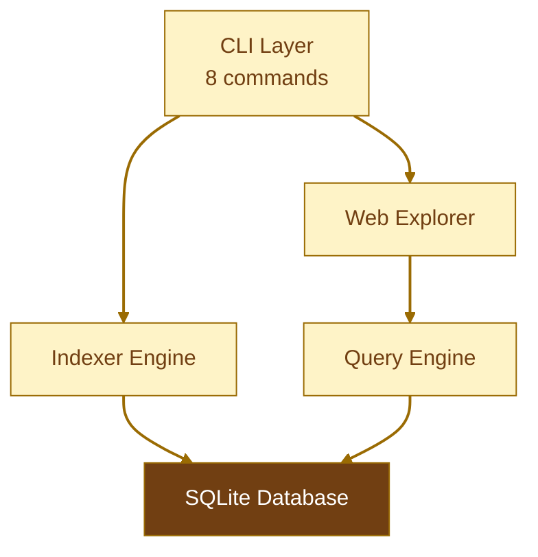
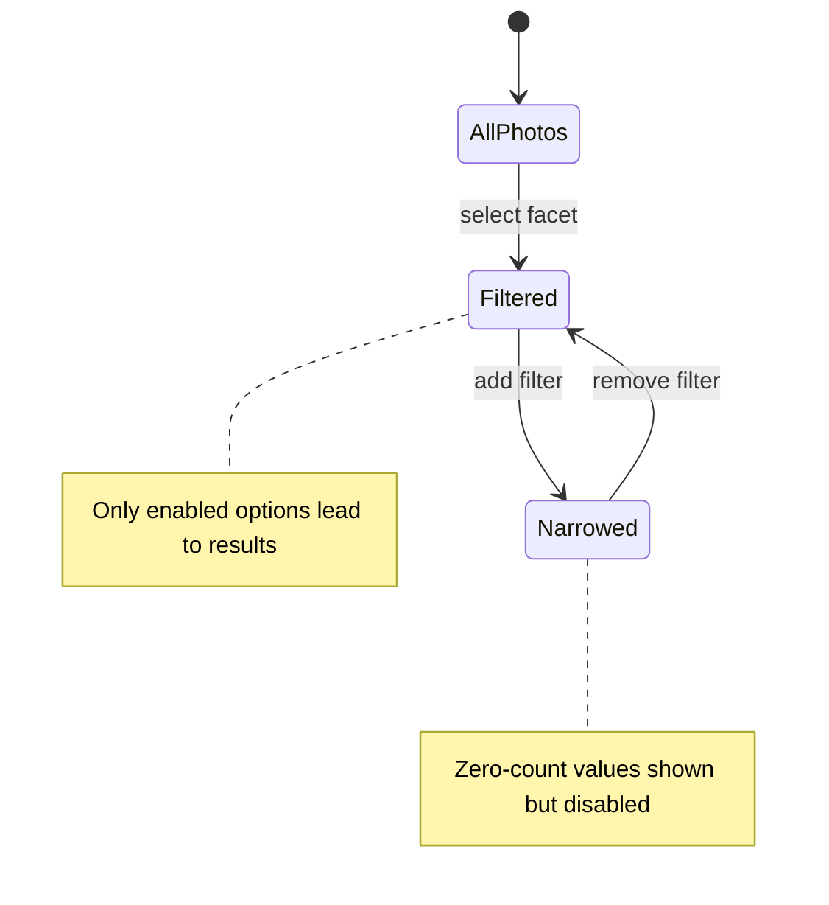

# Olsen

A read-only photo indexer. Your files stay exactly where they are.

github.com/adewale/olsen

<!-- Olsen is a high-performance photo indexing system for DNG, JPEG, and BMP files. It extracts metadata, generates thumbnails, analyzes color palettes, and computes perceptual hashes — all without modifying a single source file. The through-line is "read-only is the feature" — every architectural decision flows from the guarantee that source files are never touched. All file access uses O_RDONLY. Only the SQLite database is written to.

Sources:
- https://github.com/adewale/olsen/blob/main/README.md — project overview, supported formats, read-only guarantee
- https://github.com/adewale/olsen/blob/main/docs/architecture.md — system architecture and read-only enforcement -->

---
layout: statement
transition: fade
---

# Every photo tool wants write access to your library

They move files into opaque packages. They inject sidecar metadata. They build proprietary indexes you cannot query, export, or back up. Delete the app and the index is gone.

<!-- The iPhoto-to-Photos migration is the canonical failure: Apple moved photos into a .photoslibrary package, destroying the folder structure. The EXIF was intact, but the proprietary index was the only way to browse by date, location, or face. When that index corrupts, recovery means re-importing everything. Google Photos similarly owns the index — you cannot query it with SQL or export it independently. Olsen exists because an index should be yours to keep, query, and rebuild.

Sources:
- https://github.com/adewale/olsen/blob/main/README.md — "Olsen NEVER modifies your photo files" and motivation for read-only design -->

---
transition: zoom-in
---

# Five layers, one guarantee

<div v-motion
  :initial="{ opacity: 0, y: 40 }"
  :enter="{ opacity: 1, y: 0, transition: { delay: 200, duration: 600 } }">



</div>

Every layer reads source files with `O_RDONLY`. Only the SQLite database receives writes.

<!-- The architecture has five layers: CLI (8 commands: index, explore, analyze, stats, show, thumbnail, verify, version), Indexer Engine (metadata extraction, thumbnail quality pipeline, and visual feature analysis), Web Explorer (Aperture-inspired dark UI with inspector panel), Query Engine (state machine faceted search), and SQLite Database (portable catalog). The Indexer Engine enforces read-only through os.Open() with O_RDONLY flag. No use of os.Create, os.OpenFile, os.WriteFile, os.Remove, or os.Rename anywhere in the codebase. Image processing is entirely in-memory — EXIF parsing operates on byte buffers, thumbnails are generated in RAM, and only the final metadata is written to SQLite.

Sources:
- https://github.com/adewale/olsen/blob/main/docs/architecture.md — 5-layer system overview, read-only enforcement mechanisms
- https://github.com/adewale/olsen/blob/main/README.md — architecture diagram, CLI commands, and read-only guarantee -->

---
transition: slide-left
---

# Hash-based resume means crashes are free

File scanner walks the directory tree and feeds paths into a buffered channel. N workers consume in parallel. Production safety guards protect against resource exhaustion.

<v-clicks>

- Scanner finds DNG, JPEG, BMP files recursively
- Buffered work channel (size: 100), configurable worker count (default: 4)
- Hash-based resume skips already-processed files
- Per-file timeout: 60 seconds
- Files >500 MB or >100 megapixels: metadata only, no decode
- Disk space pre-flight check with 20% safety margin
- CLI progress bar: `[=====>   ] 62.5% | 500/800 photos | 18.3 photos/sec`

</v-clicks>

```go {1-3|4-6|all}
// 8-step pipeline per file
// 1. EXIF  2. Decode  3. Thumbnails  4. Colors
// 5. pHash  6. SHA-256  7. Infer  8. DB Insert
scanner := walkDirectory(rootPath)
for path := range workChannel {
    processFile(path) // all steps, one transaction
}
```

<!-- The worker pool uses Go's goroutine + channel pattern. N workers consume paths in parallel.

[click] Scanner finds DNG, JPEG, BMP files recursively — the main thread walks the filesystem and sends file paths into the work channel.

[click] Buffered work channel (size: 100) with configurable worker count (default: 4). 8 workers on M3 Max gives 15-25 photos/sec.

[click] Hash-based resume skips already-processed files — because source files are read-only, a file's hash is guaranteed stable. Re-running after a crash picks up where it left off.

[click] Per-file timeout: 60 seconds — prevents a single corrupt file from blocking the entire batch. Failed files logged, never block the batch.

[click] Production safety: files over 500 MB are indexed with metadata only (no image decode), images over 100 megapixels skip thumbnail generation but still store metadata. This prevents memory exhaustion on edge-case files.

[click] Disk space pre-flight check: before indexing starts, the system estimates database size (~250 KB per photo) and verifies available space with a 20% safety margin. Fails fast if insufficient space.

[click] The CLI displays a real-time progress bar with percentage, photo count, and throughput rate. Throttled to 4 updates/sec to avoid excessive terminal writes.

Sources:
- https://github.com/adewale/olsen/blob/main/docs/architecture.md — worker pool pattern, concurrency model, processing pipeline
- https://github.com/adewale/olsen/blob/main/README.md — concurrent processing, hash-based resume, per-file timeout, production safety features
- https://github.com/adewale/olsen/blob/main/internal/indexer/indexer.go — maxFileSizeBytes (500 MB), maxImagePixels (100M), checkDiskSpace(), ProgressCallback
- https://github.com/adewale/olsen/blob/main/cmd/olsen/commands.go — progress bar implementation with rate calculation -->

---
layout: section
transition: iris
---

# Read-only is the feature

All file access uses `O_RDONLY`. No sidecar files. No hidden databases in your photo directories. One SQLite file you control.

---
transition: slide-left
---

# Aperture-inspired dark UI with inspector panel

The web explorer uses a dark theme with a right-rail inspector panel for faceted navigation.

<v-clicks>

- Dark background (#0a0a0a) with minimal chrome
- Toolbar: logo, Grid/Split/Photo view switcher, sort dropdown
- Active filter chips with one-click removal
- Right-rail inspector (280px): facets grouped by Library and Filters
- Color swatches as a 4-column grid with selection states
- Accessibility: skip links, ARIA labels, keyboard navigation, screen reader support
- Responsive: stacks to column layout below 968px

</v-clicks>

<!-- The web explorer (internal/explorer/) implements an Aperture-inspired photo browsing UI. The layout uses a dark theme (#0a0a0a background, #e8e8e8 text, #0a84ff accent) with a sticky toolbar at top and a right-rail inspector panel for facets. The toolbar includes an "OLSEN" logo link, a view mode switcher (Grid active, Split and Photo disabled with "Coming soon" tooltips), a photo count display, and a sort dropdown (Date, Camera, Focal Length, ISO, Aperture). Active filters display as blue-bordered chips below the toolbar with an x to remove each filter. The inspector panel at 280px groups facets into "Library" (Timeline years, Cameras, Lenses, Colours as swatches) and "Filters" (Month, Time of Day as chips, Bursts). Color swatches use a 4-column CSS grid with selected state shown as a blue border with checkmark. The UI includes comprehensive accessibility: skip-to-content link, ARIA roles on all interactive elements, screen reader-only labels, and focus-visible outlines. Photo detail pages show the image centered with a metadata table and dominant color swatches. Templates are embedded via Go's embed.FS and served with ETag caching for thumbnails.

Sources:
- https://github.com/adewale/olsen/blob/main/internal/explorer/templates/grid.html — full faceted search UI with inspector panel, filter chips, color swatches
- https://github.com/adewale/olsen/blob/main/internal/explorer/templates/layout.html — dark theme base layout
- https://github.com/adewale/olsen/blob/main/internal/explorer/templates/detail.html — photo detail page with metadata and color swatches
- https://github.com/adewale/olsen/blob/main/docs/archive/completed/UI_REDESIGN_PLAN.md — redesign plan from left sidebar to right-rail layout -->

---
transition: slide-left
---

# Never zero results

Faceted navigation as a state machine: every filter combination is pre-validated before the UI renders it.



<v-clicks>

- SQL computes valid facet values per state
- <v-mark at="2" color="#9a6b03" type="underline">Disabled options visible but not clickable</v-mark>
- Filters preserved across transitions
- No hardcoded hierarchies — data determines paths

</v-clicks>

<!-- Faceted navigation as a state machine. The key insight: "It's about exploration and valid state transitions through actual data." An earlier hierarchical model was fundamentally wrong — it cleared Month when Year changed, assuming a containment hierarchy. The fix: treat facets as independent dimensions and let SQL compute validity.

[click] SQL computes valid facet values per state — WHERE clauses with GROUP BY naturally compute which transitions are valid given the current filter state. No hardcoded clearing logic.

[click] Disabled options visible but not clickable — values with count=0 are rendered as disabled in the UI with cursor:not-allowed and reduced opacity. The user sees the full possibility space while being guided to valid paths.

[click] Filters preserved across transitions — the state machine model preserves ALL filters. Changing year=2024 to year=2023 keeps month=11 if November 2023 has results. No more losing context.

[click] No hardcoded hierarchies — data determines paths. Available facets: Year, Month, Day, Color (11 Berlin-Kay), Time of Day, Camera, Lens, In Burst. The query engine computes counts for each facet respecting all active filters.

Sources:
- https://github.com/adewale/olsen/blob/main/specs/facet_state_machine.spec — state machine model, "never zero results" guarantee, filter preservation vs. hierarchical clearing
- https://github.com/adewale/olsen/blob/main/docs/HIERARCHICAL_FACETS.md — detailed explanation of the bug fix from hierarchical to state machine model
- https://github.com/adewale/olsen/blob/main/README.md — web explorer faceted search, available facets list -->

---
transition: slide-left
---

# Berlin-Kay maps every photo to 11 universal color terms

K-means extracts 5 dominant colors per photo from the 256px thumbnail, then classifies each into HSL-based categories with saturation checked first.

<v-clicks>

- <v-mark at="1" color="#9a6b03" type="box">Achromatic: black, white, gray, B&W</v-mark>
- Chromatic: red, orange, yellow, green, blue, purple, pink
- Special: brown (dark orange, low lightness)

</v-clicks>

- Saturation checked first — achromatic detection before hue classification
- Hue-based classification only when S >= 15%

<div class="spotlight-group mt-2">

| Detection | Rule | Example |
|-----------|------|---------|
| Black | S < 5%, L < 20% | Silhouettes, dark exposures |
| White | S < 5%, L > 80% | High-key, overexposed |
| Gray | S < 10% | Desaturated, muted tones |
| B&W | S < 15% | Film scans, Lightroom conversions |
| Brown | H 20-40, L < 50% | Wood, earth, leather |

</div>

<!-- Color extraction runs k-means clustering (100 iterations, 5 clusters) on the 256px thumbnail — not the full-resolution image. This is 100x faster with no perceptible accuracy loss for color classification. Each color is stored in both RGB and HSL. HSL enables perceptually correct queries: "all blue photos" matches regardless of saturation or lightness. The Berlin-Kay 11-color system maps to universal color terms found across human languages. The v2.0 fix catches B&W photos that were previously misclassified as "red" because achromatic colors have hue=0 in HSL — saturation-first detection prevents this. The actual SQL classification uses a tiered CASE statement: black (S<5%, L<20%), white (S<5%, L>80%), gray (S<10%), B&W (S<15%), then brown (H 20-40, L<50%), then hue-based chromatic classification.

Sources:
- https://github.com/adewale/olsen/blob/main/specs/dominant_colours.spec — k-means algorithm, RGB-to-HSL conversion, Berlin-Kay classification, B&W saturation threshold, v2.0 fix for misclassified B&W photos
- https://github.com/adewale/olsen/blob/main/internal/query/facets.go — computeColourFacet() SQL with tiered CASE statement (lines 734-752) -->

---
transition: zoom-in
---

# All file access is O_RDONLY at the syscall level

```go {1-2|3-5|6-8|all}
// All file access is O_RDONLY — read-only is enforced at the syscall level
f, err := os.Open(path) // O_RDONLY flag
defer f.Close()

// EXIF parsed from byte buffer, never written back
rawExif, err := exif.SearchAndExtractExif(data)
entries, _ := exif.GetFlatExifData(rawExif)
// 50+ fields: camera, lens, exposure, GPS, flash, white balance
```

<v-clicks>

- Camera make, model, lens, focal length
- Exposure: ISO, aperture, shutter speed
- Location: latitude, longitude, altitude
- Inferred: time of day, season, conditions

</v-clicks>

<!-- The EXIF extraction uses dsoprea/go-exif/v3. No write operations exist — os.Open() opens with O_RDONLY. For BMP files without EXIF, the indexer falls back to basic file metadata (size, modification time). For RAW files that fail to decode, metadata-only indexing is performed — the file still gets cataloged even without thumbnails.

[click] Camera make, model, lens, focal length — the equipment metadata. Parsed from IFD entries in byte buffers.

[click] Exposure: ISO, aperture, shutter speed — the technical settings. Combined, these reveal shooting conditions.

[click] Location: latitude, longitude, altitude — GPS coordinates when available. Enables geographic faceted search.

[click] Inferred: time of day, season, conditions — the indexer (internal/indexer/inference.go) computes additional metadata from raw values. Time of day from DateTaken hour, season from month, focal length category (wide/normal/telephoto), shooting conditions from ISO+aperture+shutter combinations. This is the read-only guarantee applied at the lowest level: the file descriptor itself is read-only.

Sources:
- https://github.com/adewale/olsen/blob/main/docs/architecture.md — processing pipeline, read-only enforcement via O_RDONLY, EXIF extraction step
- https://github.com/adewale/olsen/blob/main/README.md — EXIF metadata extraction, metadata inference features
- https://github.com/adewale/olsen/blob/main/internal/indexer/metadata.go — EXIF extraction implementation with fallback for BMP files -->

---
transition: slide-left
---

# Thumbnails decode the image once, resize four times

<v-mark at="1" color="#9a6b03" type="box">

| Size | Longest edge | JPEG quality | Use |
|------|-------------|-------------|-----|
| Tiny | 64px | 80% | Grid view |
| Small | 256px | 85% | List view |
| Medium | 512px | 90% | Preview |
| Large | 1024px | 92% | Detail |

</v-mark>

- Longest-edge constraint preserves aspect ratio
- No square crops — landscape stays landscape
- Quality pipeline with per-size JPEG tiers and upscale prevention
- DNG monochrome fix: black image detection with embedded JPEG fallback

<!-- Thumbnails constrain the longest edge rather than forcing square crops. A 6000x4000 landscape photo produces thumbnails at 64x43, 256x171, 512x341, and 1024x683 — the aspect ratio is always preserved. All four sizes are generated in a single pass during indexing: the image is decoded once into memory, then resized four times using Lanczos3 interpolation (via nfnt/resize). The quality pipeline (internal/quality/pipeline.go) uses configurable JPEG quality tiers per size (80/85/90/92%), prevents upscaling when the source is smaller than the target, and supports QA sampling for visual fidelity validation. A critical DNG thumbnail bug was fixed: LibRaw produced completely black images (brightness 0.0/255) for JPEG-compressed monochrome DNGs. The fix detects black images by sampling 100 pixels across the image and falls back to embedded JPEG extraction, restoring correct brightness (38.2/255). Gray-to-RGBA conversion was also added since the JPEG encoder does not support image.Gray directly. Per-photo thumbnail storage: approximately 187 KB across all four sizes.

Sources:
- https://github.com/adewale/olsen/blob/main/specs/olsen_specs.md — ThumbnailSize constants (64, 256, 512, 1024), longest-edge constraint
- https://github.com/adewale/olsen/blob/main/internal/quality/pipeline.go — quality pipeline with per-size JPEG tiers, upscale prevention, QA sampling
- https://github.com/adewale/olsen/blob/main/docs/archive/completed/THUMBNAIL_FIDELITY_FIX.md — DNG monochrome thumbnail fix: black image detection, embedded JPEG fallback
- https://github.com/adewale/olsen/blob/main/README.md — aspect-ratio-preserving thumbnails, 4 sizes -->

---
layout: fact
transition: fade
---

# <v-mark at="1" color="#9a6b03" type="circle">~62ms</v-mark>

per photo on Apple M3 Max. Hash 0.4ms + thumbnails 34ms + colors 28ms + pHash 0.2ms. 15-25 photos/sec with 8 workers.

<!-- Benchmarked on Apple M3 Max with 8 workers. The breakdown: file hash calculation 0.4ms, thumbnail generation for all 4 sizes 34ms, color palette extraction via k-means 28ms, perceptual hash 0.2ms. Total approximately 62ms per photo. At 15-25 photos/second, a 100K photo library completes initial indexing in 1.5-2 hours. Database size for 100K photos: approximately 20-25 GB including all thumbnails. Memory usage stays constant at approximately 500 MB regardless of library size. Hash-based resume means interrupted indexing picks up where it left off.

Sources:
- https://github.com/adewale/olsen/blob/main/README.md — performance benchmarks table on Apple M3 Max, throughput with 8 workers, 100K photo estimates
- https://github.com/adewale/olsen/blob/main/docs/architecture.md — time complexity per operation, space complexity per photo -->

---
layout: center
transition: morph-fade
---

# The index is disposable. The photos are permanent.

## Read-only is the feature

Delete the database. Rebuild it from scratch. Your files are exactly as they were — not a byte changed, not a file moved, not a sidecar created.

<!-- The through-line resolves here. "Read-only is the feature" connects every design decision: O_RDONLY at the syscall level (architecture), hash-based resume that trusts file stability (worker pool), faceted navigation that never corrupts state (query engine), thumbnails stored in SQLite not injected into originals (storage), production safety guards that fail fast rather than risk corruption. The SQLite database is the only artifact Olsen creates. It is designed to be disposable — delete it and your photos are untouched. The database is also portable: copy the single file to browse your catalog offline, on another machine, with any SQLite tool. WAL mode enables concurrent reads during indexing — the explorer can be used while indexing is still running. This is the contract: the tool serves the files, never the other way around. The project includes 63+ documentation files across docs/ and specs/, comprehensive test suites, and 8 CLI commands.

Sources:
- https://github.com/adewale/olsen/blob/main/README.md — read-only guarantee, database portability, "delete it and your photos are exactly as they were"
- https://github.com/adewale/olsen/blob/main/docs/architecture.md — storage architecture, database portability design principle, WAL mode -->

---
layout: end
transition: fade
---

# Your files have not moved. Now you can find them.

<!-- The closing echoes the opening. "Every photo tool wants write access to your library" — Olsen does not. "Your files have not moved" restates the read-only guarantee as reassurance. "Now you can find them" is what the indexer provides: an Aperture-inspired dark UI with faceted search across 100K+ photos — 11-color classification, temporal filters, equipment filters, and perceptual hash similarity — protected by production safety guards (file size limits, dimension limits, disk validation), with three major bug fixes (DNG monochrome thumbnails, hierarchical facets, B&W color misclassification), all without modifying a single source file. The index is the only new artifact. Your photos are exactly as they were. -->
