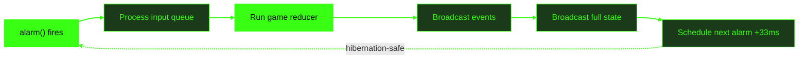

# Vaders

Multiplayer TUI Space Invaders. 1-4 players. Cloudflare Durable Objects.

github.com/adewale/vaders

<!-- Vaders is a complete multiplayer Space Invaders clone built for the terminal — 120x36 character grid, braille pixel art sprites, real-time co-op for up to 4 players synchronized via a Cloudflare Durable Object running a pure game reducer at 30Hz. Features include a twinkling starfield background with Amiga-style color cycling, 4 explosion effect variants, per-wave rainbow borders, respawn-at-death-position, wave progression with escalating difficulty, 5 entrance animation patterns, a spritesheet visualization tool, and 1,600+ tests including property-based testing with fast-check. The through-line is "the server is the truth" — every design decision traces back to server-authoritative state: the pure reducer, the alarm loop, held-state networking, full-state sync. The server computes; clients render.

Sources:
- https://github.com/adewale/vaders/blob/main/README.md — project overview, architecture, game modes
- https://github.com/adewale/vaders/blob/main/CHANGELOG.md — 1.0.0 feature inventory -->

---
layout: statement
transition: fade
---

# Multiplayer games don't belong in the terminal. Or do they?

120x36 character cells. No GPU. No game engine. Just a Durable Object and a WebSocket.

<!-- The tension: real-time multiplayer in a TUI sounds impossible. Terminals render character cells with a single foreground and background color — no sub-pixel rendering, no GPU shaders, no game engine. Movement is inherently chunky: entities jump by whole character cells. But the constraint is also the advantage. A 120x36 grid means 4,320 cells — small enough to broadcast as full state at 30Hz without compression. The terminal's limitations make server-authoritative architecture viable at a scale where it would be too expensive in a graphical game.

Sources:
- https://github.com/adewale/vaders/blob/main/README.md — terminal 120x36 requirement
- https://github.com/adewale/vaders/blob/main/Lessons_learned.md — section 1: what does NOT work in terminals (gradients, sub-pixel, smooth animation) -->

---
layout: image-right
image: /gameplay.png
backgroundSize: contain
transition: slide-left
---

# Braille pixel art at 120x36

<v-clicks>

- 7-wide animated braille sprites
- Color cycling for UFO rainbow effect
- Twinkling starfield with Amiga-style depth layers
- 4 explosion variants: dissolve, shimmer, shrapnel, UFO multi-phase
- Per-wave rainbow borders with snake trails and heartbeat pulse

</v-clicks>

<!-- The sprite system uses braille characters and Unicode box-drawing elements — not plain ASCII.

[click] 7-wide animated braille sprites — each alien type (squid, crab, octopus) has a distinct two-line sprite pattern with two animation frames.

[click] Color cycling for UFO rainbow effect — rotating through a palette of six colors every 5 ticks. The classic Amiga technique that creates compelling animation without per-pixel rendering.

[click] Twinkling starfield — three depth layers (far blue, mid purple, near grey-blue) with desynchronized coprime cycle periods (28, 20, 15 ticks) and spatial phase offsets via hash-based distribution. Brightness ramps create natural scintillation without per-pixel rendering.

[click] 4 explosion variants — dissolve (alien death, braille fragments scatter outward), shimmer (barrier hit, brief flash), shrapnel (player death, directional debris with gravity arcs), and UFO multi-phase (flash, expanding ring, sparks, tumbling fragments).

[click] Per-wave rainbow borders — 8-color palette cycling through waves (red, orange, yellow, green, cyan, blue, indigo, magenta). Animated braille border with snake trails orbiting the perimeter, heartbeat pulse modulating density, and radial ripple expanding from center.

Sources:
- https://github.com/adewale/vaders/blob/main/CHANGELOG.md — braille pixel art sprites, dissolve effects, explosion effects, barrier health colors, UFO color cycling, starfield, per-wave border colors
- https://github.com/adewale/vaders/blob/main/Lessons_learned.md — section 1: color cycling technique, Unicode box-drawing sprites; section 11: starfield depth layers, Amiga color cycling techniques -->

---
transition: slide-up
---

# Pure reducer, deterministic state

The server is the truth — because the game logic is a pure function.

````md magic-move
```ts
// The reducer signature: state in, state out
function gameReducer(
  state: GameState,
  action: GameAction
): ReducerResult {
  if (!canTransition(state.status, action.type))
    return { state, events: [], persist: false }
}
```
```ts
// Each tick: a deterministic pipeline
function tickReducer(state: GameState): ReducerResult {
  // 1. Move players (apply held input + respawn)
  // 2. Move aliens (periodic, reverse at walls)
  // 3. Move bullets (up for players, down for aliens)
  // 4. Collision detection (5 phases)
  // 5. Alien shooting (seeded RNG)
  // 6. UFO spawning and movement
  // 7. Check end conditions
}
```
````

<!-- The game reducer is the architectural core. All state changes flow through a single pure function: gameReducer(state, action) returns { state, events, persist, scheduleAlarm }. The state machine guard (canTransition) prevents race conditions — inputs that don't apply in the current game status are silently dropped. The tickReducer runs at 30Hz during gameplay and processes a fixed pipeline: (1) player movement and respawn checks, (2) alien movement with wall reversal, (3) bullet movement, (4) five collision detection phases (player-bullets vs aliens, vs UFO, alien-bullets vs players, all bullets vs barriers, aliens vs barriers), (5) alien shooting via seeded RNG, (6) UFO spawning and movement, (7) end conditions. Seeded RNG (stored in GameState as rngSeed) ensures identical gameplay given identical inputs — essential for debugging. The reducer uses structuredClone at the start of each action for immutability.

Sources:
- https://github.com/adewale/vaders/blob/main/Lessons_learned.md — section 2: pure reducer pattern, seeded RNG, state machine transitions
- https://github.com/adewale/vaders/blob/main/docs/server-architecture.md — reducer architecture diagram, tickReducer pipeline, state machine guard -->

---
layout: section
transition: iris
---

# The server is the truth

Clients send keystrokes. The Durable Object computes state. Everyone gets the same frame.

---
transition: zoom-in
---

# DO alarm loop at 30Hz

<div v-motion
  :initial="{ opacity: 0, y: 30 }"
  :enter="{ opacity: 1, y: 0, transition: { delay: 200, duration: 600 } }">



</div>

The alarm replaces setInterval — it survives hibernation. The DO sleeps between ticks, waking only when a message arrives or the alarm fires.

<!-- The game runs at 30Hz (33ms tick interval) using the Durable Object alarm() handler instead of setInterval. Alarms are hibernation-compatible: the DO can sleep while maintaining WebSocket connections, waking only when needed. Each alarm tick: (1) process the input queue (messages accumulated since last tick), (2) run the pure game reducer, (3) broadcast events (alien_killed, player_died, etc.), (4) broadcast full game state to all clients, (5) schedule the next alarm at now + 33ms. Input queuing is critical: WebSocket messages arrive asynchronously but are processed atomically in FIFO order each tick. Full state sync means ~2KB per tick — at 30Hz with 4 players, that's 120 messages/second, well within WebSocket limits.

Sources:
- https://github.com/adewale/vaders/blob/main/docs/server-architecture.md — game loop pipeline, alarm scheduling, input queuing, full-state sync rationale
- https://github.com/adewale/vaders/blob/main/Lessons_learned.md — section 3: WebSocket hibernation, alarms over intervals, full sync vs delta -->

---
layout: two-cols-header
transition: wipe-right
---

# What works / What doesn't

::left::

### Works in a TUI

- Color cycling (Amiga palette rotation)
- Braille and box-drawing sprites
- Starfield with depth-layered twinkle
- Chunky cell-based movement

::right::

### Does not work

<v-clicks>

- <v-mark at="5" type="strike" color="#ff6b35">Gradients and per-pixel effects</v-mark>
- <v-mark at="6" type="strike" color="#ff6b35">Smooth sub-cell animation</v-mark>
- <v-mark at="7" type="strike" color="#ff6b35">Complex background patterns</v-mark>
- <v-mark at="8" type="strike" color="#ff6b35">Anti-aliasing or transparency</v-mark>

</v-clicks>

<!-- Terminals render character cells with one foreground and one background color. The lesson: accept terminal constraints as features, not bugs.

[click] Gradients and per-pixel effects — impossible. No sub-pixel rendering, no partial transparency.

[click] Smooth sub-cell animation — impossible. Movement is inherently chunky. Entities jump by whole character cells.

[click] Complex background patterns — impossible. One background color per cell. But a twinkling starfield works: single middle-dot characters with brightness ramps cycling at desynchronized rates across three depth layers create convincing depth from flat rendering.

[click] Anti-aliasing or transparency — impossible. But the constraint is the advantage: chunky movement and solid colors ARE the Space Invaders aesthetic. Aliens move 2 cells every 18 ticks, which looks correct for the genre. Color cycling creates compelling animation without any of these capabilities.

Sources:
- https://github.com/adewale/vaders/blob/main/Lessons_learned.md — section 1: what works (color cycling, box-drawing, multi-line sprites) and what does NOT work (gradients, sub-pixel, smooth animation, complex backgrounds); section 11: starfield depth layers, Amiga color cycling techniques
- https://github.com/adewale/vaders/blob/main/CHANGELOG.md — braille pixel art sprites, per-health barrier colors, UFO rainbow color cycling -->

---
transition: slide-up
---

# Movement and shooting need different network models

The server is the truth for both — but movement is continuous and shooting is discrete.

```ts
// Movement: continuous held-key state
{ type: 'input', held: { left: true, right: false } }

// Server applies every tick
if (player.inputState.left)
  player.x = Math.max(MIN_X, player.x - moveSpeed)
```

```ts
// Shooting: discrete action, server rate-limits
{ type: 'shoot' }

// Cooldown enforced server-side (6 ticks = 200ms)
if (tick - player.lastShotTick < cooldownTicks)
  return { state, events: [], persist: false }
```

<!-- Two input models coexist. Movement uses held-state: the client sends which keys are currently pressed, and the server applies movement every tick. This handles terminal key repeat variation — some terminals send repeats every 30ms, others every 100ms. The held-state model with timeout fallback (40ms default, 0ms for Kitty which has native key release) absorbs this variance. Shooting uses discrete actions: each shot is a separate message, rate-limited by the server via cooldown ticks. The server never trusts the client's claimed position or fire rate — it computes everything from the authoritative state. A modified client could send fake inputs, but the server would ignore anything that violates cooldown or boundary rules.

Sources:
- https://github.com/adewale/vaders/blob/main/Lessons_learned.md — section 3: held-state vs discrete input, key repeat variation, timeout fallback
- https://github.com/adewale/vaders/blob/main/docs/server-architecture.md — WebSocket protocol (input, move, shoot messages), input handling -->

---
transition: slide-left
---

# Audio without FFI

No native dependencies. No Web Audio API. Just the system player as a subprocess.

```ts
const player = process.platform === 'darwin'
  ? 'afplay' : 'aplay'

function playSound(path: string): void {
  spawn({ cmd: [player, path],
    stdout: 'ignore', stderr: 'ignore' })
}
```

<v-clicks>

- Fire-and-forget: 5-10ms latency, acceptable for SFX
- Debounce at 50ms to prevent audio spam
- Kill spawned processes on exit (music outlives parent)
- Separate toggles: M for SFX, N for music

</v-clicks>

<!-- The audio system avoids FFI entirely — no native bindings, no Web Audio.

[click] Fire-and-forget: 5-10ms latency — the system spawns afplay (macOS) or aplay (Linux) as a subprocess. Works with WAV/MP3, no native dependencies.

[click] Debounce at 50ms to prevent audio spam — rapid-fire gameplay needs this. A 50ms minimum interval per sound type prevents overlapping SFX during intense moments.

[click] Kill spawned processes on exit — the critical gotcha. Spawned audio processes outlive the parent if not explicitly killed. MusicManager registers cleanup handlers for exit, SIGINT, and SIGTERM.

[click] Separate toggles: M for SFX, N for music — independent control lets players keep the soundtrack while muting repetitive sound effects. Startup verification checks that the audio player binary exists.

Sources:
- https://github.com/adewale/vaders/blob/main/Lessons_learned.md — section 7: system audio player approach, process cleanup, debouncing, startup verification, separate mute toggles -->

---
transition: slide-up
---

# All tests passed while game_over never reached the UI

Server tests verified events were *sent*. The client silently dropped them.

<v-clicks>

- Server: `expect(ws.send).toHaveBeenCalledWith(...)` -- passes
- Client: `if (msg.type === 'event')` -- not handled
- Every test green. `game_over` event never reaches UI.
- Fix: integration tests across the protocol boundary

</v-clicks>

The collision story is worse. Server treated `player.x` as left edge. Client treated it as center. Bullets appeared 2 columns off.

<!-- This is the war story. All server-side unit tests passed. The game was functionally broken.

[click] Server: expect(ws.send).toHaveBeenCalledWith(...) passes — unit tests verified events were sent via ws.send(). The server did its job.

[click] Client: if (msg.type === 'event') not handled — the WebSocket handler only processed 'sync', 'error', and 'pong'. The 'event' type was silently dropped.

[click] Every test green, game_over never reaches UI — the game was functionally broken for end-game state. Victory and defeat results never displayed.

[click] Fix: integration tests across the protocol boundary — add event handling to useGameConnection.ts, then add tests that verify the full client-server flow. Separately, a coordinate system mismatch placed bullets 2 columns off-center.

Sources:
- https://github.com/adewale/vaders/blob/main/Lessons_learned.md — section 9: unit tests don't catch client-side protocol issues, event handling fix
- https://github.com/adewale/vaders/blob/main/Lessons_learned.md — section 8: coordinate system mismatches, entity-specific hitbox functions, visual rendering as source of truth -->

---
layout: fact
transition: fade
---

# <v-mark at="1" color="#39ff14" type="circle">1,600+</v-mark>

tests across 46 files in 3 workspaces. 4 players. 33ms server tick. Full-state sync at 30Hz.

<!-- 1,600+ tests span the entire codebase across client (36 test files, ~1,050 tests including property-based), worker (7 test files, ~480 tests), and shared (3 test files, ~150 tests). Property-based tests using fast-check cover color conversion, interpolation, easing, and starfield determinism. The 33ms tick interval (30Hz) was chosen over 60Hz to stay within Durable Object CPU limits while providing responsive gameplay. Full-state sync broadcasts ~2KB per tick — simple and correct, no client-side prediction or reconciliation needed. Game difficulty scales with player count: solo gets 3 lives with an 11x5 alien grid at 1.0x speed; 4-player co-op gets 5 shared lives with a 13x6 grid at 1.75x speed.

Sources:
- https://github.com/adewale/vaders — test count verified from actual test files across client/, worker/, shared/ workspaces
- https://github.com/adewale/vaders/blob/main/docs/server-architecture.md — 30Hz tick rate, scaling table (1-4 players), full-state sync rationale
- https://github.com/adewale/vaders/blob/main/worker/src/game/scaling.ts — actual scaling table: 4-player grid is 13x6 -->

---
layout: end
transition: fade
---

# The best game server is a pure function with a mailbox

<!-- The closing resolves the opening and the through-line. "Multiplayer games don't belong in the terminal. Or do they?" — they do, when the server is the truth. The Durable Object is a pure function (the reducer) with a mailbox (WebSocket hibernation + alarm loop). Inputs arrive via WebSocket messages. State is computed deterministically. Everyone gets the same frame. No client-side prediction needed because the terminal's inherent chunkiness makes 30Hz feel correct. The constraints that were supposed to make this impossible — character-cell rendering, no GPU, no game engine — are what made server-authoritative architecture viable. Starfield backgrounds, rainbow wave borders, 4 explosion variants, property-based testing, respawn positioning, wave progression — all built within those constraints. The reducer pattern, the alarm loop, the full-state sync — each traces back to one principle: the server is the truth.

Sources:
- https://github.com/adewale/vaders/blob/main/Lessons_learned.md — summary: "Server is authoritative. Client renders, server decides."
- https://github.com/adewale/vaders/blob/main/docs/server-architecture.md — pure reducer pattern, actor model, hibernation-first design -->
