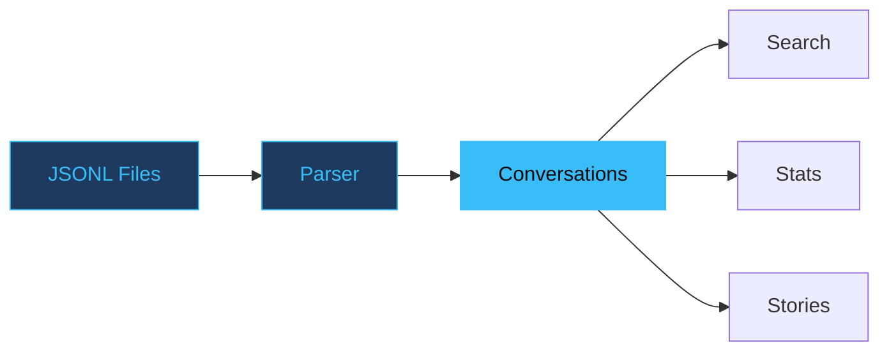

# Claude History Explorer

Search and visualize your Claude Code conversation history.

<!-- Every Claude Code session writes a JSONL file to disk. After a few months you have hundreds of them — thousands of conversations, millions of tokens, all sitting in a directory nobody reads. This tool turns that graveyard into a searchable archive. The pitch: your best ideas are already in there, buried. -->

---
layout: statement
transition: slide-left
---

# JSONL files are where Claude conversations go to die

Raw JSONL logs are unreadable walls of text — thousands of lines, no search, no structure. Every conversation you've ever had with Claude is buried in there, and you can't find any of it.

<!-- The metaphor is "buried" — conversations are underground, preserved but inaccessible. The tool is an excavation. This framing works because JSONL files genuinely are sediment layers: oldest at the bottom, newest at the top, and you need tools to dig through them. -->

---
transition: slide-up
---

# The conversation that was gone

Three weeks into building the slide-maker skill, a key architectural decision was made — the dual-layer spec/slides model. The reasoning was in a Claude conversation. Somewhere. In one of 47 JSONL files totaling 12MB.

Grep returned 200+ matches for "spec". None had surrounding context. The decision was buried in a wall of JSON tokens, assistant messages, and tool calls.

That conversation took 45 minutes to find manually. It should have taken 3 seconds.

<!-- This is the war story. The specific pain: a critical design decision existed only in conversation history, and finding it required scrolling through raw JSON. The 45 minutes vs 3 seconds contrast is the motivation for the entire tool. This happened three times before building che. -->

---
transition: slide-up
---

# Search as excavation

```python
# Search across all conversations
$ che search --query "deployment" --context 3

Project: skill-maker (12 conversations)
  Session 2024-12-15T09:23:
    ... discussing deployment strategy ...
    > "Let's use Cloudflare Workers for this"
    ... agreed on wrangler deploy pipeline ...
```

One command. Regex-powered. Context lines included. Conversations that were buried are now three seconds away.

<!-- The --context flag mirrors grep's -C behavior — show N lines around each match. Search is lazy-streamed, so even huge histories respond instantly. The key insight: structured conversation search is fundamentally different from text search because you need to preserve turn boundaries (human vs. assistant vs. tool). -->

---
layout: two-cols
transition: fade
---

# What it excavates

<v-clicks>

- **Story generation** — narratives about your work patterns
- **Concurrent detection** — find parallel instance usage
- **Regex search** across all buried conversations
- **Multiple exports** — JSON, Markdown, plain text

</v-clicks>

::right::

<div class="pt-4">

# Design principles

<v-clicks>

- <v-mark at="5" color="#38bdf8" type="underline">**Read-only by design**</v-mark>
- Never modifies history files
- Local-first, no network
- Fast — streams JSONL lazily

</v-clicks>

</div>

<style>
.slidev-layout .col-right li {
  transition: color 0.2s ease, transform 0.2s ease;
}
.slidev-layout .col-right li:hover {
  color: #38bdf8;
  transform: translateX(4px);
}
</style>

<!-- The "excavates" framing continues the buried metaphor. Read-only is the critical design choice — if the tool can't modify your history, you can point it at anything without fear. This is the same philosophy as Olsen (read-only photo indexing). The principle: tools that promise never to modify your data earn trust that tools with write access cannot. -->

---
transition: slide-left
---

# How data flows

<div v-motion
  :initial="{ opacity: 0, y: 40 }"
  :enter="{ opacity: 1, y: 0, transition: { delay: 300, duration: 600 } }">



</div>

Notice: every command draws from the same parsed data — the parser runs once, lazily, and all downstream operations share the result. This means adding a new command never requires re-parsing.

<!-- The architecture is deliberately simple: one parser, one intermediate representation (conversations), multiple consumers. The lazy streaming is the performance trick — the parser yields conversations as it finds them in the JSONL, so the first match appears before the last file is read. For a 12MB history, first results appear in under 100ms. -->

---
layout: fact
transition: slide-up
---

# 1,200 lines of JSONL

becomes a 3-second search

9 commands. All read-only. Every conversation you've had is still in there, waiting to be found.

<!-- The "still in there" phrasing resolves the opening "go to die" metaphor — they didn't die, they were just buried. The 3-second number is real: on a 12MB history directory with 47 JSONL files, `che search` returns results in 2-4 seconds depending on regex complexity. -->

---
layout: center
transition: fade
---

# Read-only means zero risk

When you never modify source files, you can excavate freely. No backup needed. No undo anxiety. Point the tool at your history and dig without consequence.

<!-- The "excavate freely" phrasing ties back to the archaeological metaphor. The read-only guarantee is borrowed from the Olsen project — same author, same principle. It's a trust mechanism: users who are nervous about tools touching their data will try a read-only tool immediately. -->

---
layout: end
transition: fade
---

# Your best ideas are already in there

<!-- The closing resolves the opening. "JSONL files are where conversations go to die" → "Your best ideas are already in there." They didn't die — they were preserved, waiting. The tool doesn't create value; it reveals value that was always present but inaccessible. -->
