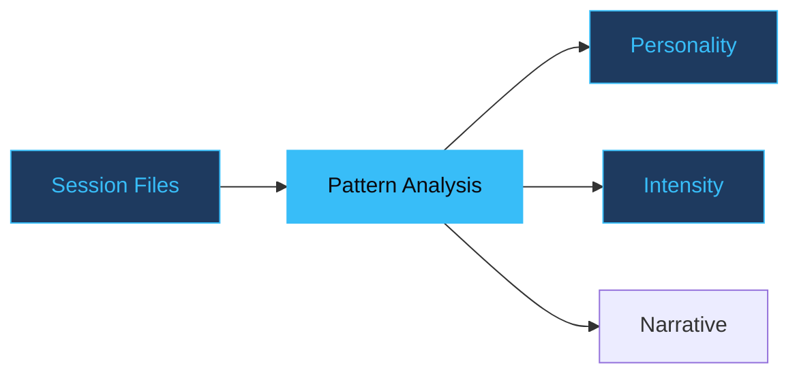

# Claude History Explorer

Read-only exploration of your Claude Code conversations.

github.com/adewale/claude-history-explorer

<!-- Claude History Explorer is a Python CLI that turns the raw JSONL files Claude Code writes to ~/.claude/projects/ into searchable conversations, statistics, and narrative stories about your development journey. The core design rule: the tool never writes to, modifies, or deletes your history files. Read-only means zero risk.

Sources:
- https://github.com/adewale/claude-history-explorer/blob/main/README.md — project overview and feature list
- https://github.com/adewale/claude-history-explorer/blob/main/TRUST.md — read-only guarantee and trust model -->

---
layout: statement
transition: fade
---

# Your conversations contain proprietary code, architecture decisions, and accidental secrets

Any tool that reads them must earn trust before it runs. Read-only is where that trust begins.

<!-- Claude Code conversations may contain API keys accidentally pasted, business logic discussions, internal architecture decisions, and personal coding struggles. TRUST.md opens with this exact framing: "You're being asked to run a tool that reads your AI coding conversations." The skepticism is warranted — and the project addresses it with five testable guarantees rather than asking users to take anything on faith.

Sources:
- https://github.com/adewale/claude-history-explorer/blob/main/TRUST.md — "The Trust Question" section listing what conversations may contain -->

---
transition: slide-up
---

# Five guarantees

<v-clicks>

- **Read-only by design** — never writes, modifies, or deletes history files
- **No network calls** — your conversations never leave your machine
- **Open source and auditable** — every line readable before you run it
- **Minimal dependencies** — only click, rich, and sparklines
- **Scoped reads** — only touches ~/.claude/projects/*.jsonl

</v-clicks>

<!-- Each guarantee is independently verifiable. Read-only: grep the codebase for write operations and find none. No network: check pyproject.toml for HTTP libraries and find none. Open source: the entire tool is four Python files. Minimal deps: three runtime libraries, all formatting-only. Scoped reads: the tool reads JSONL session files and nothing else — not your source code, not your .env, not your git history. The TRUST.md document provides exact verification commands for each guarantee.

Sources:
- https://github.com/adewale/claude-history-explorer/blob/main/TRUST.md — all five guarantees with enforcement methods and verification commands -->

---
transition: slide-up
---

# Read-only enforcement

```bash {1-2|4-5|all}
# Search for write operations — should find none
grep -r "open.*'w'" claude_history_explorer/

# No write imports anywhere in the codebase
grep -r "shutil\.\|os\.remove" claude_history_explorer/
```

Static analysis in the test suite fails the build if write operations are detected. No write imports, no shutil, no os.remove.

<!-- The read-only guarantee is enforced at three levels. First, code design: all file operations use open(file, 'r'). Second, import discipline: the codebase never imports shutil, os.remove, or similar destructive modules. Third, automated verification: the test suite includes a static analysis test that scans for write operations and fails the build if any are found. This is not a promise — it is a testable property of the codebase that runs on every commit.

Sources:
- https://github.com/adewale/claude-history-explorer/blob/main/TRUST.md — Guarantee #1 enforcement: code design, no write imports, automated verification
- https://github.com/adewale/claude-history-explorer/blob/main/docs/ARCHITECTURE.md — read-only data access pattern and static analysis in test architecture -->

---
layout: section
transition: iris
---

# Read-only means zero risk

When you never modify source files, you can explore freely. No backup needed. No undo anxiety.

---
transition: slide-left
---

# Stories from conversations

<div v-motion
  :initial="{ opacity: 0, y: 40 }"
  :enter="{ opacity: 1, y: 0, transition: { delay: 200, duration: 600 } }">



</div>

The story command analyzes sessions to generate narratives about work patterns, collaboration style, and personality traits — in brief, detailed, or timeline format.

<!-- The story generation pipeline works in stages: discover projects, collect session files, extract SessionInfo objects (lightweight summaries with timestamps, message counts, and agent-vs-main classification), then run pattern analysis. Concurrent Claude detection identifies overlapping sessions. Personality classification uses thresholds from constants.py — for example, MESSAGE_RATE_HIGH is 30 messages per hour, AGENT_RATIO_HIGH is 0.8. The output reveals patterns you would never notice reading raw JSONL: "heavy delegation (16 agents, 2 main sessions)" or "used up to 3 Claude instances in parallel."

Sources:
- https://github.com/adewale/claude-history-explorer/blob/main/README.md — story command formats (brief, detailed, timeline) and example output
- https://github.com/adewale/claude-history-explorer/blob/main/docs/ARCHITECTURE.md — story generation pipeline and personality classification -->

---
transition: slide-left
---

# Concurrent Claude detection

<v-clicks>

- Streaming JSONL — line-by-line, never loads full files
- Overlapping session timestamps reveal parallel usage
- Lazy loading — first results before last file is read
- Generators for large result sets, constant memory

</v-clicks>

<div class="spotlight-group mt-6">

```bash
claude-history story -p myproject
# "Used up to 3 Claude instances in parallel"
```

</div>

<!-- Streaming JSONL is the performance architecture: the parser yields conversations as it finds them, so the first match appears before the last file is read. For concurrent detection, the tool collects SessionInfo objects with start and end timestamps, then checks for overlaps — sessions that were active at the same time indicate parallel Claude usage. This is only possible because the tool reads all session files for a project, not just one at a time. The lazy loading pattern means even large histories with hundreds of JSONL files respond quickly.

Sources:
- https://github.com/adewale/claude-history-explorer/blob/main/README.md — concurrent Claude detection feature and streaming JSONL
- https://github.com/adewale/claude-history-explorer/blob/main/docs/ARCHITECTURE.md — efficient file operations: streaming, lazy loading, generators -->

---
transition: slide-up
---

# Three dependencies

<v-clicks>

- **click** — CLI framework (30M+ weekly downloads)
- **rich** — terminal formatting (20M+ weekly downloads)
- **sparklines** — ASCII activity charts (100K+ weekly downloads)

</v-clicks>

All formatting. No file operations. No network operations. The tool works identically offline.

<!-- The dependency choice is deliberate and trust-reinforcing. None of the three dependencies touch files or network — they only format terminal output. No requests, no httpx, no urllib, no aiohttp. You can verify by checking pyproject.toml or running the tool with network disabled. The TRUST.md document links to the GitHub repos for all three dependencies. This is another layer of the read-only guarantee: even if you don't trust the project code, the dependency tree has no capability to exfiltrate data.

Sources:
- https://github.com/adewale/claude-history-explorer/blob/main/TRUST.md — Guarantee #4: minimal dependencies table with download counts and GitHub links
- https://github.com/adewale/claude-history-explorer/blob/main/docs/ARCHITECTURE.md — core dependencies: click, rich, sparklines -->

---
layout: fact
transition: fade
---

# <v-mark at="1" color="#38bdf8" type="circle">~2,600</v-mark> lines

of Python. Four files. Small enough to audit in an afternoon.

<!-- The entire codebase is four files: __init__.py (version metadata), constants.py (analysis thresholds), history.py (data models, parsing, statistics, story generation), and cli.py (command implementations). At roughly 2,600 lines total, a developer can read every line in a single sitting. This is Guarantee #3 from TRUST.md: open source and auditable. The small surface area is itself a trust mechanism — there is nowhere for malicious behavior to hide in a codebase this size.

Sources:
- https://github.com/adewale/claude-history-explorer/blob/main/TRUST.md — Guarantee #3: "Total: ~2,600 lines of Python. Small enough to audit in an afternoon."
- https://github.com/adewale/claude-history-explorer/blob/main/docs/ARCHITECTURE.md — module structure: 4 files in claude_history_explorer/ -->

---
layout: end
transition: fade
---

# You don't have to trust us. The code is small enough to read.

<!-- The closing resolves the opening tension. "Your conversations contain proprietary code, architecture decisions, and accidental secrets" — the trust question. The answer: read-only means zero risk, and the code is small enough to verify that guarantee yourself. This is the final form of the through-line: read-only is not just a design decision, it is a trust mechanism that makes verification possible. The line is a direct quote from TRUST.md's summary: "You don't have to trust us."

Sources:
- https://github.com/adewale/claude-history-explorer/blob/main/TRUST.md — closing summary: "You don't have to trust us. The code is small enough to read, the guarantees are testable, and the Wrapped URLs are decodable. Verify everything yourself." -->
