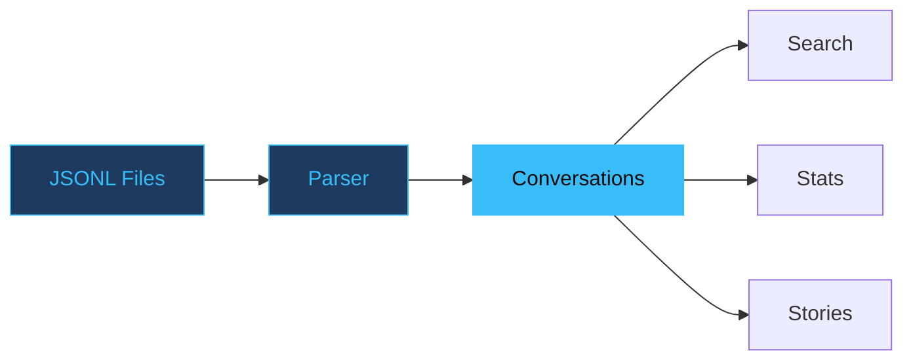

# Claude History Explorer

Search and visualize your Claude Code conversation history.

<!--
Presenter notes:
Open with the pitch: this tool makes your Claude Code history useful.
Mention it's a Python CLI — install with uv, zero config.
-->

---
layout: statement
transition: slide-left
---

# JSONL files are where Claude conversations go to die

Raw JSONL logs are unreadable walls of text — thousands of lines, no search, no structure, no way to find that one conversation from last Tuesday. You need a tool to explore them.

---
transition: slide-up
---

# Search in action

```python
# Search across all conversations
$ che search --query "deployment" --context 3

Project: skill-maker (12 conversations)
  Session 2024-12-15T09:23:
    ... discussing deployment strategy ...
    > "Let's use Cloudflare Workers for this"
    ... agreed on wrangler deploy pipeline ...
```

One command. Regex-powered. Context lines included.

<!--
Presenter notes:
Demo this live if possible — run `che search` in a terminal.
The --context flag mirrors grep's -C behavior.
Mention that search is lazy-streamed, so even huge histories respond instantly.
-->

---
layout: two-cols
transition: fade
---

# What it does

<v-clicks>

- **Story generation** — narratives about your work patterns
- **Concurrent detection** — find parallel instance usage
- **Regex search** across all conversations
- **Multiple exports** — JSON, Markdown, plain text

</v-clicks>

::right::

<div class="pt-4">

# Design principles

<v-clicks>

- <v-mark at="5" color="#38bdf8" type="underline">**Read-only by design**</v-mark>
- Never modifies history files
- Local-first, no network
- Fast — streams JSONL lazily

</v-clicks>

</div>

<style>
.slidev-layout .col-right li {
  transition: color 0.2s ease, transform 0.2s ease;
}
.slidev-layout .col-right li:hover {
  color: #38bdf8;
  transform: translateX(4px);
}
</style>

---
transition: slide-left
---

# How data flows

<div v-motion
  :initial="{ opacity: 0, y: 40 }"
  :enter="{ opacity: 1, y: 0, transition: { delay: 300, duration: 600 } }">



</div>

Raw files in, structured conversations out. Every command draws from the same parsed data.

---
layout: fact
transition: slide-up
---

# 1,200 lines of JSONL

becomes a 3-second search

9 commands. All read-only. Your data never leaves your machine.

---
layout: center
transition: fade
---

# Read-only by design means zero risk

When you never modify source files, you can experiment freely. No backup needed. No undo anxiety. Point the tool at your history and explore without consequence.

---
layout: end
transition: fade
---

# Explore your history

`uv tool install .`

<!--
Presenter notes:
Remind audience: install is one command, no config needed.
Works on macOS and Linux wherever Claude Code stores its JSONL history.
Link to the repo for docs and examples.
-->
