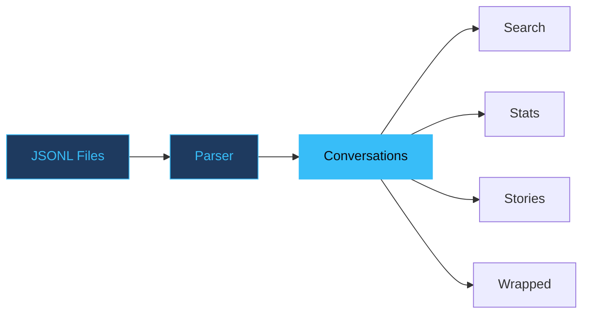

# Claude History Explorer

Search and visualize your Claude Code conversation history.

---
layout: statement
---

# Turn raw JSONL files into searchable conversations and insights

---
transition: slide-left
---

# How data flows

---
layout: two-cols
---

# What it does

<v-clicks>

- **Story generation** — narratives about your work patterns
- **Concurrent detection** — find parallel instance usage
- **Regex search** across all conversations
- **Multiple exports** — JSON, Markdown, plain text

</v-clicks>

::right::

# Design principles

<v-clicks>

- **Read-only by design**
- Never modifies history files
- Local-first, no network
- Fast — streams JSONL lazily

</v-clicks>

---

# Nine commands

<v-clicks>

1. **projects** — list all Claude Code projects
2. **sessions** — browse conversations by project
3. **show** — display a full conversation
4. **search** — regex search with context lines
5. **stats** — token counts, model usage, tool frequencies
6. **summary** — AI-generated project summaries
7. **story** — narratives about collaboration style
8. **wrapped** — shareable year-in-review URL
9. **export** — dump to JSON, Markdown, or text

</v-clicks>

---
layout: quote
transition: slide-up
---

# "Read-only by design. Never modifies your Claude history files."

---
layout: fact
---

# 9

CLI commands

All read-only. Your data never leaves your machine.

---
layout: end
transition: fade
---

# Explore your history

`uv tool install .`
