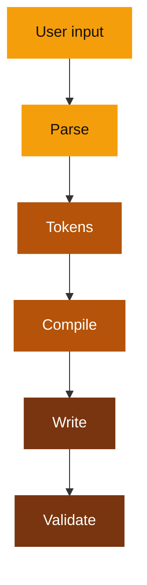
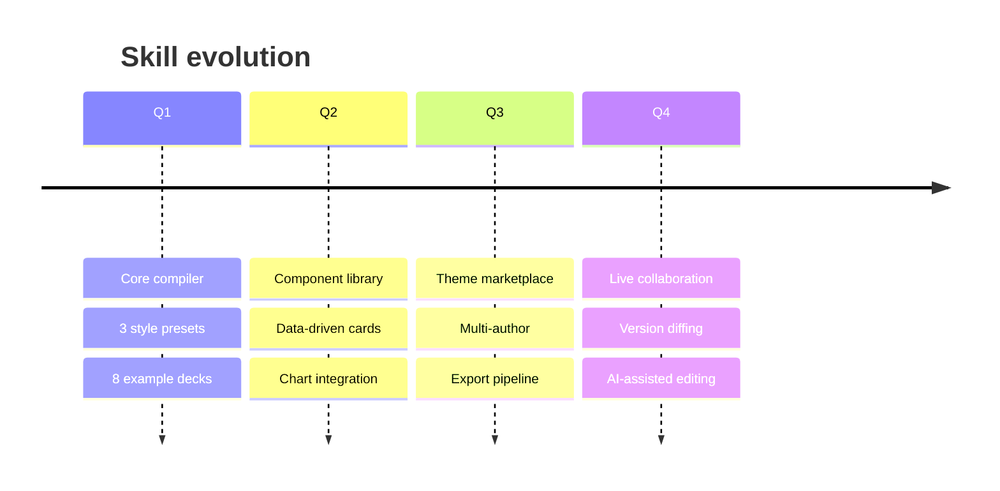

# Slidev Showcase

Every layout, component, and feature this skill can produce.

<style scoped>
.slidev-layout { background: #0a0f0a; color: #e8f5e8; }
h1 { color: #e8f5e8; }
p { color: rgba(232, 245, 232, 0.6); }
</style>

---
layout: section
transition: fade
---

# Built-in Layouts

Slidev ships 19 layouts. These are the ones that matter.

<style scoped>
.slidev-layout { background: #0d0118; color: #f0e6ff; }
h1 { color: #f0e6ff; }
p { color: rgba(240, 230, 255, 0.5); }
</style>

---
layout: statement
transition: slide-up
---

# The statement layout demands attention

<style scoped>
.slidev-layout { background: #151008; color: #f5f0e8; }
h1 { color: #f5f0e8; }
</style>

---
layout: center
transition: fade
---

# The center layout focuses a single idea

Use it for thesis slides, turning points, and transitions between major sections.

<style scoped>
.slidev-layout { background: #12100e; color: #f5f0eb; }
h1 { color: #f5f0eb; }
p { color: rgba(245, 240, 235, 0.5); }
</style>

---
transition: slide-left
---

# The default layout carries content

<v-clicks>

- Handles bullet lists, numbered lists, and paragraphs
- Supports Mermaid diagrams and code blocks inline
- Pairs with `v-clicks` for progressive reveal
- The workhorse of every deck

</v-clicks>

<style scoped>
.slidev-layout { background: #ffffff; color: #1a1a2e; }
h1 { color: #1a1a2e; }
strong { color: #f6821f; }
ul li::marker { color: #f6821f; }
</style>

---
layout: fact
transition: slide-up
---

# 147

Plant species

Garten grows them all from a single canvas element with zero dependencies.

<style scoped>
.slidev-layout { background: #fafdf7; color: #1b2e1b; }
h1 { color: #2d8a4e !important; }
p:first-of-type { color: rgba(27, 46, 27, 0.45); }
p:last-of-type { color: #1b2e1b; }
</style>

---
layout: quote
transition: fade
---

# "Good tools disappear into the workflow"

The best photo indexer is the one you never think about. It just finds what you need.

<style scoped>
.slidev-layout { background: #ffffff; color: #18181b; }
h1 { color: #18181b; border-left-color: #ca8a04; }
p { color: rgba(24, 24, 27, 0.45); }
</style>

---
layout: two-cols
transition: slide-left
---

# editorial-dark

<v-clicks>

- Near-black background
- Soft off-white text
- Cool accent tones
- Playfair Display headings
- Low-intensity fade

</v-clicks>

::right::

# bold-modern

<v-clicks>

- Dark saturated background
- High-contrast type
- Bright accent pairs
- Bebas Neue headings
- Medium-intensity reveals

</v-clicks>

<style scoped>
.slidev-layout { background: #0f1219; color: #e2e8f0; }
h1 { color: #e2e8f0; font-size: 1.75rem; }
strong { color: #38bdf8; }
ul li::marker { color: #38bdf8; }
</style>

---
layout: two-cols-header
transition: slide-up
---

# Two columns with a spanning header

::left::

### Inputs

<v-clicks>

- Title, goal, audience
- Tone and target length
- Source material
- Brand constraints

</v-clicks>

::right::

### Outputs

<v-clicks>

- `slides.md`
- `deck.spec.md`
- `styles/tokens.css`
- Layouts when justified

</v-clicks>

<style scoped>
.slidev-layout { background: #0f0a1e; color: #f0eef5; }
h1 { color: #f0eef5; }
h3 { color: #a78bfa; }
strong { color: #a78bfa; }
code { color: #fb923c; background: rgba(167, 139, 250, 0.1); }
</style>

---
layout: intro
transition: fade
---

# The intro layout

An alternative to cover, designed for speaker introductions.

Displays content with a left-aligned, editorial feel.

<style scoped>
.slidev-layout { background: #0f0a1e; color: #f0eef5; }
h1 { color: #a78bfa; }
p { color: rgba(240, 238, 245, 0.6); }
</style>

---
layout: SplitInsight
transition: fade
---

# SplitInsight -- the recurring split

::left::

### Why custom layouts

<v-clicks>

- Recurring structure reduces duplication
- Slot-based API keeps Markdown clean
- Tokens drive all visual decisions
- One layout replaces dozens of inline HTML blocks

</v-clicks>

::right::

### When to escalate

<v-clicks>

- Two-column reasoning appears 3+ times
- Built-in `two-cols` lacks the border treatment
- The left/right split needs independent scroll
- A header must span both columns naturally

</v-clicks>

<style scoped>
.split-insight { background: #0f1219; color: #e2e8f0; }
h1 { color: #e2e8f0; }
h3 { color: #38bdf8; }
.split-left { border-right-color: #38bdf8; }
strong { color: #38bdf8; }
</style>

---
layout: section
transition: slide-up
---

# Animations and Interactions

Clicks, markers, motion, and code transforms.

<style scoped>
.slidev-layout { background: #0a0f0a; color: #e8f5e8; }
h1 { color: #e8f5e8; }
p { color: rgba(232, 245, 232, 0.5); }
</style>

---
transition: slide-left
---

# v-mark annotations <mdi-marker />

<v-mark v-click type="underline" color="#a78bfa">Underline</v-mark> draws attention to key terms.

<v-mark v-click type="circle" color="#fb923c">Circle</v-mark> highlights a single word.

<v-mark v-click type="highlight" color="rgba(167, 139, 250, 0.2)">Highlight</v-mark> works like a marker pen.

<v-mark v-click type="strike-through" color="#ef4444">Strike-through</v-mark> for deletions and corrections.

<v-mark v-click type="box" color="#22c55e">Box</v-mark> frames important content.

<v-mark v-click type="bracket" color="#38bdf8">Bracket</v-mark> groups related text.

<style scoped>
.slidev-layout { background: #0f0a1e; color: #f0eef5; }
h1 { color: #f0eef5; }
p { margin-bottom: 1rem; font-size: 1.2rem; }
</style>

---
transition: fade
---

# v-motion: physics-based entrances

<div v-motion :initial="{ x: -80, opacity: 0 }" :enter="{ x: 0, opacity: 1, transition: { delay: 200, duration: 800 } }">

**Slide in** from the left with a spring curve.

</div>

<div v-motion :initial="{ y: 40, opacity: 0, scale: 0.8 }" :enter="{ y: 0, opacity: 1, scale: 1, transition: { delay: 600, duration: 600 } }">

**Scale up** with a bounce effect.

</div>

<div v-motion :initial="{ opacity: 0, rotate: -10 }" :enter="{ opacity: 1, rotate: 0, transition: { delay: 1000, duration: 500 } }">

**Rotate in** for dramatic reveals.

</div>

<style scoped>
.slidev-layout { background: #0d0118; color: #f0e6ff; }
h1 { color: #f0e6ff; }
strong { color: #e040fb; }
</style>

---
transition: fade
---

# v-switch: multi-state content

<v-switch>
<template #1>

### State 1: The problem

Users needed a way to create presentations without leaving their code editor.

</template>
<template #2>

### State 2: The approach

Markdown-first. Vue-powered. Vite-compiled. Zero config.

</template>
<template #3>

### State 3: The result

14 decks, 6 style presets, unlimited extensibility.

</template>
</v-switch>

Click to cycle through states. Each click replaces the content.

<style scoped>
.slidev-layout { background: #151008; color: #f5f0e8; }
h1 { color: #f5f0e8; }
h3 { color: #f59e0b; }
p { color: rgba(245, 240, 232, 0.6); }
</style>

---
transition: slide-up
---

# Shiki Magic Move

````md magic-move
```ts
// Before: manual slide creation
const slides = document.createElement('div')
slides.innerHTML = '<h1>Title</h1>'
slides.style.background = '#000'
document.body.appendChild(slides)
```

```ts
// After: declarative Markdown
const spec = {
  title: 'My Deck', theme: 'seriph',
  slides: [
    { layout: 'cover', title: 'Hello' },
    { layout: 'default', content: '...' },
  ],
}
```

```ts
// Even better: just write Markdown
// ---
// theme: seriph
// layout: cover
// ---
// # Hello
// Your content here.
```
````

<style scoped>
.slidev-layout { background: #0f1219; color: #e2e8f0; }
h1 { color: #e2e8f0; }
</style>

---
transition: slide-left
---

# Syntax highlighting with click steps

```ts {1|2-3|5-7|all}
interface Slide {
  layout: string
  title: string
  // optional fields
  body?: string[]
  mermaid?: string
  transition?: 'fade' | 'slide-left' | 'slide-up'
}
```

Line ranges separated by `|` reveal progressively on click. Line numbers highlight the active range.

<style scoped>
.slidev-layout { background: #12100e; color: #f5f0eb; }
h1 { color: #f5f0eb; }
p { color: rgba(245, 240, 235, 0.5); }
</style>

---
transition: fade
---

# Iconify: 150,000+ icons inline

<div class="grid grid-cols-4 gap-8 mt-8 text-center">

<div>
  <mdi-language-typescript class="text-5xl text-blue-400" />
  <div class="mt-2 text-sm opacity-60">TypeScript</div>
</div>

<div>
  <mdi-vuejs class="text-5xl text-green-400" />
  <div class="mt-2 text-sm opacity-60">Vue.js</div>
</div>

<div>
  <mdi-language-markdown class="text-5xl text-purple-400" />
  <div class="mt-2 text-sm opacity-60">Markdown</div>
</div>

<div>
  <mdi-palette-outline class="text-5xl text-orange-400" />
  <div class="mt-2 text-sm opacity-60">Theming</div>
</div>

<div>
  <carbon-chart-line class="text-5xl text-cyan-400" />
  <div class="mt-2 text-sm opacity-60">Charts</div>
</div>

<div>
  <mdi-animation-play class="text-5xl text-pink-400" />
  <div class="mt-2 text-sm opacity-60">Animation</div>
</div>

<div>
  <mdi-code-braces class="text-5xl text-yellow-400" />
  <div class="mt-2 text-sm opacity-60">Code</div>
</div>

<div>
  <mdi-presentation class="text-5xl text-red-400" />
  <div class="mt-2 text-sm opacity-60">Present</div>
</div>

</div>

<style scoped>
.slidev-layout { background: #0f0a1e; color: #f0eef5; }
h1 { color: #f0eef5; }
</style>

---
transition: fade
---

# Arrow and Transform components

<Arrow x1="100" y1="150" x2="350" y2="150" color="#a78bfa" width="2" />
<Arrow x1="400" y1="150" x2="650" y2="150" color="#fb923c" width="2" />
<Arrow x1="100" y1="250" x2="350" y2="350" color="#22c55e" width="2" />

<div class="absolute top-32 left-24 text-sm opacity-60">Start</div>
<div class="absolute top-32 left-88 text-sm opacity-60">Middle</div>
<div class="absolute top-32 right-40 text-sm opacity-60">End</div>

<Transform :scale="0.75" class="absolute bottom-20 right-10">

This text is scaled to 75% using the Transform component. Useful for fitting dense content or creating visual hierarchy.

</Transform>

<style scoped>
.slidev-layout { background: #0f1219; color: #e2e8f0; }
h1 { color: #e2e8f0; }
</style>

---
layout: section
transition: slide-left
---

# Mermaid Diagrams

Flowcharts, timelines, state machines, and more.

<style scoped>
.slidev-layout { background: #151008; color: #f5f0e8; }
h1 { color: #f5f0e8; }
p { color: rgba(245, 240, 232, 0.5); }
</style>

---
transition: fade
---

# Flowchart



<style scoped>
.slidev-layout { background: #151008; color: #f5f0e8; }
h1 { color: #f5f0e8; }
</style>

---
transition: slide-up
---

# Timeline



<style scoped>
.slidev-layout { background: #0d0118; color: #f0e6ff; }
h1 { color: #f0e6ff; }
</style>

---
layout: section
transition: fade
---

# Data Components <mdi-chart-box-outline />

Six reusable Vue components for metrics, progress, and rankings.

<style scoped>
.slidev-layout { background: #fafdf7; color: #1b2e1b; }
h1 { color: #1b2e1b; }
p { color: rgba(27, 46, 27, 0.45); }
</style>

---
transition: slide-left
---

# MetricCard with deltas

<div class="grid grid-cols-4 gap-6 mt-8">
  <MetricCard label="Decks" value="14" delta="+3" direction="up" />
  <MetricCard label="Presets" value="6" delta="+3" direction="up" />
  <MetricCard label="Layouts" value="19" />
  <MetricCard label="Components" value="15" delta="+9" direction="up" />
</div>

<style scoped>
.slidev-layout { background: #0f1219; color: #e2e8f0; }
h1 { color: #e2e8f0; }
.metric-card { border-color: #38bdf8; }
.metric-card .metric-value { color: #38bdf8; }
</style>

---
transition: fade
---

# KPICard in a StatGrid

<StatGrid :cols="3">
  <KPICard label="Geists active" value="57" delta="+8" direction="up" period="this week" />
  <KPICard label="Embeddings" value="12.4k" delta="+2.1k" direction="up" period="this month" />
  <KPICard label="Vault size" value="4.2 GB" delta="+180 MB" direction="up" period="this quarter" />
</StatGrid>

<style scoped>
.slidev-layout { background: #151008; color: #f5f0e8; }
h1 { color: #f5f0e8; }
.kpi-card { border-color: rgba(245, 158, 11, 0.2); background: rgba(245, 158, 11, 0.04); }
.kpi-value { color: #f59e0b !important; }
</style>

---
transition: slide-left
---

# ProgressBar

<div class="mt-6">
  <ProgressBar label="Wave completion" :value="87" />
  <ProgressBar label="Player 1 shields" :value="62" />
  <ProgressBar label="Player 2 shields" :value="45" />
  <ProgressBar label="Boss health" :value="23" />
</div>

<style scoped>
.slidev-layout { background: #0a0f0a; color: #e8f5e8; }
h1 { color: #e8f5e8; }
.progress-fill { background: #39ff14; }
.progress-value { color: #39ff14; }
.progress-track { background: rgba(57, 255, 20, 0.08); }
</style>

---
transition: slide-up
---

# ComparisonBar

<div class="mt-8">
  <ComparisonBar label="Active players" :left="{ name: 'Piano', value: 340 }" :right="{ name: 'Drums', value: 210 }" />
  <ComparisonBar label="Patterns created" :left="{ name: 'Melodic', value: 1200 }" :right="{ name: 'Rhythmic', value: 890 }" />
  <ComparisonBar label="Session length" :left="{ name: 'Solo', value: 18 }" :right="{ name: 'Collab', value: 42 }" />
</div>

<style scoped>
.slidev-layout { background: #0d0118; color: #f0e6ff; }
h1 { color: #f0e6ff; }
.comparison-left { background: #e040fb; color: #0d0118; }
.comparison-right { background: #00e5ff; color: #0d0118; }
.comparison-label { color: rgba(240, 230, 255, 0.5); }
</style>

---
transition: fade
---

# RankList

<div class="mt-6">
  <RankList :items="[{ label: 'Hacker News', value: 234 }, { label: 'ArXiv', value: 189 }, { label: 'Lobsters', value: 142 }, { label: 'RSS feeds', value: 98 }, { label: 'Direct saves', value: 67 }]" />
</div>

<style scoped>
.slidev-layout { background: #12100e; color: #f5f0eb; }
h1 { color: #f5f0eb; }
.rank-value { color: #fb923c; }
.rank-fill { background: linear-gradient(90deg, #fb923c, #fb923c); }
.rank-track { background: rgba(251, 146, 60, 0.08); }
</style>

---
layout: section
transition: slide-left
---

# Code Features <mdi-code-tags />

Syntax highlighting, LaTeX, and code groups.

<style scoped>
.slidev-layout { background: #0f1219; color: #e2e8f0; }
h1 { color: #e2e8f0; }
p { color: rgba(226, 232, 240, 0.5); }
</style>

---
transition: slide-left
---

# LaTeX and math expressions

Inline math: $E = mc^2$

Block equations render with KaTeX:

$$
\sum_{i=1}^{n} \frac{1}{i} = \ln(n) + \gamma + O\left(\frac{1}{n}\right)
$$

$$
\nabla \times \mathbf{E} = -\frac{\partial \mathbf{B}}{\partial t}
$$

<style scoped>
.slidev-layout { background: #151008; color: #f5f0e8; }
h1 { color: #f5f0e8; }
p { color: rgba(245, 240, 232, 0.7); }
</style>

---
transition: slide-left
---

# Code groups: tabbed code blocks

```ts {all|1-3|5-7}
// slides.md frontmatter
const config = {
  theme: 'default',
  // add your own components
  fonts: {
    sans: 'Bricolage Grotesque',
  },
}
```

```vue
<script setup lang="ts"> // MetricCard.vue
defineProps<{ label: string; value: string }>()
</script>
<template>
<div class="metric-card">
  <div class="label">{{ label }}</div>
  <div class="value">{{ value }}</div>
</div></template>
```

<style scoped>
.slidev-layout { background: #0f1219; color: #e2e8f0; }
h1 { color: #e2e8f0; }
p { color: rgba(226, 232, 240, 0.5); }
</style>

---
transition: fade
---

# v-drag: draggable elements


<div v-drag="'card'" class="bg-violet-500/20 border border-violet-400 rounded-lg p-4 w-60">

**Drag me anywhere**

This card can be repositioned during the presentation using v-drag.

</div>

<v-drag-arrow pos="200,350,400,350" color="#a78bfa" width="2" />

Drag elements and arrows reposition freely during your talk.

<style scoped>
.slidev-layout { background: #0d0118; color: #f0e6ff; }
h1 { color: #f0e6ff; }
p { color: rgba(240, 230, 255, 0.6); }
</style>

---
layout: full
transition: slide-up
---

# The full layout: edge to edge

<div class="h-full flex items-center justify-center">
<div class="text-center">

No padding. No margins. The content fills the entire viewport.

Use `layout: full` for immersive visuals, large diagrams, or full-bleed backgrounds.

<div class="mt-8 grid grid-cols-3 gap-4 text-sm">
  <div class="bg-violet-500/10 border border-violet-400/30 rounded p-4">Panel A</div>
  <div class="bg-orange-500/10 border border-orange-400/30 rounded p-4">Panel B</div>
  <div class="bg-green-500/10 border border-green-400/30 rounded p-4">Panel C</div>
</div>

</div>
</div>

<style scoped>
.slidev-layout { background: #0f0a1e; color: #f0eef5; }
h1 { color: #f0eef5; position: absolute; top: 1rem; left: 2rem; }
p { color: rgba(240, 238, 245, 0.6); }
</style>

---
transition: fade
---

# LightOrDark: theme-aware rendering

<LightOrDark>
  <template #dark>
    <div class="p-6 rounded-lg bg-zinc-800 border border-zinc-700">
      You are viewing the <strong class="text-violet-400">dark</strong> variant. Toggle the color schema to see the other.
    </div>
  </template>
  <template #light>
    <div class="p-6 rounded-lg bg-zinc-100 border border-zinc-300 text-zinc-900">
      You are viewing the <strong class="text-violet-600">light</strong> variant. Toggle the color schema to see the other.
    </div>
  </template>
</LightOrDark>

Adapt content, images, and diagrams to the viewer's preferred color scheme.

<style scoped>
.slidev-layout { background: #12100e; color: #f5f0eb; }
h1 { color: #f5f0eb; }
p { color: rgba(245, 240, 235, 0.5); margin-top: 1.5rem; }
</style>

---
layout: section
transition: slide-left
---

# Platform Features <mdi-cog-outline />

Table of contents, slide imports, and global layers.

<style scoped>
.slidev-layout { background: #0a0f0a; color: #e8f5e8; }
h1 { color: #e8f5e8; }
p { color: rgba(232, 245, 232, 0.5); }
</style>

---
transition: fade
---

# Table of Contents

<Toc columns="3" maxDepth="1" mode="onlyCurrentTree" />

The `<Toc>` component auto-generates navigation from slide titles. Props: `columns`, `maxDepth`, `mode`.

<style scoped>
.slidev-layout { background: #0f1219; color: #e2e8f0; }
h1 { color: #e2e8f0; }
p { color: rgba(226, 232, 240, 0.5); margin-top: 1rem; font-size: 0.8rem; }
:deep(.slidev-toc) { font-size: 0.65rem; line-height: 1.4; }
:deep(.slidev-toc a) { color: #e2e8f0; }
</style>

---
transition: fade
---

# Component API reference

| Component | Props | Description |
|---|---|---|
| `MetricCard` | `label` `value` `delta?` `direction?` | Single metric display |
| `KPICard` | `label` `value` `delta` `direction` `period?` | Full KPI with trend |
| `ProgressBar` | `label` `value` `max?` `suffix?` | Horizontal fill bar |
| `ComparisonBar` | `label` `left` `right` | Segmented comparison |
| `StatGrid` | `cols?` | Auto-grid wrapper (slot) |
| `RankList` | `items` `suffix?` | Ordered bar chart |

<style scoped>
.slidev-layout { background: #ffffff; color: #1a1a2e; }
h1 { color: #1a1a2e; }
th { color: #f6821f; border-bottom-color: #f6821f; }
td { color: #1a1a2e; border-bottom-color: rgba(26, 26, 46, 0.1); }
code { color: #f6821f; background: rgba(246, 130, 31, 0.08); }
p { color: rgba(26, 26, 46, 0.6); }
</style>

---
layout: section
transition: iris
---

# Cinematic Transitions

Named CSS transitions for slide-level drama.

<style scoped>
.slidev-layout { background: #0f0a1e; color: #f0eef5; }
h1 { color: #f0eef5; }
p { color: rgba(240, 238, 245, 0.5); }
</style>

---
transition: morph-fade
---

# morph-fade

Scale, blur, and opacity combine for a smooth morphing entrance. Set `transition: morph-fade` in slide frontmatter.

<v-clicks>

- Scale from 0.95 with 4px blur
- 0.5s cubic-bezier easing
- Works well between related content slides

</v-clicks>

<style scoped>
.slidev-layout { background: #0d0118; color: #f0e6ff; }
h1 { color: #f0e6ff; }
strong { color: #e040fb; }
ul li::marker { color: #e040fb; }
</style>

---
transition: zoom-in
---

# zoom-in

Content scales from 60% to full size with a fade. Ideal for reveals and dramatic moments.

<v-clicks>

- Scale from 0.6 to 1.0
- Combined with opacity fade
- Pairs well with fact or statement layouts

</v-clicks>

<style scoped>
.slidev-layout { background: #151008; color: #f5f0e8; }
h1 { color: #f5f0e8; }
strong { color: #f59e0b; }
ul li::marker { color: #f59e0b; }
</style>

---
transition: flip-x
---

# flip-x

A 3D card flip around the Y axis. Adds depth and surprise between contrasting viewpoints.

<v-clicks>

- 90-degree rotateY with perspective
- Backface hidden for clean flip
- Best for before/after comparisons

</v-clicks>

<style scoped>
.slidev-layout { background: #0f1219; color: #e2e8f0; }
h1 { color: #e2e8f0; }
strong { color: #38bdf8; }
ul li::marker { color: #38bdf8; }
</style>

---
layout: section
transition: wipe-right
---

# Animation Components

GlassCard, ShadowStack, ImageFX, and more.

<style scoped>
.slidev-layout { background: #0a0f0a; color: #e8f5e8; }
h1 { color: #e8f5e8; }
p { color: rgba(232, 245, 232, 0.5); }
</style>

---
transition: glide
---

# GlassCard

<div class="flex gap-6 mt-8">
  <GlassCard :blur="12" :opacity="0.1">
    <h3>Default blur</h3>
    <p>12px blur, 10% white background, border enabled.</p>
  </GlassCard>
  <GlassCard :blur="20" :opacity="0.2" :border="false">
    <h3>Heavy blur</h3>
    <p>20px blur, 20% opacity, no border.</p>
  </GlassCard>
</div>

<style scoped>
.slidev-layout { background: linear-gradient(135deg, #0f0a1e 0%, #1a0a2e 50%, #0f0a1e 100%); color: #f0eef5; }
h1 { color: #f0eef5; }
h3 { color: #a78bfa; font-size: 1rem; margin-bottom: 0.5rem; }
p { color: rgba(240, 238, 245, 0.6); font-size: 0.85rem; }
</style>

---
transition: blur
---

# ShadowStack presets

<div class="grid grid-cols-3 gap-6 mt-8">
  <ShadowStack preset="subtle">
    <div class="demo-card">subtle</div>
  </ShadowStack>
  <ShadowStack preset="dramatic">
    <div class="demo-card">dramatic</div>
  </ShadowStack>
  <ShadowStack preset="glow">
    <div class="demo-card">glow</div>
  </ShadowStack>
</div>

<style scoped>
.slidev-layout { background: #0f0a1e; color: #f0eef5; }
h1 { color: #f0eef5; }
.demo-card {
  background: rgba(167, 139, 250, 0.08);
  border: 1px solid rgba(167, 139, 250, 0.2);
  border-radius: 12px;
  padding: 2rem;
  text-align: center;
  font-family: var(--deck-font-mono);
  font-size: 0.9rem;
  color: var(--deck-accent);
}
</style>

---
transition: fade
---

# Keyboard shortcuts: press ?

Press <kbd>?</kbd> at any time to open the keyboard help panel. It shows all navigation, view, and tool shortcuts in a three-column grid.

<v-clicks>

- <kbd>?</kbd> toggles the overlay
- <kbd>Escape</kbd> closes it
- Works in both viewer and presenter modes

</v-clicks>

<style scoped>
.slidev-layout { background: #12100e; color: #f5f0eb; }
h1 { color: #f5f0eb; }
p { color: rgba(245, 240, 235, 0.7); }
strong { color: #fb923c; }
ul li::marker { color: #fb923c; }
kbd {
  display: inline-flex;
  align-items: center;
  padding: 0.1em 0.4em;
  font-family: var(--deck-font-mono);
  font-size: 0.85em;
  background: rgba(255,255,255,0.08);
  border: 1px solid rgba(255,255,255,0.15);
  border-radius: 4px;
}
</style>

---
layout: end
transition: fade
---

# Every feature. One deck.

13 decks. 6 presets. 46 slides. Every feature.

<style scoped>
.slidev-layout { background: #0f0a1e; color: #f0eef5; }
h1 { color: #f0eef5; }
p { color: #fb923c; }
</style>
