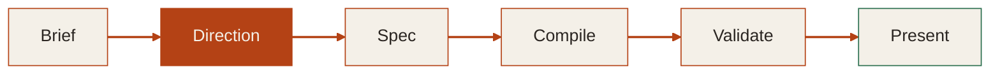

# Slide Maker

Decks that survive the podium. Built from specs, not templates.

<!-- The opening line frames the core problem without naming it yet. "Survive the podium" implies fragility; "specs, not templates" hints at the architecture. This is a warm parchment palette with Young Serif display type and Source Sans 3 body. Deliberately light mode, deliberately serif, deliberately not the AI-aesthetic dark-purple-gradient default. -->

---
layout: statement
transition: morph-fade
---

# Every generated deck looks the same because styling happens last

<!-- The tension. Most AI slide tools apply a "theme" after writing content, which means visual identity is decoration, not direction. The result: interchangeable purple-gradient-on-dark decks with Inter type and rounded-corner cards. This slide names the failure mode. -->

---
transition: slide-left
---

# The fix: decide direction before writing a single slide

**Direction** is step two — before the spec, before any slides exist. By the time compilation starts, the deck already has a voice.

<!-- The flowchart shows the full user journey: brief (what you want to say), direction (how it should look and feel), spec (the structured plan), compile (Markdown generation), validate (WCAG checks, LLM-tell audit, screenshot review), present. The bold highlight on Direction is the key insight. This is the anti-generic mechanism. No edge labels because Mermaid renders them as black boxes; every node has explicit inline style. -->

---
layout: SplitInsight
transition: wipe-right
---

# Two layers, one source of truth

::left::

### Planning layer

<v-clicks>

- **deck.spec.md** locks intent before compilation
- Tokens, layout choices, slide outlines
- Edit the blueprint to change direction

</v-clicks>

::right::

### Presentation layer

- **slides.md** is native Slidev Markdown
- `tokens.css` + `theme.css` carry the visual identity
- Edit slides to change content — nothing breaks

<!-- The dual-layer architecture solves both failure modes. The spec layer prevents generic output by forcing direction choices upfront. The presentation layer prevents brittle output by compiling to native Slidev Markdown, not custom wrapper HTML.

[click] deck.spec.md locks intent — font families, color tokens, layout preferences, and slide-by-slide outlines are decided before any Markdown is written.

[click] Tokens, layout choices, slide outlines — these are planning concerns, separated from presentation concerns.

[click] Edit the blueprint to change direction — the spec is the steering wheel, the slides are the road. -->

---
transition: slide-up
---

# Six presets, zero sameness

<v-clicks>

- **editorial-dark** — Playfair Display on near-black. Board decks, investor updates.
- **swiss-minimal** — DM Sans on white. Technical briefings, research.
- **bold-modern** — Bebas Neue, saturated backgrounds. Launches, keynotes.
- **tufte-data** — EB Garamond, 60/30 column split. Evidence-heavy analysis.
- **cloudflare** — Warm cream, orange accents. Developer workshops.
- **material-design** — M3 elevation, systematic. Product walkthroughs.

</v-clicks>

<!-- Each preset controls typography, color, motion character, and layout tendencies. The same content under editorial-dark feels restrained and high-trust; under bold-modern it feels assertive and launch-ready. Presets are not skins applied after the fact. They are directions that influence which layouts get chosen and how transitions behave.

[click] through [click] Each preset is a different opinion about how information should feel. Real designers make these choices deliberately; Slide Maker forces the choice before writing slides. -->

---
layout: section
transition: iris
---

# What the compiler actually does

Not a template engine. A seven-phase build.

<!-- Section break. The word "actually" signals specificity. This is where the deck gets concrete about the build process. -->

---
transition: slide-left
---

# The build: normalize, decide, write, validate

<v-clicks>

1. **Normalize** the brief into structured inputs
2. **Decide implementation level** per slide — Markdown first, HTML last
3. **Write headmatter** with tokens, fonts, transitions
4. **Write slides** using the spec's outline and the preset's tendencies
5. **Write tokens and theme CSS** from the spec's design tokens
6. **Validate** — WCAG contrast ratios, LLM-tell audit, CRAP principles
7. **Screenshot audit** — does the rendered deck match the spec's intent?

</v-clicks>

<!-- The seven phases are sequential. Validation is not optional — the compiler checks its own output against WCAG AA (4.5:1 for body text, 3:1 for large text), runs an LLM-tell check against the catalog in LLM_TELLS.md, and applies CRAP design principles (Contrast, Repetition, Alignment, Proximity).

[click] through [click] Progressive reveal here earns its place because each phase builds on the previous one. The audience should see the dependency chain forming. -->

---
transition: morph-fade
---

# The toolkit

### Transitions

12 built-in: fade, slide-left, slide-up, iris, wipe-right, wipe-up, morph-fade, zoom-in, zoom-out, flip-x, flip-y, blur

### Visual effects

v-motion, v-mark (underline, circle, strike, highlight, box), Shiki Magic Move for code transforms

### Data visualization

Mermaid flowcharts, sequence diagrams, mind maps, pie charts, timelines, git graphs, entity-relationship, state diagrams — all with explicit inline styling

### Design guardrails

WCAG contrast checking, LLM-tell detection, CRAP audit, screenshot validation

<!-- This is the breadth slide. No v-clicks — the point is volume, not sequence. Two columns keep it scannable. The numbers are specific: 12 transitions (not "many"), 8 Mermaid diagram types (not "various"), 5 v-mark annotation styles. Specificity is the antidote to AI-generated vagueness. -->

---
layout: center
transition: fade
---

# The priority stack

<v-clicks>

Editability 
Clarity 
Coherence 
Native Slidev 
Reuse 
Restraint

</v-clicks>

<!-- The opacity gradient makes the hierarchy visceral. Editability at the top means: if you cannot change the deck without breaking it, nothing else matters. Restraint at the bottom is the reminder that complexity is the enemy.

[click] Editability — the anti-brittle priority. Native Markdown over custom HTML.

[click] Clarity — the anti-generic priority. Every slide argues something.

[click] Coherence — no orphan slides, no filler.

[click] Native Slidev — stay on the platform.

[click] Reuse — shared presets, shared transitions.

[click] Restraint — use just enough of everything. A good deck has few layouts, readable Markdown, and no wrapper soup. -->

---
layout: quote
transition: slide-up
---

# The test: close the tab. What do you remember?

A generic deck leaves nothing. No image, no number, no story. The information was arranged correctly but never argued anything. There was no point of view.

<!-- This is from LLM_TELLS.md's "meta-signal" section — the ultimate test for whether a deck reads as AI-generated. It reframes the opening tension: the problem is not just that generated decks look the same; it is that they say nothing memorable. Direction is not decoration. Direction is the argument. -->

---
layout: end
transition: iris
---

# Direction first. Then slides.

That is the entire idea.

<!-- The closing mirrors the opening. "Decks that survive the podium" resolves to "Direction first. Then slides." The second line defuses any impulse to add more — the idea is small enough to hold in one hand. No install command, no URL, no "questions?" — just the thesis. -->
