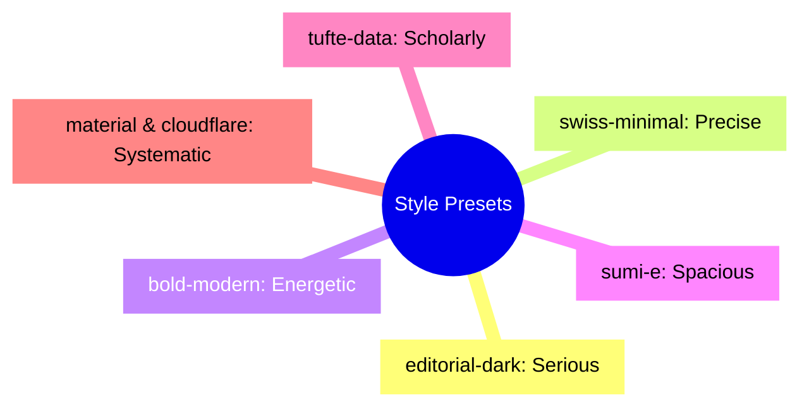
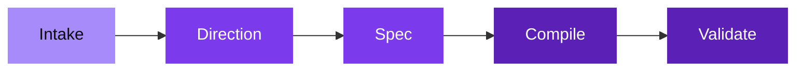

# Slide Maker

Native Slidev decks. Strong visual direction. Minimal abstraction.

---
layout: statement
transition: fade
---

# Most generated slides are too generic or too brittle

---
layout: SplitInsight
transition: slide-up
---

# Two layers. One source of truth.

::left::

### Planning layer

<v-clicks>

- **deck.spec.md** captures intent
- Structure, tokens, boundaries
- The blueprint you edit first

</v-clicks>

::right::

### Presentation layer

<v-clicks>

- **slides.md** is the compiled output
- Native Slidev Markdown
- The building you present

</v-clicks>

---
layout: section
---

# The escalation ladder

Use the lowest level that solves the slide cleanly.

---
transition: fade
---

# Five levels of implementation

<v-clicks>

1. **Markdown** — always start here
2. **Built-in layout** — cover, section, center, fact, end
3. **Custom layout** — only when a structure repeats
4. **Custom component** — only when a block has props and reuse
5. **Inline HTML** — last resort

</v-clicks>

---
layout: SplitInsight
---

# What goes in. What comes out.

::left::

### Inputs

<v-clicks>

- Title, goal, audience
- Tone and target length
- Source material
- Brand constraints

</v-clicks>

::right::

### Outputs

<v-clicks>

- `slides.md`
- `deck.spec.md`
- `styles/tokens.css` + `theme.css`
- Layouts and components only when justified

</v-clicks>

---
transition: slide-up
---

# Seven visual directions

---

# Five-step workflow

<v-clicks>

- **Intake** — goal, audience, material, constraints
- **Direction** — choose a visual style preset
- **Spec** — write deck.spec.md
- **Compile** — generate slides.md + implementation
- **Validate** — check sync, density, and abstraction count

</v-clicks>

---
layout: fact
transition: fade
---

# 6

Priorities in order

Editability, Clarity, Coherence, Native Slidev, Reuse, Restraint

---
layout: quote
---

# "Restraint is the feature"

A good deck has few layouts, few components, readable Markdown, and no legacy HTML smell.

---
transition: iris
---

# Deck at a glance

<SlideOverview />

---
layout: end
transition: fade
---

# Start building

`/slide-maker` in Claude Code
