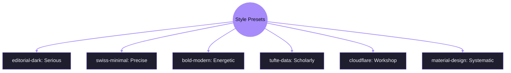
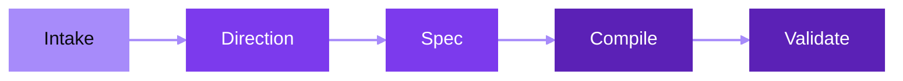

# Slide Maker

Native Slidev decks. Strong visual direction. Minimal abstraction.

github.com/adewale/skill-maker

<!-- This meta-deck explains how Slide Maker works — the skill that builds all other decks. The tension it resolves: generated slides are either too generic (interchangeable, no visual identity) or too brittle (break when you edit them). The dual-layer architecture exists to solve this specific problem.

Sources:
- file:slide-maker/COMPILER_RULES.md — build phases and acceptance checklist
- file:slide-maker/STYLE_PRESETS.md — the seven visual direction presets
- file:slide-maker/DECK_SPEC.md — planning schema specification -->

---
layout: statement
transition: fade
---

# Most generated slides are too generic or too brittle

<!-- The core problem. "Generic" means: same fonts, same layouts, same gradient backgrounds, indistinguishable from any other AI-generated deck. "Brittle" means: custom HTML that breaks when you add a bullet point or change a heading. These are the two failure modes the skill is designed to prevent. -->

---
layout: SplitInsight
transition: slide-up
---

# Two layers prevent both failures

::left::

### Planning layer

<v-clicks>

- **deck.spec.md** captures intent
- Structure, tokens, boundaries
- Visual direction decided here, not in slides
- The blueprint you edit first

</v-clicks>

::right::

### Presentation layer

- **slides.md** is the compiled output
- Native Slidev Markdown
- The building you present

<!-- The dual-layer architecture solves both failure modes.

[click] deck.spec.md captures intent — the spec layer prevents generic output by forcing visual direction choices before compilation. You decide what the deck looks like before writing a single slide.

[click] Structure, tokens, boundaries — these are planning concerns, not presentation concerns. The spec holds them so the slides don't have to.

[click] Visual direction decided here, not in slides — this is the anti-generic mechanism. By the time compilation starts, the deck already has a voice.

[click] The blueprint you edit first — edit the spec to change direction. Edit slides.md to change content. Neither breaks the other. The presentation layer prevents brittle output by compiling to native Slidev Markdown, not custom HTML.

Sources:
- file:slide-maker/DECK_SPEC.md — planning schema with required sections (Meta, Design Tokens, Layout System, Slides)
- file:slide-maker/COMPILER_RULES.md — compilation phases from spec to slides -->

---
layout: section
---

# Use the lowest level that works

Not the most impressive — the most maintainable.

<!-- The section divider reframes the escalation ladder as an anti-brittle principle. "Not the most impressive" is the key qualifier — the temptation is always to reach for custom HTML because it looks better, but it breaks when content changes. -->

---
transition: fade
---

# Start with Markdown and stop as soon as it works

<div v-motion :initial="{ opacity: 0, x: -30 }" :enter="{ opacity: 1, x: 0, transition: { delay: 200, duration: 600 } }">

<v-clicks>

1. **Markdown** — always start here
2. **Built-in layout** — cover, section, center, fact, end
3. **Custom layout** — only when a structure repeats
4. **Custom component** — only when a block has props and reuse
5. **Inline HTML** — last resort

</v-clicks>

</div>

<!-- Each level is annotated with its relationship to the generic/brittle tension.

[click] Markdown is resilient but can be generic — presets fix that. Always start here because it never breaks when you edit content.

[click] Built-in layouts add structure without fragility — cover, section, center, fact, end. These are free complexity.

[click] Custom layouts are justified only when a structure repeats across multiple slides. This is where you start paying a maintenance cost.

[click] Custom components are justified only when a block has props and reuse. Higher cost, but contained.

[click] Inline HTML is the brittle zone — last resort. This is where generated decks break most often. Every line of inline HTML is a maintenance liability.

Sources:
- file:slide-maker/COMPILER_RULES.md — "Decide implementation level per slide" section defining the five-level escalation -->

---
layout: SplitInsight
---

# What goes in. What comes out.

::left::

### Inputs

- Title, goal, audience
- Tone and target length
- Source material
- Brand constraints

::right::

### Outputs

- `slides.md`
- `deck.spec.md`
- `styles/tokens.css` + `theme.css`
- Layouts and components only when justified

<!-- No v-clicks here — these lists have equal weight and the audience should see the full picture at once. The "only when justified" on the outputs side echoes the escalation ladder.

Sources:
- file:slide-maker/COMPILER_RULES.md — Inputs (required/optional) and Outputs (required/optional) sections -->

---
transition: slide-left
---

# From spec to slides

````md
# deck.spec.md
## Meta
- title: My Deck
- style-preset: editorial-dark
- target-length: 8

## Slides
### Slide 1
- kind: cover
- title: My Deck
````

<v-click>

becomes `slides.md` with tokens, theme, layouts, and visual polish — all from one spec file.

</v-click>

<!-- The spec file is the single source of truth. The "style-preset" field is what prevents generic output — it forces a visual direction choice at the spec level, before any slides are written. Visual identity is a planning concern, not a presentation concern.

Sources:
- file:slide-maker/DECK_SPEC.md — canonical template showing the spec-to-slides compilation path -->

---
transition: slide-up
---

# One skill, six different-looking decks



Each preset controls typography, color, motion, and layout tendencies — the same content looks and feels different under each preset. This is how one skill produces decks that don't look generated.

<!-- Presets are not skins applied after the fact. They're directions — they influence which layouts get chosen, how transitions behave, and what the typography communicates. A "serious" deck uses different v-click animations than an "energetic" one. editorial-dark fades in; bold-modern scales and slides.

Sources:
- file:slide-maker/STYLE_PRESETS.md — six preset definitions with palette, typography, motion, interaction patterns -->

---

# Direction comes before content



Notice: "Direction" comes before "Spec" — the visual identity decision is made before any slides are written. This is the anti-generic mechanism. By the time compilation starts, the deck already has a voice.

<!-- The workflow enforces the principle: direction before content. In the generic failure mode, styling is applied after compilation — backwards. The current workflow makes direction the second step, before a single slide is written.

Sources:
- file:slide-maker/COMPILER_RULES.md — compilation phases (Normalize, Decide level, Write headmatter, Write slides, Write tokens, Write theme) -->

---
layout: center
transition: fade
---

# The priority stack

<v-clicks>

<div class="text-4xl font-bold tracking-tight leading-relaxed">
<span class="opacity-100">Editability</span><br>
<span class="opacity-75">Clarity</span><br>
<span class="opacity-55">Coherence</span><br>
<span class="opacity-40">Native Slidev</span><br>
<span class="opacity-30">Reuse</span><br>
<span class="opacity-20">Restraint</span>
</div>

</v-clicks>

Each click reveals the next priority. The fade communicates the hierarchy — the top matters most.

<!-- The priority order resolves the generic/brittle tension. The opacity gradient makes the ranking visceral rather than just listed.

[click] Editability first — the anti-brittle priority. If you can't edit the deck without breaking it, nothing else matters.

[click] Clarity second — the anti-generic priority. The deck must communicate clearly, not just exist.

[click] Coherence — every slide serves the argument. No orphan slides, no filler.

[click] Native Slidev — stay on the platform. Don't fight the tool.

[click] Reuse — shared components, shared presets, shared transitions.

[click] Restraint last — a reminder that the temptation to add complexity is the enemy of both goals. Less is almost always more.

Sources:
- file:slide-maker/COMPILER_RULES.md — "Goals" section listing the six optimization priorities -->

---
layout: quote
---

# "Restraint is the feature"

A good deck has few layouts, few components, readable Markdown, and no legacy HTML smell.

<!-- Restraint is the synthesis. A generic deck has too little visual identity. A brittle deck has too much custom implementation. Restraint is the discipline of using just enough of both — strong direction, minimal abstraction. -->

---
layout: end
transition: fade
---

# The best slide deck is the one you actually give

<!-- The closing resolves the opening. "Most generated slides are too generic or too brittle" — generic decks get abandoned because they're embarrassing, brittle decks get abandoned because they break. The goal isn't perfect slides — it's slides that survive contact with a real presenter and a real audience.

Sources:
- file:slide-maker/COMPILER_RULES.md — acceptance checklist defining what "done" means -->
