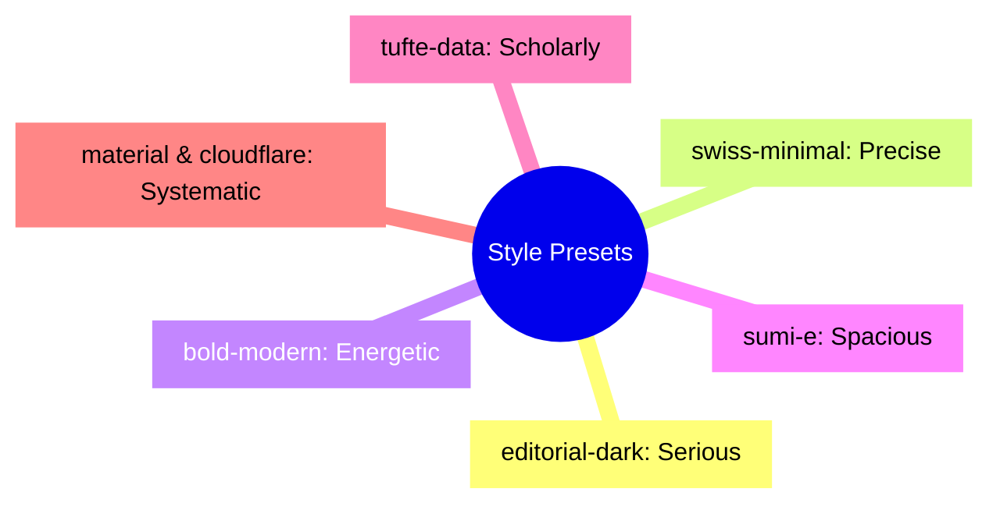
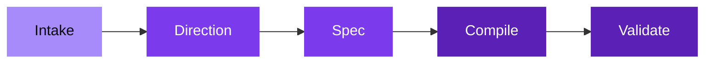

# Slide Maker

Native Slidev decks. Strong visual direction. Minimal abstraction.

github.com/adewale/skill-maker

<!-- This meta-deck explains how Slide Maker works — the skill that builds all other decks. The tension it resolves: generated slides are either too generic (interchangeable, no visual identity) or too brittle (break when you edit them). The dual-layer architecture exists to solve this specific problem. -->

---
layout: statement
transition: fade
---

# Most generated slides are too generic or too brittle

<!-- The core problem. "Generic" means: same fonts, same layouts, same gradient backgrounds, indistinguishable from any other AI-generated deck. "Brittle" means: custom HTML that breaks when you add a bullet point or change a heading. These are the two failure modes the skill is designed to prevent. -->

---
transition: slide-up
---

# The generic failure

An early prototype generated a 12-slide deck about Cloudflare Workers. Sans-serif headings, gradient backgrounds, bullet-point lists. It looked exactly like every other AI-generated deck. The audience would have no reason to remember it.

The problem wasn't technical — it compiled, it rendered, it was correct. The problem was that it had no voice.

<!-- This is the war story. The first-generation prototype used a single template with parameterized colors. Every deck looked the same because the same structural decisions produced the same visual output. "Correct but forgettable" is the failure mode that style presets were designed to prevent. -->

---
transition: slide-left
---

# The brittle failure

Another prototype used heavy custom HTML — grid layouts, absolute positioning, inline SVG diagrams. The deck looked great. Then the presenter added one bullet point and the layout collapsed.

Custom HTML is powerful and fragile. Markdown is limited and resilient. The escalation ladder exists to keep you in Markdown as long as possible.

<!-- The second war story. A deck using 200+ lines of custom HTML in scoped styles broke when the content changed. The fix wasn't better HTML — it was using less of it. This failure directly motivated the "escalation ladder" principle: Markdown → built-in layout → custom layout → custom component → inline HTML. Each step up adds power and fragility simultaneously. -->

---
layout: SplitInsight
transition: slide-up
---

# Two layers prevent both failures

::left::

### Planning layer

<v-clicks>

- **deck.spec.md** captures intent
- Structure, tokens, boundaries
- The blueprint you edit first

</v-clicks>

::right::

### Presentation layer

<v-clicks>

- **slides.md** is the compiled output
- Native Slidev Markdown
- The building you present

</v-clicks>

<!-- The dual-layer architecture is the solution to both failure modes. The spec layer prevents generic output (it forces visual direction choices before compilation). The presentation layer prevents brittle output (it compiles to native Slidev Markdown, not custom HTML). Edit the spec to change direction. Edit slides.md to change content. Neither breaks the other. -->

---
layout: section
---

# The escalation ladder

Use the lowest level that solves the slide cleanly — not the most impressive.

<!-- The section divider reframes the escalation ladder as an anti-brittle principle. "Not the most impressive" is the key qualifier — the temptation is always to reach for custom HTML because it looks better, but it breaks when content changes. -->

---
transition: fade
---

# Five levels of implementation

<div v-motion :initial="{ opacity: 0, x: -30 }" :enter="{ opacity: 1, x: 0, transition: { delay: 200, duration: 600 } }">

<v-clicks>

1. **Markdown** — always start here (resilient, editable, generic-proof when combined with presets)
2. **Built-in layout** — cover, section, center, fact, end (structure without fragility)
3. **Custom layout** — only when a structure repeats (justified complexity)
4. **Custom component** — only when a block has props and reuse (earned abstraction)
5. **Inline HTML** — last resort (powerful, fragile, generic-prone)

</v-clicks>

</div>

<!-- Each level is annotated with its relationship to the generic/brittle tension. Markdown is resilient but can be generic — presets fix that. Built-in layouts add structure without fragility. Custom layouts and components are justified complexity. Inline HTML is the brittle zone. The escalation ladder is a fragility gradient. -->

---
layout: SplitInsight
---

# What goes in. What comes out.

::left::

### Inputs

- Title, goal, audience
- Tone and target length
- Source material
- Brand constraints

::right::

### Outputs

- `slides.md`
- `deck.spec.md`
- `styles/tokens.css` + `theme.css`
- Layouts and components only when justified

<!-- No v-clicks here — these lists have equal weight and the audience should see the full picture at once. The "only when justified" on the outputs side echoes the escalation ladder. -->

---
transition: slide-left
---

# From spec to slides

````md
# deck.spec.md
## Meta
- title: My Deck
- style-preset: editorial-dark
- target-length: 8

## Slides
### Slide 1
- kind: cover
- title: My Deck
````

<v-click>

becomes `slides.md` with tokens, theme, layouts, and visual polish — all from one spec file.

</v-click>

<!-- The spec file is the single source of truth. The "style-preset" field is what prevents generic output — it forces a visual direction choice at the spec level, before any slides are written. This is the critical design decision: visual identity is a planning concern, not a presentation concern. -->

---
transition: slide-up
---

# Seven visual directions



Each preset controls typography, color, motion, and layout tendencies — the same content looks and feels different under each preset. This is how one skill produces decks that don't look generated.

<!-- The mindmap is a taxonomy, not an architecture. The insight: presets aren't themes (skins you apply after the fact). They're directions — they influence which layouts get chosen, how transitions behave, and what the typography communicates. A "serious" deck uses different v-click animations than an "energetic" one. -->

---

# Five-step workflow



Notice: "Direction" comes before "Spec" — the visual identity decision is made before any slides are written. This is the anti-generic mechanism. By the time compilation starts, the deck already has a voice.

<!-- The workflow enforces the principle: direction before content. In the generic failure, the prototype compiled first and applied styling after. That's backwards — it produces generic output because styling is an afterthought. The current workflow makes direction the second step, before a single slide is written. -->

---
layout: fact
transition: fade
---

# 6

Priorities in order

Editability, Clarity, Coherence, Native Slidev, Reuse, Restraint

<!-- The priority order resolves the generic/brittle tension. Editability first (anti-brittle). Clarity second (anti-generic). Restraint last — a reminder that the temptation to add complexity is the enemy of both goals. -->

---
layout: quote
---

# "Restraint is the feature"

A good deck has few layouts, few components, readable Markdown, and no legacy HTML smell.

<!-- Restraint is the synthesis. A generic deck has too little visual identity. A brittle deck has too much custom implementation. Restraint is the discipline of using just enough of both — strong direction, minimal abstraction. -->

---
layout: end
transition: fade
---

# The best slide deck is the one you actually give

<!-- The closing resolves the opening. "Most generated slides are too generic or too brittle" → "The best slide deck is the one you actually give." Generic decks get abandoned because they're embarrassing. Brittle decks get abandoned because they break. The goal isn't to generate perfect slides — it's to generate slides that survive contact with a real presenter and a real audience. -->
