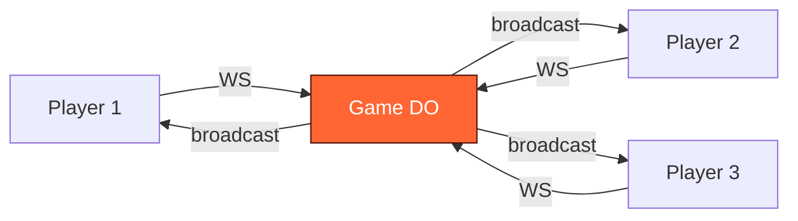

# What Are Durable Objects For?

What happens when you give a function a name, a memory, and a mailbox?

---
layout: statement
transition: fade
---

# A Worker is stateless. A database is shared. What lives in between?

---
transition: slide-left
---

# The coordination gap

Problems that neither Workers nor D1 solve cleanly:

<v-clicks>

- **Real-time sync** — 4 players need the same game state within 16ms
- **Per-entity state** — each music session holds its own pattern, its own tempo, its own players
- **Long-lived connections** — a WebSocket that outlives a single request
- **Coordination without contention** — no row locks, no optimistic retries, no race conditions

</v-clicks>

Durable Objects fill this gap. One per entity. Single-threaded. Named.

---
layout: section
transition: iris
---

# Three primitives

A name, a memory, and a mailbox.

---
transition: slide-left
---

# A name — globally unique identity

Every Durable Object is a singleton, accessed by a stable name.

```ts
// Get a stub by name — globally unique, always the same instance
const id = env.GAME_SERVER.idFromName("room-42");
const stub = env.GAME_SERVER.get(id);
```

<v-clicks>

- `idFromName()` is deterministic — the same name always returns the same instance
- No load balancers, no service discovery, no routing tables
- The name **is** the address

</v-clicks>

---
transition: slide-left
---

# A memory — state that survives

In-memory JavaScript state + SQLite persistence. Single-threaded guarantee means no race conditions.

```ts
export class GameServer extends DurableObject {
  players = new Map<string, Player>();
  frame = 0;
  async onStart() {
    const saved = await this.ctx.storage.get("state");
    if (saved) this.players = new Map(saved.players);
  }
}
```

<v-clicks>

- In-memory state is fast — no database round-trips during gameplay
- SQLite persists across restarts — state survives eviction
- **Single-threaded** — one request at a time, zero data races

</v-clicks>

---
transition: slide-left
---

# A mailbox — real-time connections

WebSocket connections that the DO owns, broadcasts to, and can hibernate.

```ts
async webSocketMessage(ws: WebSocket, msg: string) {
  this.handleInput(ws, JSON.parse(msg));
}
broadcast(data: string) {
  for (const ws of this.ctx.getWebSockets()) {
    ws.send(data);
  }
}
```

<v-clicks>

- `acceptWebSocket()` promotes an HTTP request to a persistent connection
- `getWebSockets()` returns all live connections to this instance
- **Hibernation** — idle connections sleep at zero cost, wake on message

</v-clicks>

---
layout: fact
transition: fade
---

# 0ms

cold starts

Millions of instances. Each one a named, stateful, connected entity.

---
layout: section
transition: iris
---

# A function with a name becomes a game server

Vaders — multiplayer TUI Space Invaders on Durable Objects.

---
transition: slide-left
---

# The problem

4-player real-time multiplayer in a 120x36 terminal.

<v-clicks>

- State must sync at **60fps** with zero desync
- Players connect from different edges — São Paulo, London, Tokyo
- Terminal rendering is character-by-character — every frame is a full state snapshot
- One source of truth, or the game breaks

</v-clicks>

---
transition: slide-up
---

# The DO pattern — alarm-driven broadcast

The alarm fires 60 times per second. Each tick: advance state, serialize, broadcast.

```ts
async alarm() {
  this.frame++;
  this.updatePositions();
  this.checkCollisions();
  this.broadcast(this.serialize());
  this.ctx.storage.setAlarm(Date.now() + 16); // next frame
}
```

<v-clicks>

- **Server-authoritative** — clients send inputs, DO computes state
- **Alarm loop** — `setAlarm()` is the game clock, not `setInterval`
- **No desync** — one thread, one state, one broadcast per frame

</v-clicks>

---
transition: slide-left
---

# Server-authoritative architecture



Clients send inputs. The DO is the single source of truth. Every frame, every player gets the same snapshot.

---
layout: section
transition: iris
---

# A function with a mailbox becomes a jam session

Keyboardia — collaborative polyrhythmic step sequencer.

---
transition: slide-left
---

# The problem

10 musicians collaborating in real-time. Each has their own time signature.

<v-clicks>

- **Polyrhythm** — Player A is in 4/4, Player B is in 7/8, Player C is in 5/4
- Latency must be **<50ms** or the groove falls apart
- Audio is latency-sensitive — it cannot round-trip through a server
- Session state (who's playing what pattern) must survive disconnects

</v-clicks>

---
transition: slide-up
---

# The DO pattern — session relay with KV backup

The DO relays pattern state. Audio never touches the server.

<v-clicks>

- **Session hub** — one DO per jam session, holds all player patterns
- **Relay, not render** — pattern changes broadcast to all players, audio rendered locally via Web Audio API
- **KV backup** — on disconnect, player state writes to KV. Rejoin restores your patterns.
- **Zero server-side audio** — the DO manages coordination, not computation

</v-clicks>

---
layout: two-cols
transition: wipe-right
---

# What the DO handles

<v-clicks>

- Session membership (join/leave)
- Pattern state (which steps are active)
- Tempo and time signature sync
- Broadcast on pattern change
- KV backup on disconnect

</v-clicks>

::right::

# What the client handles

<v-clicks>

- Audio synthesis (Web Audio API)
- Local playback and scheduling
- Instrument rendering
- Step sequencer UI
- Latency compensation

</v-clicks>

---
layout: section
transition: iris
---

# A function with a memory becomes an agent

Cloudflare Agents SDK — persistent AI agents on Durable Objects.

---
transition: slide-left
---

# The problem

AI agents need persistent memory, tool access, and the ability to wake on demand.

<v-clicks>

- A stateless Worker forgets the conversation after every request
- Tool results need to persist across turns — "look up the user, then update their plan"
- Agents must **sleep** when idle (cost) and **wake** when needed (latency)
- Multi-step workflows crash mid-pipeline — no checkpoint, no resume

</v-clicks>

---
transition: slide-up
---

# The pattern — AIChatAgent extends Agent

Messages, tools, and state all persist in the DO. Hibernation means zero cost when idle.

```ts
export class MyAgent extends AIChatAgent {
  async onChatMessage(onFinish) {
    await generateText({
      model: openai("gpt-4o"),
      messages: this.messages,
      tools: this.getTools(), onFinish });
} }
```

<v-clicks>

- `this.messages` — conversation history lives in the DO, not the client
- `this.getTools()` — tools are methods on the agent class
- **Hibernation** — `0ms` wake from idle, zero cost while sleeping

</v-clicks>

---
transition: slide-left
---

# Durable workflows — pipelines that survive crashes

Multi-step pipelines that checkpoint after each step. Crashes resume from the last completed step.

<v-clicks>

- `this.step()` — each step is checkpointed. If the process crashes, it resumes from the last completed step.
- `this.sleepUntil(timestamp)` — pause for human-in-the-loop approval. The DO hibernates until the timestamp.
- `this.sleepFor("2 hours")` — scheduled future compute without cron jobs.
- No orchestrator, no queue, no external state store — the DO **is** the workflow engine.

</v-clicks>

---
layout: center
transition: morph-fade
---

# A name, a memory, a mailbox

The same three primitives. Three different products.

A game server. A jam session. An autonomous agent.

---
transition: slide-left
---

# When to use what

<v-clicks>

- **Durable Objects** — per-entity coordination, real-time sync, WebSocket state, long-lived processes
- **D1** — relational queries across entities, SQL joins, analytics, reporting
- **KV** — global read-heavy config, feature flags, cached lookups
- **R2** — large binary blobs, images, audio files, backups

</v-clicks>

The question is not "which storage?" but "what's the coordination pattern?"

---
transition: slide-left
---

# Best practices

<v-clicks>

- **Validate inputs** — use Zod or similar at the WebSocket boundary. Never trust client data inside the DO.
- **Gate destructive actions** — tool calls that modify state need explicit confirmation flows.
- **Hibernate idle agents** — WebSocket hibernation API means zero cost for idle connections.
- **Batch WebSocket messages** — serialize once, broadcast to all. Never serialize per-connection.
- **Use alarms for scheduling** — `setAlarm()` is cheaper and more precise than `setTimeout`.
- **Prefer RPC over fetch** — `stub.myMethod()` is type-safe. `stub.fetch()` is stringly-typed.

</v-clicks>

---
layout: quote
transition: fade
---

# "The agent is the application"

When state, tools, and reasoning live in one Durable Object, the agent stops being a wrapper and becomes the product.

---
layout: center
transition: fade
---

# Give a function a name, a memory, and a mailbox

It becomes a game server, a jam session, or an autonomous agent.

The function doesn't change. The primitives do the work.

---
layout: end
transition: fade
---

# Start building

`npx create-cloudflare@latest my-agent --template cloudflare/agents-starter`
