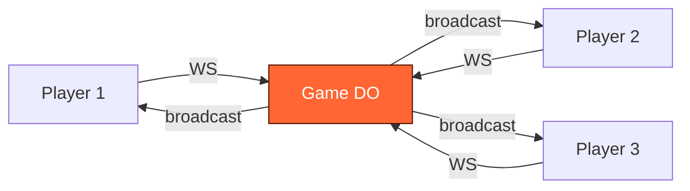

# What Are Durable Objects For?

What happens when you give a function a name, a memory, and a mailbox?

<!-- The central question isn't technical — it's philosophical. Serverless promised to abstract away servers. It succeeded. But it also abstracted away state, coordination, and identity. Durable Objects give those back — not by reverting to servers, but by making functions into entities. -->

---
layout: statement
transition: fade
---

# A Worker is stateless. A database is shared. What lives in between?

<!-- This is the coordination gap. Workers handle requests but forget everything between them. Databases remember but can't coordinate in real-time. The gap between "fast and forgetful" and "slow and shared" is where most real-time applications break down. -->

---
transition: slide-left
---

# The serverless promise

Cloudflare Workers run your code at the edge — 300+ cities, 0ms cold starts, auto-scaling.

But a Worker forgets you the moment it responds.

<v-clicks>

- Need real-time sync? Workers can't hold WebSocket state.
- Need per-entity memory? Workers share nothing between requests.
- Need coordination? Workers race against each other.

</v-clicks>

The platform gives you speed and scale. It doesn't give you identity.

<!-- This slide absorbs the "what's missing" framing from the broader platform overview. Workers are extraordinary for stateless compute. The gap becomes visible only when you try to build something that needs to remember, coordinate, or persist between requests — which is most interesting applications. -->

---
transition: slide-left
---

# The coordination gap

Problems that neither Workers nor D1 solve cleanly:

<v-clicks>

- **Real-time sync** — 4 players need the same game state within 16ms
- **Per-entity state** — each music session holds its own pattern, its own tempo, its own players
- **Long-lived connections** — a WebSocket that outlives a single request
- **Coordination without contention** — no row locks, no optimistic retries, no race conditions

</v-clicks>

Durable Objects fill this gap. One per entity. Single-threaded. Named.

<!-- Each bullet is a real product requirement from the case studies later in this deck. The 16ms game sync is Vaders. The per-entity music session is Keyboardia. The long-lived WebSocket is every real-time app. The "no race conditions" is the killer feature — single-threaded execution means coordination is free. -->

---
transition: slide-left
---

# The race condition that changed everything

A collaborative document editor built on Workers + D1. Two users edit the same paragraph simultaneously.

Worker A reads the paragraph, applies edit, writes to D1.
Worker B reads the paragraph, applies edit, writes to D1.
Worker B's write lands second. Worker A's edit vanishes.

<v-clicks>

- Optimistic locking? Adds retries, complexity, and user-visible conflicts.
- Row-level locks? D1 is SQLite — no concurrent writers.
- CRDTs? Now you're building a distributed systems library, not a document editor.

</v-clicks>

One Durable Object per document. Single-threaded. Problem gone.

<!-- This is the war story. The collaborative editor was a real prototype. The race condition appeared in testing within minutes — two browser tabs, same document, alternating edits. Every "solution" added more complexity than the feature was worth. Moving to one DO per document eliminated the entire category of bug. Not by solving concurrency — by removing it. -->

---
layout: section
transition: iris
---

# Three primitives

A name, a memory, and a mailbox.

<!-- The section header is the thesis in compressed form. Everything Durable Objects do reduces to three capabilities. The rest of the deck shows these three primitives solving three completely different problems. -->

---
transition: slide-left
---

# A name — globally unique identity

Every Durable Object is a singleton, accessed by a stable name.

```ts
// Get a stub by name — globally unique, always the same instance
const id = env.GAME_SERVER.idFromName("room-42");
const stub = env.GAME_SERVER.get(id);
```

- `idFromName()` is deterministic — the same name always returns the same instance
- No load balancers, no service discovery, no routing tables
- The name **is** the address

<!-- The name primitive is the most underrated. In traditional architectures, routing a request to the right instance requires service discovery, load balancers, sticky sessions, or consistent hashing. With DOs, the name IS the routing. "room-42" always means the same instance, globally. This eliminates an entire infrastructure layer. -->

---
transition: slide-left
---

# A memory — state that survives

In-memory JavaScript state + SQLite persistence. Single-threaded guarantee means no race conditions.

```ts
export class GameServer extends DurableObject {
  players = new Map<string, Player>();
  frame = 0;
  async onStart() {
    const saved = await this.ctx.storage.get("state");
    if (saved) this.players = new Map(saved.players);
  }
}
```

- In-memory state is fast — no database round-trips during gameplay
- SQLite persists across restarts — state survives eviction
- **Single-threaded** — one request at a time, zero data races

<!-- The memory primitive has two layers: fast in-memory state for hot paths (game frames, pattern updates) and durable SQLite for cold persistence (reconnection, crash recovery). The single-threaded guarantee is what makes this safe — you never need locks, mutexes, or CAS operations because only one request executes at a time. -->

---
transition: slide-left
---

# A mailbox — real-time connections

WebSocket connections that the DO owns, broadcasts to, and can hibernate.

```ts
async webSocketMessage(ws: WebSocket, msg: string) {
  this.handleInput(ws, JSON.parse(msg));
}
broadcast(data: string) {
  for (const ws of this.ctx.getWebSockets()) {
    ws.send(data);
  }
}
```

- `acceptWebSocket()` promotes an HTTP request to a persistent connection
- `getWebSockets()` returns all live connections to this instance
- **Hibernation** — idle connections sleep at zero cost, wake on message

<!-- The mailbox primitive turns a function into a real-time server. The key insight is ownership — the DO owns its WebSocket connections. It can enumerate them, broadcast to them, and hibernate them. This is fundamentally different from a stateless WebSocket relay — the DO knows who's connected and can make decisions based on that knowledge. -->

---
layout: fact
transition: fade
---

# 0ms

cold starts

Millions of instances. Each one a named, stateful, connected entity.

<!-- Zero millisecond cold starts because DOs run on the same V8 isolate infrastructure as Workers. But unlike Workers, they persist state between requests. You get the serverless deployment model with the stateful programming model. -->

---
layout: section
transition: iris
---

# A function with a name becomes a game server

Vaders — multiplayer TUI Space Invaders on Durable Objects.

---
transition: slide-left
---

# The problem

4-player real-time multiplayer in a 120x36 terminal.

- State must sync at **60fps** with zero desync
- Players connect from different edges — São Paulo, London, Tokyo
- Terminal rendering is character-by-character — every frame is a full state snapshot
- One source of truth, or the game breaks

<!-- The terminal constraint makes this harder than a browser game. There's no partial DOM update — every frame is a complete 120x36 character grid sent as a single string. At 60fps, that's ~260KB/s per player. The DO must compute, serialize, and broadcast a full frame every 16ms. -->

---
transition: slide-up
---

# The DO pattern — alarm-driven broadcast

The alarm fires 60 times per second. Each tick: advance state, serialize, broadcast.

```ts
async alarm() {
  this.frame++;
  this.updatePositions();
  this.checkCollisions();
  this.broadcast(this.serialize());
  this.ctx.storage.setAlarm(Date.now() + 16); // next frame
}
```

- **Server-authoritative** — clients send inputs, DO computes state
- **Alarm loop** — `setAlarm()` is the game clock, not `setInterval`
- **No desync** — one thread, one state, one broadcast per frame

<!-- Why alarms instead of setInterval? Alarms are durable — they survive hibernation and process restarts. setInterval dies when the isolate evicts. For a game loop, this means the game clock is infrastructure-grade, not runtime-grade. The alarm fires, the frame advances, the state broadcasts. If the DO hibernates between frames, the next alarm wakes it. -->

---
transition: slide-left
---

# Server-authoritative architecture



Notice: all arrows from players carry only inputs (keystrokes). All arrows from the DO carry full state. Players never compute game logic — they render what the DO tells them. This prevents cheat clients.

<!-- The diagram looks like a standard client-server pattern but the asymmetry is the insight. Input messages are tiny (a single keystroke event, ~20 bytes). Broadcast messages are large (full frame buffer, ~4KB). This asymmetry is intentional — it means the DO is the only source of truth. A modified client can't inject false game state because the DO ignores anything that isn't a raw input event. -->

---
layout: section
transition: iris
---

# A function with a mailbox becomes a jam session

Keyboardia — collaborative polyrhythmic step sequencer.

---
transition: slide-left
---

# The problem

10 musicians collaborating in real-time. Each has their own time signature.

- **Polyrhythm** — Player A is in 4/4, Player B is in 7/8, Player C is in 5/4
- Latency must be **<50ms** or the groove falls apart
- Audio is latency-sensitive — it cannot round-trip through a server
- Session state (who's playing what pattern) must survive disconnects

<!-- Audio latency is the hard constraint. At 120 BPM, a sixteenth note is 125ms. If round-trip latency exceeds ~50ms, musicians perceive the delay. This means audio CANNOT go through the server. The DO must coordinate patterns without touching audio. -->

---
transition: slide-up
---

# The DO pattern — session relay with KV backup

The DO relays pattern state. Audio never touches the server.

- **Session hub** — one DO per jam session, holds all player patterns
- **Relay, not render** — pattern changes broadcast to all players, audio rendered locally via Web Audio API
- **KV backup** — on disconnect, player state writes to KV. Rejoin restores your patterns.
- **Zero server-side audio** — the DO manages coordination, not computation

<!-- The key architectural decision is what the DO does NOT do: it doesn't touch audio. Every previous attempt at collaborative music tools tried to sync audio on the server. That path leads to unbounded latency. The insight is that you only need to sync the pattern — which notes are active at which steps. Audio synthesis happens locally on each client using Web Audio API. The DO is a coordination hub, not an audio engine. -->

---
layout: two-cols
transition: wipe-right
---

# What the DO handles

- Session membership (join/leave)
- Pattern state (which steps are active)
- Tempo and time signature sync
- Broadcast on pattern change
- KV backup on disconnect

::right::

# What the client handles

- Audio synthesis (Web Audio API)
- Local playback and scheduling
- Instrument rendering
- Step sequencer UI
- Latency compensation

<!-- This split is the entire architecture. The line between server and client is drawn at the boundary between coordination (DO) and computation (client). Everything that needs to be shared goes through the DO. Everything that needs to be fast stays local. -->

---
layout: section
transition: iris
---

# A function with a memory becomes an agent

Cloudflare Agents SDK — persistent AI agents on Durable Objects.

---
transition: slide-left
---

# The problem

AI agents need persistent memory, tool access, and the ability to wake on demand.

- A stateless Worker forgets the conversation after every request
- Tool results need to persist across turns — "look up the user, then update their plan"
- Agents must **sleep** when idle (cost) and **wake** when needed (latency)
- Multi-step workflows crash mid-pipeline — no checkpoint, no resume

<!-- The agent problem is the coordination gap in its purest form. An LLM call is stateless — it takes messages in and produces a response. But an agent needs to remember, plan, and execute across multiple turns. Without persistence, every turn starts from scratch. Without hibernation, idle agents burn compute. Without workflows, multi-step plans fail silently. -->

---
transition: slide-up
---

# The pattern — AIChatAgent extends Agent

Messages, tools, and state all persist in the DO. Hibernation means zero cost when idle.

```ts
export class MyAgent extends AIChatAgent {
  async onChatMessage(onFinish) {
    await generateText({
      model: openai("gpt-4o"),
      messages: this.messages,
      tools: this.getTools(), onFinish });
} }
```

- `this.messages` — conversation history lives in the DO, not the client
- `this.getTools()` — tools are methods on the agent class
- **Hibernation** — `0ms` wake from idle, zero cost while sleeping

<!-- The pattern is identical to the game server and the jam session: a named entity (the agent), persistent memory (conversation history + tool results), and a mailbox (WebSocket for streaming responses). The Agents SDK is syntactic sugar over the same three primitives. This is the deck's thesis in code form. -->

---
layout: center
transition: morph-fade
---

# A name, a memory, a mailbox

The same three primitives. Three different products.

A game server. A jam session. An autonomous agent.

<!-- The synthesis slide. Three wildly different products — a game, a music tool, an AI agent — all built on the same three primitives. The function didn't change. The primitives did the work. This is what Durable Objects are "for" — they're for anything that needs identity, state, and communication. -->

---
transition: slide-left
---

# When to use what

- **Durable Objects** — per-entity coordination, real-time sync, WebSocket state, long-lived processes
- **D1** — relational queries across entities, SQL joins, analytics, reporting
- **KV** — global read-heavy config, feature flags, cached lookups
- **R2** — large binary blobs, images, audio files, backups

The question is not "which storage?" but "what's the coordination pattern?"

<!-- This is the practical decision framework. DOs are not a database replacement — they're a coordination primitive. Use D1 when you need to query across entities. Use KV when you need globally distributed reads. Use R2 for blobs. Use DOs when you need a named, stateful, connected entity that coordinates in real-time. -->

---
layout: quote
transition: fade
---

# "The agent is the application"

When state, tools, and reasoning live in one Durable Object, the agent stops being a wrapper and becomes the product.

<!-- This quote applies beyond agents. When state, coordination, and identity live in one DO, the function stops being a handler and becomes an entity. The game server IS the game. The session hub IS the jam session. The agent IS the product. -->

---
layout: center
transition: fade
---

# Give a function a name, a memory, and a mailbox

It becomes a game server, a jam session, or an autonomous agent.

The function doesn't change. The primitives do the work.

<!-- The penultimate slide restates the thesis with all three case studies as evidence. The audience has now seen the same three primitives solve three different problems. The pattern should feel inevitable — of course these are the right primitives, because they keep working. -->

---
layout: end
transition: fade
---

# Every distributed system eventually reinvents the mailbox

<!-- The closing resolves the opening question. "What happens when you give a function a name, a memory, and a mailbox?" — it becomes whatever you need. And the deeper insight: every distributed system that coordinates in real-time ends up building these three primitives anyway. Durable Objects just give them to you from the start. -->
