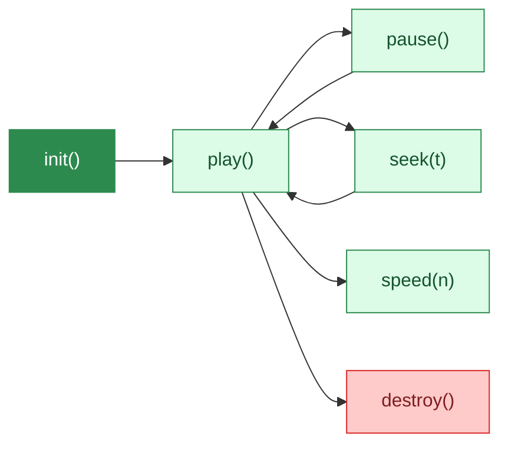

# Garten

An animated canvas garden that grows over time. Zero dependencies.

<!--
Garten turns any webpage into a living landscape. It's a pure Canvas API library — no framework, no build step, no dependencies. Drop a script tag, point it at a canvas, and watch 147 plant types grow in real time. This talk covers why it exists, how it works, and how little code it takes to get started.
-->

---
layout: statement
transition: slide-left
---

# Static hero backgrounds are boring

Every website has the same gradient or stock photo. What if your background was alive? What if it grew over time?

---
transition: slide-up
---

# One line to start a garden

```js
// One line to start a garden
const garden = new Garden(canvas, {
  preset: 'meadow',
  density: 0.7,
  seed: 42,  // deterministic — same seed, same garden
});
garden.play();
```

<!--
The entire API surface fits in a single constructor call. You pass a canvas element, pick a preset, set density and an optional seed for determinism, and call play. That's it. The seed parameter is particularly important — it means the same configuration produces the exact same garden every time, which makes testing, screenshots, and visual regression trivial.
-->

---
layout: two-cols-header
transition: fade
---

# Customize everything

::left::

<div class="hover-item">

### Presets

<v-clicks>

- **12 presets** — forest, meadow, tropical, zen, ambient
- **11 color themes** — sakura, autumn, midnight, lavender, ocean

</v-clicks>

</div>

::right::

<div class="hover-item">

### Controls

<v-clicks>

- Density and timing curves
- Accent colors and category filtering
- **Deterministic seeding** for reproducible gardens

</v-clicks>

</div>

<style>
.hover-item {
  padding: 1rem;
  border-radius: 0.5rem;
  transition: transform 0.3s ease, border-color 0.3s ease;
  border: 1px solid transparent;
}
.hover-item:hover {
  transform: scale(1.03);
  border-color: #2d8a4e;
}
</style>

---
layout: center
transition: slide-up
---

<div v-motion :initial="{ scale: 0.3, opacity: 0 }" :enter="{ scale: 1, opacity: 1, transition: { duration: 1000, type: 'spring', stiffness: 80 } }">

<div class="text-6xl text-center font-serif" style="color: var(--deck-accent);">
growth
</div>

</div>

<div class="mt-6 text-center text-lg">

<v-mark at="1" color="#2d8a4e" type="underline">Zero dependencies = zero excuses not to use it</v-mark>

</div>

---
transition: slide-left
---

# Playback API



Full programmatic control — play, pause, seek, speed, destroy.

---
layout: fact
transition: fade
---

# 147

plants, 19 categories, 0 dependencies

<4KB gzipped. Pure Canvas API. No framework. No build step.

<!--
147 plant types spread across 19 categories — from simple grasses to flowering trees, bamboo, cacti, and cherry blossoms. The entire library ships under 4KB gzipped. No framework dependency, no build step required. It's a single script tag or npm install away from running on any page.
-->

---
layout: end
transition: slide-left
---

# Try it

`npm install garten`
