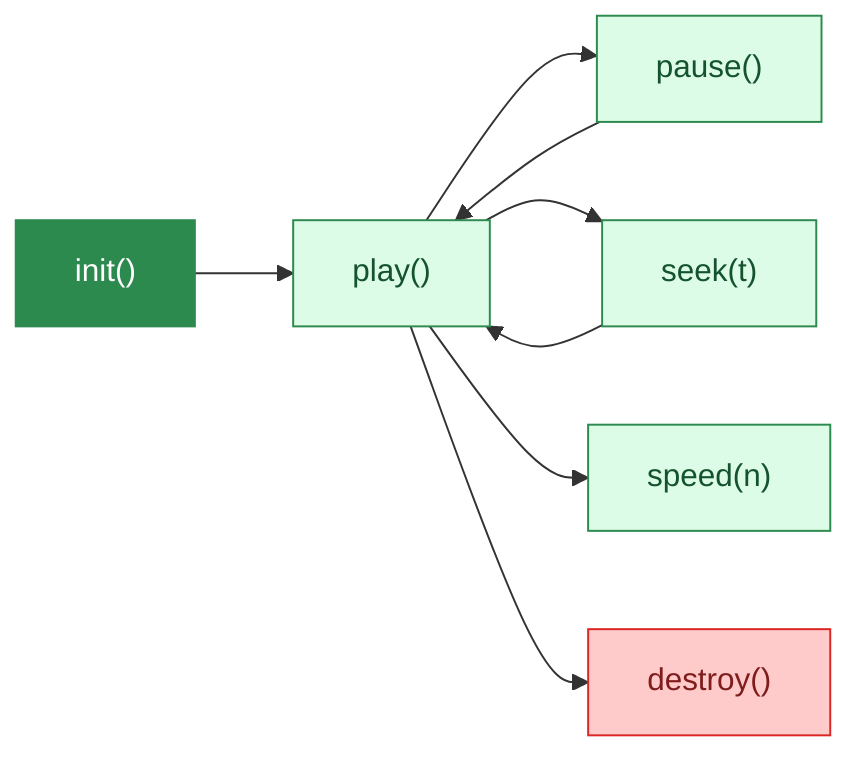

# Garten

An animated canvas garden that grows over time. Zero dependencies.

---
layout: quote
---

# "Add a living, breathing background to any webpage with one line of code"

---
transition: slide-up
---

# What grows

<v-clicks>

- **147 plant types** across 19 categories
- Flowers, trees, grasses, tropicals, cacti, bamboo
- Plants grow in waves called **generations**
- Respects `prefers-reduced-motion`

</v-clicks>

---
layout: two-cols-header
---

# Customize everything

::left::

### Presets

<v-clicks>

- **12 presets** — forest, meadow, tropical, zen, ambient
- **11 color themes** — sakura, autumn, midnight, lavender, ocean

</v-clicks>

::right::

### Controls

<v-clicks>

- Density and timing curves
- Accent colors and category filtering
- **Deterministic seeding** for reproducible gardens

</v-clicks>

---

# Playback API

Full programmatic control — play, pause, seek, speed, destroy.

---
layout: section
transition: slide-left
---

# Zero dependencies

Pure Canvas API. No framework. No build step. Just `<script>` and go.

---
layout: fact
---

# 147

Plant types

Across 19 categories — from simple flowers to cherry blossoms, bamboo, and conifers

---
layout: end
transition: fade
---

# Try it

`npm install garten`
