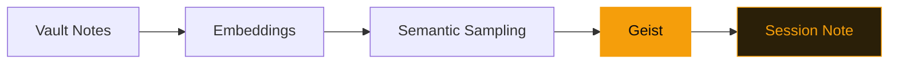

# GeistFabrik

A divergence engine for Obsidian vaults.

---
layout: quote
---

# "Muses, not oracles. Questions, not answers."

---
transition: slide-left
---

# What it does

<v-clicks>

- **57 default geists** — 48 code + 9 Tracery grammars
- **Semantic search** via 384-dim embeddings
- **Temporal embeddings** track how understanding evolves
- **Session notes** with linkable suggestions in your vault

</v-clicks>

---
layout: two-cols-header
---

# Three ways to extend

::left::

### Code extensions

<v-clicks>

- **Metadata inference** — add custom note properties via Python modules
- **Vault functions** — reusable queries with `@vault_function`

</v-clicks>

::right::

### Declarative extensions

<v-clicks>

- **Tracery YAML** grammars — define generative rules without code
- Combine with vault data for context-aware prompts

</v-clicks>

---
layout: section
transition: slide-up
---

# Design principles

Local-first. Deterministic. User-initiated.

---

# Four guardrails

<v-clicks>

1. **Sample, don't rank** — avoid preferential attachment
2. **Intermittent invocation** — user-initiated, not continuous
3. **Local-first** — no network required, 100% private
4. **Deterministic randomness** — same date + vault = same output

</v-clicks>

---

# How a geist runs

---
layout: fact
---

# 57

Default geists

48 code geists + 9 Tracery grammars. All local. All extensible.

---
layout: end
transition: fade
---

# Start exploring

`uv run geistfabrik init ~/your-vault`
