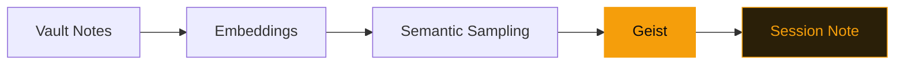

# GeistFabrik

A divergence engine for Obsidian vaults.

<!--
GeistFabrik is a creative-divergence tool, not an AI assistant. The key pitch: it generates questions, not answers. Emphasize that this is the opposite of what LLMs do — LLMs converge, geists diverge.
-->

---
layout: statement
transition: slide-left
---

# AI tools give answers. Creativity needs divergent questions.

LLMs are convergent by design — they find the most likely response. But creative thinking needs the opposite: unexpected connections, oblique angles, surprising juxtapositions.

That's what a muse does.

---
layout: quote
transition: fade
---

# "Muses, not oracles. Questions, not answers."

---
transition: slide-up
---

# A geist definition

```yaml
# A geist that finds unexpected connections
name: bridge-builder
type: tracery
rules:
  origin:
    - "What if {note_a.title} and {note_b.title} shared a {concept}?"
    - "The gap between {note_a.tags[0]} and {note_b.tags[0]} is {bridge}."
  concept:
    - "metaphor"
    - "constraint"
    - "failure mode"
  bridge:
    - "smaller than you think"
    - "the interesting part"
```

Declarative YAML. No Python required. Combine Tracery grammars with vault data.

<!--
This is the simplest way to create a geist — pure YAML. Tracery grammars expand stochastically, pulling note titles and tags from the vault at runtime. The result: a new question every session, grounded in YOUR notes.
-->

---
transition: slide-left
---

# What a geist session produces

<div class="bg-[#1a1208] border border-[#f59e0b]/30 rounded-lg p-6 font-mono text-sm leading-relaxed">

```
Session: 2024-12-15 | Geist: bridge-builder
---
```

<v-mark at="1" color="#f59e0b" type="highlight">

"What if 'distributed-systems' and 'garden-design' shared a constraint?"

</v-mark>

```
Linked notes: [[emergence]], [[pruning-strategies]], [[growth-cycles]]
Similarity: 0.73 (384-dim cosine)
```

</div>

<div class="mt-4 text-sm text-[#f5f0e8]/50">

The highlighted line is the divergent output — a question you would never have asked yourself.

</div>

---
transition: fade
---

# How a geist runs

<v-motion
  :initial="{ x: -80, opacity: 0 }"
  :enter="{ x: 0, opacity: 1, transition: { duration: 600, delay: 200 } }">



</v-motion>

<div class="mt-6 text-sm text-[#f5f0e8]/60">

Notes are embedded once. Geists sample semantically — not by popularity, not by recency. The session note lands back in your vault as a linkable artifact.

</div>

---
transition: slide-up
---

# Four guardrails

<div class="spotlight-group grid grid-cols-2 gap-6 mt-8">

<v-clicks>

<div class="guardrail-item p-5 rounded-lg border border-[#f59e0b]/20 bg-[#1a1208]/60 transition-all duration-300">
  <h3 class="text-[#f59e0b] font-semibold mb-2">Sample, don't rank</h3>
  <p class="text-sm text-[#f5f0e8]/70">Avoid preferential attachment. Popular notes don't get more attention.</p>
</div>

<div class="guardrail-item p-5 rounded-lg border border-[#f59e0b]/20 bg-[#1a1208]/60 transition-all duration-300">
  <h3 class="text-[#f59e0b] font-semibold mb-2">Intermittent invocation</h3>
  <p class="text-sm text-[#f5f0e8]/70">User-initiated, not continuous. You call the muse; it doesn't interrupt.</p>
</div>

<div class="guardrail-item p-5 rounded-lg border border-[#f59e0b]/20 bg-[#1a1208]/60 transition-all duration-300">
  <h3 class="text-[#f59e0b] font-semibold mb-2"><v-mark at="5" color="#f59e0b" type="underline">Local-first</v-mark></h3>
  <p class="text-sm text-[#f5f0e8]/70">No network required. 100% private. Your vault never leaves your machine.</p>
</div>

<div class="guardrail-item p-5 rounded-lg border border-[#f59e0b]/20 bg-[#1a1208]/60 transition-all duration-300">
  <h3 class="text-[#f59e0b] font-semibold mb-2">Deterministic randomness</h3>
  <p class="text-sm text-[#f5f0e8]/70">Same date + same vault = same output. Reproducible serendipity.</p>
</div>

</v-clicks>

</div>

<style>
.spotlight-group .guardrail-item:hover {
  transform: translateY(-4px);
  border-color: rgba(245, 158, 11, 0.6);
  box-shadow: 0 8px 24px rgba(245, 158, 11, 0.15);
  background: rgba(26, 18, 8, 0.9);
}
</style>

<!--
The four guardrails are the philosophical backbone. "Sample, don't rank" prevents the rich-get-richer effect that plagues most recommendation systems. "Local-first" is the one to emphasize — zero cloud dependencies, zero data exfiltration.
-->

---
layout: fact
transition: fade
---

# 57

geists, 384-dim embeddings, 0 cloud dependencies

48 code geists + 9 Tracery grammars. All local. All extensible. All deterministic.

---
layout: end
transition: slide-left
---

# Start exploring

`uv run geistfabrik init ~/your-vault`
