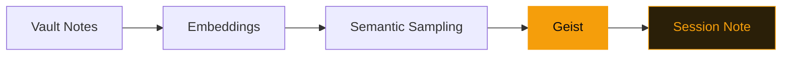

# GeistFabrik

A divergence engine for Obsidian vaults.

github.com/adewale/geist-fabrik

<!-- GeistFabrik is a creative-divergence tool, not an AI assistant. The key pitch: it generates questions, not answers. LLMs are convergence machines — they find the most probable response. Creative work needs the opposite: unexpected connections, oblique angles, productive confusion. The through-line is "muses vs. oracles" — stated here, threaded through guardrails, and resolved in the closing. -->

---
layout: statement
transition: slide-left
---

# AI tools give answers. Creativity needs divergent questions.

LLMs are convergent by design — they find the most likely response. But creative thinking needs the opposite: unexpected connections, oblique angles, surprising juxtapositions.

That's what a muse does. A muse doesn't answer. A muse provokes.

<!-- The statement establishes the muse vs. oracle tension. "Convergent by design" is precise — LLMs literally optimize for the highest-probability token sequence. Creative work requires low-probability connections. This isn't a feature request; it's a fundamental architectural mismatch. -->

---
layout: quote
transition: fade
---

# "Muses, not oracles. Questions, not answers."

<!-- The through-line in its purest form. This phrase should echo in the audience's mind by the closing slide. It's the design manifesto — every technical decision in the project serves this distinction. -->

---
transition: slide-up
---

# A geist definition

```yaml
# A geist that finds unexpected connections
name: bridge-builder
type: tracery
rules:
  origin:
    - "What if {note_a.title} and {note_b.title} shared a {concept}?"
    - "The gap between {note_a.tags[0]} and {note_b.tags[0]} is {bridge}."
  concept:
    - "metaphor"
    - "constraint"
    - "failure mode"
  bridge:
    - "smaller than you think"
    - "the interesting part"
```

Declarative YAML. No Python required. Combine Tracery grammars with vault data.

<!-- Tracery grammars expand stochastically, pulling note titles and tags from the vault at runtime. The result: a new question every session, grounded in your notes. Note that the grammar rules themselves are questions and provocations, not statements — the geist's output is always a question, never an answer. This is "muse, not oracle" at the API level. -->

---
transition: slide-left
---

# The oracle failure

Early prototypes used GPT-4 to generate "creative prompts" from vault content. The results were grammatically perfect and creatively dead.

"Consider exploring the intersection of distributed systems and garden design" — an oracle answer. Polished, probable, and utterly predictable.

The Tracery approach generates worse grammar but better questions. "What if 'pruning-strategies' and 'load-balancing' shared a failure mode?" — a muse question. Surprising, improbable, and worth thinking about.

<!-- This is the war story. The GPT-4 prototype generated prompts that sounded like a creativity coach — smooth, encouraging, and empty. The key insight was that LLM-generated prompts converge just like LLM-generated answers. Stochastic grammar expansion is "dumber" but produces genuinely unexpected connections because it doesn't optimize for probability. The muse needs to be unreliable to be useful. -->

---
transition: slide-left
---

# What a geist session produces

<div class="bg-[#1a1208] border border-[#f59e0b]/30 rounded-lg p-6 font-mono text-sm leading-relaxed">

```
Session: 2024-12-15 | Geist: bridge-builder
---
```

<v-mark at="1" color="#f59e0b" type="highlight">

"What if 'distributed-systems' and 'garden-design' shared a constraint?"

</v-mark>

```
Linked notes: [[emergence]], [[pruning-strategies]], [[growth-cycles]]
Similarity: 0.73 (384-dim cosine)
```

</div>

<div class="mt-4 text-sm text-[#f5f0e8]/50">

The highlighted line is the muse's output — a question you would never have asked yourself. An oracle would have answered it. A muse just leaves it there.

</div>

<!-- The session output format is deliberately sparse. The linked notes are semantically sampled (384-dim cosine similarity), not popularity-ranked. The similarity score is shown so the user can calibrate — 0.73 means "related but not obvious," which is the sweet spot for creative divergence. Below 0.5 is too random. Above 0.85 is too expected. -->

---
transition: fade
---

# How a geist runs

<v-motion
  :initial="{ x: -80, opacity: 0 }"
  :enter="{ x: 0, opacity: 1, transition: { duration: 600, delay: 200 } }">



</v-motion>

Notice: "Semantic Sampling" is not "Semantic Ranking." Sampling selects notes by weighted random draw from the embedding space. Ranking would always surface the same popular notes — an oracle behavior the architecture deliberately avoids.

<!-- The distinction between sampling and ranking is the core architectural decision. Ranking produces the same top-K notes every time (convergence). Sampling draws from a probability distribution weighted by semantic distance (divergence). The geist node is yellow because it's the creative transformation point — notes go in, questions come out. -->

---
transition: slide-up
---

# Four guardrails

<div class="spotlight-group grid grid-cols-2 gap-6 mt-8">

<v-clicks>

<div class="guardrail-item p-5 rounded-lg border border-[#f59e0b]/20 bg-[#1a1208]/60 transition-all duration-300">
  <h3 class="text-[#f59e0b] font-semibold mb-2">Sample, don't rank</h3>
  <p class="text-sm text-[#f5f0e8]/70">Avoid preferential attachment. Popular notes don't get more attention. This is the muse principle at the algorithm level.</p>
</div>

<div class="guardrail-item p-5 rounded-lg border border-[#f59e0b]/20 bg-[#1a1208]/60 transition-all duration-300">
  <h3 class="text-[#f59e0b] font-semibold mb-2">Intermittent invocation</h3>
  <p class="text-sm text-[#f5f0e8]/70">User-initiated, not continuous. You call the muse; it doesn't interrupt. Oracles push answers; muses wait to be asked.</p>
</div>

<div class="guardrail-item p-5 rounded-lg border border-[#f59e0b]/20 bg-[#1a1208]/60 transition-all duration-300">
  <h3 class="text-[#f59e0b] font-semibold mb-2"><v-mark at="5" color="#f59e0b" type="underline">Local-first</v-mark></h3>
  <p class="text-sm text-[#f5f0e8]/70">No network required. 100% private. Your vault never leaves your machine.</p>
</div>

<div class="guardrail-item p-5 rounded-lg border border-[#f59e0b]/20 bg-[#1a1208]/60 transition-all duration-300">
  <h3 class="text-[#f59e0b] font-semibold mb-2">Deterministic randomness</h3>
  <p class="text-sm text-[#f5f0e8]/70">Same date + same vault = same output. Reproducible serendipity — the muse remembers what it said.</p>
</div>

</v-clicks>

</div>

<style>
.spotlight-group .guardrail-item:hover {
  transform: translateY(-4px);
  border-color: rgba(245, 158, 11, 0.6);
  box-shadow: 0 8px 24px rgba(245, 158, 11, 0.15);
  background: rgba(26, 18, 8, 0.9);
}
</style>

<!-- Each guardrail embodies the muse vs. oracle distinction. "Sample, don't rank" = muse behavior (divergent). "Intermittent invocation" = muse behavior (on-demand, not push). "Local-first" = privacy but also sovereignty — your creative process belongs to you. "Deterministic randomness" = the muse is reproducible, which makes it trustworthy. -->

---
layout: fact
transition: fade
---

# 57

geists, 384-dim embeddings, 0 cloud dependencies

48 code geists + 9 Tracery grammars. All local. All extensible. All deterministic.

<!-- 57 geists ship by default. Users can create custom geists in YAML without writing any Python. The 384-dim embeddings use sentence-transformers locally — no API calls, no cloud dependency. The "0 cloud dependencies" number is the proof that local-first isn't a marketing claim; it's an architectural commitment. -->

---
layout: end
transition: slide-left
---

# The best answer is a better question

<!-- The closing resolves the through-line. "AI tools give answers. Creativity needs divergent questions." → "The best answer is a better question." The paradox is the point: in creative work, the question IS the answer. GeistFabrik exists because the most valuable thing a tool can give you is not a solution but a provocation. Muses, not oracles. -->
