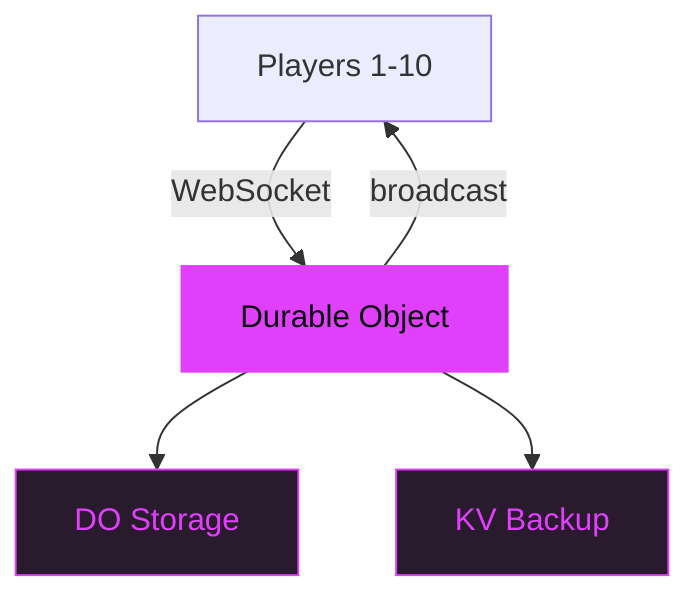

# Keyboardia

Multiplayer step sequencer with polyrhythmic patterns.

---
layout: statement
transition: fade
---

# Up to 10 players. 64 sound generators. Real-time collaboration.

---
layout: two-cols-header
transition: slide-left
---

# Sequencer + Sound engine

::left::

### Sequencer

<v-clicks>

- **3-128 step counts** per track
- **Parameter locks** per step
- **Chromatic grid** with scale lock
- **Per-track swing** and groove

</v-clicks>

::right::

### Sound

<v-clicks>

- **32 Web Audio** synths, 40+ presets
- **11 Tone.js** FM/AM/Membrane
- **21 sampled** instruments
- **Effects chain** with limiter

</v-clicks>

---

# Multiplayer sync

---
layout: section
---

# Hybrid persistence

DO storage for immediacy. KV on disconnect. Session sharing via QR codes.

---

# How sessions work

<v-clicks>

1. **Create** — host starts a session, gets a shareable link
2. **Join** — players scan QR or paste URL
3. **Sync** — every pattern change broadcasts in real-time
4. **Persist** — state lives in DO; backs up to KV on disconnect
5. **Remix** — fork any session into your own

</v-clicks>

---
layout: fact
transition: fade
---

# 64

Sound generators

32 Web Audio + 11 Tone.js + 21 sampled instruments across 4 synthesis engines

---
layout: end
transition: fade
---

# Start jamming

`cd app && npm install && npm run dev`
