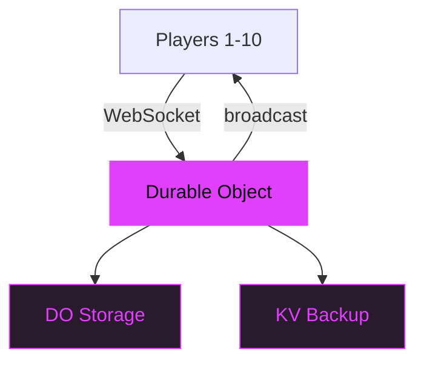

# Keyboardia

Multiplayer step sequencer with polyrhythmic patterns.

<!--
Keyboardia is a browser-native collaborative music tool. No installs, no accounts required.
Share a link and start making music together in real time with up to 10 players.
-->

---
layout: statement
transition: fade
---

# Collaborative music tools require expensive DAWs

Ableton, Logic, FL Studio cost $200–800. Browser-native collaborative music should be free and instant.

<v-click>

**No install. Share a link. Start jamming.**

</v-click>

---
transition: slide-left
---

# Web Audio synth creation

```ts
// Create a synth voice with parameter locks
function createVoice(ctx: AudioContext, params: StepParams) {
  const osc = ctx.createOscillator();
  const gain = ctx.createGain();
  osc.type = params.waveform ?? 'sawtooth';
  osc.frequency.setValueAtTime(
    params.frequency, ctx.currentTime
  );
  gain.gain.setValueAtTime(
    1 / this.polyphony, ctx.currentTime  // normalize
  );
  osc.connect(gain).connect(this.master);
  return { osc, gain, stop: () => osc.stop() };
}
```

<!--
Every step in the sequencer can have its own parameter locks — pitch, waveform, volume.
The createVoice function builds an oscillator-gain pair on the fly.
Gain is normalized by polyphony count so stacking voices doesn't clip.
-->

---
layout: two-cols-header
transition: slide-up
---

# Sequencer + Sound engine

::left::

### Sequencer

<v-clicks>

- **3–128 step counts** per track
- **Parameter locks** per step
- **Chromatic grid** with scale lock
- **Per-track swing** and groove

</v-clicks>

::right::

### Sound

<v-clicks>

- **32 Web Audio** synths, 40+ presets
- **11 Tone.js** FM/AM/Membrane
- **21 sampled** instruments
- **Effects chain** with limiter

</v-clicks>

<style>
.slidev-layout .col-left,
.slidev-layout .col-right {
  transition: transform 0.2s ease;
}
.slidev-layout .col-left:hover,
.slidev-layout .col-right:hover {
  transform: scale(1.03);
}
.slidev-layout li {
  transition: transform 0.15s ease, color 0.15s ease;
}
.slidev-layout li:hover {
  transform: scale(1.04);
  color: #e040fb;
}
</style>

---
transition: fade
---

# Multiplayer sync

<div v-motion :initial="{ opacity: 0, y: 30 }" :enter="{ opacity: 1, y: 0, transition: { duration: 600 } }">



</div>

<v-mark at="1" color="#e040fb" type="underline">Polyrhythm = each player owns their own time signature</v-mark>

---
transition: slide-left
---

# How sessions work

<v-clicks>

1. **Create** — host starts a session, gets a shareable link
2. **Join** — players scan QR or paste URL
3. **Sync** — every pattern change broadcasts in real-time
4. **Persist** — state lives in DO; backs up to KV on disconnect
5. **Remix** — fork any session into your own

</v-clicks>

---
layout: fact
transition: slide-up
---

# 64

generators, 10 concurrent players, <50ms latency

32 Web Audio + 11 Tone.js + 21 sampled. All audio client-side. Server is a state relay.

<!--
The key architectural insight: audio never touches the server. The Durable Object only relays
pattern state. Each client renders audio locally via Web Audio API, which keeps latency
under 50ms regardless of network conditions. 64 generators across 4 synthesis engines.
-->

---
layout: end
transition: fade
---

# Start jamming

`cd app && npm install && npm run dev`
