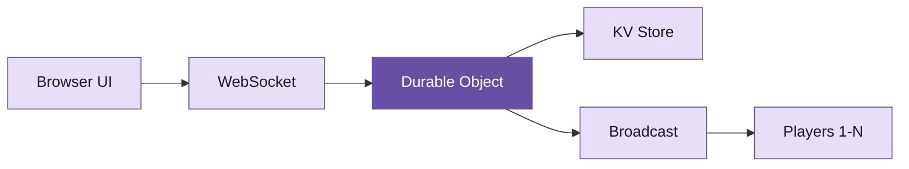

<div v-motion :initial="{ opacity: 0, scale: 0.9 }" :enter="{ opacity: 1, scale: 1, transition: { duration: 600, easing: 'cubic-bezier(0.05, 0.7, 0.1, 1.0)' } }">

# Keyboardia

10 players. 64 instruments. One room.

</div>

---
layout: MaterialSlide
transition: slide-left
---

# Web audio is a minefield

<div class="card-grid">

<v-click>
<MDCard variant="elevated" title="Gain staging">
Volume sounded tinny and distorted. Master gain was multiplicative across layers, causing clipping at 3+ simultaneous instruments. Fix: normalize per-voice gain to <strong>1/polyphony</strong>.
</MDCard>
</v-click>

<v-click>
<MDCard variant="elevated" title="Memory leaks">
AudioBufferSourceNodes are single-use. Each note creates a new node. Without cleanup, 10 minutes of play leaked thousands of orphaned nodes. Fix: <strong>disconnect and nullify</strong> on stop.
</MDCard>
</v-click>

<v-click>
<MDCard variant="elevated" title="Voice limiting">
Unlimited polyphony caused audio dropouts on mobile. Safari caps at ~32 concurrent sources before crackling. Fix: voice pool with <strong>oldest-steal</strong> eviction.
</MDCard>
</v-click>

</div>

---
transition: slide-up
---

# The architecture



Cloudflare Durable Objects as authoritative session state. Every mutation broadcasts to all connected players.

---
layout: MaterialSlide
transition: fade
---

# Three surfaces must align

<div class="card-grid">

<v-click>
<MDCard variant="outlined" title="API surface">
What the code can do. `audioEngine.setTempo(120)` exists as a function. But if it only lives here, nobody hears the change.
</MDCard>
</v-click>

<v-click>
<MDCard variant="filled" title="UI surface">
What users can control. The tempo slider in Transport. If a feature has no UI, users cannot discover it.
</MDCard>
</v-click>

<v-click>
<MDCard variant="elevated" title="Session state">
What persists and syncs. `{ tempo, swing, tracks }` in the Durable Object. If a feature does not sync, <strong>everyone hears different music</strong>.
</MDCard>
</v-click>

</div>

<v-click>

A feature is not done until all three surfaces support it. We rolled back reverb and delay because they existed only in the API.

</v-click>

---
transition: slide-left
---

# The real-time challenge

Cloudflare Durable Objects use the Hibernation API to save costs. But hibernation breaks `setTimeout`.

```ts
// This timer dies when the DO hibernates
setTimeout(() => {
  this.broadcastState()
}, 5000)

// The DO wakes on next WebSocket message
// but the scheduled broadcast is gone
```

<v-mark v-click type="box" color="#6750A4">Hibernation pauses JavaScript execution. All pending timers and intervals are silently discarded.</v-mark>

<v-click>

Fix: use `alarm()` API for critical scheduled work. Alarms persist across hibernation cycles.

</v-click>

---
layout: MaterialSlide
transition: fade
---

# Multiplayer war stories

<div class="chip-group">

<v-click><MDChip label="XSS prevention" selected /></v-click>
<v-click><MDChip label="Reconnection jitter" /></v-click>
<v-click><MDChip label="Offline queues" /></v-click>
<v-click><MDChip label="State hash mismatch" /></v-click>
<v-click><MDChip label="Duplicate track IDs" /></v-click>
<v-click><MDChip label="KV/DO divergence" /></v-click>
<v-click><MDChip label="Connection storms" /></v-click>
<v-click><MDChip label="Client timeouts" /></v-click>

</div>

<v-click>

<MDCard variant="filled" style="margin-top: 1rem;">
User-controlled fields (session names, player names) are attack surfaces. Track IDs generated client-side can collide. KV and Durable Object state can diverge after failed writes. Reconnection without jitter causes thundering herds. Every lesson was earned in production.
</MDCard>

</v-click>

---
layout: MaterialSlide
transition: slide-up
---

# The numbers

<div class="metric-row">

<v-click>
<MDSurface :level="1">
<div style="text-align: center;">
<div style="font-family: var(--deck-font-display); font-size: 2.2rem; font-weight: 800; color: var(--deck-primary);">64</div>
<div style="font-size: 0.82rem; color: var(--deck-muted);">Instruments</div>
</div>
</MDSurface>
</v-click>

<v-click>
<MDSurface :level="1">
<div style="text-align: center;">
<div style="font-family: var(--deck-font-display); font-size: 2.2rem; font-weight: 800; color: var(--deck-primary);">10</div>
<div style="font-size: 0.82rem; color: var(--deck-muted);">Simultaneous players</div>
</div>
</MDSurface>
</v-click>

<v-click>
<MDSurface :level="1">
<div style="text-align: center;">
<div style="font-family: var(--deck-font-display); font-size: 2.2rem; font-weight: 800; color: var(--deck-primary);">18</div>
<div style="font-size: 0.82rem; color: var(--deck-muted);">Lessons learned</div>
</div>
</MDSurface>
</v-click>

<v-click>
<MDSurface :level="1">
<div style="text-align: center;">
<div style="font-family: var(--deck-font-display); font-size: 2.2rem; font-weight: 800; color: var(--deck-primary);">0</div>
<div style="font-size: 0.82rem; color: var(--deck-muted);">Server-side audio</div>
</div>
</MDSurface>
</v-click>

</div>

<v-click>

All audio synthesis happens client-side. The server is a state relay. This keeps latency under 50ms for real-time collaboration.

</v-click>

---
transition: fade
---

# What we shipped

<div style="display: grid; grid-template-columns: repeat(8, 1fr); gap: 4px; max-width: 520px; margin: 1.5rem auto;">
  <div v-for="i in 64" :key="i" :style="{
    background: i % 8 === 0 ? '#6750A4' : i % 4 === 0 ? '#EADDFF' : '#F3EDF7',
    borderRadius: '4px',
    aspectRatio: '1',
    display: 'flex',
    alignItems: 'center',
    justifyContent: 'center',
    fontSize: '0.55rem',
    fontFamily: 'var(--deck-font-mono)',
    color: i % 8 === 0 ? '#fff' : '#1C1B1F',
  }">{{ i <= 16 ? ['BD', 'SD', 'HH', 'OH', 'CL', 'CP', 'CB', 'CY', 'LT', 'MT', 'HT', 'RS', 'MA', 'LC', 'HC', 'CR'][i-1] : '' }}</div>
</div>

<div style="text-align: center; margin-top: 1rem; color: var(--deck-muted); font-size: 0.9rem;">

An 8x8 step sequencer grid. Each row is an instrument. Each column is a beat. Click to toggle. Everyone hears the change.

</div>

---
layout: MaterialSlide
transition: slide-left
---

# Three lessons

<div class="card-grid">

<MDCard variant="outlined" title="Align all surfaces">
API, UI, and session state must agree. A feature that exists only in the API violates the core promise: "Everyone hears the same music."
</MDCard>

<MDCard variant="outlined" title="Defer high-integration work">
Audio effects touch session state, WebSocket protocol, server validation, and UI. Implement them last, when the core is stable, or not at all.
</MDCard>

<MDCard variant="outlined" title="Test the spec, not your model">
100% test coverage does not mean correctness. Our publish tests passed — and encoded the wrong behavior. The spec is the source of truth.
</MDCard>

</div>

---
layout: end
transition: fade
---

# Play together
