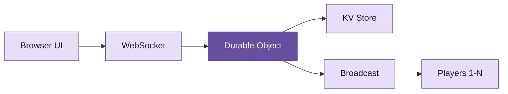

<div v-motion :initial="{ opacity: 0, scale: 0.9 }" :enter="{ opacity: 1, scale: 1, transition: { duration: 600, easing: 'cubic-bezier(0.05, 0.7, 0.1, 1.0)' } }">

# Keyboardia

10 players. 64 instruments. One room. Everyone hears the same music.

</div>

<!-- This deck follows a war stories structure: we open with the product vision ("everyone hears the same music"), walk through the battles we fought building real-time multiplayer audio in the browser, and close by resolving the promise. The arc is: promise, pain, payoff. "Everyone hears the same music" is the through-line — stated here, threatened by every bug, and resolved in the closing. -->

---
layout: MaterialSlide
transition: slide-left
---

# Web audio is a minefield

<div class="card-grid">

<v-click>
<MDCard variant="elevated" title="Gain staging">
Volume sounded tinny and distorted. Master gain was multiplicative across layers, causing clipping at 3+ simultaneous instruments. Fix: normalize per-voice gain to <strong>1/polyphony</strong>.
</MDCard>
</v-click>

<v-click>
<MDCard variant="elevated" title="Memory leaks">
AudioBufferSourceNodes are single-use. Each note creates a new node. Without cleanup, 10 minutes of play leaked thousands of orphaned nodes. Fix: <strong>disconnect and nullify</strong> on stop.
</MDCard>
</v-click>

<v-click>
<MDCard variant="elevated" title="Voice limiting">
Unlimited polyphony caused audio dropouts on mobile. Safari caps at ~32 concurrent sources before crackling. Fix: voice pool with <strong>oldest-steal</strong> eviction.
</MDCard>
</v-click>

</div>

<!-- Three battle scars from Web Audio API: gain staging causes clipping with multiple voices, AudioBufferSourceNodes leak memory because they are single-use, and Safari caps polyphony around 32 sources. Each of these shipped as a production bug before we understood the underlying constraint. The pattern: browser APIs have undocumented limits that only surface under real load. Every one of these bugs meant someone, somewhere, was not hearing the same music. -->

---
transition: slide-up
---

# The architecture



Notice: all audio synthesis happens client-side. The Durable Object is a state relay, not an audio engine. This asymmetry is why latency stays under 50ms — the DO only needs to sync pattern data (tiny), not audio buffers (huge).

<!-- The architecture looks like a standard hub-and-spoke but the insight is in what the DO does NOT do: it never touches audio. Every previous attempt at collaborative music tools tried to mix audio on the server. That path leads to unbounded latency. The DO syncs patterns (which steps are active, which instruments are loaded). Audio synthesis happens locally on each client via Web Audio API. -->

---
layout: MaterialSlide
transition: fade
---

# Three surfaces must align

<div class="card-grid" v-motion :initial="{ opacity: 0, y: 20 }" :enter="{ opacity: 1, y: 0, transition: { delay: 200, duration: 600 } }">

<v-click>
<MDCard variant="outlined" title="API surface">
What the code can do. `audioEngine.setTempo(120)` exists as a function. But if it only lives here, nobody hears the change.
</MDCard>
</v-click>

<v-click>
<MDCard variant="filled" title="UI surface">
What users can control. The tempo slider in Transport. If a feature has no UI, users cannot discover it.
</MDCard>
</v-click>

<v-click>
<MDCard variant="elevated" title="Session state">
What persists and syncs. `{ tempo, swing, tracks }` in the Durable Object. If a feature does not sync, <strong>everyone hears different music</strong>.
</MDCard>
</v-click>

</div>

<v-click>

A feature is not done until all three surfaces support it. We rolled back reverb and delay because they existed only in the API — two players would hear different effects.

</v-click>

<!-- The three-surface framework is the core design insight. A feature is incomplete if it exists in fewer than all three surfaces. We actually rolled back reverb and delay because they only had API support — users couldn't control them and they didn't sync. The consequence: two players in the same room heard different music. That violates the core promise. -->

<style>
.card-grid > div {
  transition: transform 0.2s cubic-bezier(0.05, 0.7, 0.1, 1.0), box-shadow 0.2s ease;
}
.card-grid > div:hover {
  transform: translateY(-4px);
  box-shadow: 0 8px 24px rgba(103, 80, 164, 0.2);
}
</style>

---
transition: slide-left
---

# The real-time challenge

Cloudflare Durable Objects use the Hibernation API to save costs. But hibernation breaks `setTimeout`.

```ts
// This timer dies when the DO hibernates
setTimeout(() => {
  this.broadcastState()
}, 5000)

// The DO wakes on next WebSocket message
// but the scheduled broadcast is gone
```

<v-mark v-click type="box" color="#6750A4">Hibernation pauses JavaScript execution. All pending timers and intervals are silently discarded.</v-mark>

<v-click>

Fix: use `alarm()` API for critical scheduled work. Alarms persist across hibernation cycles. Without this fix, players would reconnect to a room where the music had silently stopped.

</v-click>

<!-- The hibernation bug was the hardest to diagnose because it was intermittent. During development, the DO never hibernated (constant WebSocket activity). In production, idle rooms would hibernate, and when the next player joined, the scheduled broadcast was gone. The room was alive but the music was dead. Switching to alarm() fixed it because alarms are infrastructure-grade — they survive hibernation, eviction, and process restarts. -->

---
layout: MaterialSlide
transition: fade
---

# Multiplayer war stories

<div class="chip-group">

<MDChip label="XSS prevention" selected />
<MDChip label="Reconnection jitter" />
<MDChip label="Offline queues" />
<MDChip label="State hash mismatch" />
<MDChip label="Duplicate track IDs" />
<MDChip label="KV/DO divergence" />
<MDChip label="Connection storms" />
<MDChip label="Client timeouts" />

</div>

<MDCard variant="filled" style="margin-top: 1rem;">
User-controlled fields (session names, player names) are attack surfaces. Track IDs generated client-side can collide. KV and Durable Object state can diverge after failed writes. Reconnection without jitter causes thundering herds. Every one of these bugs meant someone was hearing different music — or no music at all.
</MDCard>

<!-- Eight production bugs, each discovered after deployment. The chips are shown statically because their individual revelation isn't the point — the density is. The summary card ties them back to the through-line: every bug is a way the "everyone hears the same music" promise can break. -->

---
layout: MaterialSlide
transition: slide-up
---

# The numbers

<div class="metric-row">

<MDSurface :level="1">
<div style="text-align: center;">
<div style="font-family: var(--deck-font-display); font-size: 2.2rem; font-weight: 800; color: var(--deck-primary);">64</div>
<div style="font-size: 0.82rem; color: var(--deck-muted);">Instruments</div>
</div>
</MDSurface>

<MDSurface :level="1">
<div style="text-align: center;">
<div style="font-family: var(--deck-font-display); font-size: 2.2rem; font-weight: 800; color: var(--deck-primary);">10</div>
<div style="font-size: 0.82rem; color: var(--deck-muted);">Simultaneous players</div>
</div>
</MDSurface>

<MDSurface :level="1">
<div style="text-align: center;">
<div style="font-family: var(--deck-font-display); font-size: 2.2rem; font-weight: 800; color: var(--deck-primary);">18</div>
<div style="font-size: 0.82rem; color: var(--deck-muted);">Lessons learned</div>
</div>
</MDSurface>

<MDSurface :level="1">
<div style="text-align: center;">
<div style="font-family: var(--deck-font-display); font-size: 2.2rem; font-weight: 800; color: var(--deck-primary);">0</div>
<div style="font-size: 0.82rem; color: var(--deck-muted);">Server-side audio</div>
</div>
</MDSurface>

</div>

The zero is the most important number. All audio synthesis happens client-side. The server is a state relay. This is why everyone can hear the same music — the DO syncs patterns, not audio.

<!-- 64 instruments, 10 players, 18 lessons, 0 server-side audio. The metrics are shown statically — their individual revelation adds no meaning. The zero-server-audio number deserves emphasis: it's the architectural decision that makes the latency target achievable. If audio went through the server, round-trip latency would exceed 100ms and the groove would fall apart. The tradeoff: every client must be capable of synthesis, which limits low-powered mobile devices. -->

---
transition: fade
---

# What we shipped

<div style="display: grid; grid-template-columns: repeat(8, 1fr); gap: 4px; max-width: 520px; margin: 1.5rem auto;">
  <div v-for="i in 64" :key="i" :style="{
    background: i % 8 === 0 ? '#6750A4' : i % 4 === 0 ? '#EADDFF' : '#F3EDF7',
    borderRadius: '4px',
    aspectRatio: '1',
    display: 'flex',
    alignItems: 'center',
    justifyContent: 'center',
    fontSize: '0.55rem',
    fontFamily: 'var(--deck-font-mono)',
    color: i % 8 === 0 ? '#fff' : '#1C1B1F',
  }">{{ i <= 16 ? ['BD', 'SD', 'HH', 'OH', 'CL', 'CP', 'CB', 'CY', 'LT', 'MT', 'HT', 'RS', 'MA', 'LC', 'HC', 'CR'][i-1] : '' }}</div>
</div>

<div style="text-align: center; margin-top: 1rem; color: var(--deck-muted); font-size: 0.9rem;">

An 8x8 step sequencer grid. Each row is an instrument. Each column is a beat. Click to toggle. Everyone hears the change.

</div>

<!-- The grid is visual evidence — this is what the actual UI looks like. 64 cells, 16 labeled with standard drum machine abbreviations (BD=bass drum, SD=snare, HH=hi-hat, etc). The sentence at the bottom echoes the through-line: "Everyone hears the change." -->

---
layout: MaterialSlide
transition: slide-left
---

# Three lessons

<div class="card-grid">

<MDCard variant="outlined" title="Align all surfaces">
API, UI, and session state must agree. A feature that exists only in the API violates the core promise: "Everyone hears the same music."
</MDCard>

<MDCard variant="outlined" title="Defer high-integration work">
Audio effects touch session state, WebSocket protocol, server validation, and UI. Implement them last, when the core is stable, or not at all.
</MDCard>

<MDCard variant="outlined" title="Test the spec, not your model">
100% test coverage does not mean correctness. Our publish tests passed — and encoded the wrong behavior. The spec is the source of truth.
</MDCard>

</div>

<!-- Three takeaways: (1) Align all surfaces — the three-surface framework applies to any collaborative system. (2) Defer high-integration work — features that touch every layer are the riskiest. (3) Test the spec — coverage metrics are vanity metrics if the tests encode wrong assumptions. These lessons cost weeks of debugging each. -->

---
layout: end
transition: fade
---

# Everyone hears the same music

<!-- The closing resolves the opening. "10 players. 64 instruments. One room. Everyone hears the same music." → "Everyone hears the same music." After 10 slides of bugs, war stories, and architectural battles, the promise is kept. The through-line survives every complication. That's the payoff. -->
