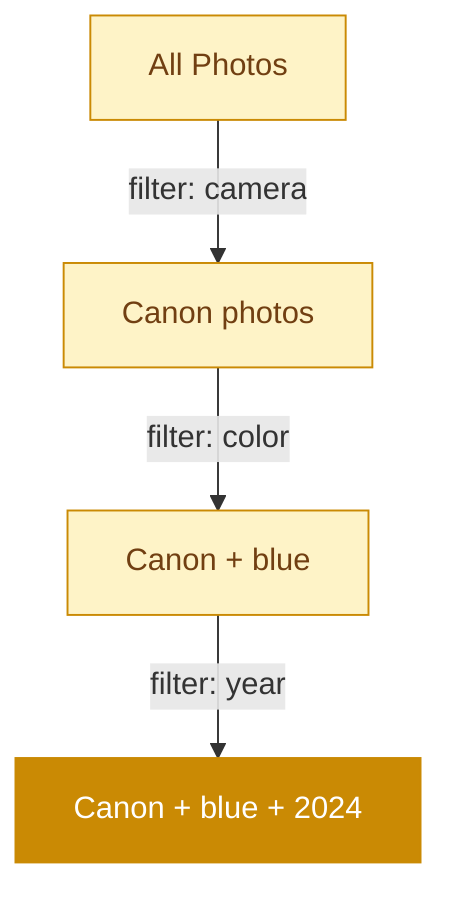

# Olsen

Local-first photo indexing and faceted browsing.

<!--
Olsen is a read-only photo indexer. The key differentiator: it never modifies source files. Position it against Apple Photos and Google Photos — those lock you in. Olsen indexes YOUR files on YOUR disk.
-->

---
layout: statement
transition: fade
---

# Your photos. Your database. Guaranteed read-only.

Olsen indexes without touching a single source file. No sidecar files. No hidden databases. One SQLite file you control.

---
transition: slide-up
---

# Why build another photo tool?

<v-clicks>

- Photo libraries grow to **100K+ images**. Existing tools can't keep up or lock you in.
- Apple Photos and Google Photos **own the index**. You can't query it. You can't export it.
- You want to browse **your files**, on **your disk**, with **your queries**.
- Olsen indexes everything into a single SQLite database — and never modifies a source file.

</v-clicks>

---
transition: slide-left
---

# Extracting from raw photos

```go
// Extract the largest embedded JPEG from a DNG file
func ExtractEmbeddedJPEG(data []byte) (image.Image, error) {
    var largest []byte
    var largestSize int
    for i := 0; i < len(data)-1; i++ {
        if data[i] == 0xFF && data[i+1] == 0xD8 {
            if jpegSize > largestSize {
                largest = jpegData
                largestSize = jpegSize
            }
        }
    }
    return jpeg.Decode(bytes.NewReader(largest)), nil
}
```

DNG, CR2, NEF — raw files embed full-resolution JPEGs. Olsen finds and extracts the largest one for thumbnail generation.

<!--
This is a simplified version of the actual extraction. The real code handles multiple JPEG markers, validates SOI/EOI pairs, and falls back to libraw if no embedded JPEG is found. The point: we avoid decoding the raw Bayer data entirely for thumbnail generation.
-->

---
layout: two-cols
transition: fade
---

# What it extracts

<v-clicks>

- **EXIF metadata** — camera, lens, exposure, GPS
- **Thumbnails** at 4 sizes, aspect-preserving
- **Dominant colors** via k-means clustering
- **Perceptual hashes** for duplicate detection

</v-clicks>

::right::

# Faceted search

<v-clicks>

- <v-mark at="5" color="#ca8a04" type="underline">Users **never hit zero results**</v-mark>
- SQL computes valid facet values
- **11 Berlin-Kay** color categories
- Temporal, visual, equipment facets

</v-clicks>

<style>
.slidev-layout .col-right li {
  transition: all 0.2s ease;
  padding: 2px 4px;
  border-radius: 4px;
}
.slidev-layout .col-right li:hover {
  background: rgba(202, 138, 4, 0.1);
  color: #ca8a04;
}
</style>

---
transition: slide-up
---

# The state machine guarantee

<v-motion
  :initial="{ y: 40, opacity: 0 }"
  :enter="{ y: 0, opacity: 1, transition: { duration: 500, delay: 150 } }">



</v-motion>

<div class="mt-4">

<v-mark at="1" color="#ca8a04" type="highlight">

Every filter combination is pre-validated. The UI only shows options that lead to results.

</v-mark>

</div>

---
layout: fact
transition: slide-left
---

# 62ms

per photo x 100K photos = 103 minutes

500MB constant memory. Hash-based resume. Metadata, thumbnails, color palette, and perceptual hash — all in one pass.

<!--
The 62ms figure is the average across a mixed library of JPEGs, PNGs, and raw files. Raw files take longer (DNG extraction), but the pipeline is I/O-bound, not CPU-bound. Hash-based resume means re-running after a crash skips everything already processed.
-->

---
layout: section
transition: fade
---

# Start at the source

Debug from the file, not from the abstraction. Every record links back to the original path.

---
layout: end
transition: fade
---

# Index your photos

`./bin/olsen index ~/Pictures --db photos.db`
