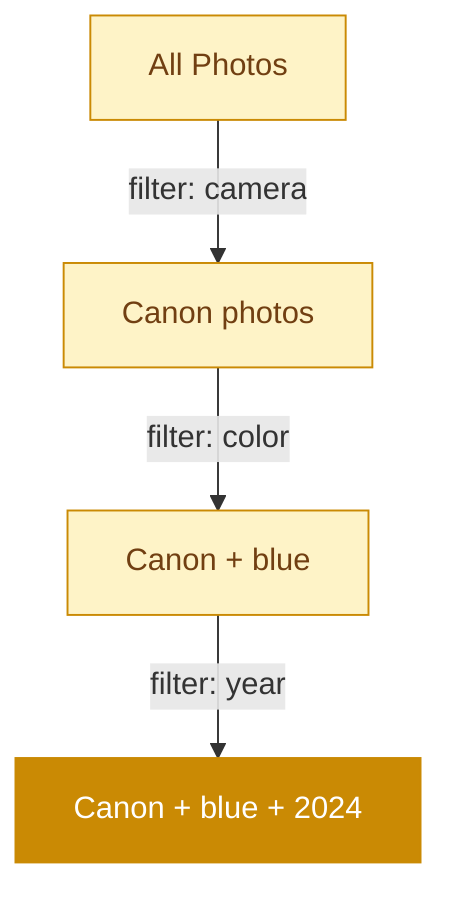

# Olsen

Local-first photo indexing and faceted browsing.

github.com/adewale/olsen

<!-- Olsen is a read-only photo indexer. It never modifies source files — not a sidecar, not a hidden database, not a single byte. The through-line is "read-only": stated as a guarantee on the cover, tested by every design decision, and resolved in the closing as a philosophy of trust. Position against Apple Photos and Google Photos — those own your index. Olsen indexes YOUR files on YOUR disk. -->

---
layout: statement
transition: fade
---

# Your photos. Your database. Guaranteed read-only.

Olsen indexes without touching a single source file. No sidecar files. No hidden databases. One SQLite file you control.

<!-- "Guaranteed read-only" is not a feature — it's a contract. Every architectural decision flows from this commitment: no write locks on source directories, no thumbnail injection into EXIF, no sidecar .xmp files. The SQLite database is the ONLY artifact Olsen creates. Delete it and your photos are exactly as they were. -->

---
transition: slide-up
---

# The day the index disappeared

iPhoto → Photos migration, 2015. Apple moved 40,000 photos into an opaque .photoslibrary package. The folder structure was gone. The EXIF was intact, but Apple's index was the only way to browse by date, location, or face.

Then the index corrupted. Recovery: re-import everything. 40,000 photos, 6 hours, and a new dependency on Apple's database format that couldn't be queried, exported, or backed up independently.

Olsen exists because an index should be yours to keep, query, and rebuild — not locked inside an application you can't control.

<!-- This is the war story. The iPhoto → Photos migration affected millions of users. The key failure: Apple's index was proprietary, undocumented, and not independently recoverable. When it corrupted, the only option was re-import. Olsen's read-only guarantee means the index is a disposable artifact — you can delete it, rebuild it, fork it, query it with any SQLite tool. The source files are never touched. -->

---
transition: slide-up
---

# Why build another photo tool?

- Photo libraries grow to **100K+ images**. Existing tools can't keep up or lock you in.
- Apple Photos and Google Photos **own the index**. You can't query it. You can't export it.
- You want to browse **your files**, on **your disk**, with **your queries**.
- Olsen indexes everything into a single SQLite database — and the read-only guarantee means your files are never at risk.

<!-- No v-clicks — these reasons have equal weight and the audience should see the full picture. The last bullet ties back to the through-line: read-only is what makes this safe. Every other photo tool asks for write access. Olsen doesn't. -->

---
transition: slide-left
---

# Extracting from raw photos

```go
// Extract the largest embedded JPEG from a DNG file
func ExtractEmbeddedJPEG(data []byte) (image.Image, error) {
    var largest []byte
    var largestSize int
    for i := 0; i < len(data)-1; i++ {
        if data[i] == 0xFF && data[i+1] == 0xD8 {
            if jpegSize > largestSize {
                largest = jpegData
                largestSize = jpegSize
            }
        }
    }
    return jpeg.Decode(bytes.NewReader(largest)), nil
}
```

DNG, CR2, NEF — raw files embed full-resolution JPEGs. Olsen finds and extracts the largest one. Read-only: the raw file is scanned, never modified.

<!-- Simplified extraction code. The real implementation handles multiple JPEG markers, validates SOI/EOI pairs, and falls back to libraw if no embedded JPEG meets quality thresholds. The insight: raw files already contain high-quality thumbnails. You don't need to decode the Bayer sensor data — just find the embedded JPEG. This is 60x faster than full RAW decoding (see the tufte deck for the debugging story behind this discovery). -->

---
layout: two-cols
transition: fade
---

# What it extracts

- **EXIF metadata** — camera, lens, exposure, GPS
- **Thumbnails** at 4 sizes, aspect-preserving
- **Dominant colors** via k-means clustering
- **Perceptual hashes** for duplicate detection

::right::

# Faceted search

- <v-mark at="1" color="#ca8a04" type="underline">Users **never hit zero results**</v-mark>
- SQL computes valid facet values
- **11 Berlin-Kay** color categories
- Temporal, visual, equipment facets

<style>
.slidev-layout .col-right li {
  transition: all 0.2s ease;
  padding: 2px 4px;
  border-radius: 4px;
}
.slidev-layout .col-right li:hover {
  background: rgba(202, 138, 4, 0.1);
  color: #ca8a04;
}
</style>

<!-- No v-clicks on these lists — both sides have equal-weight items. The v-mark on "never hit zero results" highlights the key UX guarantee. The faceted search is the read-only promise extended to the query layer: every filter combination is pre-validated, so the UI never shows a dead end. The index serves the user; it doesn't constrain them. -->

---
transition: slide-up
---

# The state machine guarantee

<v-motion
  :initial="{ y: 40, opacity: 0 }"
  :enter="{ y: 0, opacity: 1, transition: { duration: 500, delay: 150 } }">



</v-motion>

<div class="mt-4">

<v-mark at="1" color="#ca8a04" type="highlight">

Every filter combination is pre-validated. The UI only shows options that lead to results. You can never filter yourself into an empty page.

</v-mark>

</div>

<!-- The state machine diagram IS the insight — it shows that each filtering step narrows to a guaranteed non-empty result set. Traditional photo UIs let you filter into emptiness. Olsen pre-computes valid combinations so every click is safe. This is the read-only philosophy applied to the UI: just as the indexer never damages your files, the browser never wastes your time. -->

---
layout: fact
transition: slide-left
---

# 62ms

per photo x 100K photos = 103 minutes

500MB constant memory. Hash-based resume. Metadata, thumbnails, color palette, and perceptual hash — all in one pass. All read-only.

<!-- 62ms is the average across a mixed library of JPEGs, PNGs, and raw files. Raw files take longer (DNG extraction is I/O-bound). Hash-based resume means re-running after a crash skips everything already processed — because the source files are read-only, the hash of an already-processed file is guaranteed stable. The "all read-only" reminder is deliberate: even at 100K photos, Olsen has not modified a single source file. -->

---
layout: section
transition: fade
---

# Start at the source

Debug from the file, not from the abstraction. Every record links back to the original path — because the original is still exactly where you left it.

<!-- The section divider echoes the read-only through-line one more time. "The original is still exactly where you left it" is the emotional payoff of the guarantee. When a tool promises read-only, debugging is always possible because the source is never corrupted by the tool itself. -->

---
layout: end
transition: fade
---

# Your files haven't moved. Now you can find them.

<!-- The closing resolves the opening. "Your photos. Your database. Guaranteed read-only." → "Your files haven't moved. Now you can find them." The read-only guarantee is restated as a reassurance: nothing changed except that now you have a way to search. The index is the only new artifact. Your photos are exactly as they were. -->
