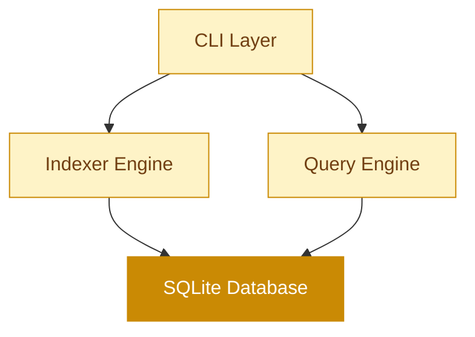
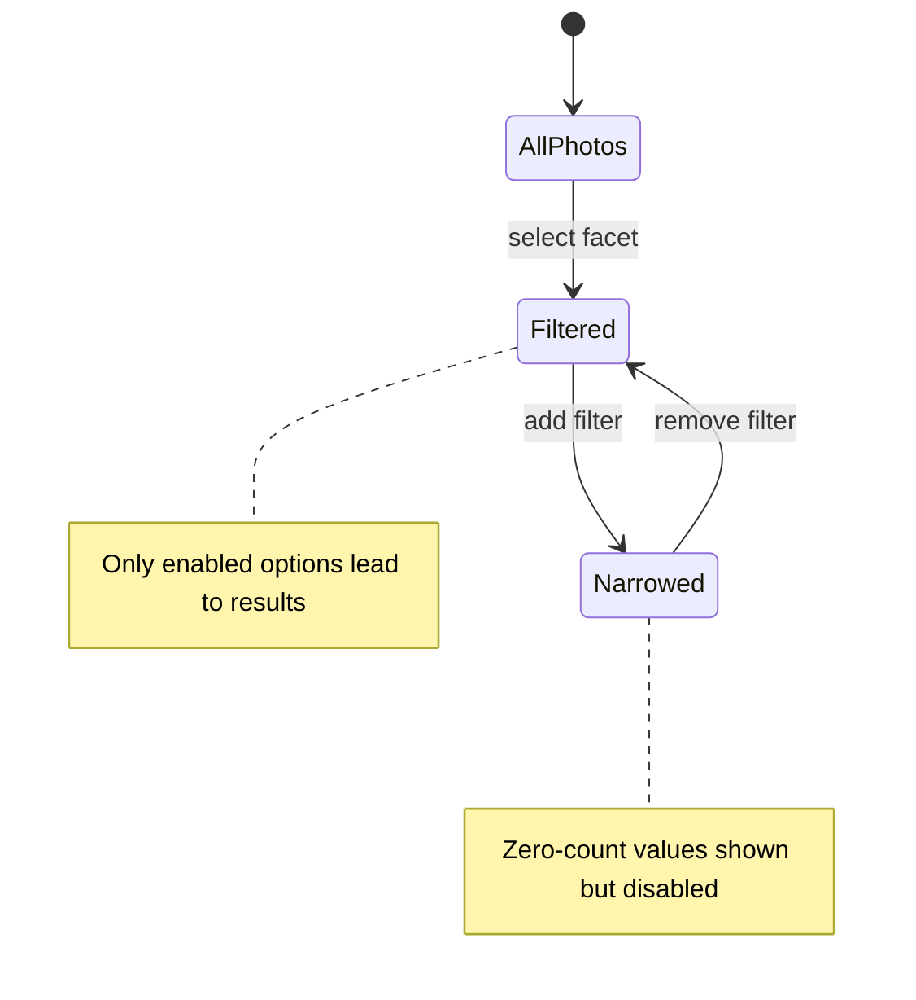

# Olsen

A read-only photo indexer. Your files stay exactly where they are.

github.com/adewale/olsen

<!-- Olsen is a high-performance photo indexing system for DNG, JPEG, and BMP files. It extracts metadata, generates thumbnails, analyzes color palettes, and computes perceptual hashes — all without modifying a single source file. The through-line is "read-only is the feature" — every architectural decision flows from the guarantee that source files are never touched. All file access uses O_RDONLY. Only the SQLite database is written to.

Sources:
- https://github.com/adewale/olsen/blob/main/README.md — project overview, supported formats, read-only guarantee
- https://github.com/adewale/olsen/blob/main/docs/architecture.md — system architecture and read-only enforcement -->

---
layout: statement
transition: fade
---

# Every photo tool wants write access to your library

They move files into opaque packages. They inject sidecar metadata. They build proprietary indexes you cannot query, export, or back up. Delete the app and the index is gone.

<!-- The iPhoto-to-Photos migration is the canonical failure: Apple moved photos into a .photoslibrary package, destroying the folder structure. The EXIF was intact, but the proprietary index was the only way to browse by date, location, or face. When that index corrupts, recovery means re-importing everything. Google Photos similarly owns the index — you cannot query it with SQL or export it independently. Olsen exists because an index should be yours to keep, query, and rebuild.

Sources:
- https://github.com/adewale/olsen/blob/main/README.md — "Olsen NEVER modifies your photo files" and motivation for read-only design -->

---
transition: zoom-in
---

# Four layers, one guarantee

<div v-motion
  :initial="{ opacity: 0, y: 40 }"
  :enter="{ opacity: 1, y: 0, transition: { delay: 200, duration: 600 } }">



</div>

Every layer reads source files with `O_RDONLY`. Only the SQLite database receives writes.

<!-- The architecture has four layers: CLI (user-facing commands), Indexer Engine (metadata extraction and visual feature analysis), Query Engine (faceted search), and SQLite Database (portable catalog). The Indexer Engine enforces read-only through os.Open() with O_RDONLY flag. No use of os.Create, os.OpenFile, os.WriteFile, os.Remove, or os.Rename anywhere in the codebase. Image processing is entirely in-memory — EXIF parsing operates on byte buffers, thumbnails are generated in RAM, and only the final metadata is written to SQLite.

Sources:
- https://github.com/adewale/olsen/blob/main/docs/architecture.md — 4-layer system overview, read-only enforcement mechanisms
- https://github.com/adewale/olsen/blob/main/README.md — architecture diagram and read-only guarantee -->

---
transition: slide-left
---

# Worker pool

File scanner walks the directory tree and feeds paths into a buffered channel. N workers consume in parallel.

<v-clicks>

- Scanner finds DNG, JPEG, BMP files recursively
- Buffered work channel (size: 100)
- Configurable worker count (default: 4)
- Hash-based resume skips processed files
- Per-file timeout: 60 seconds
- Failed files logged, never block the batch

</v-clicks>

```go {1-3|4-6|all}
// 8-step pipeline per file
// 1. EXIF  2. Decode  3. Thumbnails  4. Colors
// 5. pHash  6. SHA-256  7. Infer  8. DB Insert
scanner := walkDirectory(rootPath)
for path := range workChannel {
    processFile(path) // all steps, one transaction
}
```

<!-- The worker pool uses Go's goroutine + channel pattern. The main thread walks the filesystem and sends file paths into a buffered channel of size 100. N worker goroutines pull paths and run the full 8-step pipeline: EXIF extraction, image decode, thumbnail generation (4 sizes), color palette extraction (k-means), perceptual hash (pHash), file hash (SHA-256), metadata inference (time of day, season, conditions), and transactional database insert. Mutex-protected statistics track progress. Hash-based resume means re-running after a crash skips already-processed files — because source files are read-only, a file's hash is guaranteed stable.

Sources:
- https://github.com/adewale/olsen/blob/main/docs/architecture.md — worker pool pattern, concurrency model, processing pipeline
- https://github.com/adewale/olsen/blob/main/README.md — concurrent processing, hash-based resume, per-file timeout -->

---
layout: section
transition: iris
---

# Read-only is the feature

All file access uses `O_RDONLY`. No sidecar files. No hidden databases in your photo directories. One SQLite file you control.

---
transition: slide-left
---

# Never zero results

Faceted navigation as a state machine: every filter combination is pre-validated before the UI renders it.



<v-clicks>

- SQL computes valid facet values per state
- <v-mark at="2" color="#ca8a04" type="underline">Disabled options visible but not clickable</v-mark>
- Filters preserved across transitions
- No hardcoded hierarchies — data determines paths

</v-clicks>

<!-- The state machine model replaced an earlier hierarchical model that cleared "child" filters when a "parent" changed (e.g., changing year cleared month). The new model preserves ALL filters during transitions and lets SQL compute which facet values have results given current filters. Values with count=0 are rendered as disabled. The key insight from the spec: "Faceted navigation isn't about taxonomy and hierarchies. It's about exploration and valid state transitions through actual data." Available facets: Year, Month, Day, Color (11 Berlin-Kay), Time of Day, Season, Camera, Lens, Focal Category, Shooting Condition, In Burst.

Sources:
- https://github.com/adewale/olsen/blob/main/specs/facet_state_machine.spec — state machine model, "never zero results" guarantee, filter preservation vs. hierarchical clearing
- https://github.com/adewale/olsen/blob/main/README.md — web explorer faceted search, available facets list -->

---
transition: slide-left
---

# Eleven colors

Berlin-Kay universal color categories classified from HSL color space. K-means extracts 5 dominant colors per photo from the 256px thumbnail.

<v-clicks>

- <v-mark at="1" color="#ca8a04" type="box">Achromatic: black, white, gray, B&W</v-mark>
- Chromatic: red, orange, yellow, green, blue, purple, pink
- Special: brown (dark orange, low lightness)
- Saturation checked first — S < 10% is B&W
- Hue-based classification only when S >= 10%

</v-clicks>

<div class="spotlight-group mt-2">

| Detection | Rule | Example |
|-----------|------|---------|
| B&W | S < 15% | Film scans, Lightroom conversions |
| Black | S < 5%, L < 20% | Silhouettes, dark exposures |
| Brown | H 20-40, L < 50% | Wood, earth, leather |

</div>

<!-- Color extraction runs k-means clustering (100 iterations, 5 clusters) on the 256px thumbnail — not the full-resolution image. This is 100x faster with no perceptible accuracy loss for color classification. Each color is stored in both RGB and HSL. HSL enables perceptually correct queries: "all blue photos" matches regardless of saturation or lightness. The Berlin-Kay 11-color system maps to universal color terms found across human languages. The v2.0 fix catches B&W photos that were previously misclassified as "red" because achromatic colors have hue=0 in HSL.

Sources:
- https://github.com/adewale/olsen/blob/main/specs/dominant_colours.spec — k-means algorithm, RGB-to-HSL conversion, Berlin-Kay classification, B&W saturation threshold, v2.0 fix for misclassified B&W photos -->

---
transition: zoom-in
---

# What EXIF extraction looks like

```go {1-2|3-5|6-8|all}
// All file access is O_RDONLY — read-only is enforced at the syscall level
f, err := os.Open(path) // O_RDONLY flag
defer f.Close()

// EXIF parsed from byte buffer, never written back
rawExif, err := exif.SearchAndExtractExif(data)
entries, _ := exif.GetFlatExifData(rawExif)
// 50+ fields: camera, lens, exposure, GPS, flash, white balance
```

<v-clicks>

- Camera make, model, lens, focal length
- Exposure: ISO, aperture, shutter speed
- Location: latitude, longitude, altitude
- Inferred: time of day, season, conditions

</v-clicks>

<!-- The EXIF extraction uses dsoprea/go-exif/v3 which parses IFD entries from byte buffers. No write operations exist in the extraction path — os.Open() opens with O_RDONLY, and the EXIF library reads from the byte slice. After extraction, the indexer infers additional metadata: time of day (from DateTaken hour), season (from month), focal length category (wide/normal/telephoto/super-telephoto), and shooting conditions (from ISO, aperture, shutter speed combinations). This is the read-only guarantee applied at the lowest level: the file descriptor itself is read-only.

Sources:
- https://github.com/adewale/olsen/blob/main/docs/architecture.md — processing pipeline, read-only enforcement via O_RDONLY, EXIF extraction step
- https://github.com/adewale/olsen/blob/main/README.md — EXIF metadata extraction, metadata inference features -->

---
transition: slide-left
---

# Four sizes, one pass

<v-mark at="1" color="#ca8a04" type="box">

| Size | Longest edge | Use |
|------|-------------|-----|
| Tiny | 64px | Grid view |
| Small | 256px | List view |
| Medium | 512px | Preview |
| Large | 1024px | Detail |

</v-mark>

<v-clicks>

- Longest-edge constraint preserves aspect ratio
- No square crops — landscape stays landscape
- Generated in memory, stored as BLOBs in SQLite
- Color extraction runs on the 256px thumbnail

</v-clicks>

<!-- Thumbnails constrain the longest edge rather than forcing square crops. A 6000x4000 landscape photo produces thumbnails at 64x43, 256x171, 512x341, and 1024x683 — the aspect ratio is always preserved. All four sizes are generated in a single pass during indexing: the image is decoded once into memory, then resized four times using Lanczos3 interpolation (via nfnt/resize). Thumbnails are stored as BLOBs in the thumbnails table, making the SQLite database fully self-contained for browsing without access to the original files. Per-photo thumbnail storage: approximately 187 KB across all four sizes.

Sources:
- https://github.com/adewale/olsen/blob/main/specs/olsen_specs.md — ThumbnailSize constants (64, 256, 512, 1024), longest-edge constraint
- https://github.com/adewale/olsen/blob/main/README.md — aspect-ratio-preserving thumbnails, 4 sizes -->

---
layout: fact
transition: fade
---

# <v-mark at="1" color="#ca8a04" type="circle">~62ms</v-mark>

per photo on Apple M3 Max. Hash 0.4ms + thumbnails 34ms + colors 28ms + pHash 0.2ms. 15-25 photos/sec with 8 workers.

<!-- Benchmarked on Apple M3 Max with 8 workers. The breakdown: file hash calculation 0.4ms, thumbnail generation for all 4 sizes 34ms, color palette extraction via k-means 28ms, perceptual hash 0.2ms. Total approximately 62ms per photo. At 15-25 photos/second, a 100K photo library completes initial indexing in 1.5-2 hours. Database size for 100K photos: approximately 20-25 GB including all thumbnails. Memory usage stays constant at approximately 500 MB regardless of library size. Hash-based resume means interrupted indexing picks up where it left off.

Sources:
- https://github.com/adewale/olsen/blob/main/README.md — performance benchmarks table on Apple M3 Max, throughput with 8 workers, 100K photo estimates
- https://github.com/adewale/olsen/blob/main/docs/architecture.md — time complexity per operation, space complexity per photo -->

---
layout: center
transition: morph-fade
---

# The index is disposable. The photos are permanent.

## Read-only is the feature

Delete the database. Rebuild it from scratch. Your files are exactly as they were — not a byte changed, not a file moved, not a sidecar created.

<!-- The through-line resolves here. "Read-only is the feature" connects every design decision: O_RDONLY at the syscall level (architecture), hash-based resume that trusts file stability (worker pool), faceted navigation that never corrupts state (query engine), thumbnails stored in SQLite not injected into originals (storage). The SQLite database is the only artifact Olsen creates. It is designed to be disposable — delete it and your photos are untouched. The database is also portable: copy the single file to browse your catalog offline, on another machine, with any SQLite tool. This is the contract: the tool serves the files, never the other way around.

Sources:
- https://github.com/adewale/olsen/blob/main/README.md — read-only guarantee, database portability, "delete it and your photos are exactly as they were"
- https://github.com/adewale/olsen/blob/main/docs/architecture.md — storage architecture, database portability design principle -->

---
layout: end
transition: fade
---

# Your files have not moved. Now you can find them.

<!-- The closing echoes the opening. "Every photo tool wants write access to your library" — Olsen does not. "Your files have not moved" restates the read-only guarantee as reassurance. "Now you can find them" is what the indexer provides: faceted search across 100K+ photos with 11-color classification, temporal filters, equipment filters, and perceptual hash similarity — all without modifying a single source file. The index is the only new artifact. Your photos are exactly as they were. -->
