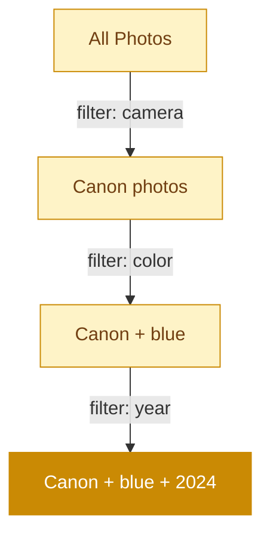

# Olsen

Local-first photo indexing and faceted browsing.

---
layout: statement
---

# Your photos. Your database. Guaranteed read-only.

---
transition: slide-up
---

# The indexing pipeline

Metadata, thumbnails, color palette, and perceptual hash — all in one pass per photo.

---
layout: two-cols
---

# What it extracts

<v-clicks>

- **EXIF metadata** — camera, lens, exposure, GPS
- **Thumbnails** at 4 sizes, aspect-preserving
- **Dominant colors** via k-means clustering
- **Perceptual hashes** for duplicate detection

</v-clicks>

::right::

# Faceted search

<v-clicks>

- Users **never hit zero results**
- SQL computes valid facet values
- **11 Berlin-Kay** color categories
- Temporal, visual, equipment facets

</v-clicks>

---

# The state machine guarantee

Every filter combination is pre-validated. The UI only shows options that lead to results.

---
layout: section
---

# Built for scale

100K+ photos. 500MB constant memory. Hash-based resume.

---
layout: fact
transition: fade
---

# 62ms

Per photo

Metadata, thumbnails, color palette, and perceptual hash — all in one pass

---
layout: end
transition: fade
---

# Index your photos

`./bin/olsen index ~/Pictures --db photos.db`
