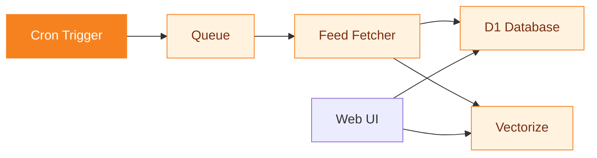
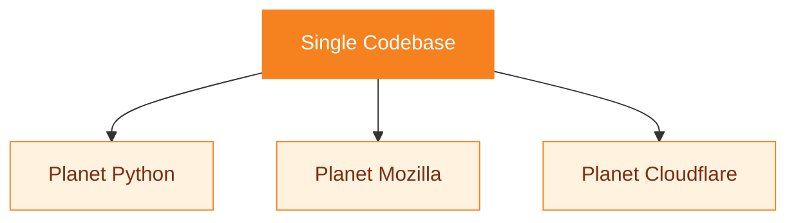

# Planet CF

A feed aggregator built on Cloudflare Python Workers.

---
layout: statement
---

# Aggregate blogs. Search semantically. Deploy in minutes.

---
transition: slide-up
---

# The pipeline

---
layout: two-cols
---

# Features

<v-clicks>

- **RSS, Atom, and OPML** aggregation
- **Hourly cron** triggers
- **Semantic search** via Vectorize + Workers AI
- **Queue-based fetching** with retries

</v-clicks>

::right::

# Smart defaults

<v-clicks>

- All config optional
- Database auto-initializes
- Theme fallback prevents failures
- Empty range shows 50 most recent

</v-clicks>

---
transition: fade
---

# Multi-instance deployment

One codebase, multiple deployment targets. Each instance gets its own D1 database and feed list.

---
layout: fact
---

# 500+

Feeds in Planet Python

Ready-to-deploy examples for Planet Python, Planet Mozilla, and Planet Cloudflare

---
layout: end
transition: fade
---

# Deploy your own

`git clone && npx wrangler deploy`
