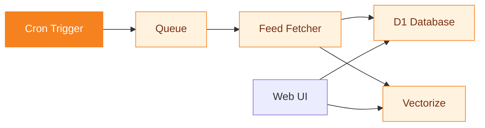

# Planet CF

A feed aggregator built on Cloudflare Python Workers.

<!--
Presenter notes:
Open with: this is a full-stack Cloudflare Python Workers project.
D1, Vectorize, Queues, Cron — all wired together in one codebase.
Three ready-to-deploy instances included.
-->

---
layout: statement
transition: fade
---

# Developer blogs are scattered across thousands of personal sites

No unified discovery. No search across authors. RSS readers help, but they are single-user and local. You need an aggregator that collects, indexes, and serves content for everyone.

---
transition: slide-up
---

# The feed fetcher

```python
async def fetch_feed(url: str, db: D1Database):
    """Parse RSS/Atom, embed via Vectorize, store in D1."""
    feed = feedparser.parse(await fetch(url))
    for entry in feed.entries[:50]:
        embedding = await ai.run(
            "@cf/bge-base-en-v1.5",
            {"text": [entry.title + entry.summary]}
        )
        await db.execute(
            "INSERT INTO posts ...", [entry]
        )
```

Fetch, embed, store — in one async function.

<!--
Presenter notes:
Walk through the code: feedparser handles RSS and Atom.
Workers AI generates embeddings at the edge — no external API calls.
D1 stores everything in SQLite. Vectorize handles similarity search.
Each fetch processes up to 50 entries to stay within Worker limits.
-->

---
transition: slide-left
---

# Architecture

<div v-motion
  :initial="{ opacity: 0, y: 40 }"
  :enter="{ opacity: 1, y: 0, transition: { delay: 300, duration: 600 } }">



</div>

Cron triggers the queue. The queue fans out to feed fetchers. Everything lands in D1 and Vectorize.

---
layout: two-cols
transition: fade
---

# Features

<v-clicks>

- **RSS, Atom, and OPML** aggregation
- **Hourly cron** triggers
- **Semantic search** via Vectorize + Workers AI
- **Queue-based fetching** with retries

</v-clicks>

::right::

<div class="pt-4">

# Smart defaults

<v-clicks>

- All config optional
- <v-mark at="5" color="#f6821f" type="underline">**Database auto-initializes**</v-mark>
- Theme fallback prevents failures
- Empty range shows 50 most recent

</v-clicks>

</div>

<style>
.slidev-layout .col-right li {
  transition: color 0.2s ease, transform 0.2s ease;
}
.slidev-layout .col-right li:hover {
  color: #f6821f;
  transform: translateX(4px);
}
</style>

---
layout: center
transition: slide-up
---

# Smart defaults eliminate configuration

All config optional. Database auto-initializes on first request. Theme fallback prevents deployment failures. You deploy, it works.

---
layout: fact
transition: fade
---

# 500 feeds

12,000 posts indexed, semantic search in <50ms

Three ready-to-deploy instances. One codebase.

---
layout: end
transition: slide-left
---

# Deploy your own

`git clone && npx wrangler deploy`

<!--
Presenter notes:
Clone the repo, pick an instance (Python, Mozilla, or Cloudflare), deploy.
wrangler handles D1 creation, Vectorize binding, and cron setup.
Customise feeds by editing a single OPML or JSON file.
-->
