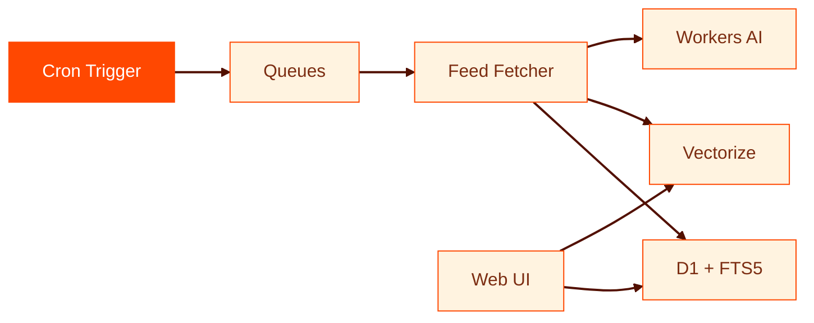

# Planet CF

A feed aggregator built on Cloudflare Python Workers.

github.com/adewale/planet\_cf

<!-- Planet CF collects developer blog posts from hundreds of personal sites into a single searchable index. Built on Cloudflare's Python Workers platform: D1 for storage, Vectorize for semantic search, Queues for feed processing, Workers AI for embeddings. The through-line is "quarantine the boundary" — every hard lesson from this project traces back to the JS/Python FFI edge.

Sources:
- https://github.com/adewale/planet_cf — project repository
- https://github.com/adewale/planet_cf/blob/main/README.md — project overview -->

---
layout: statement
transition: fade
---

# Developer blogs are scattered across thousands of personal sites

No unified discovery. No search across authors. RSS readers help, but they're single-user and local. The writing exists. Nobody can find it.

<!-- The problem is structural: search engines prioritize commercial content, social media rewards engagement over depth, and RSS is single-user. A senior engineer's detailed blog post about a production outage reaches only existing subscribers. Planet CF collects feeds into a searchable index — making personal-site writing discoverable without requiring authors to cross-post or self-promote.

Sources:
- https://github.com/adewale/planet_cf/blob/main/README.md — "A feed aggregator built on Cloudflare's Python Workers platform" -->

---
transition: slide-left
---

# The Cloudflare stack

<div v-motion
  :initial="{ opacity: 0, y: 40 }"
  :enter="{ opacity: 1, y: 0, transition: { delay: 200, duration: 600 } }">



</div>

The Web UI queries both D1 and Vectorize independently — chronological browsing and semantic search are two separate discovery paths.

<!-- Architecture: Cron fires hourly, enqueues each feed as a separate queue message. Queue consumer fetches with 30s HTTP timeout and 60s processing timeout. Failed messages retry or go to a dead-letter queue. D1 stores entries with FTS5 for keyword search. Vectorize stores 768-dimension embeddings for semantic search. Workers AI generates embeddings using bge-base-en-v1.5 with CLS pooling. Edge cache: 1-hour TTL. Static asset TTFB: 15-90ms. Worker cold start: 1000-1400ms.

Sources:
- https://github.com/adewale/planet_cf/blob/main/docs/ARCHITECTURE.md — system overview, data flow, performance metrics
- https://github.com/adewale/planet_cf/blob/main/README.md — Cloudflare resource setup and feature list -->

---
transition: slide-up
---

# The boundary problem

````md magic-move
```python
# JsProxy objects aren't subscriptable
result = await env.DB.prepare(sql).bind(*params).all()
for row in result.results:
    title = row["title"]
    # TypeError: 'JsProxy' object is not subscriptable
```
```python
# SafeD1 quarantines JS types at the edge
result = await safe_db.query(sql, params)
for row in result:
    title = row["title"]
    # Pure Python dict — just works
```
````

The fix: convert at the boundary, never in business logic.

<!-- This was the most painful production lesson. All unit tests passed because mocks return pure Python dicts. Production returned 500 errors because D1 results are JsProxy objects. The SafeD1 wrapper calls _to_py_safe() on every result immediately — business logic never sees JsProxy. The boundary layer also handles the JsNull trap: JavaScript null becomes JsNull in Python, not None. And Python None becomes JavaScript undefined, which D1 rejects — SafeD1 converts None to proper JS null via js.JSON.parse("null").

Sources:
- https://github.com/adewale/planet_cf/blob/main/docs/LESSONS_LEARNED.md — sections 1-2: JsProxy conversion and boundary layer pattern
- https://github.com/adewale/planet_cf/blob/main/docs/LESSONS_LEARNED.md — section 17: FFI type-compatibility matrix -->

---
layout: section
transition: iris
---

# Quarantine the boundary

Convert JS types to Python types at the edge, then forget the edge exists.

---
layout: two-cols-header
transition: wipe-right
---

# What mocks miss

::left::

### Mock tests

<v-clicks>

- `MockD1` returns Python dicts
- `MockAI` returns `[0.1, 0.1, ...]`
- `MockVectorize` returns all vectors
- All tests green

</v-clicks>

::right::

### Production

<v-clicks>

- D1 returns `JsProxy` objects
- AI results need `.to_py()` conversion
- Vectorize returns `JsProxy` matches
- **500 errors on every query**

</v-clicks>

<!-- Mock-based tests verify logic but cannot catch FFI type mismatches. The SafeD1, SafeVectorize, and SafeAI wrappers exist specifically because mocks are pure Python while production returns JsProxy. The solution: two-tier testing. Mock tests for logic verification (fast, no network). E2E tests against real infrastructure via wrangler dev --remote, running against actual Cloudflare bindings at http://localhost:8787. The E2E tests catch JsProxy issues that mocks fundamentally cannot simulate.

Sources:
- https://github.com/adewale/planet_cf/blob/main/docs/LESSONS_LEARNED.md — section 3: "Mocks Don't Catch JsProxy Issues"
- https://github.com/adewale/planet_cf/blob/main/docs/LESSONS_LEARNED.md — section 16: "Search Accuracy Requires Real Infrastructure Tests" -->

---
transition: slide-left
---

# Hybrid search

Three-tier ranking makes exact matches instant and semantic matches discoverable:

<v-clicks>

- **Exact title match** — score `1.0`, highest priority
- **Semantic similarity** — Vectorize cosine distance, ranked by score
- **Keyword fallback** — D1 `LIKE` query, ranked by date

</v-clicks>

```python {1-3|5-6|all}
# Priority 1: exact title match
if query_lower == title_lower:
    results.append({**entry, "score": 1.0})

# Priority 2: semantic (by cosine similarity)
# Priority 3: keyword-only (by date)
```

<!-- Pure semantic search misses exact keyword matches. Searching "context" doesn't find articles with "context" in the title if they're not semantically similar to the query vector. Hybrid search combines Vectorize for conceptual similarity with D1 LIKE for keyword matching. The three-tier ranking ensures searching for a specific title always returns that article first. Bidirectional matching is critical: both "what the day-to-day looks like" (exact) and "what the day-to-day looks like now" (query contains title) find the right article.

Sources:
- https://github.com/adewale/planet_cf/blob/main/docs/LESSONS_LEARNED.md — section 5: "Hybrid Search Beats Pure Semantic"
- https://github.com/adewale/planet_cf/blob/main/docs/LESSONS_LEARNED.md — section 15: "Search Ranking: Exact Matches First" -->

---
layout: fact
transition: fade
---

# <v-mark at="1" color="#ff4801" type="circle">768</v-mark>

dimensions per embedding. Semantic search under 50ms. `bge-base-en-v1.5` with CLS pooling.

<!-- Workers AI embedding model: @cf/baai/bge-base-en-v1.5 with 768 dimensions and CLS pooling. CLS pooling produces better search results than mean pooling for this use case. The Vectorize index uses cosine similarity metric. The 768 dimensions must match between the AI model output and the Vectorize index configuration — a mismatch causes silent failures with no error message. Embeddings are generated at the Cloudflare edge with no external API calls needed.

Sources:
- https://github.com/adewale/planet_cf/blob/main/docs/LESSONS_LEARNED.md — section 10: "Workers AI Embedding Model Choice"
- https://github.com/adewale/planet_cf/blob/main/docs/ARCHITECTURE.md — Vectorize configuration: 768 dimensions, cosine metric -->

---
transition: zoom-in
---

# Templates without a filesystem

Workers Python runs in WebAssembly inside V8 isolates. There is no filesystem — no `open()`, no `pathlib`, no `FileSystemLoader`.

```python
# Build-time: compile templates into a Python module
templates = {}
for path in TEMPLATE_FILES:
    templates[path] = (TEMPLATE_DIR / path).read_text()
# Output: src/templates.py with EmbeddedLoader
```

Everything you'd normally load from disk must be embedded at build time or fetched from Cloudflare bindings at runtime.

<!-- This is another boundary problem: the boundary between traditional Python assumptions (filesystem exists) and the Workers runtime (no filesystem at all). Jinja2's FileSystemLoader fails. The solution is scripts/build_templates.py, which reads HTML templates from disk and generates a Python module with embedded template strings and a custom EmbeddedLoader class. After editing any template: python scripts/build_templates.py, then wrangler deploy. Same principle as SafeD1: quarantine the platform constraint at the edge so core code never thinks about it.

Sources:
- https://github.com/adewale/planet_cf/blob/main/docs/LESSONS_LEARNED.md — section 4: "Templates Must Be Embedded (No Filesystem Access)"
- https://github.com/adewale/planet_cf/blob/main/README.md — build_templates.py in scripts table -->

---
transition: slide-left
---

# Smart defaults

<div class="spotlight-group">

| Setting | Default | Override |
|---------|---------|----------|
| Display range | 7 days | `CONTENT_DAYS` |
| Fallback entries | 50 | built-in |
| HTTP timeout | 30 seconds | `HTTP_TIMEOUT_SECONDS` |
| Feed timeout | 60 seconds | `FEED_TIMEOUT_SECONDS` |
| Retention | 90 days | `RETENTION_DAYS` |

</div>

Database auto-initializes on first request. Theme falls back to `default` if the specified theme doesn't exist. Empty date range shows the 50 most recent entries instead of a blank page.

<!-- Smart defaults philosophy: deploy should be one command with zero configuration. All configuration values have sensible defaults in wrangler.jsonc. The database creates its tables automatically on first request, eliminating the manual migration step for new instances. Theme fallback prevents deployment failures from misconfiguration. The 7-day content window falls back to showing the 50 most recent entries so the homepage is never blank, even on a fresh install. Feed dates that are missing or malformed store NULL rather than faking the current timestamp.

Sources:
- https://github.com/adewale/planet_cf/blob/main/README.md — "Smart Defaults" section with full configuration table
- https://github.com/adewale/planet_cf/blob/main/docs/LESSONS_LEARNED.md — section 8: "Feed Dates Can Be Missing or Malformed" -->

---
layout: center
transition: morph-fade
---

# Every lesson traces back to one principle

## Quarantine the boundary

Convert foreign types at the edge. Let the core be pure.

<!-- The through-line resolves here. JsProxy conversion (lessons 1-2), mock failures (lesson 3), filesystem absence (lesson 4), hybrid search edge (lesson 5), date handling (lesson 8), SSRF protection (lesson 7), session management (lesson 9) — each is a boundary problem. SafeD1, SafeVectorize, SafeAI, EmbeddedLoader, _to_py_safe, _is_js_undefined, _to_d1_value — each is a boundary quarantine. The pattern: identify where foreign types cross into your domain, convert immediately at the edge, and never let the foreign types leak deeper into business logic.

Sources:
- https://github.com/adewale/planet_cf/blob/main/docs/LESSONS_LEARNED.md — all 19 lessons trace to boundary management
- https://github.com/adewale/planet_cf/blob/main/docs/ARCHITECTURE.md — boundary layer architecture diagram -->

---
layout: end
transition: fade
---

# The best writing is invisible. The best boundaries are too.

<!-- The closing echoes the opening. "Developer blogs are scattered across thousands of personal sites" — the writing is invisible because discovery is broken. Planet CF makes it visible. "The best boundaries are too" — when SafeD1 works correctly, you never think about JsProxy. Both solve a visibility problem through careful boundary management. The invisible writing becomes findable. The invisible boundary layer makes the codebase pure Python.

Sources:
- https://github.com/adewale/planet_cf/blob/main/docs/LESSONS_LEARNED.md — boundary layer pattern
- https://github.com/adewale/planet_cf/blob/main/README.md — project purpose -->
