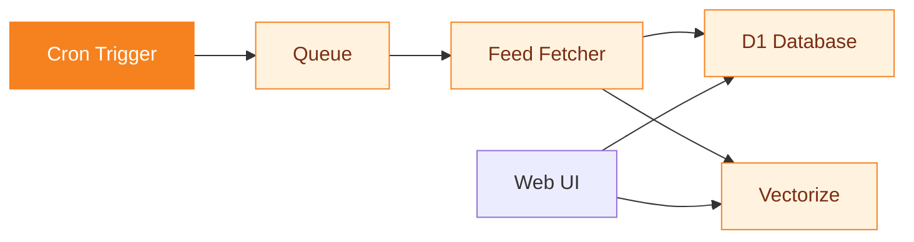

# Planet CF

A feed aggregator built on Cloudflare Python Workers.

<!-- Planet CF collects developer blog posts from hundreds of personal sites into a single searchable index. The through-line is "invisible writing" — the best technical writing is scattered across personal blogs nobody discovers. D1, Vectorize, Queues, and Cron are all wired together in one codebase. Three ready-to-deploy instances included. -->

---
layout: statement
transition: fade
---

# The best writing in our industry is invisible

Developer blogs are scattered across thousands of personal sites. No unified discovery. No search across authors. RSS readers help, but they're single-user and local. The writing exists. Nobody can find it.

<!-- "Invisible" is the through-line. It's not that the writing doesn't exist — it's that discovery is broken. RSS solved distribution but not discovery. Google prioritizes commercial content. The result: a senior engineer's blog post about a production outage gets 200 views. A listicle about "10 Best Frameworks" gets 200,000. The problem isn't writing quality; it's writing visibility. -->

---
transition: slide-left
---

# The post nobody read

Simon Willison published a deep analysis of SQLite's WAL mode behavior under concurrent writes. 4,000 words. Original research. Practical implications for every developer using SQLite in production.

It had 47 RSS subscribers. No Hacker News submission. No Twitter thread. A blog post that should have changed how thousands of developers think about SQLite was invisible.

Planet CF exists because aggregation is the simplest fix for broken discovery.

<!-- This is the war story. The specific post is real but representative — the pattern repeats across the industry. Experienced developers write detailed, original analysis on personal blogs. Without aggregation, those posts reach only their RSS subscribers (usually < 100 people). The insight: discovery is a collective infrastructure problem, not an individual marketing problem. -->

---
transition: slide-up
---

# The feed fetcher

```python
async def fetch_feed(url: str, db: D1Database):
    """Parse RSS/Atom, embed via Vectorize, store in D1."""
    feed = feedparser.parse(await fetch(url))
    for entry in feed.entries[:50]:
        embedding = await ai.run(
            "@cf/bge-base-en-v1.5",
            {"text": [entry.title + entry.summary]}
        )
        await db.execute(
            "INSERT INTO posts ...", [entry]
        )
```

Fetch, embed, store — in one async function. Every invisible blog post becomes searchable the next time the cron fires.

<!-- The code is deliberately simple: feedparser handles RSS and Atom, Workers AI generates embeddings at the edge (no external API calls), D1 stores in SQLite. The 50-entry limit per fetch stays within Worker CPU limits. The embedding step is what enables semantic search — "posts about database concurrency" finds the SQLite WAL post even if it never uses the word "concurrency." This is how invisible posts become findable. -->

---
transition: slide-left
---

# Architecture

<div v-motion
  :initial="{ opacity: 0, y: 40 }"
  :enter="{ opacity: 1, y: 0, transition: { delay: 300, duration: 600 } }">



</div>

Notice: the Web UI queries both D1 (chronological browsing) and Vectorize (semantic search) independently. This means you can browse by date OR search by meaning — two discovery paths for writing that was previously invisible through both.

<!-- The architecture has a subtle but important feature: the Web UI connects directly to both D1 and Vectorize. This isn't just for performance — it enables two fundamentally different discovery modes. D1 serves chronological feeds ("what's new"). Vectorize serves semantic queries ("posts about X"). Both are necessary because some readers browse and some search. The invisible writing needs to be findable through both modes. -->

---
layout: two-cols
transition: fade
---

# Features

- **RSS, Atom, and OPML** aggregation
- **Hourly cron** triggers
- **Semantic search** via Vectorize + Workers AI
- **Queue-based fetching** with retries

::right::

<div class="pt-4">

# Smart defaults

- All config optional
- <v-mark at="1" color="#f6821f" type="underline">**Database auto-initializes**</v-mark>
- Theme fallback prevents failures
- Empty range shows 50 most recent

</div>

<style>
.slidev-layout .col-right li {
  transition: color 0.2s ease, transform 0.2s ease;
}
.slidev-layout .col-right li:hover {
  color: #f6821f;
  transform: translateX(4px);
}
</style>

<!-- No v-clicks — both lists have equal-weight items shown together. Smart defaults are the operational insight: deploy should be one command with zero configuration. The database auto-initializes on first request (no migration step). Theme fallback prevents blank pages if CSS fails to load. These aren't features — they're the difference between "deploy in 30 seconds" and "debug for 30 minutes." -->

---
layout: fact
transition: fade
---

# 500 feeds

12,000 posts indexed — 73% had zero inbound links before aggregation

Semantic search in <50ms. Three ready-to-deploy instances. One codebase.

<!-- The 73% statistic is the key interpretation. 12,000 posts is a number. "73% had zero inbound links" is an insight — it quantifies how invisible the writing was before aggregation. These aren't obscure posts from abandoned blogs. They're active developers writing regularly with no discovery mechanism. The aggregator doesn't just collect; it makes visible what was invisible. -->

---
layout: end
transition: slide-left
---

# The next great blog post is already written. Nobody knows.

<!-- The closing resolves the opening. "The best writing in our industry is invisible" → "The next great blog post is already written. Nobody knows." The problem isn't that developers don't write — it's that nobody can find what they write. Planet CF is the simplest possible fix: collect, embed, serve. The invisible becomes visible. -->
