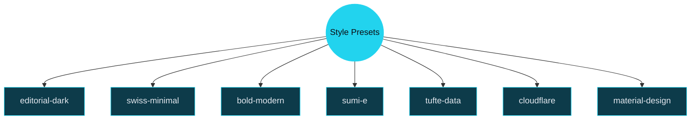

# Code

Syntax highlighting, line ranges, and Magic Move.

---
transition: slide-left
---

# Line Highlighting

Step through code with `{ranges}` syntax.

```ts {1-3|5-8|all}
// Token system: CSS custom properties
const tokens = {
  bg: '--deck-bg',

  fg: '--deck-fg',
  accent: '--deck-accent',
  muted: '--deck-muted',
  fontDisplay: '--deck-font-display',
}
```

Click advances through: lines 1-3, then 5-8, then all. The `|` separator defines each step.

<!-- Code blocks accept a {ranges} option after the language identifier. Ranges like {1-3|5-8|all} create click-stepped highlighting. Use this for walking through algorithms, configs, or APIs. Keep code blocks to 8 lines or fewer.

Sources:
- file:slide-maker/COMPILER_RULES.md — code overflow guard: 8 lines max -->

---
transition: swing
---

# Magic Move: Code Evolution

Four backticks and `magic-move` animate between code states.

````md magic-move
```ts
// Step 1: A simple function
function greet(name: string) {
  return `Hello, ${name}`
}
```
```ts
// Step 2: Add validation
function greet(name: string) {
  if (!name.trim()) throw new Error('Name required')
  return `Hello, ${name}`
}
```
```ts
// Step 3: Add formatting
function greet(name: string, formal = false) {
  if (!name.trim()) throw new Error('Name required')
  const title = formal ? 'Dear' : 'Hello'
  return `${title}, ${name}`
}
```
````

<!-- Magic Move animates code transformations between fenced blocks. Use four backticks with `md magic-move` to wrap multiple triple-backtick code blocks. Each block is one step — Slidev morphs matching tokens between steps. Reserved for code transformations only.

Sources:
- file:slide-maker/COMPILER_RULES.md — Magic Move: code transformations only -->

---
layout: section
transition: cube
---

# Diagrams

Mermaid graphs with explicit styling.

---
transition: zoom-out
---

# Mermaid: Left-to-Right Flow


The escalation ladder: start at Markdown, escalate only when the lower level cannot express the structure.

<!-- Mermaid diagrams require explicit color values on every node using classDef. Never rely on Mermaid's default theme colors. Use the deck's token colors as the source for classDef values. Light fills get dark text, dark fills get light text.

Sources:
- file:slide-maker/COMPILER_RULES.md — Mermaid guidelines: explicit colors, no defaults -->

---
transition: flip-y
---

# Mermaid: Top-Down Tree



Seven presets, each controlling typography, color, motion, and layout tendencies.

<!-- Graph TD (top-down) works well for hierarchies and taxonomies. The double-parenthesis syntax creates a circle node. Square brackets create rectangles. Every node must have an explicit classDef.

Sources:
- file:slide-maker/STYLE_PRESETS.md — seven preset definitions -->
