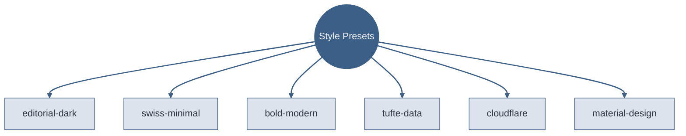
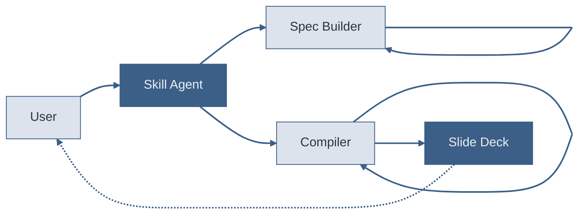

# Code

Syntax highlighting, line ranges, and Magic Move.

---
transition: slide-left
---

# Line Highlighting

Step through code with `{ranges}` syntax.

```ts {1-3|5-8|all}
// Token system: CSS custom properties
const tokens = {
  bg: '--deck-bg',

  fg: '--deck-fg',
  accent: '--deck-accent',
  muted: '--deck-muted',
  fontDisplay: '--deck-font-display',
}
```

Click advances through: lines 1-3, then 5-8, then all. The `|` separator defines each step.

<!-- Code blocks accept a {ranges} option after the language identifier. Ranges like {1-3|5-8|all} create click-stepped highlighting. Use this for walking through algorithms, configs, or APIs. Keep code blocks to 8 lines or fewer.

Sources:
- file:slide-maker/COMPILER_RULES.md — code overflow guard: 8 lines max -->

---
transition: swing
---

# Magic Move: Code Evolution

Four backticks and `magic-move` animate between code states.

````md magic-move
```ts
// Step 1: A simple function
function greet(name: string) {
  return `Hello, ${name}`
}
```
```ts
// Step 2: Add validation
function greet(name: string) {
  if (!name.trim()) throw new Error('Name required')
  return `Hello, ${name}`
}
```
```ts
// Step 3: Add formatting
function greet(name: string, formal = false) {
  if (!name.trim()) throw new Error('Name required')
  const title = formal ? 'Dear' : 'Hello'
  return `${title}, ${name}`
}
```
````

<!-- Magic Move animates code transformations between fenced blocks. Use four backticks with `md magic-move` to wrap multiple triple-backtick code blocks. Each block is one step — Slidev morphs matching tokens between steps. Reserved for code transformations only.

Sources:
- file:slide-maker/COMPILER_RULES.md — Magic Move: code transformations only -->

---
layout: section
transition: cube
---

# Diagrams

Every node needs explicit inline styles. Auto-theming fails.

---
transition: zoom-out
---

# The Escalation Ladder


Start at Markdown, escalate only when the lower level cannot express the structure. Most slides never leave level 2.

<!-- Beautiful Mermaid's color-mix() auto-theming produces black boxes — always add explicit inline style directives on every node. The escalation ladder uses three tiers: light fill for simple levels, accent fill for moderate, accent-alt for the escape hatch.

Sources:
- file:slide-maker/COMPILER_RULES.md — Mermaid guidelines: inline styles always required -->

---
transition: flip-y
---

# Six Presets, Six Personalities



Each preset controls typography, color, motion, and layout tendencies — the same content looks and feels different under each preset.

<!-- Graph TD (top-down) for hierarchies. Circle node for the hub, rectangles for leaves. Every node explicitly styled — Beautiful Mermaid auto-theming is unreliable.

Sources:
- file:slide-maker/STYLE_PRESETS.md — six preset definitions -->

---
transition: slide-left
---

# The Compilation Pipeline



Five actors, two self-loops. The Spec Builder re-enters itself for source-grounding. The Compiler loops for layout resolution. The dashed return is the live preview.

<!-- sequenceDiagram and stateDiagram-v2 produce black boxes with Beautiful Mermaid. Always use flowcharts with inline styles instead. Self-loop arrows show recursive processes.

Sources:
- file:slide-maker/COMPILER_RULES.md — Mermaid guidelines: inline styles always required
- file:slide-maker/COMPILER_RULES.md — diagram insight annotations required -->

---
transition: flip-y
---

# Slides Have a Lifecycle Most Presenters Ignore


The backward edges matter most but can't be shown cleanly in Mermaid (cycles break the layout). Validation failures return to **Draft**, not to Compiled — structural fixes require a full recompile. Post-talk revisions also restart from Draft.

<!-- stateDiagram-v2 produces black boxes — use flowcharts with circle nodes for start/end instead. Backward transitions highlight recovery paths that audiences overlook.

Sources:
- file:slide-maker/COMPILER_RULES.md — Mermaid guidelines: inline styles always required
- file:slide-maker/COMPILER_RULES.md — diagram insight annotations required -->
