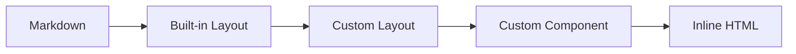
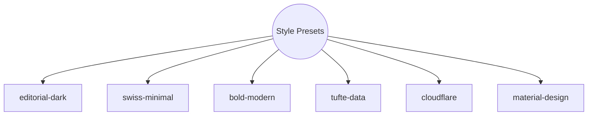
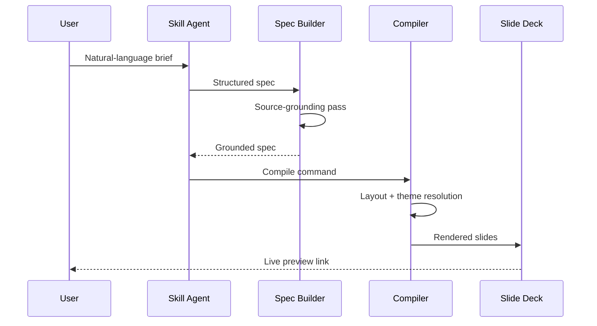
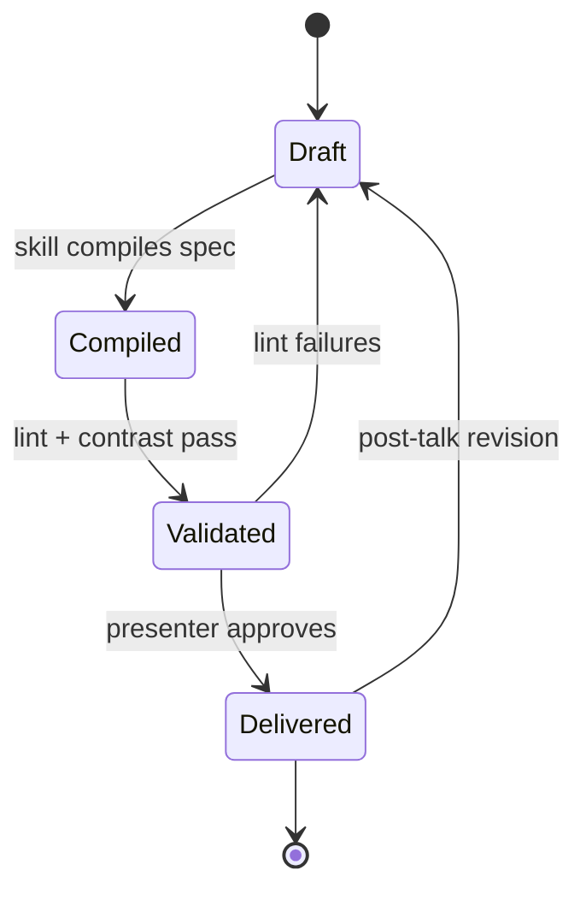

# Code

Syntax highlighting, line ranges, and Magic Move.

---
transition: slide-left
---

# Line Highlighting

Step through code with `{ranges}` syntax.

```ts {1-3|5-8|all}
// Token system: CSS custom properties
const tokens = {
  bg: '--deck-bg',

  fg: '--deck-fg',
  accent: '--deck-accent',
  muted: '--deck-muted',
  fontDisplay: '--deck-font-display',
}
```

Click advances through: lines 1-3, then 5-8, then all. The `|` separator defines each step.

<!-- Code blocks accept a {ranges} option after the language identifier. Ranges like {1-3|5-8|all} create click-stepped highlighting. Use this for walking through algorithms, configs, or APIs. Keep code blocks to 8 lines or fewer.

Sources:
- file:slide-maker/COMPILER_RULES.md — code overflow guard: 8 lines max -->

---
transition: swing
---

# Magic Move: Code Evolution

Four backticks and `magic-move` animate between code states.

````md magic-move
```ts
// Step 1: A simple function
function greet(name: string) {
  return `Hello, ${name}`
}
```
```ts
// Step 2: Add validation
function greet(name: string) {
  if (!name.trim()) throw new Error('Name required')
  return `Hello, ${name}`
}
```
```ts
// Step 3: Add formatting
function greet(name: string, formal = false) {
  if (!name.trim()) throw new Error('Name required')
  const title = formal ? 'Dear' : 'Hello'
  return `${title}, ${name}`
}
```
````

<!-- Magic Move animates code transformations between fenced blocks. Use four backticks with `md magic-move` to wrap multiple triple-backtick code blocks. Each block is one step — Slidev morphs matching tokens between steps. Reserved for code transformations only.

Sources:
- file:slide-maker/COMPILER_RULES.md — Magic Move: code transformations only -->

---
layout: section
transition: cube
---

# Diagrams

Beautiful Mermaid renders with deck palette tokens.

---
transition: zoom-out
---

# The Escalation Ladder



Start at Markdown, escalate only when the lower level cannot express the structure. Most slides never leave level 2.

<!-- Mermaid diagrams on light backgrounds use Beautiful Mermaid's auto-theming — no inline style directives needed. The renderer reads --deck-bg, --deck-fg, --deck-accent, and --deck-muted from CSS and derives all node fills, strokes, and text colors automatically via color-mix().

Sources:
- file:slide-maker/COMPILER_RULES.md — Mermaid guidelines: diagram type reliability matrix -->

---
transition: flip-y
---

# Six Presets, Six Personalities



Each preset controls typography, color, motion, and layout tendencies — the same content looks and feels different under each preset.

<!-- Graph TD (top-down) works well for hierarchies and taxonomies. The double-parenthesis syntax creates a circle node. On light backgrounds, Beautiful Mermaid auto-themes all nodes with no classDef needed.

Sources:
- file:slide-maker/STYLE_PRESETS.md — six preset definitions -->

---
transition: slide-left
---

# Sequence Diagrams Reveal Hidden Round-Trips



Five actors, but the surprise is the internal loop: the Spec Builder re-enters itself for source-grounding before handing off to the Compiler.

<!-- sequenceDiagram works on light backgrounds with Beautiful Mermaid auto-theming. Solid arrows (->>)  are calls; dashed arrows (-->>)  are returns. On dark backgrounds, sequenceDiagram is unreliable — convert to flowchart instead (see diagram reliability matrix).

Sources:
- file:slide-maker/COMPILER_RULES.md — Mermaid guidelines: diagram type reliability matrix
- file:slide-maker/COMPILER_RULES.md — diagram insight annotations required -->

---
transition: flip-y
---

# Slides Have a Lifecycle Most Presenters Ignore



The backward edges matter most: validation failures return to Draft, not to Compiled, because structural fixes require a full recompile.

<!-- stateDiagram-v2 works on light backgrounds with Beautiful Mermaid auto-theming. The [*] symbol marks start and end states. On dark backgrounds, stateDiagram is unreliable — convert to flowchart instead (see diagram reliability matrix).

Sources:
- file:slide-maker/COMPILER_RULES.md — Mermaid guidelines: diagram type reliability matrix
- file:slide-maker/COMPILER_RULES.md — diagram insight annotations required -->
