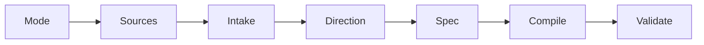

# The Skill

Seven steps from intent to deck. Ten phases of compilation.

---
transition: slide-left
---

# Seven-Step Workflow



<v-clicks>

- **Mode** — new deck or update to existing
- **Sources** — gather README, ARCHITECTURE, CHANGELOG, LESSONS_LEARNED
- **Intake** — normalize title, goal, audience, tone, target length
- **Direction** — offer 2-3 visual directions in words only
- **Spec** — write `deck.spec.md` before any slides
- **Compile** — generate slides, styles, layouts, components
- **Validate** — spec matches slides, density controlled, abstractions justified

</v-clicks>

<!-- The Skill's workflow enforces direction-before-content. Visual identity is decided at step 4, before a single slide is written at step 6.

[click] Mode — new deck or update to existing. This determines which workflow branches apply.

[click] Sources — gather README, ARCHITECTURE, CHANGELOG, LESSONS_LEARNED. The raw material the deck is built from.

[click] Intake — normalize title, goal, audience, tone, target length. Establish what the deck needs to accomplish.

[click] Direction — offer 2-3 visual directions in words only. No slides yet. This is the anti-generic mechanism.

[click] Spec — write deck.spec.md before any slides. The blueprint that prevents both generic and brittle output.

[click] Compile — generate slides, styles, layouts, components. This is where the actual presentation is built.

[click] Validate — spec matches slides, density controlled, abstractions justified. The final quality gate.

Sources:
- file:slide-maker/SKILL.md — workflow steps 1-7
- file:slide-maker/COMPILER_RULES.md — compilation phases -->

---
layout: SplitInsight
transition: wipe-right
---

# Source-of-Truth Model

::left::

### Planning Layer

<v-clicks>

- `deck.spec.md` is the blueprint
- Structure, tokens, boundaries
- Structural changes start here
- Must stay in sync with slides

</v-clicks>

::right::

### Presentation Layer

<v-clicks>

- `slides.md` is the compiled output
- Native Slidev Markdown
- `styles/`, `layouts/`, `components/`
- Implementation serves the spec

</v-clicks>

<!-- The dual-layer architecture prevents both failure modes. The spec layer prevents generic output by forcing visual direction choices before compilation. The presentation layer prevents brittle output by compiling to native Slidev Markdown. Edit the spec to change direction. Edit slides.md to change content.

Sources:
- file:slide-maker/SKILL.md — source-of-truth model
- file:slide-maker/DECK_SPEC.md — planning schema specification -->

---
transition: slide-up
---

# Ten Compilation Phases

<v-clicks>

1. **Gather sources** — read project docs, extract facts and stories
2. **Normalize spec** — resolve meta, tokens, slide and layout inventory
3. **Decide level** — escalation ladder per slide: Markdown first
4. **Write headmatter** — theme, fonts, colorSchema, transition
5. **Write slides** — clean Markdown, one idea per slide, v-clicks on lists
6. **Write tokens** — `--deck-bg`, `--deck-fg`, `--deck-accent`, `--deck-muted`
7. **Write theme** — typography, color application, v-click animations

</v-clicks>

<v-click>

8-10: **Custom layouts**, **custom components**, **prune dead code** — only when justified.

</v-click>

<!-- Phases 1-7 run on every deck. Phases 8-10 are conditional.

[click] Gather sources — read project docs, extract facts and stories. The raw material.

[click] Normalize spec — resolve meta, tokens, slide and layout inventory. Establish the planning layer.

[click] Decide level — the escalation ladder per slide. Markdown first. This is the anti-brittle mechanism.

[click] Write headmatter — theme, fonts, colorSchema, transition. The Slidev configuration block.

[click] Write slides — clean Markdown, one idea per slide, v-clicks on lists. The core compilation.

[click] Write tokens — --deck-bg, --deck-fg, --deck-accent, --deck-muted. The design system foundation.

[click] Write theme — typography, color application, v-click animations. Tokens applied to layout classes.

Sources:
- file:slide-maker/COMPILER_RULES.md — phases 1-10 specification -->

---
transition: fade
---

# The Skill Rejects These Patterns

Every item here has appeared in a generated deck at least once.

- No generic stock phrases ("Let's dive in", "In conclusion")
- No ad-hoc transitions — each type has a fixed semantic meaning
- No same layout for every content slide — vary the rhythm
- No hardcoded hex in `<style scoped>` — use `var(--deck-*)` only
- No "install command" closings — resolve the opening instead
- No blanket `.slidev-layout { background }` overrides on themed decks

<!-- Anti-patterns are the negative space of the Skill. They define what a generated deck should never look like. The most common failure: every slide uses the default layout with the same transition, producing visual monotony. The hardcoded hex rule prevents palette drift when presets change.

Sources:
- file:slide-maker/COMPILER_RULES.md — anti-patterns list -->

---
layout: section
transition: iris
---

# Narrative Architecture

Slide kinds, through-lines, and story structure.

---
transition: slide-left
---

# 14 Canonical Slide Kinds

<v-clicks>

- **cover** / **end** — opening and closing frames
- **section** — chapter breaks that create visual rhythm
- **default-content** — the workhorse explanatory slide
- **center-statement** / **fact** / **quote-pull** — single-idea emphasis
- **split-insight** / **comparison** — side-by-side reasoning
- **metrics-grid** — comparable metrics in a grid
- **image-caption** / **visual-evidence** — image with context

</v-clicks>

<v-click>

Plus **timeline**, **through-line-echo** (resurfaces the deck's thread mid-deck, max 2-3).

</v-click>

<!-- 14 canonical slide kinds, each with a default implementation level.

[click] cover / end — opening and closing frames. These bookend the argument.

[click] section — chapter breaks that create visual rhythm. Use iris transition.

[click] default-content — the workhorse explanatory slide. 80% of all slides.

[click] center-statement / fact / quote-pull — single-idea emphasis. Different weights for different rhetorical purposes.

[click] split-insight / comparison — side-by-side reasoning. When two ideas need juxtaposition.

Sources:
- file:slide-maker/SLIDE_KINDS.md — canonical kinds and escalation rules
- file:slide-maker/SLIDE_KINDS.md — density guardrails -->

---
layout: TufteSlide
transition: slide-up
---

# Through-Line Types

The through-line is the conceptual thread that holds the deck together. It must come from the source material, not be imposed on it.

Five types, each a different rhetorical shape:

- **Question** — posed early, answered repeatedly
- **Metaphor** — concrete image mapping to abstract concept
- **Concept** — technical idea connecting all sections
- **Provocation** — bold claim the deck proves
- **Design-rule** — constraint that shaped every decision

::sidenote::

<Sidenote number="1">The through-line appears in 5-6 slides, gaining new meaning each time. Cover introduces it. Sections refract it. End resolves it.</Sidenote>

<Sidenote number="2">Bookend syndrome: the through-line appears only on cover and closing. The middle forgets it exists. This is the most common failure.</Sidenote>

<!-- The through-line IS: present in 5-6 slides, gaining meaning, resolved at close. The through-line IS NOT: a tagline on cover and close only (bookend syndrome), a decorative metaphor with no analytical function, or multiple competing threads.

Sources:
- file:slide-maker/COMPILER_RULES.md — through-line types and anti-patterns
- file:slide-maker/COMPILER_RULES.md — per-slide-type through-line placement -->

---
transition: morph-fade
---

# Narrative Arc and Structural Rhythm

Every deck follows a four-part story structure:

<v-clicks>

- **Tension** — open with a problem, contradiction, or surprising fact
- **Exploration** — walk through the journey, showing real decisions
- **Insight** — present a counterintuitive finding or unexpected result
- **Resolution** — close with a memorable takeaway

</v-clicks>

<v-click>

Slides alternate in a rhythm: **section divider**, 2-3 **content slides**, then a **pause** (quote, diagram, or fact). Repeat. This prevents visual monotony.

</v-click>

<!-- Every deck follows a four-part story structure. "Decks are arguments, not outlines."

[click] Tension — open with a problem, contradiction, or surprising fact. Never an agenda slide. Provocative openings only.

[click] Exploration — walk through the journey, showing real decisions. This is where war stories and evidence live.

[click] Insight — present a counterintuitive finding or unexpected result. The "aha" moment the deck builds toward.

[click] Resolution — close with a memorable takeaway. Never "Questions?" or "Thank you." Circle back to the opening tension and resolve it.

Sources:
- file:slide-maker/COMPILER_RULES.md — narrative arc: tension, exploration, insight, resolution
- file:docs/PRESENTATION_PHILOSOPHY.md — dialectical progression, provocative openings, resonant closings -->

---
transition: slide-left
---

# War Stories and Source Citations

Every deck of 10+ slides needs at least one **war story** — a specific moment where something broke or a false trail was followed.

<v-clicks>

- War stories are concrete, not abstract: "The cache was 2.3 GB" beats "We encountered challenges"
- Every war story cites specific evidence: file path, commit, screenshot
- Every content slide with facts needs a `Sources:` block in presenter notes

</v-clicks>

<v-click>

```html
<!-- Presenter notes here...

Sources:
- https://github.com/user/project/blob/main/README.md — overview
- file:LESSONS_LEARNED.md — the production incident
-->
```

</v-click>

<!-- Source citations ensure no slide makes an unsourced claim. The format: each entry starts with `- ` followed by a URL or `file:` path, then ` — ` and a brief annotation. Exempt: cover (unless it makes a factual claim), section dividers, end slides, and self-quoting quote layouts.

Sources:
- file:slide-maker/COMPILER_RULES.md — source citation format and rules
- file:slide-maker/COMPILER_RULES.md — war story requirements -->

---
layout: section
transition: iris
---

# Quality Gates

Density guardrails, the acceptance checklist, and the priority stack.

---
transition: slide-left
---

# Hard Limits Prevent Overflow

- **7 bullets maximum** per slide — split if exceeded
- **8 code lines maximum** per code block — truncate or split
- **60 characters maximum** per bullet — rewrite if exceeded
- **One idea per slide** — if you need to scroll, split it
- **3-5 bullets is normal** — one strong stat beats six weak ones

If the slide needs tiny text, the slide needs redesigning.

<!-- Density guardrails prevent the most common slide failure: cramming too much onto one screen. These are hard limits, not suggestions. The overflow guard runs during phase 5 (write slides) and again during validation. Mermaid diagrams have their own limits: 8 nodes for flowcharts, 12 for mindmaps, 6 for timelines.

Sources:
- file:slide-maker/SLIDE_KINDS.md — density guardrails
- file:slide-maker/COMPILER_RULES.md — overflow guard limits -->

---
transition: fade
---

# A Deck Passes When All of These Hold

The acceptance checklist:

<v-clicks>

- No generic stock phrases, no ad-hoc transitions
- At least 3 different layout types used
- Bullet lists use `<v-clicks>` for progressive reveal
- At least 1 `v-motion` element, 1 hover-interactive element
- Mermaid nodes: light fills get dark text, dark fills get light text
- No slide overflows (7 bullets, 8 code lines, 60 char bullets)
- Closing echoes or resolves the opening

</v-clicks>

<!-- The acceptance checklist has 30+ items. These seven are the most commonly failed.

[click] No generic stock phrases, no ad-hoc transitions — the most basic quality gate.

[click] At least 3 different layout types used — prevents visual monotony.

[click] Bullet lists use v-clicks for progressive reveal — pacing the audience.

[click] At least 1 v-motion element, 1 hover-interactive element — minimum interactivity.

[click] Mermaid nodes: light fills get dark text, dark fills get light text — readability in diagrams.

[click] No slide overflows (7 bullets, 8 code lines, 60 char bullets) — density guardrails.

[click] Closing echoes or resolves the opening — narrative coherence. The full checklist adds project-specific requirements: through-line in 3+ slides, 2+ source materials digested, project colors override preset palette.

Sources:
- file:slide-maker/COMPILER_RULES.md — acceptance checklist (full list) -->
