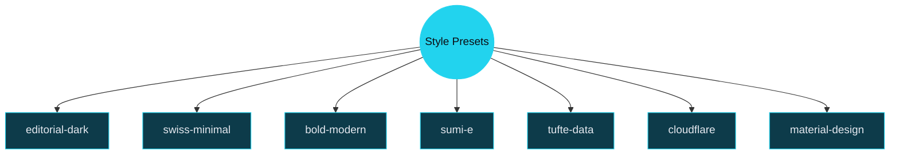

# Slide Maker Reference

Every feature. One deck.

<!-- This reference deck documents and demonstrates every Slidev feature and Slide Maker extension. Each slide names the feature it exemplifies and uses it in practice. The deck serves as both documentation and a test fixture for iterating on the Skill.

Sources:
- file:slide-maker/COMPILER_RULES.md — feature inventory and acceptance criteria
- file:slide-maker/STYLE_PRESETS.md — visual direction system -->

---
layout: statement
transition: fade
---

# This deck exists to be broken, fixed, and improved

It is the test fixture for the Slide Maker skill and the reference for what Slidev can do.

<!-- The statement layout centers text with maximum visual weight. Use it for provocative or framing statements — never for content with bullet points. This is a good layout for opening tension or closing resolution.

Sources:
- file:slide-maker/SLIDE_KINDS.md — statement/center-statement kind definition -->

---
layout: section
transition: iris
---

# Layouts

Seven built-in. Two custom. Each with a distinct purpose.

<!-- Section dividers use the iris transition (circular clip-path reveal) to signal a new chapter. The section layout provides a heading and optional subtitle — no body content, no bullets. -->

---
transition: slide-left
---

# Default Content Layout

The workhorse. Heading, body text, and bullet points.

<v-clicks>

- **Bold text** signals emphasis — maps to `var(--deck-accent)`
- `Inline code` uses the mono font with accent-alt background
- *Italic text* for softer emphasis or terminology
- Numbered lists use accent-colored markers
- Bullet depth stays shallow — two levels maximum

</v-clicks>

<!-- The default layout is the most common. It supports headings, paragraphs, bullet lists, numbered lists, bold, italic, inline code, and links. v-clicks wraps the list for progressive reveal. The escalation ladder says: start here, only reach for a custom layout when default cannot express the structure.

Sources:
- file:slide-maker/COMPILER_RULES.md — escalation ladder: Markdown first
- file:slide-maker/SLIDE_KINDS.md — default-content kind -->

---
layout: SplitInsight
transition: wipe-right
---

# SplitInsight Layout

::left::

### Left Column

<v-clicks>

- Custom layout with named slots
- `::left::` and `::right::` markers
- Border divider between columns
- Header spans full width above

</v-clicks>

::right::

### Right Column

<v-clicks>

- Use for comparisons
- Before/after contrasts
- Input/output pairs
- Parallel concepts

</v-clicks>

<!-- SplitInsight is a custom layout defined in layouts/SplitInsight.vue. It uses Vue named slots: the default slot renders the header, ::left:: and ::right:: populate the two columns. A vertical border divides the columns. Use it when two ideas need side-by-side presentation.

Sources:
- file:slide-maker/COMPILER_RULES.md — custom layout justification rules -->

---
layout: TufteSlide
transition: slide-up
---

# TufteSlide Layout

The Tufte layout splits content into a 60% body column and a 30% sidenote margin. This mirrors Edward Tufte's page design: primary narrative flows in the wide column while supporting details live in the margin.

The layout is ideal for data-heavy slides where context matters as much as the headline.

::sidenote::

<Sidenote number="1">Sidenotes use the Sidenote component with a number prop. They render in the margin area defined by the TufteSlide layout.</Sidenote>

<Sidenote number="2">The margin column uses a smaller font size and muted color. It never competes with the body — it supports it.</Sidenote>

<!-- TufteSlide is a custom layout in layouts/TufteSlide.vue. It uses a CSS grid with 60%/30% columns and 6% gap. The ::sidenote:: slot maps to the margin area. The Sidenote component adds a numbered superscript. Use this for information-dense slides where annotation adds value.

Sources:
- file:slide-maker/STYLE_PRESETS.md — tufte-data preset layout tendencies
- file:slide-maker/COMPILER_RULES.md — data visualization component catalog -->

---
layout: center
transition: morph-fade
---

# The center layout is for a single idea, stated boldly

No bullets. No lists. Just the point.

<!-- The center layout constrains h1 to max-width 70% and centers it. Optional body text below. Use it for thesis statements, turning points, or aphorisms. morph-fade (scale + opacity + blur) signals a conceptual shift.

Sources:
- file:slide-maker/SLIDE_KINDS.md — center-statement kind definition -->

---
layout: fact
transition: zoom-in
---

# <v-mark at="1" color="#22d3ee" type="circle">13</v-mark>

custom transitions

Built with pure CSS. No animation libraries. Each with a semantic meaning.

<!-- The fact layout makes h1 enormous (7rem) for a single stat or number. The v-mark with type="circle" draws an animated circle around the number on click. zoom-in transition focuses attention. The subtitle text goes below in muted color.

Sources:
- file:slide-maker/COMPILER_RULES.md — fact layout styling
- file:slide-maker/COMPILER_RULES.md — transition grammar -->

---
layout: quote
transition: fade
---

# "Restraint is the feature"

A good deck has few layouts, few components, readable Markdown, and no legacy HTML smell.

<!-- The quote layout styles h1 as a pull-quote. Use it for direct quotes, design principles, or memorable phrasing. fade transitions pair naturally with reflective content.

Sources:
- file:slide-maker/COMPILER_RULES.md — restraint as priority -->

---
layout: two-cols
transition: glide
---

# Built-in Two Columns

::left::

The `two-cols` layout is a Slidev built-in. It splits the slide into two columns using `::left::` and `::right::` slot syntax.

Unlike SplitInsight, it has no header span and no border divider.

::right::

Use the built-in when:

<v-clicks>

- No visual separator is needed
- Content is loosely related
- A spanning header is unnecessary

</v-clicks>

<!-- two-cols is a Slidev built-in layout, not a custom one. The escalation ladder says: prefer built-in layouts before reaching for custom ones. SplitInsight exists because two-cols lacks a shared header and visual divider.

Sources:
- file:slide-maker/COMPILER_RULES.md — escalation ladder: built-in before custom -->

---
layout: section
transition: iris
---

# Interactivity

Progressive reveals, annotations, and motion.

---
transition: slide-left
---

# v-clicks: Progressive Reveal

Wrap a list in `<v-clicks>` to reveal items one at a time on click.

<v-clicks>

- First item appears on first click
- Second item on second click
- Third item on third click
- The audience focuses on each point before seeing the next
- Aim for fewer than 40% of slides using v-clicks

</v-clicks>

<!-- v-clicks is the primary interactivity mechanism. It wraps any list to make each item appear sequentially. The acceptance checklist requires bullet lists to use v-clicks for progressive reveal. But restraint matters — not every list needs it.

Sources:
- file:slide-maker/COMPILER_RULES.md — v-click usage rules and 40% budget -->

---
transition: wipe-up
---

# v-mark: Five Annotation Types

Each type draws attention differently.

<v-clicks>

- <v-mark type="highlight" color="rgba(34, 211, 238, 0.2)">Highlight</v-mark> — soft background wash for key phrases
- <v-mark type="underline" color="#22d3ee">Underline</v-mark> — emphasis without obscuring text
- <v-mark type="strike" color="#f472b6">Strikethrough</v-mark> — for ideas being rejected or superseded
- <v-mark type="box" color="#22d3ee">Box</v-mark> — border around a term for definition or focus
- <v-mark at="6" type="circle" color="#f472b6">Circle</v-mark> — draws a hand-drawn circle, best on numbers

</v-clicks>

<!-- v-mark renders Rough Notation annotations over text. Five types: highlight, underline, strike, box, circle. The color prop accepts any CSS color value. The at="N" prop delays the annotation until click N. strike is for rejected options, highlight for key terms, circle for stats.

Sources:
- file:slide-maker/COMPILER_RULES.md — v-mark variants with semantic meanings -->

---
transition: slide-up
---

# v-click with Targeted Timing

Individual elements can appear at specific click numbers.

Step 1 is visible immediately.

<v-click at="1">

Step 2 appears on the first click.

</v-click>

<v-click at="2">

Step 3 appears on the second click.

</v-click>

<v-click at="3">

The `at` prop controls which click triggers each element. This enables non-linear reveal sequences — later DOM elements can appear before earlier ones.

</v-click>

<!-- v-click wraps a single element for click-gated reveal. The at="N" prop specifies which click number triggers it. Unlike v-clicks (which auto-increments), v-click gives explicit control over reveal order.

Sources:
- file:slide-maker/COMPILER_RULES.md — v-click timing and reveal patterns -->

---
transition: blur
---

# v-motion: Animated Entrance

<div v-motion
  :initial="{ opacity: 0, y: -40 }"
  :enter="{ opacity: 1, y: 0, transition: { delay: 300, duration: 800 } }">

This entire block slides down and fades in after a 300ms delay.

</div>

<div v-motion
  :initial="{ opacity: 0, x: -60 }"
  :enter="{ opacity: 1, x: 0, transition: { delay: 600, duration: 600 } }">

This block slides in from the left after 600ms.

</div>

<div v-motion
  :initial="{ opacity: 0, scale: 0.8 }"
  :enter="{ opacity: 1, scale: 1, transition: { delay: 900, duration: 500 } }">

This block scales up from 80% after 900ms. Reserve v-motion for 3-4 dramatic entrances per deck.

</div>

<!-- v-motion uses @vueuse/motion for physics-based element animations. Properties: opacity, x, y, scale, rotate. The :initial state is where the element starts, :enter is where it ends up. Each can have independent delay and duration.

Sources:
- file:slide-maker/COMPILER_RULES.md — v-motion budget: 3-4 per deck max -->

---
layout: section
transition: flip-x
---

# Code

Syntax highlighting, line ranges, and Magic Move.

---
transition: slide-left
---

# Line Highlighting

Step through code with `{ranges}` syntax.

```ts {1-3|5-8|all}
// Token system: CSS custom properties
const tokens = {
  bg: '--deck-bg',

  fg: '--deck-fg',
  accent: '--deck-accent',
  muted: '--deck-muted',
  fontDisplay: '--deck-font-display',
}
```

Click advances through: lines 1-3, then 5-8, then all. The `|` separator defines each step.

<!-- Code blocks accept a {ranges} option after the language identifier. Ranges like {1-3|5-8|all} create click-stepped highlighting. Use this for walking through algorithms, configs, or APIs. Keep code blocks to 8 lines or fewer.

Sources:
- file:slide-maker/COMPILER_RULES.md — code overflow guard: 8 lines max -->

---
transition: swing
---

# Magic Move: Code Evolution

Four backticks and `magic-move` animate between code states.

````md magic-move
```ts
// Step 1: A simple function
function greet(name: string) {
  return `Hello, ${name}`
}
```
```ts
// Step 2: Add validation
function greet(name: string) {
  if (!name.trim()) throw new Error('Name required')
  return `Hello, ${name}`
}
```
```ts
// Step 3: Add formatting
function greet(name: string, formal = false) {
  if (!name.trim()) throw new Error('Name required')
  const title = formal ? 'Dear' : 'Hello'
  return `${title}, ${name}`
}
```
````

<!-- Magic Move animates code transformations between fenced blocks. Use four backticks with `md magic-move` to wrap multiple triple-backtick code blocks. Each block is one step — Slidev morphs matching tokens between steps. Reserved for code transformations only.

Sources:
- file:slide-maker/COMPILER_RULES.md — Magic Move: code transformations only -->

---
layout: section
transition: cube
---

# Diagrams

Mermaid graphs with explicit styling.

---
transition: zoom-out
---

# Mermaid: Left-to-Right Flow


The escalation ladder: start at Markdown, escalate only when the lower level cannot express the structure.

<!-- Mermaid diagrams require explicit color values on every node using classDef. Never rely on Mermaid's default theme colors. Use the deck's token colors as the source for classDef values. Light fills get dark text, dark fills get light text.

Sources:
- file:slide-maker/COMPILER_RULES.md — Mermaid guidelines: explicit colors, no defaults -->

---
transition: flip-y
---

# Mermaid: Top-Down Tree



Seven presets, each controlling typography, color, motion, and layout tendencies.

<!-- Graph TD (top-down) works well for hierarchies and taxonomies. The double-parenthesis syntax creates a circle node. Square brackets create rectangles. Every node must have an explicit classDef.

Sources:
- file:slide-maker/STYLE_PRESETS.md — seven preset definitions -->

---
layout: section
transition: iris
---

# Data Visualization

Word-sized charts. Inline with prose. No charting library.

---
transition: slide-left
---

# Sparklines and Small Multiples

<div v-motion :initial="{ opacity: 0, x: -30 }" :enter="{ opacity: 1, x: 0, transition: { delay: 200, duration: 600 } }">

<SmallMultiples :cols="4">
<div>
  <Sparkline :data="[10, 15, 12, 18, 22, 19, 25]" :width="90" :height="20" color="#22d3ee" />
  <div><strong>Rising</strong></div>
</div>
<div>
  <Sparkline :data="[25, 22, 18, 15, 12, 10, 8]" :width="90" :height="20" color="#f472b6" />
  <div><strong>Falling</strong></div>
</div>
<div>
  <Sparkline :data="[15, 18, 14, 19, 13, 17, 16]" :width="90" :height="20" color="#22d3ee" />
  <div><strong>Volatile</strong></div>
</div>
<div>
  <Sparkline :data="[15, 15, 16, 15, 15, 16, 15]" :width="90" :height="20" color="#22d3ee" />
  <div><strong>Stable</strong></div>
</div>
</SmallMultiples>

</div>

Sparkline renders an inline SVG polyline. SmallMultiples arranges children in a CSS grid.

<!-- Sparkline accepts data (array of numbers), width, height, and color props. SmallMultiples accepts a cols prop for grid column count. Both use currentColor by default, overridable with explicit color values.

Sources:
- file:slide-maker/COMPILER_RULES.md — data visualization component catalog -->

---
transition: slide-up
---

# MicroBar, BulletBar, and SlopeChart

<div style="display: grid; grid-template-columns: 1fr 1fr; gap: 2rem; margin-top: 1rem;">

<div>

**MicroBar** — categorical comparison

<MicroBar :data="[{label: 'Build', value: 42}, {label: 'Test', value: 78}, {label: 'Deploy', value: 15}]" color="#22d3ee" />

</div>

<div>

**BulletBar** — actual vs target

<BulletBar :value="73" :target="90" :max="100" label="Coverage" />

</div>

</div>

<div style="margin-top: 2rem;">

**SlopeChart** — before and after

<SlopeChart :items="[{label: 'Build', start: 120, end: 45}, {label: 'Test', start: 90, end: 30}, {label: 'Deploy', start: 60, end: 15}]" startLabel="Before" endLabel="After" />

</div>

<!-- MicroBar takes data as [{label, value}]. BulletBar shows actual vs target with a marker line. SlopeChart shows before/after changes with connecting lines. All use currentColor by default.

Sources:
- file:slide-maker/components/MicroBar.vue — horizontal bar component
- file:slide-maker/components/BulletBar.vue — bullet graph component
- file:slide-maker/components/SlopeChart.vue — slope chart component -->

---
transition: glide
---

# WinLoss, DotStrip, and DataTable

<div style="display: grid; grid-template-columns: 1fr 1fr; gap: 2rem; margin-top: 1rem;">

<div>

**WinLoss** — binary outcomes

<WinLoss :data="[1, 1, -1, 1, 0, -1, 1, 1, 1, -1, 1, 1]" />

Pass/fail sequences at a glance.

</div>

<div>

**DotStrip** — distribution

<DotStrip :data="[12, 15, 18, 22, 25, 28, 35, 42, 48]" />

Shows spread and clustering.

</div>

</div>

<div style="margin-top: 1.5rem;">

**DataTable** — minimal table

<DataTable :headers="['Feature', 'Type', 'Status']" :rows="[['v-clicks', 'Directive', 'Built-in'], ['v-mark', 'Directive', 'Built-in'], ['Sparkline', 'Component', 'Custom'], ['TufteSlide', 'Layout', 'Custom']]" />

</div>

<!-- WinLoss renders positive values up, negative down, zero as a thin line. DotStrip plots values as dots on a horizontal axis. DataTable renders a minimal table with bottom borders only — no vertical lines, no zebra striping.

Sources:
- file:slide-maker/components/WinLoss.vue — binary outcome visualization
- file:slide-maker/components/DotStrip.vue — dot plot component
- file:slide-maker/components/DataTable.vue — minimal table component -->

---
layout: section
transition: iris
---

# Transitions and Effects

13 cinematic transitions. 6 hover patterns. Scoped CSS.

---
transition: morph-fade
---

# Transition Catalog

Each transition carries a semantic meaning in the grammar.

<v-clicks>

- **fade** — reflection, pause, denouement
- **slide-left** — progression, forward momentum
- **slide-up** — reveal, elevation
- **iris** — new chapter, section entry
- **morph-fade** — conceptual shift
- **wipe-right** / **wipe-up** — comparison, before/after
- **zoom-in** / **zoom-out** — focus or defocus

</v-clicks>

<v-click>

Plus **flip-x**, **flip-y**, **cube**, **swing**, **blur**, and **glide** for 3D, filter, and motion effects.

</v-click>

<!-- The transition grammar assigns semantic meaning to each transition. This is not cosmetic — it is a language. fade for reflection, iris for new chapters, wipe-right for comparison. The default transition in frontmatter should be the most common one in the deck.

Sources:
- file:slide-maker/COMPILER_RULES.md — transition grammar with semantic meanings -->

---
transition: slide-left
---

# Hover Interactions

Six reusable CSS patterns from `interactions.css`.

<div class="spotlight-group" style="display: grid; grid-template-columns: repeat(3, 1fr); gap: 1.5rem; margin-top: 1.5rem;">

<div class="hover-lift" style="padding: 1.5rem; border: 1px solid var(--deck-accent); border-radius: 8px; text-align: center;">

**hover-lift**

translateY(-4px) + shadow

</div>

<div class="hover-scale" style="padding: 1.5rem; border: 1px solid var(--deck-accent); border-radius: 8px; text-align: center;">

**hover-scale**

scale(1.03)

</div>

<div class="hover-glow" style="padding: 1.5rem; border: 1px solid var(--deck-accent); border-radius: 8px; text-align: center;">

**hover-glow**

accent shadow

</div>

</div>

The parent `spotlight-group` dims all siblings when hovering any one card.

<!-- Six interaction patterns in interactions.css: hover-lift, spotlight-group, hover-scale, hover-accent, hover-glow, hover-dim. The spotlight-group class on the parent container dims all children except the one being hovered. CSS-only, no JavaScript.

Sources:
- file:slide-maker/styles/interactions.css — hover pattern definitions -->

---
transition: wipe-right
---

# Scoped Styles and Tokens

The `<style>` block adds per-slide CSS. All values reference `--deck-*` tokens.

```css
:root {
  --deck-bg: #0c0e14;
  --deck-fg: #e4e8ef;
  --deck-accent: #22d3ee;
  --deck-accent-alt: #f472b6;
  --deck-muted: rgba(228, 232, 239, 0.5);
}
```

<v-click>

`tokens.css` declares. `theme.css` applies. Components read. Never hardcode hex values in scoped styles.

</v-click>

<!-- The token system is the bridge between presets and slides. tokens.css contains only :root declarations. theme.css maps tokens to .slidev-layout classes. Scoped styles must use var(--deck-*) references, never raw hex or rgb values. deck-lint.mjs flags hardcoded colors.

Sources:
- file:slide-maker/COMPILER_RULES.md — token specification and scoped style rules -->

---
layout: end
transition: fade
---

# The reference is the test

<!-- The closing resolves the opening. "Every feature. One deck." — this deck doesn't just document features, it exercises them. Every layout, transition, directive, and component appears at least once. When the Skill changes, this deck is where you see whether it still works. -->
