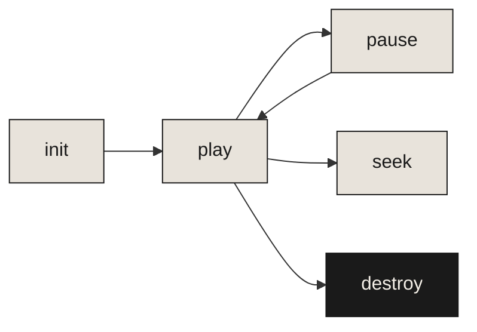

# The Garden

What grows when you plant a single `<canvas>` element?

github.com/adewale/garten

<!-- Garten is a zero-dependency canvas garden library. This deck presents it through the sumi-e lens: constraint as creative force. The question isn't what the library does — it's what emerges when you remove everything unnecessary. -->

---
layout: ZenSlide
---

# One element. Zero dependencies. 147 species.

Pure Canvas API. No framework. No build step. Just `<script>` and go.

<!-- The constraint stack: one DOM element (canvas), zero npm dependencies, no build tool required. These aren't limitations — they're the design. Every feature must justify itself against the cost of complexity. -->

---
layout: center
transition: fade
---

# Constraints breed creativity

<BrushDivider width="40%" :opacity="0.2" />

When you remove everything unnecessary, what remains is essential.

<!-- This is the thesis. The entire library exists to prove that constraint produces richer output than freedom. The canvas API is "limited" — no DOM nodes, no CSS, no SVG — and that limitation forces algorithmic solutions that produce organic, unpredictable beauty. -->

---
transition: fade
---

# One line to start a garden

```js
const garden = new Garden(canvas, {
  preset: 'meadow',
  density: 0.7,
  seed: 42,  // deterministic — same seed, same garden
});
garden.play();
```

<BrushDivider width="25%" :opacity="0.12" />

The entire API surface fits in a single constructor call. The `seed` parameter is the hidden power — deterministic rendering means reproducible gardens, testable screenshots, and visual regression without flakiness.

<!-- The API is deliberately small. One constructor, one play call. The seed parameter deserves emphasis — it makes something inherently organic (a growing garden) into something reproducible. This tension between organic growth and deterministic control is the library's core insight. -->

---
layout: ZenSlide
transition: fade
---

# What grows

<v-clicks>

- Flowers, trees, grasses, tropicals, cacti, bamboo, cherry blossoms
- Plants grow in waves called **generations** — each wave responds to the previous
- 12 presets (forest, meadow, tropical, zen, ambient) and 11 color themes
- Deterministic seeding for reproducible gardens
- Respects `prefers-reduced-motion` — accessibility without an opt-in

</v-clicks>

<!-- 147 plant types across 19 categories. The generation system is key — plants don't appear randomly. Each wave "sees" what's already growing and fills gaps, creating natural-looking distribution from pure math. The prefers-reduced-motion support isn't just nice — it's essential for a library whose entire purpose is animation. -->

---
transition: fade
---

# The lifecycle



Notice: `seek(t)` lets you jump to any growth stage without replaying the animation — the deterministic seed means the garden at time `t` is always the same, so seek is a lookup, not a simulation.

<!-- The lifecycle diagram looks simple but hides an insight: seek() is O(1), not O(n). Because every frame is deterministic, you can compute the garden state at any timestamp directly. This is what makes the library usable for static screenshots, loading states, and scroll-driven reveals — you don't need to run the animation to get the result at time t. -->

---
layout: ZenSlide
transition: fade
---

# What happened without constraints

The first version had 12 dependencies. Canvas rendering, easing curves, color interpolation, noise generation — all imported.

The garden looked the same. The bundle was 340KB. And every major browser update broke something in the dependency chain.

<BrushDivider width="30%" :opacity="0.15" />

Zero dependencies wasn't a goal. It was a lesson.

<!-- This is the war story. The original prototype used simplex-noise for organic distribution, chroma-js for color, bezier-easing for growth curves. It worked. Then Node 18 broke simplex-noise's ESM export. Then chroma-js shipped a breaking change to its alpha handling. The garden kept breaking — not because of garden bugs, but because of dependency bugs. Rewriting everything in vanilla Canvas API took two weeks but eliminated an entire category of failure. -->

---
layout: center
transition: fade
---

<div v-motion :initial="{ opacity: 0, y: 40 }" :enter="{ opacity: 1, y: 0, transition: { duration: 1200 } }">

# Emergence

</div>

<div v-motion :initial="{ opacity: 0 }" :enter="{ opacity: 1, transition: { delay: 800, duration: 1000 } }">

A canvas garden teaches you that complex beauty arises from simple rules applied patiently.

</div>

<!-- Emergence is the reward for constraint. The 147 plant types are all variations on a few primitive drawing operations — arcs, bezier curves, filled paths. The complexity you see is combinatorial, not architectural. This is the lesson that extends beyond the library: the richest systems are often the ones with the fewest primitives and the most patience. -->

---
layout: fact
transition: fade
---

# 147

Plant types

From simple flowers to cherry blossoms, bamboo, and conifers. 4KB gzipped. Pure Canvas API.

<!-- The number is the proof. 147 plant types, 19 categories, under 4KB gzipped. This isn't minimalism as aesthetic preference — it's minimalism as engineering discipline. Every byte justified. Every plant type earned its place by being visually distinct enough to warrant inclusion. -->

---
layout: end
transition: fade
---

<EnsoCircle :size="280" :opacity="0.06" :strokeWidth="2" />

Everything you need was already there.

<!-- The enso circle — a single brushstroke that contains everything. The closing resolves the opening question: what grows from a single canvas element? Everything. The constraint was never a limitation. It was the entire point. -->
