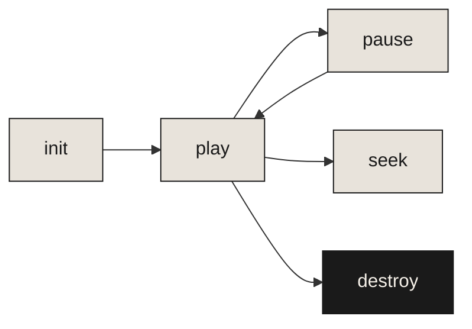

# The Garden

---
layout: ZenSlide
---

# 147 plant species. Zero dependencies.

Pure Canvas API. No framework. No build step. Just `<script>` and go.

---
layout: center
transition: fade
---

# Constraints breed creativity

<BrushDivider width="40%" :opacity="0.2" />

When you remove everything unnecessary, what remains is essential.

---
layout: ZenSlide
transition: fade
---

# What grows

<v-clicks>

- Flowers, trees, grasses, tropicals, cacti, bamboo
- Plants grow in waves called **generations**
- Deterministic seeding for reproducible gardens
- Respects `prefers-reduced-motion`

</v-clicks>

---
transition: fade
---

# The flow

Full programmatic control over the garden lifecycle.

---
layout: center
transition: fade
---

# Emergence

A canvas garden teaches you that complex beauty arises from simple rules applied patiently.

---
layout: ZenSlide
transition: fade
---

# The simple solution

"We spent significant time implementing LibRaw integration when embedded preview extraction would have been faster, simpler, and often higher quality."

<BrushDivider width="30%" :opacity="0.15" />

Sometimes the right answer is the one you skip over because it seems too easy.

---
layout: center
transition: fade
---

# <v-mark v-click type="underline" color="#c23b22">Simplicity</v-mark>

---
layout: fact
transition: fade
---

# 147

Plant types

From simple flowers to cherry blossoms, bamboo, and conifers

---
layout: end
transition: fade
---

<EnsoCircle :size="280" :opacity="0.06" :strokeWidth="2" />
