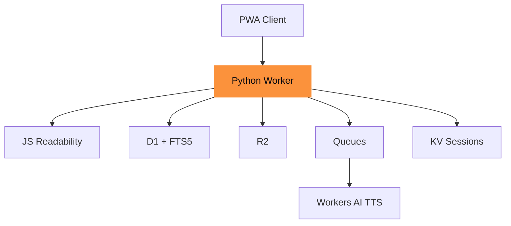

# Tasche

A read-later service where your articles survive.

[github.com/adewale/tasche](https://github.com/adewale/tasche)

<!-- Tasche is German for "pocket" -- a self-hosted read-it-later service built entirely on Cloudflare Python Workers. The through-line is "your articles survive": every architectural decision exists to ensure saved articles outlast the platform they run on. D1 exports as SQLite, R2 speaks S3, images are converted to WebP, content is stored in dual format. The survival guarantee is structural, not aspirational.

Sources:
- https://github.com/adewale/tasche/blob/main/README.md -- project overview and feature list
- https://github.com/adewale/tasche/blob/main/specs/tasche-spec.md -- section 1.1: core promise "Your Articles Survive" -->

---
layout: statement
transition: fade
---

# Read-later services own your data

When a service stores your articles on their servers, your library exists at their discretion. When they shut down, pivot, or get acquired, your reading list is collateral.

<v-click>

**What happens when they disappear?**

</v-click>

<!-- The ownership problem is structural. Pocket was acquired by Mozilla, Instapaper was sold twice, Omnivore shut down and open-sourced its code. Each transition puts user libraries at risk. Tasche's answer is self-hosting: you deploy your own instance, your data lives in your own Cloudflare account, and every stored format is portable. The v-click punchline reframes the problem from "you need an alternative" to "what survives?"

Sources:
- https://github.com/adewale/tasche/blob/main/specs/tasche-spec.md -- section 1.1: "Your Articles Survive" core promise and rationale for self-hosting -->

---
transition: slide-left
---

# The archive promise

When you save a URL, Tasche creates a complete, self-contained archive. Your articles survive because every artifact is stored independently:

<v-clicks>

- **Clean HTML** with localized image paths in R2
- **Markdown** for search indexing and reader mode
- **All images** downloaded and converted to WebP
- **Three deduplicated URLs** -- original, final, canonical
- **Full-page screenshot** as archival fallback
- **TTS audio** generated on demand via Workers AI

</v-clicks>

<!-- The dual-format storage philosophy is key: HTML preserves the author's intent (formatting, images, layout), while Markdown is ideal for FTS5 search, AI processing, and the clean reader view. Images are downloaded at save time because they disappear faster than text -- CDN expiry, hotlink protection, domain death. The three-URL deduplication catches the same article saved via Twitter t.co links, newsletter tracking URLs, and direct shares. WebP conversion saves roughly 30% storage versus original formats.

Sources:
- https://github.com/adewale/tasche/blob/main/specs/tasche-spec.md -- section 1.2: "What Gets Archived" table with all asset types
- https://github.com/adewale/tasche/blob/main/specs/tasche-spec.md -- section 1.7: content storage philosophy (dual format rationale) -->

---
transition: slide-up
---

# The FFI boundary

````md magic-move
```python
await r2.put(key, audio_bytes)
# TypeError: not 'ArrayBuffer'
```
```python
await r2.put(key, to_js(audio_bytes))
# Uint8Array -- R2 accepts it
```
````

The FFI boundary is bidirectional: JS-to-Python reads and Python-to-JS writes both need explicit conversion.

<!-- This was discovered across three separate production bugs. Python `bytes` cross the Pyodide FFI as an opaque PyProxy that R2 rejects. Python `None` becomes JS `undefined` (not `null`), which D1 rejects. Python `dict` becomes a Map, which Queue `.send()` rejects. The fix is a centralized boundary layer in `wrappers.py` with Safe* wrapper classes (SafeD1, SafeR2, SafeKV, SafeQueue, SafeAI) that handle both read and write conversions. Unit tests cannot catch these failures because mocks accept any Python type -- only a live smoke test on the real Cloudflare runtime reveals them.

Sources:
- https://github.com/adewale/tasche/blob/main/LESSONS_LEARNED.md -- lesson 29: Python bytes cannot cross FFI boundary to R2
- https://github.com/adewale/tasche/blob/main/LESSONS_LEARNED.md -- lesson 30: FFI boundary is bidirectional (read and write) -->

---
layout: section
transition: iris
---

# Your articles survive

Every format portable. Every artifact stored independently. The archive outlasts the platform.

---
transition: slide-left
---

# Anatomy of a saved article

A 14-step pipeline runs asynchronously via Queues for each saved URL:

<v-clicks>

- **Fetch and resolve** -- follow redirects, capture final URL
- **Extract** -- JS Worker runs Mozilla Readability via Service Binding
- **Download images** -- convert to WebP, enforce size limits
- **Store dual format** -- clean HTML and Markdown to R2
- **Index** -- FTS5 full-text search across title, excerpt, content
- **Deduplicate** -- check original, final, and canonical URLs

</v-clicks>

The Readability extraction runs in a separate JS Worker because `python-readability` calls `js.eval()`, which V8 isolates block.

<!-- The Service Binding pattern solves a fundamental constraint: every Python content extraction library with high-quality output (Trafilatura F1=0.958, Newspaper4k F1=0.949, Goose3 F1=0.896) requires lxml, a C extension unavailable in Pyodide/WebAssembly. Rather than use a lower-quality pure-Python alternative, Tasche deploys a separate JavaScript Worker that bundles @mozilla/readability and linkedom. The Python Worker calls it via Service Binding RPC, which is in-process communication at 1-5ms latency, not a network call. BeautifulSoup is the fallback if the JS Worker is unavailable.

Sources:
- https://github.com/adewale/tasche/blob/main/LESSONS_LEARNED.md -- lesson 32: python-readability cannot run in Workers, Service Binding solution
- https://github.com/adewale/tasche/blob/main/LESSONS_LEARNED.md -- lesson 33: nearly every Python extraction library requires lxml
- https://github.com/adewale/tasche/blob/main/specs/tasche-spec.md -- section 1.2: what gets archived -->

---
layout: two-cols-header
transition: wipe-right
---

# Implement, then audit

::left::

### 9 phases

<v-clicks>

- Foundation, FFI wrappers, and auth
- Article CRUD and URL validation
- 14-step processing pipeline
- FTS5 search, tags, and TTS
- Preact PWA frontend
- Observability and edge hardening

</v-clicks>

::right::

### Audit results

<v-clicks>

- **17** audit iterations total
- **909** tests (877 unit + 32 integration)
- Phases 8-9 passed on first attempt
- **17** edge cases hardened in phase 9
- Fix-to-feature ratio: **1:2.1**

</v-clicks>

<!-- Each phase was implemented by one sub-agent and audited by a separate sub-agent. If the audit failed, fixes were applied and the audit re-run. The cleanest phase was Observability (wide events middleware) -- it passed on first review because the pattern is self-contained with clear inputs and outputs. The messiest was the Frontend PWA: 4 HIGH and 7 MEDIUM issues including XSS via javascript: URLs in the markdown renderer, a bookmarklet that used location.origin (wrong context), and missing PWA icons. The article processing pipeline (processing.py and routes.py) was the perpetual hotspot with 41 combined modifications across all commits.

Sources:
- https://github.com/adewale/tasche/blob/main/LESSONS_LEARNED.md -- Implement-Audit Loop Summary: all 9 phase summaries
- https://github.com/adewale/tasche/blob/main/LESSONS_LEARNED.md -- Final Stats: 909 tests, 17 iterations -->

---
transition: slide-up
---

# The bookmarklet pivot

The bookmarklet used cross-origin `fetch()` with `credentials: 'include'`. With `SameSite=Lax` cookies, the browser silently drops the session cookie. Every save from a bookmarklet failed with no error.

<v-clicks>

- **First instinct**: open CORS to `.*`
- **Correct fix**: `window.open()` popup with a dedicated `/bookmarklet` page
- Same-origin request, shows "Saved!", auto-closes
- Browser extension deleted -- zero maintenance burden

</v-clicks>

The lesson: fix the integration pattern, not the security policy.

<!-- The initial fix was weakening CORS to accept all origins -- addressing the symptom, not the cause. The spec already described bookmarklets using window.open(), but the implementation used fetch() for a perceived smoother UX. The popup approach is simpler (a standalone 2KB HTML page), more resilient (immune to CSP and cookie issues), and updatable server-side. The browser extension directory was deleted entirely because it had the same cross-origin problem and added maintenance burden with no advantage over the popup. This pattern applies broadly: dedicated lightweight pages beat loading the full SPA for transient interactions.

Sources:
- https://github.com/adewale/tasche/blob/main/LESSONS_LEARNED.md -- lesson 17: SameSite cookies break cross-origin bookmarklets
- https://github.com/adewale/tasche/blob/main/LESSONS_LEARNED.md -- lesson 18: fix the integration pattern, not the security policy
- https://github.com/adewale/tasche/blob/main/CHANGELOG.md -- bookmarklet rewritten, browser extension deleted -->

---
transition: slide-left
---

# The Cloudflare stack

<div v-motion :initial="{ opacity: 0, y: 30 }" :enter="{ opacity: 1, y: 0, transition: { duration: 600 } }">



</div>

Seven Cloudflare services. Every data format is portable -- D1 is SQLite, R2 is S3-compatible, KV is key-value.

<!-- The JS Worker is the Readability Service Binding -- an in-process RPC call, not a network hop. Queues decouple the save response from the 14-step processing pipeline: the API returns immediately while the queue consumer fetches, extracts, converts images, and indexes. Workers AI provides TTS with configurable models (MeloTTS default, Deepgram Aura-2 available). The PWA frontend is a Preact SPA built with Vite, served as Workers Static Assets with offline support via a service worker with 4 named caches. The architecture is intentionally all-Cloudflare for operational simplicity, but the data portability guarantee means the exit strategy is always available.

Sources:
- https://github.com/adewale/tasche/blob/main/README.md -- architecture table with all 6 service bindings
- https://github.com/adewale/tasche/blob/main/LESSONS_LEARNED.md -- lesson 32: Service Binding to JS Worker for Readability -->

---
layout: fact
transition: fade
---

# <v-mark at="1" color="#fb923c" type="circle">$5</v-mark>/month

Workers Paid plan. Your own D1, R2, KV, Queues, Workers AI. One-click deploy. Zero vendor lock-in.

<!-- The Workers Paid plan at $5/month (as of early 2026) includes all the services Tasche uses. The free tier covers 100K requests per day, which handles light personal use. There is no additional SaaS fee -- you pay Cloudflare directly for infrastructure. One-click Deploy to Cloudflare provisions all resources automatically (D1 database, R2 bucket, KV namespace, Queues). The only manual step is creating a GitHub OAuth App for authentication. SITE_URL is auto-detected from the request Host header, so workers.dev deployments need zero URL configuration.

Sources:
- https://github.com/adewale/tasche/blob/main/README.md -- Cost section: "$5/month as of early 2026"
- https://github.com/adewale/tasche/blob/main/CHANGELOG.md -- v0.2.0: one-click Deploy to Cloudflare with automatic resource provisioning -->

---
layout: center
transition: morph-fade
---

# Your articles survive because every format is portable

## D1 exports as SQLite. R2 speaks S3. Images are WebP. Audio is MP3.

The archive outlasts the platform.

<!-- The through-line resolves here. "Your articles survive" is not just about self-hosting -- it is about data portability at every layer. D1 is SQLite under the hood, exportable with a single command. R2 implements the S3 API, so objects are accessible with any S3-compatible tool. Images are standard WebP files. Audio is standard MP3. Markdown is plain text. Even if Cloudflare disappeared tomorrow, every artifact in your archive is in a universally readable format. The survival guarantee is structural: it is built into the choice of storage formats, not dependent on any service continuing to exist.

Sources:
- https://github.com/adewale/tasche/blob/main/specs/tasche-spec.md -- section 1.1: core promise and portability rationale
- https://github.com/adewale/tasche/blob/main/README.md -- architecture table showing portable service bindings -->

---
layout: end
transition: fade
---

# The original got paywalled. The domain expired. Doesn't matter -- you saved it.

<!-- The closing echoes the spec's own language: "If you click the original URL and it 404s: 'Original is gone. Good thing you saved it.'" The opening asked what happens when read-later services shut down. The answer: it does not matter, because the archive is yours, in portable formats, on infrastructure you control. The through-line completes: your articles survive not because of any single service, but because every artifact is stored in a format that outlasts any platform.

Sources:
- https://github.com/adewale/tasche/blob/main/specs/tasche-spec.md -- section 1.1: "Original is gone. Good thing you saved it."
- https://github.com/adewale/tasche/blob/main/README.md -- project purpose and self-hosting rationale -->
