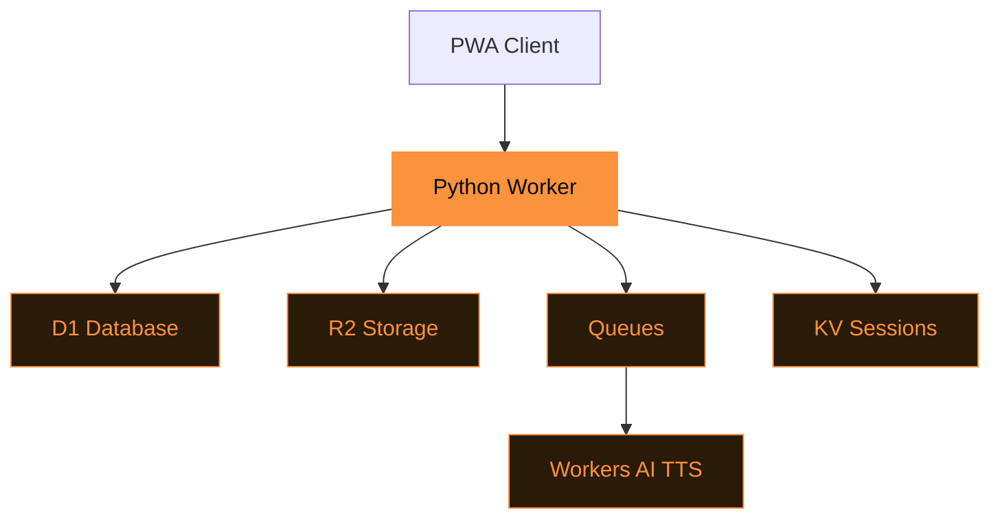

# Tasche

Self-hosted read-it-later on Cloudflare.

---
layout: statement
---

# Save articles. Read offline. Listen later. Your data stays yours.

---
transition: slide-left
---

# Features

<v-clicks>

- **Save by URL** with automatic content extraction and archival
- **Full-text search** across your entire library via FTS5
- **Listen Later** — audio versions via Workers AI TTS
- **PWA** with offline reading and service worker caching

</v-clicks>

---

# The Cloudflare stack

---
layout: two-cols
---

# Storage layer

<v-clicks>

- **D1** — articles, users, tags
- **FTS5** search index
- **R2** — archived HTML, markdown, images, audio

</v-clicks>

::right::

# Processing layer

<v-clicks>

- **Queues** — async article processing
- **Workers AI** — text-to-speech
- **KV** — session management

</v-clicks>

---
layout: section
transition: slide-up
---

# Listen Later

Workers AI generates audio versions of saved articles. Play them in the PWA.

---

# How an article flows

<v-clicks>

1. **Save** — user submits a URL
2. **Extract** — Worker fetches and parses content
3. **Archive** — HTML + markdown + images to R2
4. **Index** — metadata + FTS5 into D1
5. **Audio** — queue triggers TTS generation
6. **Read** — PWA serves from cache or network

</v-clicks>

---
layout: fact
---

# $5

Per month

On the Cloudflare Workers Paid plan. Free tier covers light personal use.

---
layout: end
transition: fade
---

# Deploy in 5 minutes

`git clone && uv run pywrangler deploy`
