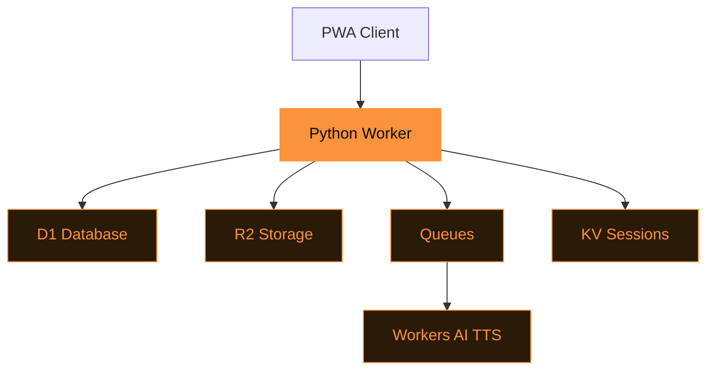

# Tasche

Self-hosted read-it-later on Cloudflare.

<!--
Tasche is German for "pocket" — a nod to the service it replaces, but fully self-hosted.
We built it on Cloudflare's developer platform so your reading list is truly yours.
-->

---
layout: statement
transition: slide-left
---

# Read-later services own your data

Pocket, Instapaper, Omnivore — they store your articles on their servers.
When they shut down (Omnivore did in 2024), your library vanishes overnight.

<v-click>

**You need a self-hosted alternative.**

</v-click>

---
transition: slide-up
---

# Article extraction pipeline

```python
async def save_article(url: str, db: D1Database, r2: R2Bucket):
    """Extract, archive, and index in one pipeline."""
    html = await fetch(url)
    article = extract_content(html)  # readability

    # Archive everything to R2
    await r2.put(f"{article.id}/content.md", article.markdown)
    await r2.put(f"{article.id}/original.html", html)

    # Index for full-text search
    await db.execute(
        "INSERT INTO articles_fts ...", [article]
    )
```

<!--
This is the core save flow. One async function handles fetch, extraction, archival, and indexing.
R2 stores both markdown and original HTML so you never lose fidelity.
D1's FTS5 extension gives you instant full-text search without an external service.
-->

---
transition: slide-left
---

# The Cloudflare stack

<div v-motion :initial="{ opacity: 0, y: 30 }" :enter="{ opacity: 1, y: 0, transition: { duration: 600 } }">



</div>

---
layout: two-cols
transition: fade
---

# Storage layer

<v-clicks>

- **D1** — articles, users, tags
- <v-mark at="4" color="#fb923c" type="underline">**FTS5**</v-mark> — full-text search index
- **R2** — archived HTML, markdown, images, audio

</v-clicks>

::right::

# Processing layer

<v-clicks>

- **Queues** — async article processing
- **Workers AI** — text-to-speech
- **KV** — session management

</v-clicks>

<style>
.slidev-layout li {
  transition: transform 0.2s ease, box-shadow 0.2s ease;
  padding: 2px 4px;
  border-radius: 4px;
}
.slidev-layout li:hover {
  transform: translateY(-2px);
  text-shadow: 0 0 8px rgba(251, 146, 60, 0.4);
}
</style>

---
layout: center
transition: slide-up
---

# Cloudflare stack = <v-mark at="1" color="#fb923c" type="circle">$5/month</v-mark> for unlimited articles

D1 for metadata. R2 for content. Queues for async processing. AI for TTS.

The entire stack runs on one platform — no Docker, no VPS, no ops.

<!--
This is the design thesis: Cloudflare's developer platform is cheap enough that a single $5/month plan
covers everything. D1 gives you SQLite with FTS5, R2 gives you S3-compatible storage,
Queues handle background work, and Workers AI provides TTS. No external dependencies.
-->

---
layout: fact
transition: fade
---

# $5

per month vs $120/year Pocket Premium

Your data, your rules. Self-hosted on Cloudflare Workers Paid plan.

---
layout: end
transition: slide-left
---

# Deploy in 5 minutes

`git clone && uv run pywrangler deploy`
