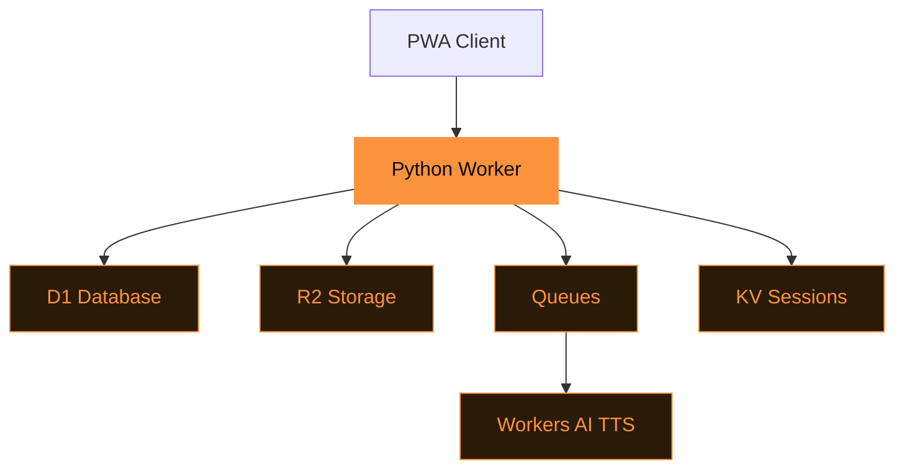

# Tasche

Self-hosted read-it-later on Cloudflare.

github.com/adewale/tasche

<!-- Tasche is German for "pocket" — a nod to the service it replaces, but fully self-hosted. The through-line is "ownership": stated here as self-hosting, threaded through every architectural decision (you own the database, you own the archive, you own the search index), and resolved in the closing as permanence. -->

---
layout: statement
transition: slide-left
---

# Read-later services own your data

Pocket, Instapaper, Omnivore — they store your articles on their servers. When they shut down, your library vanishes overnight.

<v-click>

**You need a reading list you own.**

</v-click>

<!-- The ownership through-line starts here. "They store your articles on their servers" is the problem. "Your library vanishes" is the consequence. The v-click punch line reframes the need: not "a self-hosted alternative" (technical) but "a reading list you own" (philosophical). -->

---
transition: slide-up
---

# The day Omnivore disappeared

October 28, 2024. Omnivore announced acquisition by ElevenLabs. The service shut down the same day. Users had 30 days to export — a JSON dump of URLs and highlights, no preserved content, no full-text search, no tags.

Years of carefully curated reading lists became a flat file of broken links. The articles themselves were already gone from the original sites.

Tasche archives both the markdown and the original HTML to R2 storage that you control. When the next service shuts down, your reading list survives.

<!-- This is the war story. Omnivore was the most-recommended open-source read-later service. Its shutdown was abrupt — same-day announcement and closure. The export was technically available but practically useless: just URLs and highlights, not preserved content. Many of the original articles had already been updated or removed. Users who trusted Omnivore with their reading lists lost not just the organization but the content itself. Tasche's dual-format archival (markdown + original HTML) in R2 is the architectural response to this specific failure. -->

---
transition: slide-up
---

# Article extraction pipeline

```python
async def save_article(url: str, db: D1Database, r2: R2Bucket):
    """Extract, archive, and index in one pipeline."""
    html = await fetch(url)
    article = extract_content(html)  # readability

    # You own the archive: markdown + original HTML
    await r2.put(f"{article.id}/content.md", article.markdown)
    await r2.put(f"{article.id}/original.html", html)

    # You own the search index
    await db.execute(
        "INSERT INTO articles_fts ...", [article]
    )
```

One function: fetch, extract, archive, index. Every artifact lands in storage you own.

<!-- The code comments are deliberately framed as ownership claims: "you own the archive," "you own the search index." The dual-format archival is the key technical decision — markdown for readability, original HTML for fidelity. R2 is S3-compatible, so even if you leave Cloudflare, the objects are portable. D1's FTS5 extension gives full-text search without any external service dependency. -->

---
transition: slide-left
---

# The Cloudflare stack

<div v-motion :initial="{ opacity: 0, y: 30 }" :enter="{ opacity: 1, y: 0, transition: { duration: 600 } }">



</div>

Notice: every service in this stack is Cloudflare-native, but every data format is portable. D1 is SQLite (export with one command). R2 is S3-compatible. You own the platform choice, not the other way around.

<!-- The architecture looks like vendor lock-in — five Cloudflare services. But the portability insight is the key: D1 exports as SQLite, R2 speaks S3, KV is key-value (trivially portable). The ownership guarantee extends beyond "you host it" to "you can leave it." If Cloudflare changes pricing or shuts down a service, the data is in standard formats. -->

---
layout: two-cols
transition: fade
---

# You own the storage

- **D1** — articles, users, tags (SQLite — export anytime)
- <v-mark at="1" color="#fb923c" type="underline">**FTS5**</v-mark> — full-text search index (built into D1)
- **R2** — archived HTML, markdown, images, audio (S3-compatible)

::right::

# You own the processing

- **Queues** — async article processing
- **Workers AI** — text-to-speech for articles
- **KV** — session management

<style>
.slidev-layout li {
  transition: transform 0.2s ease, box-shadow 0.2s ease;
  padding: 2px 4px;
  border-radius: 4px;
}
.slidev-layout li:hover {
  transform: translateY(-2px);
  text-shadow: 0 0 8px rgba(251, 146, 60, 0.4);
}
</style>

<!-- The column headers continue the ownership theme: "You own the storage" and "You own the processing." Each service is annotated with its portability characteristic. The v-mark on FTS5 highlights the most surprising capability — full-text search built into SQLite, no Elasticsearch, no external service. -->

---
layout: center
transition: slide-up
---

# Your entire reading infrastructure: <v-mark at="1" color="#fb923c" type="circle">$5/month</v-mark>

D1 for metadata. R2 for content. Queues for async processing. AI for TTS.

One platform, portable data, no Docker, no VPS, no ops. You own it for less than a streaming subscription.

<!-- The $5/month number is the ownership thesis in economic terms. Pocket Premium costs $120/year — for a service that owns your data and can shut down anytime. Tasche costs $60/year — for infrastructure you control with data in portable formats. The cost comparison is secondary; the ownership comparison is primary. -->

---
layout: fact
transition: fade
---

# $5

per month vs $120/year Pocket Premium

Your data in portable formats. Your search index. Your archive. The next acquisition can't take them away.

<!-- The fact slide adds the Omnivore callback: "The next acquisition can't take them away." This directly references the war story — Omnivore's acquisition destroyed user libraries. The $5/month price point makes ownership accessible, not aspirational. -->

---
layout: end
transition: slide-left
---

# Your reading list will outlive the next acquisition

<!-- The closing resolves the opening. "Read-later services own your data" → "Your reading list will outlive the next acquisition." The ownership through-line completes: from the Omnivore shutdown (what happens when you don't own your data) to Tasche's architecture (how to own it) to the closing promise (permanence). Your reading list is yours, and it will still be there when the next service disappears. -->
