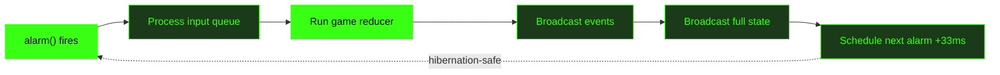

# Vaders

Multiplayer TUI Space Invaders. 1-4 players. Cloudflare Durable Objects.

github.com/adewale/vaders

<!-- Vaders is a complete multiplayer Space Invaders clone built for the terminal — 120x36 character grid, braille pixel art sprites, real-time co-op for up to 4 players synchronized via a Cloudflare Durable Object running a pure game reducer at 30Hz. The through-line is "the server is the truth" — every design decision traces back to server-authoritative state: the pure reducer, the alarm loop, held-state networking, full-state sync. The server computes; clients render.

Sources:
- https://github.com/adewale/vaders/blob/main/README.md — project overview, architecture, game modes
- https://github.com/adewale/vaders/blob/main/CHANGELOG.md — 1.0.0 feature inventory -->

---
layout: statement
transition: fade
---

# Multiplayer games don't belong in the terminal. Or do they?

120x36 character cells. No GPU. No game engine. Just a Durable Object and a WebSocket.

<!-- The tension: real-time multiplayer in a TUI sounds impossible. Terminals render character cells with a single foreground and background color — no sub-pixel rendering, no GPU shaders, no game engine. Movement is inherently chunky: entities jump by whole character cells. But the constraint is also the advantage. A 120x36 grid means 4,320 cells — small enough to broadcast as full state at 30Hz without compression. The terminal's limitations make server-authoritative architecture viable at a scale where it would be too expensive in a graphical game.

Sources:
- https://github.com/adewale/vaders/blob/main/README.md — terminal 120x36 requirement
- https://github.com/adewale/vaders/blob/main/Lessons_learned.md — section 1: what does NOT work in terminals (gradients, sub-pixel, smooth animation) -->

---
layout: image-right
image: /gameplay.png
backgroundSize: contain
transition: slide-left
---

# Braille pixel art at 120x36

<v-clicks>

- 7-wide animated braille sprites
- Color cycling for UFO rainbow effect
- Per-health colors on destructible barriers
- Dissolve particle system for entity deaths
- Directional shrapnel for explosions

</v-clicks>

<!-- The sprite system uses braille characters and Unicode box-drawing elements — not plain ASCII. Each alien type (squid, crab, octopus) has a distinct two-line sprite pattern with two animation frames. The UFO uses color cycling: rotating through a palette of six colors every 5 ticks, the classic Amiga technique that creates compelling animation without per-pixel rendering. Barriers have per-segment health tracked on the server, with colors shifting as they degrade. The dissolve effect uses a braille particle system where dying entities scatter into fragments that fall with simulated gravity.

Sources:
- https://github.com/adewale/vaders/blob/main/CHANGELOG.md — braille pixel art sprites, dissolve effects, explosion effects, barrier health colors, UFO color cycling
- https://github.com/adewale/vaders/blob/main/Lessons_learned.md — section 1: color cycling technique, Unicode box-drawing sprites, multi-line sprite readability -->

---
transition: slide-up
---

# Pure reducer, deterministic state

The server is the truth — because the game logic is a pure function.

````md magic-move
```ts
// The reducer signature: state in, state out
function gameReducer(
  state: GameState,
  action: GameAction
): ReducerResult {
  if (!canTransition(state.status, action.type))
    return { state, events: [], persist: false }
}
```
```ts
// Each tick: a deterministic pipeline
function tickReducer(state: GameState): ReducerResult {
  // 1. Move players (apply held input)
  // 2. Move bullets (up for players, down for aliens)
  // 3. Collision detection (6 entity pairs)
  // 4. Alien movement (periodic, reverse at walls)
  // 5. Alien shooting (seeded RNG)
  // 6. Cleanup dead entities
  // 7. Check end conditions
}
```
````

<!-- The game reducer is the architectural core. All state changes flow through a single pure function: gameReducer(state, action) returns { state, events, persist, scheduleAlarm }. The state machine guard (canTransition) prevents race conditions — inputs that don't apply in the current game status are silently dropped. The tickReducer runs at 30Hz during gameplay and processes a fixed pipeline: player movement, bullet movement, six collision detection pairs, alien movement, alien shooting via seeded RNG, entity cleanup, and end conditions. Seeded RNG (stored in GameState as rngSeed) ensures identical gameplay given identical inputs — essential for debugging. The reducer uses structuredClone at the start of each action for immutability.

Sources:
- https://github.com/adewale/vaders/blob/main/Lessons_learned.md — section 2: pure reducer pattern, seeded RNG, state machine transitions
- https://github.com/adewale/vaders/blob/main/docs/server-architecture.md — reducer architecture diagram, tickReducer pipeline, state machine guard -->

---
layout: section
transition: iris
---

# The server is the truth

Clients send keystrokes. The Durable Object computes state. Everyone gets the same frame.

---
transition: zoom-in
---

# DO alarm loop at 30Hz

<div v-motion
  :initial="{ opacity: 0, y: 30 }"
  :enter="{ opacity: 1, y: 0, transition: { delay: 200, duration: 600 } }">



</div>

The alarm replaces setInterval — it survives hibernation. The DO sleeps between ticks, waking only when a message arrives or the alarm fires.

<!-- The game runs at 30Hz (33ms tick interval) using the Durable Object alarm() handler instead of setInterval. Alarms are hibernation-compatible: the DO can sleep while maintaining WebSocket connections, waking only when needed. Each alarm tick: (1) process the input queue (messages accumulated since last tick), (2) run the pure game reducer, (3) broadcast events (alien_killed, player_died, etc.), (4) broadcast full game state to all clients, (5) schedule the next alarm at now + 33ms. Input queuing is critical: WebSocket messages arrive asynchronously but are processed atomically in FIFO order each tick. Full state sync means ~2KB per tick — at 30Hz with 4 players, that's 120 messages/second, well within WebSocket limits.

Sources:
- https://github.com/adewale/vaders/blob/main/docs/server-architecture.md — game loop pipeline, alarm scheduling, input queuing, full-state sync rationale
- https://github.com/adewale/vaders/blob/main/Lessons_learned.md — section 3: WebSocket hibernation, alarms over intervals, full sync vs delta -->

---
layout: two-cols-header
transition: wipe-right
---

# What works / What doesn't

::left::

### Works in a TUI

<v-clicks>

- Color cycling (Amiga palette rotation)
- Braille and box-drawing sprites
- Chunky cell-based movement
- Solid foreground/background per cell

</v-clicks>

::right::

### Does not work

<v-clicks>

- <v-mark at="5" type="strike" color="#ff6b35">Gradients and per-pixel effects</v-mark>
- <v-mark at="6" type="strike" color="#ff6b35">Smooth sub-cell animation</v-mark>
- <v-mark at="7" type="strike" color="#ff6b35">Complex background patterns</v-mark>
- <v-mark at="8" type="strike" color="#ff6b35">Anti-aliasing or transparency</v-mark>

</v-clicks>

<!-- Terminals render character cells with one foreground and one background color. There is no sub-pixel rendering, no partial transparency, no smooth gradients. But color cycling — the classic Amiga technique of rotating through a color palette — creates compelling visual effects. The UFO cycles through six colors every 5 ticks. Barriers shift color as health decreases. Aliens alternate between two animation frames. Movement is inherently "chunky" — entities jump by whole character cells. Aliens move 2 cells every 18 ticks, which looks correct for the genre. The lesson: accept terminal constraints as features, not bugs. Chunky movement and solid colors ARE the Space Invaders aesthetic.

Sources:
- https://github.com/adewale/vaders/blob/main/Lessons_learned.md — section 1: what works (color cycling, box-drawing, multi-line sprites) and what does NOT work (gradients, sub-pixel, smooth animation, complex backgrounds)
- https://github.com/adewale/vaders/blob/main/CHANGELOG.md — braille pixel art sprites, per-health barrier colors, UFO rainbow color cycling -->

---
transition: slide-up
---

# Held-state networking

Movement and shooting need different network models. The server is the truth for both.

```ts
// Movement: continuous held-key state
{ type: 'input', held: { left: true, right: false } }

// Server applies every tick
if (player.inputState.left)
  player.x = Math.max(MIN_X, player.x - moveSpeed)
```

```ts
// Shooting: discrete action, server rate-limits
{ type: 'shoot' }

// Cooldown enforced server-side (6 ticks = 200ms)
if (tick - player.lastShotTick < cooldownTicks)
  return { state, events: [], persist: false }
```

<!-- Two input models coexist. Movement uses held-state: the client sends which keys are currently pressed, and the server applies movement every tick. This handles terminal key repeat variation — some terminals send repeats every 30ms, others every 100ms. The held-state model with timeout fallback (40ms default, 0ms for Kitty which has native key release) absorbs this variance. Shooting uses discrete actions: each shot is a separate message, rate-limited by the server via cooldown ticks. The server never trusts the client's claimed position or fire rate — it computes everything from the authoritative state. A modified client could send fake inputs, but the server would ignore anything that violates cooldown or boundary rules.

Sources:
- https://github.com/adewale/vaders/blob/main/Lessons_learned.md — section 3: held-state vs discrete input, key repeat variation, timeout fallback
- https://github.com/adewale/vaders/blob/main/docs/server-architecture.md — WebSocket protocol (input, move, shoot messages), input handling -->

---
transition: slide-left
---

# Audio without FFI

No native dependencies. No Web Audio API. Just the system player as a subprocess.

```ts
const player = process.platform === 'darwin'
  ? 'afplay' : 'aplay'

function playSound(path: string): void {
  spawn({ cmd: [player, path],
    stdout: 'ignore', stderr: 'ignore' })
}
```

<v-clicks>

- Fire-and-forget: 5-10ms latency, acceptable for SFX
- Debounce at 50ms to prevent audio spam
- Kill spawned processes on exit (music outlives parent)
- Separate toggles: M for SFX, N for music

</v-clicks>

<!-- The audio system avoids FFI entirely. Instead of native bindings or Web Audio (which doesn't exist in a terminal), Vaders spawns the system's command-line audio player (afplay on macOS, aplay on Linux) as a subprocess. Advantages: no native dependencies, works with WAV/MP3, fire-and-forget. Disadvantages: ~5-10ms subprocess overhead, no per-sound volume control. Rapid-fire gameplay needs debouncing — a 50ms minimum interval per sound type prevents audio spam during intense moments. The critical gotcha: spawned audio processes outlive the parent if not explicitly killed. The MusicManager registers cleanup handlers for exit, SIGINT, and SIGTERM. Startup verification checks that the audio player binary exists and sound files are present.

Sources:
- https://github.com/adewale/vaders/blob/main/Lessons_learned.md — section 7: system audio player approach, process cleanup, debouncing, startup verification, separate mute toggles -->

---
transition: slide-up
---

# Testing across the wire

Server tests verified events were *sent*. The client silently dropped them.

<v-clicks>

- Server: `expect(ws.send).toHaveBeenCalledWith(...)` -- passes
- Client: `if (msg.type === 'event')` -- not handled
- 620+ tests green. `game_over` event never reaches UI.
- Fix: integration tests across the protocol boundary

</v-clicks>

The collision story is worse. Server treated `player.x` as left edge. Client treated it as center. Bullets appeared 2 columns off.

<!-- This is the war story. All server-side unit tests passed — they verified that events were sent via ws.send(). But the client's WebSocket handler only processed 'sync', 'error', and 'pong' messages. The 'event' message type was silently dropped. The game_over event with victory/defeat result never reached the UI. 620+ tests were green while the game was functionally broken for end-game state. The fix: add event handling to useGameConnection.ts, then add integration tests that verify the full client-server flow. Separately, a coordinate system mismatch caused visual bugs: the server treated player.x as the center of the sprite, but collision code added SPRITE_WIDTH/2 as an offset — placing bullets 2 columns off-center. The lesson: entity-specific collision functions (checkAlienHit, checkPlayerHit) encode coordinate conventions and are harder to misuse than generic functions with offset parameters.

Sources:
- https://github.com/adewale/vaders/blob/main/Lessons_learned.md — section 9: unit tests don't catch client-side protocol issues, event handling fix
- https://github.com/adewale/vaders/blob/main/Lessons_learned.md — section 8: coordinate system mismatches, entity-specific hitbox functions, visual rendering as source of truth -->

---
layout: fact
transition: fade
---

# <v-mark at="1" color="#39ff14" type="circle">620+</v-mark>

tests across all workspaces. 4 players. 33ms server tick. Full-state sync at 30Hz.

<!-- 620+ tests span the entire codebase: reducer unit tests (deterministic game logic), GameRoom integration tests (WebSocket protocol), Matchmaker tests (room registry), scaling tests (player count difficulty curves), and property-based collision tests. The 33ms tick interval (30Hz) was chosen over 60Hz to stay within Durable Object CPU limits while providing responsive gameplay. Full-state sync broadcasts ~2KB per tick — simple and correct, no client-side prediction or reconciliation needed. Game difficulty scales with player count: solo gets 3 lives with an 11x5 alien grid at 1.0x speed; 4-player co-op gets 5 shared lives with a 15x6 grid at 1.75x speed.

Sources:
- https://github.com/adewale/vaders/blob/main/CHANGELOG.md — "620+ tests — Comprehensive test suite across all workspaces including property-based collision tests"
- https://github.com/adewale/vaders/blob/main/docs/server-architecture.md — 30Hz tick rate, scaling table (1-4 players), full-state sync rationale -->

---
layout: end
transition: fade
---

# The best game server is a pure function with a mailbox

<!-- The closing resolves the opening and the through-line. "Multiplayer games don't belong in the terminal. Or do they?" — they do, when the server is the truth. The Durable Object is a pure function (the reducer) with a mailbox (WebSocket hibernation + alarm loop). Inputs arrive via WebSocket messages. State is computed deterministically. Everyone gets the same frame. No client-side prediction needed because the terminal's inherent chunkiness makes 30Hz feel correct. The constraints that were supposed to make this impossible — character-cell rendering, no GPU, no game engine — are what made server-authoritative architecture viable. The reducer pattern, the alarm loop, the full-state sync — each traces back to one principle: the server is the truth.

Sources:
- https://github.com/adewale/vaders/blob/main/Lessons_learned.md — summary: "Server is authoritative. Client renders, server decides."
- https://github.com/adewale/vaders/blob/main/docs/server-architecture.md — pure reducer pattern, actor model, hibernation-first design -->
