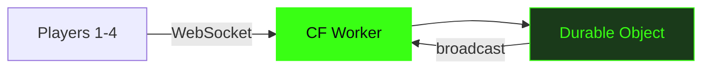

# Vaders

Multiplayer TUI Space Invaders. 1-4 players. Cloudflare Durable Objects.

<!--
Vaders is a complete reimagining of Space Invaders for the modern terminal. Built on Bun and Cloudflare Durable Objects, it supports 1-4 players in real-time co-op — all rendered in a 120x36 character grid. This talk walks through why that's hard, how it works, and why it matters.
-->

---
layout: statement
transition: fade
---

# Multiplayer games don't belong in the terminal. Or do they?

The challenge: real-time multiplayer in a TUI is supposed to be impossible. 120x36 character cells, no GPU, no game engine. Just text.

---
transition: slide-up
---

# Durable Object state sync

```ts
// Durable Object broadcasts game state 60 times/second
async alarm() {
  const state = {
    aliens: this.aliens.map(a => a.serialize()),
    bullets: this.bullets.filter(b => b.active),
    players: Object.fromEntries(
      this.sessions.map(([id, s]) => [id, s.pos])
    ),
  };
  this.broadcast(JSON.stringify(state));
}
```

<!--
This is the heartbeat of the game. The Durable Object's alarm fires 60 times per second. It serializes the entire game state — alien positions, active bullets, and player positions — then broadcasts it over WebSocket to every connected client. The key insight is that state is authoritative on the server. Clients send inputs, the DO processes them, and the broadcast is the single source of truth. This eliminates desync issues that plague peer-to-peer architectures.
-->

---
layout: two-cols-header
transition: slide-left
---

# Four moving parts

::left::

<div class="hover-section">

### Client

<v-clicks>

- **Bun** runtime
- **OpenTUI React** terminal renderer
- Native audio (afplay / aplay)

</v-clicks>

</div>

::right::

<div class="hover-section">

### Server

<v-clicks>

- **Cloudflare Worker** routing
- **Durable Object** game state
- **WebSocket protocol** real-time sync

</v-clicks>

</div>

<style>
.hover-section {
  padding: 1rem;
  border-radius: 0.75rem;
  transition: transform 0.3s ease, box-shadow 0.3s ease;
}
.hover-section:hover {
  transform: scale(1.04);
  box-shadow: 0 0 24px rgba(57, 255, 20, 0.2);
}
</style>

---
layout: center
transition: fade
---

<div v-motion :initial="{ opacity: 0, y: -40 }" :enter="{ opacity: 1, y: 0, transition: { duration: 800 } }">

```
  +--------------------+
  |  * * * * * * * * *  |
  |   * * * * * * * *   |
  |    * * * * * * *    |
  |        .            |
  |        |            |
  |       /^\           |
  +--------------------+
```

</div>

<div class="mt-8 text-center text-lg">

<v-mark at="1" color="#39ff14" type="highlight">120x36 constraint breeds creative rendering</v-mark> — when you only have 4,320 character cells, every cell matters.

</div>

---
transition: slide-up
---

# Architecture



---
layout: fact
transition: fade
---

# 4

players, <16ms frame time, 0 dropped inputs

Real-time co-op with shared lives, synchronized via Durable Objects at 60fps.

---
layout: end
transition: fade
---

# Play now

`bun install && bun run vaders`

<!--
That's Vaders. A multiplayer Space Invaders built entirely for the terminal, powered by Bun on the client and Cloudflare Durable Objects on the server. Clone the repo, run the command, and you're playing in seconds. If you want to dig deeper, the WebSocket protocol and DO game loop are fully documented in the source.
-->
