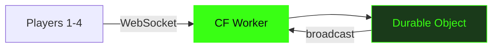

# Vaders

Multiplayer TUI Space Invaders. 1-4 players. Cloudflare Durable Objects.

---
layout: statement
transition: fade
---

# Classic arcade reimagined for the terminal

---
layout: two-cols
transition: slide-up
---

# What you get

<v-clicks>

- **Solo mode** with 3 lives
- **Co-op** with up to 4 players
- Full TUI at 120x36 resolution
- Sound effects and music

</v-clicks>

::right::

<div class="pt-12 font-mono text-sm opacity-70">

```
  +--------------------+
  |  * * * * * * * * *  |
  |   * * * * * * * *   |
  |    * * * * * * *    |
  |        .            |
  |        |            |
  |       /^\           |
  +--------------------+
```

</div>

---

# Architecture



---
layout: two-cols-header
---

# Four moving parts

::left::

### Client

<v-clicks>

- **Bun** runtime
- **OpenTUI React** terminal renderer
- Native audio (afplay / aplay)

</v-clicks>

::right::

### Server

<v-clicks>

- **Cloudflare Worker** routing
- **Durable Object** game state
- **WebSocket protocol** real-time sync

</v-clicks>

---
layout: section
transition: slide-up
---

# Co-op mode

Shared lives. Larger alien grid. Synchronized in real-time.

---
layout: fact
transition: fade
---

# 4

Players in real-time co-op

Synchronized via Durable Objects with shared lives and a larger alien grid

---
layout: end
transition: fade
---

# Play now

`bun install && bun run vaders`
