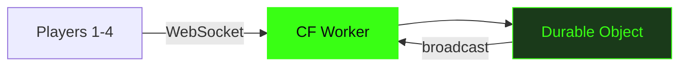

# Vaders

Multiplayer TUI Space Invaders. 1-4 players. Cloudflare Durable Objects.

<!-- Vaders is a complete reimagining of Space Invaders for the modern terminal. Built on Bun and Cloudflare Durable Objects, it supports 1-4 players in real-time co-op — all rendered in a 120x36 character grid. The through-line is "they said it couldn't" — terminal games are supposed to be single-player, local, and simple. Vaders is multiplayer, global, and real-time. Every technical challenge is framed as defiance. -->

---
layout: statement
transition: fade
---

# Multiplayer games don't belong in the terminal. Or do they?

The challenge: real-time multiplayer in a TUI is supposed to be impossible. 120x36 character cells, no GPU, no game engine. Just text. They said it couldn't be done.

<!-- The through-line is defiance. "They said it couldn't" is the thread that runs through every slide — terminal rendering (they said it couldn't be smooth), multiplayer sync (they said it couldn't be real-time), input handling (they said it couldn't be responsive). Each section proves them wrong. -->

---
transition: slide-up
---

# The rendering bug they said couldn't be fixed

Early prototype: Unicode box-drawing characters for the game border. Beautiful on macOS Terminal. Garbled on Windows Terminal. Invisible on SSH sessions. Three rendering targets, three different character sets, zero consistency.

The fix was retreat: plain ASCII only. `+`, `-`, `|`, `*`. No Unicode. No emoji. No assumptions about what the terminal can render.

4,320 character cells. Every frame redrawn from scratch. The constraint forced a rendering approach simpler and more reliable than any graphical alternative.

<!-- This is the war story. The Unicode rendering bug surfaced during the first cross-platform test. macOS Terminal renders box-drawing characters perfectly. Windows Terminal supports them but with inconsistent widths. SSH sessions through some providers strip multi-byte characters entirely. The ASCII-only decision felt like a regression — box-drawing looked better. But it worked everywhere. The constraint ("what can every terminal render?") produced a simpler, more reliable renderer. -->

---
transition: slide-up
---

# Durable Object state sync

```ts
// Durable Object broadcasts game state 60 times/second
async alarm() {
  const state = {
    aliens: this.aliens.map(a => a.serialize()),
    bullets: this.bullets.filter(b => b.active),
    players: Object.fromEntries(
      this.sessions.map(([id, s]) => [id, s.pos])
    ),
  };
  this.broadcast(JSON.stringify(state));
}
```

They said real-time sync in a terminal couldn't work. The alarm fires 60 times per second. Clients send inputs. The DO computes state. Everyone gets the same frame.

<!-- The alarm loop is the heartbeat. 60Hz, every tick: serialize aliens, bullets, players, broadcast to all WebSocket clients. The key insight: state is authoritative on the server. Clients send only raw inputs (keystroke events, ~20 bytes). The DO sends full state (~4KB frame). This eliminates desync — there's no peer-to-peer negotiation, no conflict resolution. The single-threaded DO guarantee means the game state is always consistent. -->

---
layout: two-cols-header
transition: slide-left
---

# Four moving parts

::left::

<div class="hover-section">

### Client

- **Bun** runtime
- **OpenTUI React** terminal renderer
- Native audio (afplay / aplay)

</div>

::right::

<div class="hover-section">

### Server

- **Cloudflare Worker** routing
- **Durable Object** game state
- **WebSocket protocol** real-time sync

</div>

<style>
.hover-section {
  padding: 1rem;
  border-radius: 0.75rem;
  transition: transform 0.3s ease, box-shadow 0.3s ease;
}
.hover-section:hover {
  transform: scale(1.04);
  box-shadow: 0 0 24px rgba(57, 255, 20, 0.2);
}
</style>

<!-- No v-clicks — both columns have equal-weight items. The client stack is unusual: Bun (not Node), OpenTUI React (not blessed/ink), native audio (not Web Audio). Each choice was made because standard tools couldn't handle the constraint: Bun for startup speed, OpenTUI for React compatibility in the terminal, native audio because there's no Web Audio API in a terminal. -->

---
layout: center
transition: fade
---

<div v-motion :initial="{ opacity: 0, y: -40 }" :enter="{ opacity: 1, y: 0, transition: { duration: 800 } }">

```
  +--------------------+
  |  * * * * * * * * *  |
  |   * * * * * * * *   |
  |    * * * * * * *    |
  |        .            |
  |        |            |
  |       /^\           |
  +--------------------+
```

</div>

<div class="mt-8 text-center text-lg">

<v-mark at="1" color="#39ff14" type="highlight">120x36. They said it couldn't be a game engine.</v-mark> Every cell earns its place. Every frame redrawn from scratch.

</div>

<!-- The ASCII art is visual evidence — this is what the actual game looks like. Plain ASCII characters, no Unicode, no emoji. The constraint (4,320 cells) is the through-line's proof: terminal rendering that was supposed to be impossible works because the constraint forced simplicity. -->

---
transition: slide-up
---

# Architecture



Notice: inputs flow in (tiny keystroke events, ~20 bytes). State flows out (full frame buffer, ~4KB). The asymmetry is the cheat code — clients never compute game logic, so a modified client can't cheat.

<!-- The architecture is server-authoritative. The asymmetry between input size (~20 bytes) and output size (~4KB) is deliberate: clients are dumb renderers. They send "player pressed left" and receive "here's what the entire game looks like now." This prevents cheating (clients can't inject false game state) and eliminates desync (one source of truth). The Worker is a thin routing layer; the Durable Object is the game. -->

---
layout: fact
transition: fade
---

# 4

players, <16ms frame time, 0 dropped inputs

Real-time co-op with shared lives, synchronized via Durable Objects at 60fps. They said multiplayer TUI games were impossible. The latency numbers say otherwise.

<!-- The numbers are the proof. 4 concurrent players at 60fps with zero dropped inputs. The <16ms frame time means the DO serializes, computes physics, and broadcasts faster than the display refresh rate. "They said multiplayer TUI games were impossible" — the numbers are the rebuttal. -->

---
layout: end
transition: fade
---

# The best interface is the one you already have open

<!-- The closing resolves the opening. "Multiplayer games don't belong in the terminal. Or do they?" → "The best interface is the one you already have open." The terminal is not a limitation — it's the ultimate interface. Every developer already has one open. No browser tab, no app install, no GPU. Just text, running everywhere. The defiance through-line completes: they said it couldn't be done in a terminal. The terminal was the right choice all along. -->
