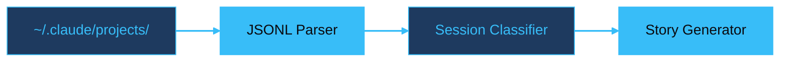

# Claude History Explorer

Python CLI tool to explore, search and visualise your Claude Code conversation history

<!--
This deck presents claude-history-explorer, a read-only CLI that turns Claude Code's local JSONL files into searchable narratives, statistics, and personality insights. The through-line: what does your conversation history say about you?

Sources:
- https://github.com/adewale/claude-history-explorer -- project repository
-->

---
transition: slide-left
---

# What Is Claude History Explorer?

A read-only CLI that parses the JSONL files Claude Code stores in `~/.claude/projects/`.

<v-clicks>

- Nine commands from `projects` to `wrapped`
- Streams JSONL line-by-line for any file size
- Detects concurrent Claude instances
- 2,600 lines of Python. Three dependencies.

</v-clicks>

<!--
The project identity matters here: this is not a dashboard or web app. It is a terminal tool that reads local files and never writes to them. The dependency count is a deliberate architectural constraint. The three core runtime dependencies are click (CLI framework, 30M+ weekly downloads), rich (terminal formatting, 20M+), and sparklines (ASCII charts, 100K+). Every dependency formats output; none touches files or network. Two additional dependencies (msgpack, pyperclip) support the wrapped feature only.

Sources:
- https://github.com/adewale/claude-history-explorer/blob/main/README.md -- project overview, feature list, nine commands
- https://github.com/adewale/claude-history-explorer/blob/main/pyproject.toml -- dependency list: click, rich, sparklines, msgpack, pyperclip
-->

---
layout: section
transition: iris
---

# Reading the Receipts

<!--
This section break introduces the core technical story: how raw JSONL files become narrative insights. The through-line surfaces here -- your history files are receipts of every conversation, and this tool reads them. What do those receipts say about how you work?
-->

---
transition: slide-left
---

# From JSONL to Narrative



<div v-motion :initial="{ y: 40, opacity: 0 }" :enter="{ y: 0, opacity: 1, transition: { delay: 300, duration: 600 } }">

```
3 days of development
heavy delegation (16 agents, 2 main sessions)
1873 messages at 25.0 msgs/hour
Used up to 3 Claude instances in parallel
```

</div>

<!--
The pipeline is intentionally simple. The parser does not build an AST or database -- it streams. The classifier uses CONCURRENT_WINDOW_MINUTES = 30 to detect parallel Claude usage. The story generator applies threshold constants: MESSAGE_RATE_HIGH = 30 msgs/hour for "rapid-fire", SESSION_LENGTH_LONG = 2.0 hours for "marathon sessions", AGENT_RATIO_HIGH = 0.8 for "heavy delegation". The terminal output shown is real example output from the story command in the README.

Sources:
- https://github.com/adewale/claude-history-explorer/blob/main/claude_history_explorer/stories.py -- narrative generation pipeline
- https://github.com/adewale/claude-history-explorer/blob/main/claude_history_explorer/constants.py -- threshold values
- https://github.com/adewale/claude-history-explorer/blob/main/README.md -- example output from story command
-->

---
layout: center
transition: morph-fade
---

# A tool about AI that uses no AI

"Heavy delegation." "Rapid-fire development." "Marathon sessions."

<v-click>

Personality traits from **arithmetic on timestamps** -- not machine learning.

</v-click>

<!--
This is the genuinely surprising element. A tool built to explore AI conversation history does not itself use any AI. It derives personality traits from pure arithmetic: messages-per-hour thresholds, session duration buckets, agent-to-main ratios. The classification system is entirely deterministic. AGENT_RATIO_HIGH = 0.8 means "heavy delegation". MESSAGE_RATE_HIGH = 30 means "rapid-fire development". The "story" command generates narratives like "agent-driven, deep-work focused, high-intensity" from nothing more than timestamps and file counts. This is a tool about AI that is conspicuously not AI -- and that constraint is the source of its trustworthiness.

Sources:
- https://github.com/adewale/claude-history-explorer/blob/main/FAQ.md -- personality trait definitions and threshold explanations
- https://github.com/adewale/claude-history-explorer/blob/main/claude_history_explorer/constants.py -- MESSAGE_RATE_HIGH=30, AGENT_RATIO_HIGH=0.8, SESSION_LENGTH_LONG=2.0
-->

---
layout: section
transition: iris
---

# The Trust Contract

<!--
The through-line deepens: if the tool reads your AI conversations -- which may contain proprietary code, API keys, business logic -- it must earn trust first. TRUST.md is a 300+ line document with five guarantees, each with grep/pytest commands the user can run to verify. Read-only file access (all opens use 'r' mode, verified by static analysis tests). Zero network calls (no requests, httpx, urllib imports -- verified by dependency audit). 2,600 auditable lines. 3 minimal dependencies. The trust model is verifiable architecture, not marketing copy.

Sources:
- https://github.com/adewale/claude-history-explorer/blob/main/TRUST.md -- five trust guarantees with verification commands
-->

---
layout: end
transition: fade
---

# Your History Is Already Telling a Story

Claude History Explorer just lets you read it

<!--
Resolution of the through-line: the question "what does your conversation history say about you?" resolves not with the tool's analysis features, but with the realization that the story was always there in the JSONL files. The tool merely makes it legible. The closing echoes the cover's implicit promise and resolves it: the history was already narrative, just unread.

Sources:
- https://github.com/adewale/claude-history-explorer -- project repository
-->
