# GeistFabrik

What happens when your notes ask the questions?

<!--
GeistFabrik means "spirit factory" in German. The name signals its role: manufacturing provocations from your Obsidian vault, not answers. This deck introduces the project's philosophy and architecture to developers and PKM practitioners.

The opening question is the through-line. By the end, we will have an answer: a well-asked question beats a poorly-computed answer.

Sources:
- https://github.com/adewale/geist_fabrik/blob/main/README.md — project name, tagline, and philosophy
-->

---
layout: fact
transition: fade
---

# 611

TESTS PASSING

57 geists. 16 modules. Zero network calls.

<!--
The numbers ground the project in concrete evidence. 611 tests at 100% pass rate across unit and integration suites. 57 bundled default geists (48 code, 9 Tracery). 16 source modules totalling ~6,000 lines.

"Zero network calls" is the real headline. GeistFabrik uses sentence-transformers for local 384-dimensional embeddings. No data leaves your machine. No API keys. No internet required after installation.

Sources:
- https://github.com/adewale/geist_fabrik/blob/main/STATUS.md — 611/611 tests, 16 modules, schema v6
- https://github.com/adewale/geist_fabrik/blob/main/README.md — privacy model, local-first architecture, geist count
-->

---
layout: center
transition: fade
---

# The Contradictor taught us something

100 lines of Python to compute opposites. **10% success rate.**

13 lines of Tracery to ask "What contradicts this?" **100% success rate.**

<!--
This is the war story. The Contradictor geist originally tried to algorithmically generate opposite note titles using 100+ lines of pattern matching. It worked for "Benefits of Morning Routines" (producing "Costs of Morning Routines") but failed for "Evergreen notes" (producing "The opposite of Evergreen notes") and dates (producing "The opposite of 2023-09-12").

The fix was to stop computing answers and start asking questions. A 13-line YAML template that says "What contradicts [[note]]?" works on any note title, because the human generates the opposite — not the algorithm.

This incident became a design principle: "A well-asked question is better than a poorly-computed answer."

Sources:
- https://github.com/adewale/geist_fabrik/blob/main/LESSONS_LEARNED.md — Contradictor case study, 10% vs 100% success rate, code-to-question comparison
-->

---
layout: two-cols
transition: slide-left
---

# Two Engines, One Pipeline

<v-clicks>

- **Code geists**: Python with VaultContext API
- Graph operations, semantic search, temporal drift
- Best when computation reveals structure

</v-clicks>

::right::

<v-clicks>

- **Tracery geists**: YAML grammars with vault functions
- Template variations, provocative questions
- Best when human creativity exceeds algorithms

</v-clicks>

<!--
The two engines are not competitors. They compose. Vault functions written in Python can be called from Tracery grammars using the $vault.function_name() syntax. A code geist might compute the 20 oldest highly-connected notes; a Tracery geist turns that into "Consider revisiting [[note]] — what has changed since you wrote it?"

Both engine types run through the same 4-stage filtering pipeline: boundary checks, novelty scoring, diversity enforcement, and quality gates. The pipeline samples ~5 suggestions by default, with --full and --no-filter modes for deeper exploration.

Sources:
- https://github.com/adewale/geist_fabrik/blob/main/README.md — code vs Tracery architecture, VaultContext API, filtering pipeline
- https://github.com/adewale/geist_fabrik/blob/main/LESSONS_LEARNED.md — when to use code vs Tracery decision framework
-->

---
transition: slide-left
---

# Three Dimensions of Extension

<v-clicks>

- **Metadata inference** adds properties to notes
- **Vault functions** create reusable queries
- **Geists** compose both into provocations

</v-clicks>

Each layer builds on the one below. Non-programmers write Tracery geists that call functions written by developers.

<!--
The three-layer extensibility model is what makes GeistFabrik more than a suggestion engine. Metadata inference modules add computed properties to notes (reading time, lexical diversity, sentence count). Vault functions wrap reusable queries behind a @vault_function decorator. Geists compose both into creative provocations.

The practical result: a developer writes a vault function that finds notes above a complexity threshold, and a non-programmer writes a Tracery geist that asks "Could you simplify [[complex_note]] by splitting it into three smaller notes?"

Sources:
- https://github.com/adewale/geist_fabrik/blob/main/README.md — metadata inference, vault functions, geist examples, three-dimensional extensibility
-->

---
transition: fade
---

# The Pipeline

```mermaid {scale: 0.8}
graph LR
  A["Vault Files"] --> B["Sync"]
  B --> C["Embeddings"]
  C --> D["VaultContext"]
  D --> E["Geists"]
  E --> F["Filter"]
  F --> G["Session Note"]
  style A fill:#dbeafe,stroke:#2563eb,color:#1e3a5f
  style B fill:#dbeafe,stroke:#2563eb,color:#1e3a5f
  style C fill:#2563eb,stroke:#2563eb,color:#ffffff
  style D fill:#2563eb,stroke:#2563eb,color:#ffffff
  style E fill:#2563eb,stroke:#2563eb,color:#ffffff
  style F fill:#dbeafe,stroke:#2563eb,color:#1e3a5f
  style G fill:#dbeafe,stroke:#2563eb,color:#1e3a5f
  linkStyle default stroke:#2563eb,stroke-width:2px
```

Deterministic: same date + same vault = same suggestions. Incremental: only changed files reprocess.

<!--
The data flow is the architectural backbone. Vault.sync() reads Obsidian markdown files into a SQLite database with incremental sync (only changed files are reprocessed). Session.compute_embeddings() generates 384-dimensional vectors using sentence-transformers with batch processing that is 15-20x faster than naive implementation.

VaultContext provides the rich query API that geists use: semantic search, graph operations (orphans, hubs, backlinks), deterministic random sampling, and metadata inference integration. The filtering pipeline applies boundary, novelty, diversity, and quality checks before writing suggestions to a session note in the geist journal.

Deterministic randomness means the same date plus the same vault state always produces the same output. This is intentional — sessions are reproducible and replayable.

Sources:
- https://github.com/adewale/geist_fabrik/blob/main/README.md — architecture section, data flow, incremental sync, batch embeddings performance
-->

---
layout: end
transition: fade
---

# A well-asked question beats a poorly-computed answer

That is the design rule behind every geist.
