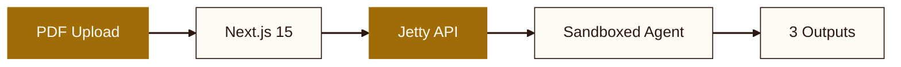

# pdf2croissant

Turn academic papers into MLCommons Croissant JSON-LD metadata

<span style="font-family: var(--deck-font-mono); font-size: 0.85rem; color: var(--deck-muted); margin-top: 1.5rem; display: inline-block;">github.com/jettyio/pdf2croissant</span>

<!--
The cover establishes the project identity. The subtitle is the one-line description from the README. The URL points to the GitHub repo. pdf2croissant solves the gap between what Croissant defines as a schema and the messy reality of extracting that metadata from academic papers.

Sources:
- https://github.com/jettyio/pdf2croissant — repository description and live app URL
-->

---
transition: fade
---

# This Was Extracted From a PDF

```json
{
  "@type": "sc:Dataset",
  "name": "SQuAD 2.0",
  "description": "Reading comprehension dataset combining
    100,000 answerable questions with 50,000 unanswerable",
  "license": "CC-BY-SA-4.0",
  "creator": [{ "name": "Pranav Rajpurkar" }]
}
```

The paper never had structured metadata. An agent read 20 pages of prose and produced this.

<!--
In media res opening. Before explaining what Croissant is, show what the system actually outputs. The audience sees the end product first. The tension: this structured metadata did not exist anywhere in the paper as structured data. The dataset name was on page 1, the license was in a footnote, the description was scattered across the abstract and introduction. An agent extracted these fields, tagged their confidence, and assembled valid JSON-LD. The rest of the deck explains how.

Sources:
- https://github.com/jettyio/pdf2croissant/blob/main/README.md — project overview: agent extracts Croissant JSON-LD from academic papers
- https://github.com/jettyio/pdf2croissant/tree/main/benchmarks — SQuAD 2.0 benchmark with ground-truth Croissant output
-->

---
transition: slide-left
---

# The Standard That Needs Filling

Croissant is the MLCommons standard for dataset metadata. HuggingFace, Kaggle, and OpenML adopted it. It defines 16 fields in JSON-LD: name, creators, license, distributions, record sets, data types.

<v-clicks>

- **Well-designed schema** -- machine-readable, linked-data compatible, validated by `mlcroissant`
- **Widely adopted** -- the three largest dataset platforms use it as their canonical format
- **But papers don't come with Croissant files** -- someone has to read them and extract the fields

</v-clicks>

<!--
Croissant was published by MLCommons in 2024 and rapidly adopted by HuggingFace, Kaggle, and OpenML as the standard way to describe ML datasets. It defines a JSON-LD vocabulary with 16 fields covering identity, provenance, structure, and data types. The mlcroissant Python library validates conformance and can even instantiate datasets from the metadata. The standard is excellent. The problem is that papers do not ship with Croissant files.

Sources:
- https://github.com/jettyio/pdf2croissant/blob/main/RUNBOOK.md — 16 field mappings from paper to Croissant, mlcroissant validation
- https://github.com/jettyio/pdf2croissant/blob/main/README.md — MLCommons standard context, HuggingFace/Kaggle/OpenML adoption
-->

---
transition: slide-left
---

# The Extraction Gap

A researcher publishes a paper describing a new dataset. The dataset name is on page 1. The license is in a footnote on page 12. The column types are in a table on page 4. The download URL might be in an appendix -- or missing entirely.

<v-clicks>

- Croissant needs **structured fields**
- Papers contain **scattered prose**
- Someone must read the paper, find each fact, and decide what is explicit vs. inferred
- That someone is now an agent

</v-clicks>

<!--
This slide makes the gap concrete. A single academic paper can scatter the metadata Croissant needs across 20+ pages. The dataset name is usually clear, but the license might be a footnote, the data format might be described in a methodology section, and the download URL might exist only in a GitHub link buried in the appendix. Some fields may not appear in the paper at all. The extraction problem is not just reading; it is distinguishing between what the paper explicitly states and what you are inferring from context.

Sources:
- https://github.com/jettyio/pdf2croissant/blob/main/RUNBOOK.md — "Distinguish between what is explicitly stated vs what you are inferring"
-->

---
layout: section
transition: iris
---

# An Agent That Reads Papers

<!--
Section break into the core product. The agent is an AI model (Claude or Gemini) running inside a sandboxed Python environment, guided by a runbook that tells it exactly how to extract metadata from academic papers. The word "agent" is precise here: it has a system prompt, access to tools (pip, Python, mlcroissant), and a multi-step workflow it follows autonomously.

Sources:
- https://github.com/jettyio/pdf2croissant/blob/main/README.md — agent-based extraction overview
-->

---
transition: slide-left
---

# Three Outputs From Every Run

Upload a PDF of a paper that introduces an ML dataset. The agent reads it and delivers three files:

<v-clicks>

- **croissant.json** -- the Croissant JSON-LD metadata file, ready for HuggingFace or Kaggle
- **validation_report.json** -- what passed, what failed, how many iterations it took to fix errors
- **summary.md** -- human-readable extraction report with confidence levels per field

</v-clicks>

<p v-click style="color: var(--deck-muted); font-size: 0.95rem; margin-top: 1.5rem;">The validation report and summary exist because the Croissant file alone does not tell you how much to trust it.</p>

<!--
The three-output design is deliberate. croissant.json is the machine-readable payload. validation_report.json is the audit trail: it records which of the three validation stages passed, what errors were encountered, and how many self-healing iterations the agent ran. summary.md is for human review, showing each extracted field with its confidence tag (high, medium, low) and a table of gaps. The summary is what a dataset maintainer reads to decide whether to accept the Croissant file as-is or manually verify specific fields.

Sources:
- https://github.com/jettyio/pdf2croissant/blob/main/README.md — three output files and their purposes
-->

---
transition: slide-left
---

# The Upload Pipeline

Three stages keep the API server out of the file transfer path:

<v-clicks>

- **Presign** -- client requests a signed URL from `/api/presign`
- **Blob** -- client PUTs the PDF directly to Vercel Blob storage (15MB limit, drag-and-drop with progress)
- **Run** -- client POSTs to `/api/run` with the blob reference and selected model

</v-clicks>

<p v-click style="color: var(--deck-muted); font-size: 0.95rem; margin-top: 1rem;">React Query polls for completion. The frontend never touches the PDF after upload.</p>

<!--
The presigned URL pattern means the Next.js server never buffers the full PDF. The client uploads directly to Vercel Blob storage. The 15MB limit is enforced client-side in the UploadForm component before the upload starts. The XMLHttpRequest-based upload provides real progress tracking for large papers. Once the blob is stored, the POST to /api/run sends only the blob reference and the user's model choice to the Jetty API backend. React Query handles polling the run status until completion.

Sources:
- https://github.com/jettyio/pdf2croissant/blob/main/README.md — upload pipeline: presign, blob, run
- https://github.com/jettyio/pdf2croissant/blob/main/package.json — React Query, Vercel Blob dependencies
-->

---
transition: slide-left
---

# Architecture



<p style="color: var(--deck-muted); font-size: 0.9rem; margin-top: 0.5rem;">One env var (JETTY_API_TOKEN) connects the frontend to the backend. The three outputs are croissant.json, validation_report.json, and summary.md.</p>

<!--
The architecture separates concerns cleanly. The Next.js 15 frontend (React 19, Tailwind CSS 4) handles the upload UI and result display through 8 components. The Jetty API provides an OpenAI-compatible chat completions endpoint that orchestrates the agent. The sandbox gives each run Python 3.12 with 4 CPUs, 8GB RAM, a 1200-second timeout, and network access for optional HuggingFace cross-referencing. The single env var deployment means the entire system connects through JETTY_API_TOKEN with no database, no queue, and no additional infrastructure.

Sources:
- https://github.com/jettyio/pdf2croissant/blob/main/README.md — architecture overview, Jetty API, sandbox constraints
- https://github.com/jettyio/pdf2croissant/blob/main/package.json — Next.js 15, React 19, Tailwind CSS 4, React Query
-->

---
layout: center
transition: fade
---

# The agent runs in a sandbox. 4 CPUs. 8 GB RAM. 20 minutes. No escape.

<!--
The sandbox constraints are worth pausing on. Each agent run gets an isolated Python 3.12 process with 4 CPUs, 8GB RAM, and a 1200-second (20-minute) timeout. The agent has network access for pip install and optional HuggingFace queries, but it runs inside Jetty's sandboxed environment. The 20-minute timeout accommodates complex papers that require multiple validation iterations: a paper with ambiguous metadata might need 2-3 self-healing cycles.

Sources:
- https://github.com/jettyio/pdf2croissant/blob/main/README.md — sandbox: Python 3.12, 4 CPUs, 8GB RAM, 1200s timeout, network access
-->

---
transition: slide-left
---

# Choose Your Extraction Engine

The model selector lets users pick per run:

<v-clicks>

- **Claude Opus** -- highest comprehension quality, best for complex multi-table papers
- **Claude Sonnet** -- faster extraction, good for straightforward papers
- **Gemini Pro** -- the default backend model, balances speed and accuracy

</v-clicks>

<p v-click style="color: var(--deck-muted); font-size: 0.95rem; margin-top: 1.5rem;">Same runbook, same validation pipeline, different reading engine. The rules stay constant; the model varies.</p>

<!--
Model-agnosticism is an architectural choice, not a feature checkbox. The runbook is the same regardless of which model executes it. The Jetty API backend uses an OpenAI-compatible chat completions endpoint, so swapping models means changing one parameter. The default is Gemini Pro, but the frontend model selector lets users choose Claude Opus or Sonnet for any given run. Different models have different strengths: Opus handles dense multi-table papers better, while Gemini Pro is faster for straightforward single-dataset papers.

Sources:
- https://github.com/jettyio/pdf2croissant/blob/main/README.md — model selector: Claude Opus, Claude Sonnet, Gemini Pro
-->

---
layout: section
transition: iris
---

# The Runbook Is the System Prompt

<!--
Section break into the most interesting part of the project. The runbook (RUNBOOK.md) is a 300+ line standard operating procedure that ships as the system prompt with every API request. It is embedded at build time by embed-runbook.ts and sent verbatim. The runbook is not documentation about the agent; it IS the agent's instructions. Every design decision about how extraction works is encoded here.

Sources:
- https://github.com/jettyio/pdf2croissant/blob/main/RUNBOOK.md — 300+ line system prompt
-->

---
transition: slide-left
---

# Eight Steps, One Procedure

The runbook defines the agent's complete workflow:

<v-clicks>

- **1. Environment Setup** -- `pip install mlcroissant`, create output directories
- **2. Read and Analyze** -- extract dataset identity, creators, structure, characteristics
- **3. Cross-Reference** -- optionally query HuggingFace for supplementary data
- **4. Build Croissant JSON-LD** -- map 16 paper fields to Croissant properties
- **5. Validate** -- three-stage pipeline (syntax, schema, semantics)

</v-clicks>

<p v-click style="color: var(--deck-muted); font-size: 0.95rem; margin-top: 1rem;">Steps 6-8: iterate on errors (max 3), write executive summary, run final checklist.</p>

<!--
The 8-step runbook is the entire extraction discipline. Step 2 is where the agent does the actual reading, extracting dataset identity (name, version), creators (authors, institutions), data structure (columns, types, splits), and characteristics (size, format, modality). The key rule in step 2: "Distinguish between what is explicitly stated vs what you are inferring." Step 3 is optional. The runbook warns: "Do NOT blindly copy. The paper is the primary source." Step 4 uses a field mapping table with 16 specific mappings from paper concepts to Croissant JSON-LD properties.

Sources:
- https://github.com/jettyio/pdf2croissant/blob/main/RUNBOOK.md — 8-step extraction procedure
-->

---
transition: morph-fade
---

# Confidence Is a First-Class Output

Every extracted field gets a confidence tag. The agent cannot skip this.

<v-clicks>

- **HIGH** -- explicitly stated in the paper: dataset name, authors, license, citation
- **MEDIUM** -- inferred from context: column types, data splits, file formats
- **LOW** -- not in the paper: download URLs, file sizes, update frequency
- **GAPS** -- documented explicitly, never filled with plausible guesses

</v-clicks>

<p v-click style="color: var(--deck-accent); font-size: 0.95rem; margin-top: 1.5rem;">A Croissant file with documented gaps is more useful than one with confident-looking hallucinations.</p>

<!--
The confidence tracking system is what makes the extraction honest. HIGH means the paper literally says "this dataset contains 100,000 training examples." MEDIUM means the agent inferred the information from context, for example deducing column types from a table even though the paper does not explicitly list them. LOW means the information is not in the paper at all. GAPS are the most important category: they represent fields the paper simply does not address. The runbook requires the agent to document gaps rather than fill them.

Sources:
- https://github.com/jettyio/pdf2croissant/blob/main/RUNBOOK.md — confidence tracking: HIGH, MEDIUM, LOW definitions and examples
-->

---
transition: slide-left
---

# Gap Documentation

The executive summary includes a mandatory gaps table:

| Gap | Why It Matters |
|-----|---------------|
| Download URL not in paper | Croissant distribution object is incomplete |
| File sizes not mentioned | Cannot verify download integrity |
| Update frequency unknown | Consumers cannot plan refresh schedules |
| Data split ratios implied but not stated | Record set definitions are approximations |

<p v-click style="color: var(--deck-muted); font-size: 0.95rem; margin-top: 1rem;">The agent is required to note absence rather than fabricate presence. Silence is data.</p>

<!--
Gap documentation is the most unusual requirement in the runbook. Most extraction tools optimize for completeness. pdf2croissant inverts this. The gaps table is mandatory. If a paper does not mention where to download the dataset, the agent writes that down rather than guessing a URL from model knowledge. This means downstream consumers of the Croissant file can trust the fields that are present and know exactly which ones need manual verification.

Sources:
- https://github.com/jettyio/pdf2croissant/blob/main/RUNBOOK.md — gap documentation requirements, executive summary template
-->

---
layout: two-cols-header
transition: wipe-right
---

# Paper In, Croissant Out

::left::

**What the agent reads**

<v-clicks>

- PDF of an academic paper
- Tables, figures, prose descriptions
- Scattered metadata across sections
- Implicit assumptions, missing URLs

</v-clicks>

::right::

**What the agent produces**

<v-clicks>

- `croissant.json` -- valid JSON-LD
- `validation_report.json` -- audit trail
- `summary.md` -- confidence per field
- Gaps documented, not filled

</v-clicks>

<!--
This slide makes the transformation concrete. The left column is the messy reality of academic papers: metadata is never in one place. A dataset's record count might be in a table on page 4, the license in a footnote on page 12, and the download URL in an appendix or not mentioned at all. The right column is the structured output. The key insight is the last item on each side: "Implicit assumptions, missing URLs" becomes "Gaps documented, not filled." The agent does not invent what the paper omits.

Sources:
- https://github.com/jettyio/pdf2croissant/blob/main/README.md — three output files
- https://github.com/jettyio/pdf2croissant/blob/main/RUNBOOK.md — gap documentation and confidence tagging rules
-->

---
transition: slide-left
---

# Field Mapping

The runbook defines 16 specific mappings from paper concepts to Croissant JSON-LD:

<v-clicks>

- **Identity** -- dataset name, version, description, URL, same-as DOI
- **Provenance** -- creators, date published, citation, license
- **Structure** -- distributions (files), record sets (tables), fields (columns)
- **Data types** -- 7 mappings: text, integer, float, boolean, date, URL, enum

</v-clicks>

<p v-click style="color: var(--deck-muted); font-size: 0.95rem; margin-top: 1.5rem;">Each mapping has a source (paper) and a target (JSON-LD property). The agent fills what it can find and documents the rest as gaps.</p>

<!--
The field mapping table is the mechanical core of the extraction. It tells the agent exactly which paper concepts map to which Croissant JSON-LD properties. For example, "dataset name as stated in the paper" maps to the name property, "authors and institutions" maps to creator, "file format and access method" maps to distribution. The data type mapping covers 7 types that the mlcroissant library recognizes: sc:Text, sc:Integer, sc:Float, sc:Boolean, sc:Date, sc:URL, and sc:Enum.

Sources:
- https://github.com/jettyio/pdf2croissant/blob/main/RUNBOOK.md — field mapping table (16 mappings), data type mapping (7 types)
-->

---
layout: center
transition: morph-fade
---

# The runbook is a file in the repo. Copy it. Use it with Claude Code, Codex, or Gemini CLI. The web app is optional.

<!--
This is the insight most people miss about the project. The web app is a convenient wrapper, but the runbook (RUNBOOK.md) is the actual intellectual contribution. It encodes the extraction discipline: what to look for, how to tag confidence, when to document gaps, how to validate. The /runbook page in the app makes this explicit by inviting users to copy the runbook and use it with whatever agent they already have. If the rules are right, any sufficiently capable model can follow them.

Sources:
- https://github.com/jettyio/pdf2croissant/blob/main/RUNBOOK.md — portable runbook designed for use outside the app
- https://github.com/jettyio/pdf2croissant/blob/main/README.md — /runbook page and portability description
-->

---
layout: section
transition: iris
---

# Three Stages, Three Chances to Be Wrong

<!--
Section break for the validation deep-dive. The three-stage validation pipeline is what turns a best-effort extraction into a verified one. Each stage catches a different class of error: malformed JSON, schema violations, and semantic errors that only surface when you try to load the data. The self-healing loop means the agent can fix its own mistakes, but only up to three times.

Sources:
- https://github.com/jettyio/pdf2croissant/blob/main/RUNBOOK.md — three-stage validation: JSON syntax, Croissant schema, record set generation
-->

---
transition: slide-up
---

# The Validation Pipeline

Three stages catch three classes of error:

<v-clicks>

- **JSON syntax** -- is the output valid JSON-LD? Catches malformed LLM output
- **Croissant schema** -- does it conform to the MLCommons spec? Validated by `mlcroissant`
- **Record set generation** -- can you actually load the data? Catches semantic errors

</v-clicks>

<p v-click style="color: var(--deck-muted); font-size: 0.95rem; margin-top: 1.5rem;">The escalation order matters. Each stage is more expensive and catches a different failure mode.</p>

<!--
The escalation order is deliberate. JSON syntax validation is cheap and catches the most common failure mode of malformed output. Croissant schema validation uses the official mlcroissant Python library, which checks field types, required properties, and cross-references between record sets and distributions. Record set generation is the most expensive check: it actually tries to instantiate the dataset from the metadata. This catches semantic errors like incorrect column names or mismatched file formats that pass schema validation but fail at load time.

Sources:
- https://github.com/jettyio/pdf2croissant/blob/main/RUNBOOK.md — three-stage validation pipeline
-->

---
transition: slide-left
---

# Self-Healing: Read the Error, Fix the Output

When validation fails, the agent reads the error message, re-reads the relevant section of the paper, and fixes the Croissant output.

<v-clicks>

- **8 common error patterns** documented in the runbook with known fixes
- **Max 3 iterations** -- most fixable errors resolve in 1-2 attempts
- **Errors past 3** are fundamental extraction failures, not fixable by retry
- Each iteration produces an updated `validation_report.json`

</v-clicks>

<!--
The runbook includes a table of 8 common error patterns the agent encounters during validation, along with their typical fixes. For example, a missing @context is a JSON-LD structural error fixed by adding the standard Croissant context block. A mismatched record set field name is a semantic error fixed by re-reading the paper's data description table. The 3-iteration limit was chosen empirically: in testing against the benchmark suite, most fixable errors resolve in 1-2 attempts. Errors that persist past 3 iterations are usually fundamental.

Sources:
- https://github.com/jettyio/pdf2croissant/blob/main/RUNBOOK.md — common error table (8 patterns), max 3 iterations
-->

---
transition: slide-left
---

# The Executive Summary

Every run produces a human-readable summary with structured confidence tables:

<v-clicks>

- **High confidence table** -- fields explicitly stated, with page references
- **Medium confidence table** -- fields inferred from context, with reasoning
- **Low confidence table** -- fields the agent guessed at, flagged for review
- **Gaps table** -- fields the paper does not address at all

</v-clicks>

<p v-click style="color: var(--deck-muted); font-size: 0.95rem; margin-top: 1.5rem;">The summary is what a maintainer reads to decide whether to accept or verify.</p>

<!--
The executive summary template is defined in step 7 of the runbook. It is not optional. The high-confidence table lists fields like dataset name, authors, and license that the paper explicitly states. The medium-confidence table lists fields like column types and data splits that can be reasonably inferred from context. The gaps table lists fields the paper simply does not mention. This structured output means a human reviewer can focus their time on the medium, low, and gap categories rather than re-verifying everything.

Sources:
- https://github.com/jettyio/pdf2croissant/blob/main/RUNBOOK.md — executive summary template with confidence tables
-->

---
transition: slide-left
---

# Five Benchmarks, Five Ground Truths

The repo ships ground-truth Croissant files for five datasets, sourced from HuggingFace:

<v-clicks>

- **SQuAD 2.0** -- reading comprehension with unanswerable questions
- **GLUE** -- NLU benchmark suite (9 tasks, distinct schemas)
- **WikiText** -- language modeling on Wikipedia articles
- **CNN/DailyMail** -- abstractive text summarization
- **GSM8K** -- grade school math word problems

</v-clicks>

<p v-click style="color: var(--deck-muted); font-size: 0.95rem; margin-top: 1.5rem;">Each pairs the original arXiv paper PDF with its known-good Croissant output. Diff agent output against reality.</p>

<!--
The benchmark suite is how you test an extraction agent honestly. Each entry has the original academic paper as a PDF (sourced from arXiv) and a ground-truth Croissant file from HuggingFace, metadata that was created by humans who actually read the paper and understood the dataset. When pdf2croissant processes the SQuAD 2.0 paper, you can diff the output against HuggingFace's canonical Croissant file to see what the agent got right, what it missed, and what it tagged as low-confidence.

Sources:
- https://github.com/jettyio/pdf2croissant/tree/main/benchmarks — five benchmark datasets with PDFs and ground-truth Croissant JSON-LD from HuggingFace
-->

---
transition: slide-left
---

# Intentional V1 Constraints

What pdf2croissant does not do, by design:

<v-clicks>

- **No batch processing** -- one paper at a time, because each extraction needs full attention
- **No direct HuggingFace analysis** -- the paper is the source, not the platform
- **No metadata editing UI** -- review the output, but edit it in your own tools
- **No auth system** -- single env var deployment, JETTY_API_TOKEN connects everything

</v-clicks>

<p v-click style="color: var(--deck-muted); font-size: 0.95rem; margin-top: 1.5rem;">These are scope decisions, not missing features.</p>

<!--
The V1 constraints reveal what the project values. No batch processing means the agent gives full attention to each paper. Batch mode would incentivize shortcuts. No direct HuggingFace analysis means the paper is always the primary source; HuggingFace metadata is supplementary at best (step 3 of the runbook). No editing UI keeps the project focused on extraction and validation. No auth system means deployment is one env var with no user management overhead.

Sources:
- https://github.com/jettyio/pdf2croissant/blob/main/README.md — V1 limitations and scope decisions
-->

---
layout: center
transition: fade
---

# Millions of datasets. Metadata trapped in prose. pdf2croissant reads the paper and extracts it.

<!--
One sentence to land the through-line. The deck opened with a JSON-LD fragment extracted from a PDF. Slides 3-4 established the complication: Croissant is a good standard, but papers do not come with Croissant files. Slides 5-23 showed how the agent reads, extracts, validates, and documents gaps. Now we compress the entire argument into a single claim: the metadata exists, it is trapped in prose, and pdf2croissant extracts it.

Sources:
- https://github.com/jettyio/pdf2croissant/blob/main/README.md — project description
-->

---
layout: end
transition: fade
---

# The metadata was always in the paper. Now it is in the JSON.

github.com/jettyio/pdf2croissant

<!--
The closing resolves the in media res opening. Slide 2 showed a JSON-LD fragment and said "this was extracted from a PDF." The audience spent 23 slides learning how: the Croissant standard, the extraction gap, the agent, the runbook, the validation pipeline, the confidence tags, the gap documentation. Now we close the loop: the metadata was always in the paper. It is now in the JSON. The JSON on slide 2 is this sentence made concrete.

Sources:
- https://github.com/jettyio/pdf2croissant — project repository
-->
