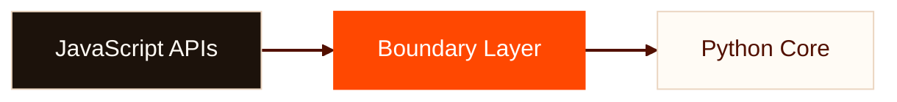

# Planet CF

A feed aggregator built on Cloudflare's Python Workers platform

<div style="margin-top: 2rem; font-family: var(--deck-font-mono); font-size: 0.85rem; color: var(--deck-muted);">
github.com/adewale/planet_cf
</div>

<!--
Planet CF is a modern take on the classic "Planet" feed aggregator concept -- Planet Python, Planet Mozilla, Planet GNOME -- rebuilt from scratch to run entirely on Cloudflare's edge infrastructure. What makes it unusual: it is written in Python, not JavaScript, running inside V8 via Pyodide/WASM. That single architectural choice -- Python on a JavaScript platform -- cascades into every design decision in the project.

Sources:
- https://github.com/adewale/planet_cf/blob/main/README.md -- project overview and description
-->

---
transition: fade
---

# What Is Planet CF?

An RSS/Atom aggregator where **Python runs inside V8 isolates** via Pyodide/WASM on Cloudflare's global edge network.

<v-clicks>

- One worker: scheduler, queue consumer, HTTP server, admin UI
- Hourly feed fetching with retries and dead-letter queue
- Semantic search via **Vectorize** and **Workers AI**
- On-demand HTML/RSS/Atom/OPML with 1-hour edge caching
- Multi-instance: Planet Python (500+), Mozilla (190)

</v-clicks>

<!--
The key surprise here is that Cloudflare Workers is a JavaScript-first platform. The documentation defaults to JavaScript and TypeScript. Python support runs through Pyodide, which compiles CPython to WebAssembly inside V8 isolates. This means no filesystem, no threading, no direct network I/O. Every external operation must cross the FFI boundary into JavaScript APIs. Despite these constraints, Planet CF handles feed parsing (feedparser), HTML sanitization (bleach), and template rendering (Jinja2) -- all in Python.

Sources:
- https://github.com/adewale/planet_cf/blob/main/README.md -- feature list and multi-instance examples
- https://github.com/adewale/planet_cf/blob/main/docs/ARCHITECTURE.md -- system topology and request flow
-->

---
transition: morph-fade
layout: center
---

# Python inside JavaScript. Not alongside it.

Pyodide compiles CPython to WebAssembly. No filesystem. No threading. Every external operation crosses the FFI boundary into JavaScript APIs.

<!--
This distinction matters. Planet CF is not Python running in a container next to JavaScript. It is Python compiled to WASM, executing inside the same V8 isolate. There is no filesystem -- open(), os.path, and pathlib all fail at runtime. Templates must be compiled into Python string literals at build time via build_templates.py. Configuration that would normally live in files on disk must be embedded in code or stored in Cloudflare bindings (D1, KV, R2). This is lesson 4 from the LESSONS_LEARNED document: "Templates Must Be Embedded (No Filesystem Access)."

Sources:
- https://github.com/adewale/planet_cf/blob/main/docs/LESSONS_LEARNED.md -- lesson 4 (no filesystem access)
- https://github.com/adewale/planet_cf/blob/main/docs/ARCHITECTURE.md -- Pyodide/WASM runtime constraints
-->

---
layout: section
transition: iris
---

# The Boundary Problem

Five Cloudflare primitives, each returning JavaScript types to Python code

<!--
D1 (database), Queues, Vectorize (vector search), Workers AI (embeddings), and Static Assets -- each is a JavaScript API that returns JsProxy objects when called from Python. The core challenge of the project is not feed aggregation. It is type conversion at the boundary between two runtime worlds.
-->

---
transition: slide-up
---

# The Boundary Layer Pattern

A single worker orchestrates five Cloudflare primitives from Python.



<v-clicks>

- **SafeD1** wraps D1 -- converts `None` to `JS_NULL`, rows to Python dicts
- **SafeVectorize** wraps Vectorize -- handles `to_js()` for vectors
- **SafeAI** wraps Workers AI -- converts embedding results to lists
- **SafeQueue** wraps Queues -- ensures dicts cross the boundary cleanly

</v-clicks>

<div v-motion :initial="{ y: 20, opacity: 0 }" :enter="{ y: 0, opacity: 1, transition: { delay: 300, duration: 600 } }" style="margin-top: 1rem; font-size: 0.9rem; color: var(--deck-muted);">

Business logic stays pure Python. No JsProxy checks in core code.

</div>

<!--
The architecture diagram shows three layers. At the top: JavaScript APIs (D1, Vectorize, Workers AI, Queues). In the middle: a thin boundary layer implemented in src/wrappers.py. At the bottom: pure Python business logic that never sees JsProxy objects. Each Cloudflare binding gets a Safe* wrapper class. SafeD1 handles the critical None-to-JS_NULL conversion (Python None becomes JavaScript undefined, but D1 requires JavaScript null for SQL NULL). SafeVectorize converts Python lists to JavaScript arrays via to_js(). The boundary layer is roughly 600 lines of code -- small relative to the rest of the project, but it is the single most important architectural decision.

Sources:
- https://github.com/adewale/planet_cf/blob/main/docs/LESSONS_LEARNED.md -- lesson 2 (boundary layer pattern)
- https://github.com/adewale/planet_cf/blob/main/src/wrappers.py -- SafeD1, SafeVectorize, SafeAI, SafeQueue
-->

---
transition: fade
layout: center
---

# `None` is not `None`

JavaScript `null` becomes `JsNull` in Python. It is falsy, but `is None` returns `False`. Every `if x is None` at the FFI boundary is a latent bug.

<!--
This is lesson 21 from LESSONS_LEARNED.md, and arguably the sharpest insight in the entire project. In CPython, None is the only null-like value. At the Pyodide FFI boundary, there are three: Python None, JavaScript null (which arrives as JsNull), and JavaScript undefined (which arrives as JsUndefined). JsNull is falsy -- bool(JsNull) returns False. But JsNull is not None -- the identity check fails. This means every function that guards with "if x is None" silently passes JsNull through, and the code crashes downstream. The project discovered this through production failures that all unit tests missed, because Python mocks return None, not JsNull.

Sources:
- https://github.com/adewale/planet_cf/blob/main/docs/LESSONS_LEARNED.md -- lesson 17 (FFI type matrix) and lesson 21 (is None trap)
- https://github.com/adewale/planet_cf/blob/main/src/wrappers.py -- _is_js_undefined function
-->

---
transition: wipe-right
layout: two-cols
---

# Three Null-Like Values

| Value | `is None` | `bool()` |
|-------|:---------:|:--------:|
| Python `None` | `True` | `False` |
| JS `null` | **`False`** | `False` |
| JS `undefined` | **`False`** | `False` |

The `is None` guard lets `JsNull` slip through silently. The code crashes downstream.

::right::

### The Fix

```python {1-4|6-8|all}
# The boundary guard
def _is_js_undefined(value):
    name = type(value).__name__
    return name in ("JsNull", "JsUndefined")

# Every null check becomes:
if value is None or _is_js_undefined(value):
    return default_value
```

<div v-click style="margin-top: 1rem; font-size: 0.85rem; color: var(--deck-muted);">

Caught by Pyodide fake tests, not mocks.

</div>

<!--
The left column shows the type compatibility matrix: three values that all evaluate as falsy but only one of which passes the "is None" identity check. The right column shows the fix from src/wrappers.py: _is_js_undefined checks type(x).__name__ against a set of known JS null types. The project also introduced a two-tier testing strategy (lesson 20): CPython tests with Python mocks for logic, and Pyodide fake tests that monkeypatch HAS_PYODIDE=True and inject FakeJsProxy, JsNull, and JsUndefined classes. The fake tests caught the _to_py_list bug immediately -- JsNull input bypassed "is None" and crashed on iteration.

Sources:
- https://github.com/adewale/planet_cf/blob/main/docs/LESSONS_LEARNED.md -- lesson 20 (two-tier FFI testing) and lesson 21
- https://github.com/adewale/planet_cf/blob/main/src/wrappers.py -- _is_js_undefined, _to_py_list
-->

---
layout: section
transition: iris
---

# 21 Lessons, One Document

From JsProxy conversion to SSRF protection, every surprise documented

<!--
The LESSONS_LEARNED.md file contains 21 hard-won lessons from building Planet CF. They cover: JsProxy conversion (1), boundary layer pattern (2), mock limitations (3), no filesystem (4), hybrid search (5), D1 LIKE escaping (6), SSRF protection (7), feed date handling (8), stateless sessions (9), embedding model choice (10), content sanitization (11), queue error handling (12), structured observability (13), E2E test cleanup (14), search ranking (15), search accuracy testing (16), the full FFI type matrix (17), visual fidelity for conversions (18), deterministic E2E tests (19), two-tier FFI testing (20), and the "is None is never enough" rule (21). Each lesson includes the problem, the symptom, the wrong approach, and the solution with code examples.
-->

---
layout: end
transition: fade
---

# The boundary layer is the architecture

github.com/adewale/planet_cf

<!--
The through-line resolves here. What happens when Python wakes up inside JavaScript's house? It builds a wall at the door. The boundary layer -- SafeD1, SafeVectorize, SafeAI, SafeQueue, _to_py_safe, _is_js_undefined -- is not a utility module. It is the architecture. Everything downstream of it is pure Python. Everything upstream of it is JavaScript. The wall is thin (600 lines), but it is load-bearing. Without it, JsProxy objects leak into business logic, mocks lie about production behavior, and None is not None. The 21 lessons document is the proof that this wall was earned, not designed in advance.
-->
